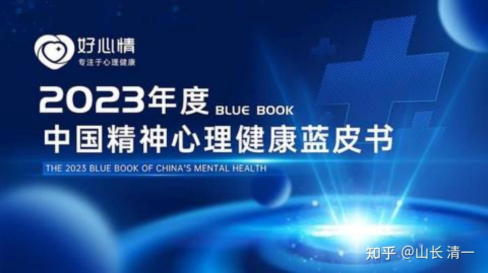
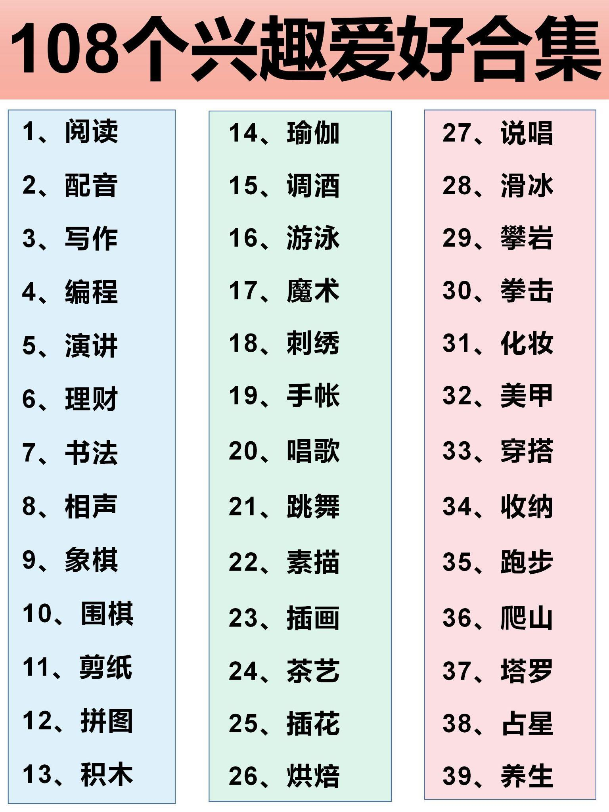
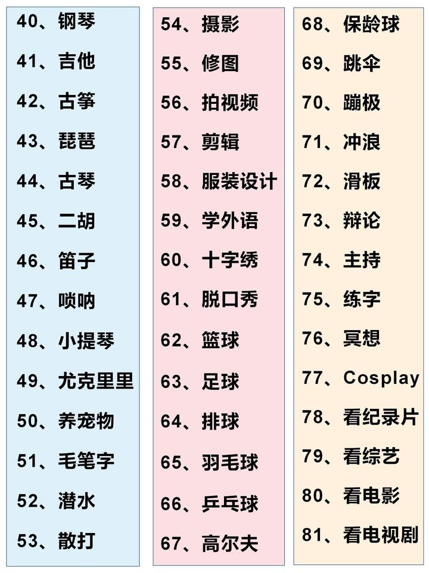
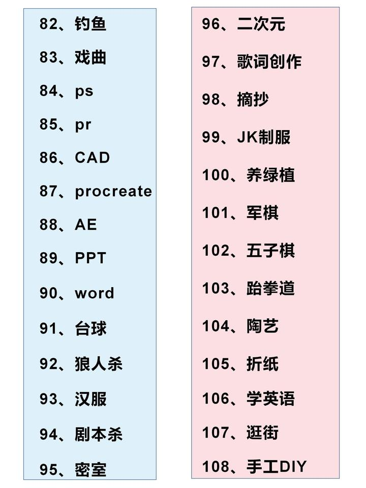

**说点八卦：我几个老同学，还有亲戚朋友，目前正在为大学毕业数年的孩子在家躺平，得抑郁症，各种气死人的毛病而烦恼，觉得我懂教育，找我想办法解决。我只能怼他们-----20年前，我放下正在风口上成功的企业经营，去办私塾，专心教育自家孩子，就是为了将来不出现这些烂事！当年你们这些人，只顾自己潇洒，认为我没事找事，犯神经病非要自讨苦吃办学堂。你们现在才发现：自家孩子被人给教废了，人生出大问题了。却一句话给我，让我来收拾残局。以为我出面是几句话你们孩子就“满血复活”，跟我们学堂的孩子一样积极进取了！真以为我是神呀？有本事为你们20年前的“不作为，不思考”买单？凭啥呀？倒不是我不肯帮忙，而是很多东西，如果小时候的教育基础没打好，基础信念有问题。等大了想要来改变，难度很大，甚至根本就没希望。恐怕只能等人死了，下辈子再改了！我这厨师，虽然看起来现在做的“教育饭”大家认为还不错做，满香的。但我还真没本事把你们已经烧夹生的米，甚至是烧糊的米，重新恢复成“正常米”，做出“正常饭”来。这是只有神才能做的事情了。**

估计我这几个自己在人生，事业上都很成功的老同学，亲戚朋友，晚年就要毁在孩子身上了。只能在泪水和烦恼中度过残年了，他们过上了最可怜的---“死不瞑目”的余生！叹息！现在几个老家伙们还在拼命“想办法”，但我看就是只有焦虑和各种不甘心，其实他们根本就没啥有效的办法，只会病急乱投医，乱找神佛，乱拜庙门。我看---除了骗子，没人会出来帮他们！因为真的帮不上。我教的倒是有方法-----向死而生，绝地求生。但老伙计们以为我发神经，出的这个主意他们无法接受，怎么也听不进去！因此，最终结果就已经注定了----悲剧！将来传出他们的孩子自杀，甚至他们受不了去自杀，或者各种生不如死的消息，都是很正常的！我只能劝他们放下，认输，管好自己就行。但他们却说---做不到！问题是：当年有机会改变，自己做得到的时候，你们干嘛啥都不做?把孩子居然就胡乱交给根本不懂教育的人乱折腾一通？期待运气超级好吗？

我是在2003年儿子5岁时候，看到我有权有钱的老同学惨痛教训，才决定放弃商界生涯，不去捞钱，而是专心研究新教育，先把自家孩子教好，再想其他事。当时老同学16岁的儿子闹自杀，半夜父子两来找我做心理辅导。他还不解，说自己家里要啥有啥，要钱有钱，要面子有面子（权），可为什么孩子就这么不快乐呢？我看他的惨样，当年就决定退出商界。我知道必须牺牲10年的自在生活来把儿子教育好。不然我后半辈子的生活都会被孩子毁了！幸亏当时的我并不自恋，不认为“我家孩子将来肯定不会这样”。我判断10年后，有可能我的儿子还不如他儿子呢。因为别人家孩子5岁的时候，可比我家孩子更乖。现在20年过去了，我的三个孩子都是家长们眼中“别人家的优秀孩子”。没有我，几个孩子也能够独立自强的生活。这个结果，来自于我在2003年的醒悟----**金钱买不来好孩子！孩子的教育成败，决定了我下半生是否成功和幸福！**

** 那么：您今天，会为您的孩子未来前程，做出什么样的思考，决定和选择呢？这些基本教育理念的考核，其实就是考核您的未来人生走向：您会幸福还是烦恼？您会死不瞑目，还是会悠然养老？你晚年受人尊重，还是惶惶不可终日？这一切，都取决于你今天的教育理念测试，看您是否懂得什么是真正的教育！**

说明：这几天，总有人给我发私信，想要替自家孩子申请入学我们学校，但我不会回复这种私信的。我是一个分享者，只介绍新教育的理念。但我不做招生宣传，更不在这里拉人头做生意。我们学校入学，是需要考核家长和学生实力的，还需要有推荐人。您直接申请是无效的。但您可以参加新教育的家长内部分享会，获取您需要的推荐机会！

下面把我们家长考核的内容，分享给各位参考，也许对您教育孩子有帮助。不管你读什么学校，以下的基本常识您必须有，如果您没有的话，恐怕您送孩子去任何学校，国内国外，都没有好结果！所以，如果您希望教育出一个好孩子，您得证明您是一个好家长！

** 2025年，新教育家长基本教育理念考核题目（通用基本版——）**

这是一份价值万金的教育考核题目。千万资产也买不来好孩子。能够教育出一个优秀懂事的孩子，比家长赚了多少钱都更高兴。因此——如果能够良好回答和处理以下问题家长，肯定是有心的好家长。如果您及早发现这些核心问题，自己不会处理，也没关系，现在还有时间赶快去学习和提高，这样你就会让自己的孩子“改命”，不至于走上一条让家庭崩溃的道路。不去犯别人已经犯下的错误！

人无远虑，必有近忧，如果不在基础教育阶段，提前做好预备工作，孩子长大后，肯定会出现种种家长不愿意见到的问题。等问题出现之后，你们再来处理就太晚了！15岁以后，很多问题其实已经很难去处理了，只能随波逐流。因为很多重要的素质，一旦错过最佳教育阶段，几乎就是终身无法弥补的事情！

因此，从2025年开始，申请今日系学校的家长，都必须通过以下家长基本教育理念的考核，如果家长的考核不及格，就将失去申请入学的资格！

因为新教育认为：孩子是复印件，家长是原件。如果家长不懂基本的教育常识，最终孩子费力也教不出来的！因此，新教育不打算花时间在不懂基本教育常识的家长身上，我们只与互相理解和支持的家长共同教育孩子！

**2025年入学申请今日系各校（含今日三校，今日高中，冠军班）的家长：请在2025年6月份之前，完成这份申请考核题目，通过后就可以获得邀请，进入2025学生入学申请群。凡不在申请群的家长，无资格提交新学年（2025年9月份开学）的班级的入学申请！除学位证拥有者之外，其他人不考虑豁免情况！**

**请注意：以下问题均要求家长认真回答，请不要说空话废话，凡是家长的回答，不具备操作价值，无法实施，不能产生应有效果，就判为不及格！本卷打分，只有三个分数**

**1：无效答案—--不及格。**

**2：有一定的现实操作可能，水平有限。及格！**

**3：有良好的实施效果，可以完美解决问题。优秀！下同】**

另外说明：我们的打分，并不是基于对您的个人评判。而是基于对您“发包”的教育目标评判。判断我们是否有能力接单的自我评估。比如第二道题，如果您选的是希望孩子人生拥有的核心爱好就是“画画”，**我们就会一票否决您的入学申请，整份卷子都算您不及格。**但不能说您的选择就一定是错的，而是您需要另请名师。也许您的孩子将来会成为梵高呢？怎么可能一定就错？但我们的新教育，并没有培养画家的目标！无法实现您的委托。所以，如果我们给您打不及格，只是表示你发包的“教育工程”我们没有能力接单，是为我们接待您的能力打了不及格，不是说您不及格，您就是错误的。您完全有权利选择您喜欢的生活和道路！去捍卫您自己的价值观！我们也一样，新教育与别的家长有完全不同的人生和价值观，教育价值观当然也不一样。所以才会有目前的教学效果！鸡和鸭，不可能走一样的道路！

另外----2025年，我会继续出资供养新一届冠军班，支持学生申请全奖入读。为中国武术崛起，击败现代格斗而效力。除了招收15岁考过1500分的学生外，好消息是：为了提升运动水平，明年会招收一些10岁入读的冠军班学生，从童子功开始练武。15岁招的是学霸学生全奖入读，但10岁招的重点，是有运动天赋的学生全奖入读今日。这些人未来的道路，与15岁的冠军班不一样，他们只是拿武术格斗作为业余爱好，但这个班的学生，是把武术格斗作为职业，目标不是全国冠军，而是世界冠军，要成为在世界范围内，为国争光的“武术天才”。但小小冠军班的家长要求极为严格，必须取得无培训通过教育理念的考试，并取得优良通过的成绩单。

申请其他入学项目的家长，如果教育理念考试不及格，还可以通过申请参加内部培训的方式，来提高自己的教育认知，转变教育思想。然后通过补考过关，获取申请资格。但申请小冠军班的家长，不能参加我的私人培训，只能自己去取得无培训通过的结果！简单地说---必须是你装都装不出来的，真正理解新教育，才有资格送孩子来培养去当世界冠军。这份福报，只送给准备好了的人。

具体的安排，12月的交流会，公主班的双料全国锦标赛亚军（泰拳和自由搏击），五语学霸ELLA，将在会场分享冠军的要求和申请通道。该项目，是由公主武道小组来负责招收和带领的！现在的冠军，带未来的冠军。

**2025 家长基本教育理念考核题目：**

**一：您最希望您孩子拥有什么样的个性品质和素质能力？请你选出五种你希望孩子拥有的素质和能力。如果神只能送给你其中一种，您选什么？您怎样才能得到这种你想要的这种素质和能力？您怎样去培养自己孩子具有这种素质？ **

**（参考内容：**成功人士必备的8种素质，您没必要根据 这些内容来选择，这只是一个提示。您选出您认为最重要的素质，以及如何实现它，就行了）

01 一个充满激情、无私的愿景，基于一个更高的目标，而不是自我驱动的欲望。

02 纪律和承诺，以实现一个有意义的愿景，依靠一个多样化的团队的积极性的个人。

03 对他人抱有同理心和同情心，从而激发他们发挥最大潜能的愿望。

04 谦恭地倾听他人的意见，真诚地考虑他人的意见。

05 能够在信念与灵活性之间保持平衡，在才智与直觉之间保持平衡。

06 承诺诚实地说话和做事。

07 当面对新的事实时，重新审视个人信仰并改变它们的勇气。

08 一种不可动摇的乐观主义，植根于人类和世界天生善良的认识中。）

**二：人总有要一些爱好，不然生活会很乏味。那么，您喜欢您的孩子多才多艺吗？您希望ta拥有哪些才艺呢？如果神说，您的孩子一生只能有一个兴趣和爱好，您希望她拥有什么样的业余爱好？这个爱好还能陪伴他终身？为什么你选这一项？你如何才能从小去培养孩子让他拥有这种良好的业余爱好？（一点小提示----如果您选择的业余爱好，不能帮助避免包括厌学，厌世在内的各种教育和人生的问题，您的选择得分就是不及格。另外，您就算选对了项目，但您如果不知道如何从小就培养出这种兴趣和爱好，您的打分也是不及格）。**

**参考资料：**

**三：可能每个人身上，都难免会有别人不喜欢的一些坏毛病，坏习惯。有些勉强可以容忍，有一些是难以让人容忍的。你最不能接受孩子身上拥有什么样的坏毛病，坏习惯？为什么你认为这个毛病，是你不能接受的？你怎样才能防止孩子出现这种问题？**

**四：现在十几岁的孩子，自杀的情况很多。你认为是何种原因，导致这些孩子自杀？你怎样才能防止你的孩子13岁突然去自杀？请拿出一个有效的方案。**

**内容：思考** **之前有个经济学专家，叫宋某辉。主要观点包括“中国人假期太多，严重影响经济发展，应该减少一半”。然后他12岁的儿子，疑似压力太大，跳楼了。**

**昨天我们这里一个十三岁的女孩跳楼了，为什么现在的年轻人心理承受能力如此差？**

**[https://www.zhihu.com/question/619981295/answer/3214329657](https://www.zhihu.com/question/619981295/answer/3214329657)**

**五：现在有很多大学生自杀的情况。某知名大学特别调查结果是：每十个大学生中，就至少有一个大学生严肃地进行过自杀计划。新闻【** **一学期，一所985高校，九名孩子自杀】。你认为十三岁的孩子自杀的原因，和20多岁，考上名校后才自杀的孩子，自杀的原因会是一样的吗？如果你认为不一样，哪些地方会不一样？这两种孩子，在心理，个性上有何不同？从小的教育路径，方法，结果有何差别？你怎样才能防止你的孩子在上大学以后走上自杀之路？**

**六：耶鲁大学在关于抑郁症的调查中发现：中国留学生明确表示抑郁症倾向已经高达45%。而美国学生仅有13％。文章题目—-【在国外，有20万抑郁症留学生在假装生活】。中国2023心理健康报告中，提到中国高中生的抑郁症患者高达40%。请问——你怎样才能防止你的孩子得抑郁症？请拿出你真实有效的实施方案来防止您的孩子的抑郁症。另外，你认为什么时候，年龄，就必须开始去处理和面对青少年的抑郁症问题?**

**参考链接 **

[2023年中国心理健康蓝皮书新鲜出炉，中小学生抑郁检出率 竟然高达40%](https://zhuanlan.zhihu.com/p/666774056)

[为什么现在那么多小孩得抑郁？](https://www.zhihu.com/question/486206053/answer/34270078160)

**七：现在大学毕业后躺平的孩子很多。就算是名校毕业，也不肯去上班和工作！你认为孩子缩在家里不愿意去就业是啥原因？您能接受自己孩子将来躺平在家养老吗？请尽可能找到导致躺平的可能原因，并一一对应拿出你面对和解决的方案！**

**参考链接：**

[怎样把躺平的年轻人拉起来？](https://www.zhihu.com/question/665418546/answer/3609533436)[儿子28岁，大学毕业6年一直不愿意找工作 我该怎么办？](https://www.zhihu.com/question/591131539/answers/updated)

**八：人类的素质和能力教育，很多是有敏感期的，一旦错过窗口期，可能终生都不再有重新弥补的机会！请问家长，您认为有哪些你认为很人生最重要的素质，是必须在孩子小时候获得的？你怎样做，才能获得这些你认为重要的教育素质？现在您为孩子选择的教育道路，能否解决这些您关注在意的问题？**

**九：一份国家统计表明:中小学生厌学率高达 73.3%。而在经济较发达城市，如北京、上海、杭州最高接近80%。在目前这样的信息化社会，需要有终身学习的能力。一旦从小就失去学习的愿望和能力，就意味着在社会上注定落后和淘汰，只能在底层生活。如果你家有一个厌学的孩子，你认为应该怎么办？你怎样才能让自己的孩子不厌学？**

[孩子十四岁，极度厌学，已经辍学并怎么都不肯再回学校。无社交，抓到手机玩的话通宵不睡。怎么挽救？](https://www.zhihu.com/question/460921592)[如何看待 14 岁少年厌学，其父辞职带孩子周游全国？](https://www.zhihu.com/question/438885254)

**十：**您能接受你的孩子身体不健康吗？中国教育部发布30年来学生体质与健康变化情况。数据显示，我国学生体质健康状况持续20多年下滑。值得关注的是，大学生身体素质形势依然严峻，很多指标上，大学生的体质数据不如中学生。超过40%的男大学生连一个引体向上都做不到（女生情况就更严重）。几十年前的大学生引体向上及格标准是10个。**如果您不希望您的孩子未老先衰，身体不健康，请问你怎样才能让孩子拥有健康的身体，过上有活力的生活？**

**十一：您认为：要取得优秀的学业成绩（比如取得SAT1500分以上），对学生的核心要求是什么？是心态好？还是智商高，脑子聪明？还是人专注？还是毅力强？** **您怎样才能让您的孩子拥有你想要的学业素质？请用现实有效的方法，来说明您的信念和做法！**

如果您看到这些题目感到为难，你做不出来以上题目，甚至你从来没有想过这些教育情况，证明您孩子的教育，很可能预后不良。您还是多花点时间，去学习新教育的基本理念吧。不然，你现在只关心挣钱，但将来你就发现——如果孩子教育失败了，你挣多少钱都没用的！你的余生，充满的只有痛苦，烦恼和懊悔！

** 如果您想要去见到目前已经完美解决了以上11个问题的家长和学生，以及教师们。您想要知道他们是如何解决了这些普通家长根本没有意识到的重要的难题，就请你在12月月底，来参加广东的新教育家长交流会。解决问题的第一步，就是面对问题！不能假装没有问题。如果您假装没有问题，最终生活一定会狠狠的教训你！**