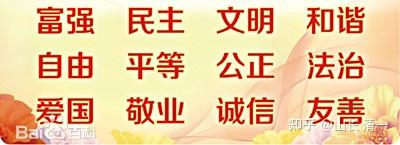

共产党宣言中，说要实现“自由人的自由联合”的共产主义社会。

**“代替那存在着阶级和阶级对立的资产阶级旧社会的,将是这样一个联合体,在那里,每个人的自由发展是一切人的自由发展的条件。”**

要实现共产主义理想，本质上，必须“在社会物质文化极度丰富的情况下”。如果在温饱都成问题的情况下，过去是通过阶级革命---“剥夺剥夺者”来实现。但在社会总财富没有增加的情况下。这种行为，只能是财富的再分配。而且把社会资源交给不懂经营的穷人来管理，注定是无效的。

因此，从1978年开始改变的“中国特色社会主义”。向西方资本主义学习，实行私有化。极大地刺激了财富潜力，短短40年后，我们已经成为了世界上的富裕国家！

但刚刚富裕起来的中国人，怎样才能长治久安?

怎样才能防止后代子孙的挥霍无度?导致第一代创富者的心血被浪费？

怎样才能把财富交给子女，未来免于饥寒？未来均免于被资本家剥削？

我们能不能提前实现共产主义？把财富用于公共资源？不再成为个人的私产？

同时也能满足个人的需要？

如果要求整个社会。都跑步实现共产主义，同步实现这个理想和目标，我认为是不现实的。

但如果只是让中国一些先富起来的极少数人群，来“提前实现共产主义”，我认为现在的条件，已经非常成熟了！

作为中国一批先富起来的人群，面临的任务，就是财富的永续和传承问题。靠买买买，无论是什么产品，都无法满足财富的永续和传承的条件。这些家长，都懂得一些基本的常识：

首先：财富不应该完全交给家族子女，因为我们的子女不是圣人，轻易掌握的大量财富，只会让她们养成挥霍的不良习性。反而帮助子女走向失败人生。只能有控制的发基本生活费，才能避免富不过三代的悲剧。

第二：财富的维护，不是简单的拥有就可以了。它需要人的守护和管理，代代相传。否则不可能传承下去！

第三：水只有放到大海里面，才不会干涸！没有愿意做你们家财产的看门狗，替你们子女义务守护家庭财富。

因此，我们一小群拥有上述共同理念的清一公社成员，就会一起来创建这个“共产主义微型试验社区”。并用心从小去培养子女的德行和行为教育，不需要关心利益集团的考试制度。让子女健康成长。我们实现这个百年传承目标的核心方式是：

**一：用资本主义的金融工具，来实现财富的保值增值。**

我们的共产主义，没必要去“打倒资本家”。相反可以利用资本家来实现我们的目标。

共产主义人，也可以和资本家站在一起，公享同样的机会和收入！我们完全可以让懂管理，有经验的资本家继续去做大股东，去管理企业，我们做小股东，自由放权就行了。没必要去抢大股东来当。又累又苦的。我们做小股东也能从资本家的收入中取得一份红利。只需要和资本家大股东一起利用优质企业的分红，就能实现长期的股权收益。我们每个社员，都能获得一份社员福利---获取社员月红。发放相当于上海地区的最低工资标准。这份月红，还将随著社会工资水平的增长而不断增长。比如40年多前的教师基本工资，大约是每月52元。现在是8000元。按这个比例来测算的话，大致**在40年后，清一公社的社员月红，就可以达到惊人的每月43万8400元。**我相信：这是任何商业保险，家族信托都完全无法实现的收入！因为这些商业保险的本质，是为从业人员创造利润、不是为了我们的长期利益。我们只能自己来维护自己的利益。

有了这份基金，我们的子孙后代，就永远摆脱了被资本家剥削和强迫劳动的可能。我们就让子孙后代拥有了做“自由人”的机会，不被强迫劳动的机会。拥有了地球上“自由行走”的权利。

**二：清一公社社员，奉行社会主义核心价值观。**

社员人人平等，没有等级差别。提倡积极上进，简朴生活，低欲望生存。才能避免被资本社会收割。我们鼓励社员提倡健康的生活方式，不与社会攀比财富和物质。而是社员比精神修养，比服务社会，比道德水平。比学习和上进精神。

当然：既然是崇尚“自由”，我们也不会去干预社员按照其他普通人的生活方式去生活，不一定要求所有人都实行清一社区的生活方式。我们只是示范一个更健康的生活方式，让喜欢这种生活方式的人在一起生活。不喜欢的人自己去融合自己喜欢的生活和工作去。只要不违法，不违反道德，做什么社员都是自由的！

**三：清一公社社员，提倡服务者精神：各尽所能，服务社会。我们的社员来自人民，也需要“为人民服务”。**

我们的子孙后代，没有必要成为工业化的“异化人类”，我们不需去做自己不喜欢的工作，不需要去成为机器人，也不需要去被迫和机器竞争！我们可以去选择自己喜欢的工作。不去计较工资的高低。我们基于人的本性。我们更愿意去提升和发展自己，用自己的特长来为社会服务。缺乏能力者，可以利用在社区内提供的学习机会学习提高。我们也提倡社员为社区提供无报酬工作，但不提倡“强迫劳动”。社员有选择自愿劳动和“不劳动”的自由，也可以在其他地方选择有报酬的工作。

清一公社核心是“消除强迫劳动”，“无意义的工作”。而不是“消除劳动”！我们崇尚工作，鼓励社员进行了积极的，有创造性的， 不计报酬和待遇的高低，有益身心和大众的工作都去做。

**四：清一社员拥有“入社和退社”自由，奉行“自由人自由联合精神”！**

社员入社申请需要公示，需老社员作为推荐人，需要获得全体社员的同意，才能加入清一公社，因为这才是尊重原有社员的自由选择权利。

社员退社，有两种条件

**1：社员自愿退社。**社员如果认为公社的条件，不符合自己的要求和理想，任何时候都可以申请自愿退社。社团负责退回该社员的原始入社资金，并根据历年的银行存款利率，计算原始资金的利息，扣除掉社员历年的月红收入后，本息全部退还给本人及其继承人！

**2：社员强制退社：**如社员有违法犯罪行为，以及违背清一公社章程，违反基本的道德准则。经过清一社员的集体投票，多数票通过退社决议后，可以强制要求该社员退社。并按照上述“自愿退社”的条件，退还社员的原始资本加银行利息。我们不剥夺违规社员的资产，只剥夺无良社员的机会。

**五：清一公社的资本增值部分的使用方向。**

1：清一公社的启动资金，来源于社员的众筹资本。无论经营盈亏，均按时支付月红。因为清一公社资本，本质和核心是一种对社员的生活保证措施，负责按时支付社员的月红。

2：但该社员集体资产，如果遇到良好的金融增值机会，除了支付社员月红之余，还有额外的结余部分，我们视这些额外资产是我们的国家和社会给我们的额外盈余，是管理员良好的理财能力和金融素质带来的意外收获。我们不认为是我们每一个社员应得的财富，而是愿意把这些盈余，用来做公益事业，为社会服务。因此，资产增值部分，将作为全体社员的公共资产，不进行分配，不作为社员的私人财产使用！这些盈余资产的公益资金使用方向，是教育，医疗，体育，文化方向的公益事业，禁止用于任何支持政治和军事的活动项目。

3：社员对于公益资金的使用，有优先申请使用权。根据规则，根据社员的申请，抽签决定取舍。社员使用权益之后，就轮换他人申请，不能重复申请。社员未申请的公益资金，用于社会人士的公益申请。社员不能以个人生活困难申请公社集体资产的救助。不能绑架集体为私人利益服务。因为每月发有月红，不需要再有额外的生活救助。

**六：公社社员人人平等，任何人都不享有特权和特殊利益。**

公社的管理和普通人，均按照自己的投资份额取得相应的权益，不能去侵占他人的权益。

公社社员内个人的能力有大小，长短有不同，但公社社员的地位权利无大小，每个人只要尽力为公社工作就是合格的社员，我们不看成果，看社员的态度和愿心！不想承担工作任务的社员可以选择躺平。不愿意承担公社义务也没问题，只要不影响他人即可！

公社有管理者，是公社会员中，我们集体去选出社会中有能力，有愿心，愿意为社员服务的社员担当，不拿工资，和其他社员一样，只拿月红！

管理者不是官员，不拥有特权。社员也不是员工，不需要服从管理者的调遣。只服从自己的愿望。管理者只有义工权利！如果有其他社员觉得自己能做得比现有的管理者更好，可以提出申请去做管理者。认为某些管理人不符合要求，可以申请撤换他人代替！