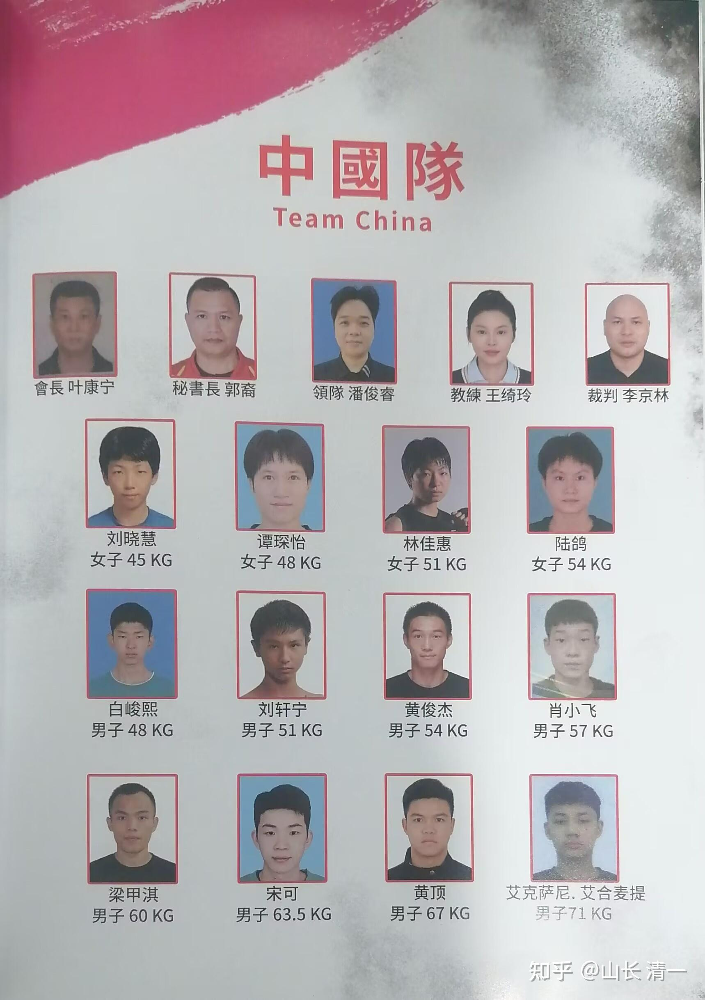
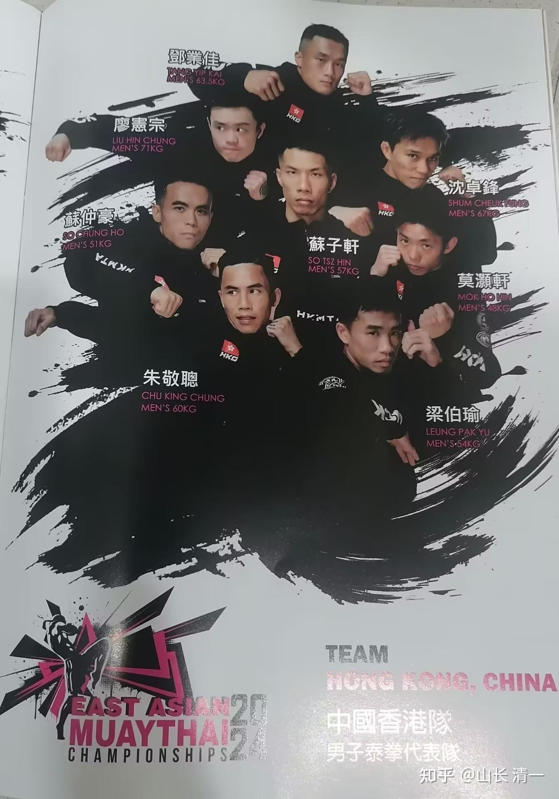
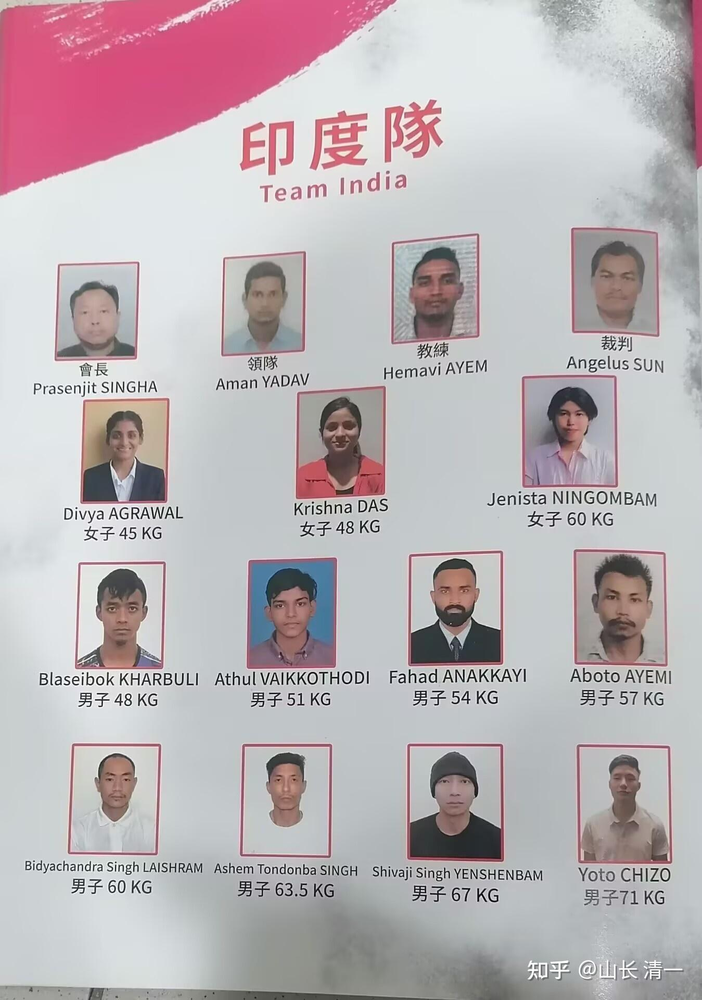
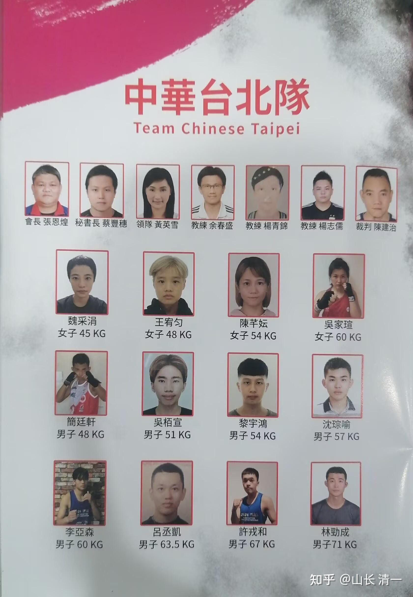

2025年，是清一战队在泰国练完兵，“出山”参加锦标赛的第二年。2025我们不仅仅将在泰拳锦标赛，自由搏击锦标赛，以及拳击锦标赛上，与全国的专业拳手作战，还将在世界赛场上，与世界各国的冠军们交战！会参加不少国际比赛。

今天，我和妻女一起，在香港伊丽莎白体育馆参加国际格斗赛事----【第五屆東亞泰拳錦標賽2024】。11月28日是首個比賽日，今天進行了16場初賽，第一轮淘汰赛。报道说：【晚上7時會舉行開幕儀式。之后接著比赛！來自10個國家及地區嘅頂尖拳手，包括中國、中國澳門、中華台北、菲律賓、印度、孟加拉、蒙古、澳洲、韓國以及中國香港。佢哋將喺擂台上，展現佢哋非凡嘅實力和拼搏精神。】

*国家队12个队员中，清一武道贡献了五个队员！*

这十个队伍，人员都是各国的顶尖高手，全国冠军，才有资格来参赛的。比如香港队，为了准备这次赛事，10月份提前举办了一次香港泰拳锦标赛，选出来的全港冠军，作为本次东亚锦标赛的参赛队员。所以---来的人个个不凡，谁都不好惹。运气不好，上届冠军有可能初赛就被淘汰！比如上届东亚冠军，香港的阴招拳王，今年晚上初赛就差点被名不见经传的印度拳手干掉。虽然他第一局开场他就被狂抽，但他继续使用最擅长的“踢裆绝招”把对手击倒地上。但对手也很强悍，前面连续两局，都打赢了阴招拳王，该香港冠军眼看就要被终结冠军历史。但第三局对手还是体能耗尽了，最终被阴招拳王逆反战局成功。

查看了一下历史：香港泰拳队在这个赛事上表现良好。2019年的第三届东亚锦标赛，香港队获得了4个金牌。疫情之后的2023年重新开赛第四届的时候，由于对手因为疫情准备不良，香港队居然获得了10枚金牌。对比就是中国国家泰拳队派出了12人的队伍，结果却很惨-----一场未胜！带着零的记录回国交差！怪不得国家武术总局干脆2024年就不再派出国家泰拳队去参加亚锦赛，世界锦标赛了。据我所知，世界锦标赛去年就希望在中国举行，但中国无人能战，上去第一场初赛都被淘汰掉，当个东道主不是挺丢人的吗？所以中国一直不肯承办这个比赛。 这一次，由广东的一个泰拳俱乐部出面来召集新一轮的中国国家泰拳队，重点录用了我们的清一拳手，全部女拳手都是我们的木兰。男拳手目前我们也缺人。我猜赛事方是想要通过这次比赛，重新塑造中国泰拳的形象，看是否找到能够击败外国冠军的中国泰拳冠军。获得国家体育总局的信任之后，才会组织国家队去参加世界锦标赛！

今天的东亚泰拳锦标赛，可以说是“大爆冷门”的赛事。首先就是去年的夺标大热门---香港泰拳队连续爆冷，多名拳手居然首轮就被淘汰掉！连去年的东亚锦标赛冠军，也去拿了中国的全国锦标赛冠军，同时还是去年，今年的香港冠军的“阴招拳王”，香港泰拳圈子的招牌拳手朱某，今天晚上第一轮就差点被无名小卒淘汰！连入围资格都差点丢掉。朱某前两局都输了，但幸亏第三局对手犯了错误，急躁加上体能耗尽，被他逆转战局成功。但原来并不出名的蒙古队，今年第一轮，还淘汰了其他的香港冠军！

第二个冷门，就是我们拳手代表的中国队开始击败，甚至是连续KO外国冠军了。今天的第二场比赛，就是谭木兰的重量级48公斤级别的比赛，谭木兰在第二局就TKO结束了凶悍的蒙古泰拳手，爆出了中国泰拳长期外战外行的第一个冷门。接下来清一武士刘轩宁，居然在15秒内就击垮了对手，结束了战斗！对手一招未还就走下了擂台。令赛前一直认为我们拳手练拳的时候软绵绵的其他队友刮目相看。我看对手一开场就被几个快拳快腿加上膝击的连续攻击打蒙了，居然站住不动。裁判示意继续比赛，却站住不动！最终裁判只能结束比赛。我推测，是被击中腹部的力量太重，他当时护痛，已经失去反应能力。但刘武士傻乎乎的，却在等著对手来打他。其实应该看到对手反应迟钝，裁判一示范继续开打，就要猛冲上去抓住机会KO对手（朱某昨天就很擅长抓住机会。本来自己累得快不行了。一看对手被读秒了，就冲上来拼命攻击，不给对手缓过来的机会）。刘武士居然傻等着。万一这个对手更强悍一点，可能就缓过来了！失去了KO的机会。

中国队这连续两场KO外国对手，终于让现场的参赛队伍们，开始改变原来一向瞧不起的中国队的看法，有点敬意了！明天的半决赛，我认为这些各国冠军们，将看到中国清一拳手们的不凡表现！台湾队和香港队的泰拳基础一项很好，相信也有良好的表现！看我们今年，能否创造中国泰拳队首次成为这场赛事的“夺金第一队”的奇迹了！（应该锁定四个金牌就是全场第一名了）。

特别好消息是：今天晚上，本次大赛的首轮比赛全部结束后，五名清一拳手全都闯入了半决赛，这意味着：情清一战队全部锁定了前三名成绩！明天，我们这五名拳手将要参与争夺最终冠军决赛拳的赛事。我相信明天晚上的比赛结束后，我们可以听到更多的好消息。会有更多对手被KO的消息传来的！（我希望不止两个对手被KO，至少KO三个吧？）

今晚的开幕式上，我居然看到谭木兰作为中国队的代表旗手上台。佳慧更是获得了作为拳手代表来宣誓发言的机会，她用纯正的英文，代表拳手宣誓认真比赛，打出风格和成绩。因为香港的官方语言，似乎就是粤语和英语。普通话在香港的地位并不高！我估计----外语好的格斗拳手，应该是稀有之物，所以选我们的拳手作为拳手代表，应该是外语良好的原因。她的发言，也获得了赛场的一片掌声！

*香港冠军队男拳手？朱某放在核心位置*

*印度队派出了11名拳手（最多只能有13名）*

*台湾队12名队员，与中国队一样多！*

格斗大国韩国，这一次也派出了队伍参赛，可惜---小日本没有来，不然清一木兰就可以好好的收拾日本人了！

佳慧如果明天闯入决赛，她对手，应该就是女子51KG 林凱婷 ，她是上屆的51KG金牌，今年是她的“衛冕赛”。我认为很可能她的冠军头衔今年会易主了！好像明晓明天的半决赛对手，也是香港的上届冠军！不过我还没有完全确认。我看了今天明晓对手的表现，我认为明晓完全有Ko对方的实力！