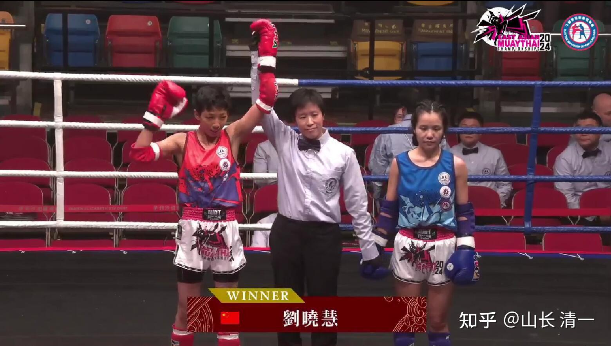
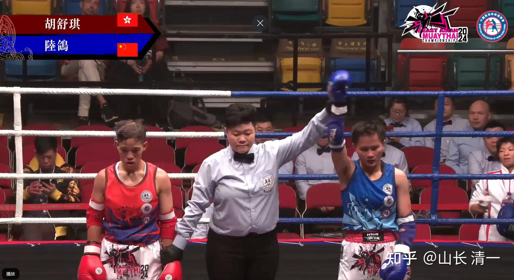
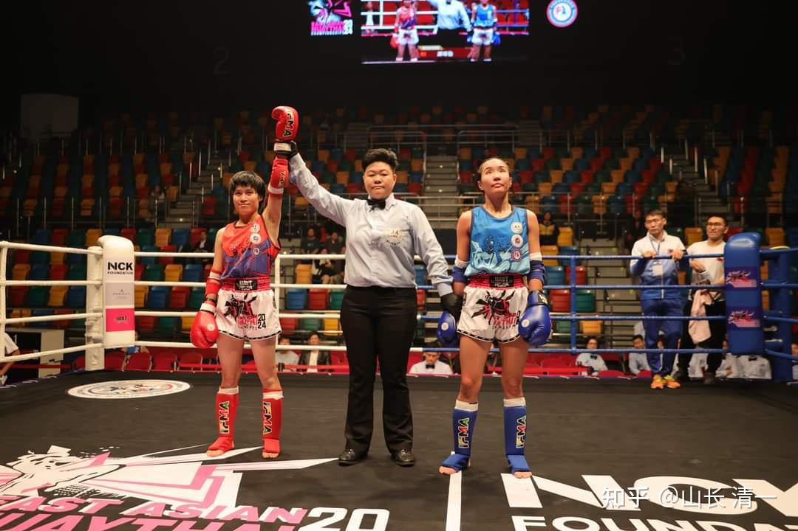

今天木兰们已经打完了第二日的半决赛，结果是令现场所有人意外！四个木兰都全部闯入了决赛，拿到了四张通往金牌的通行证。甚至连我都没有想到：每场比赛我方队员都没有打完三回合，甚至第一回合就结束战斗了！对手没有太多还手的机会，太极格斗的威力正在显现出来！

与此同时，去年拿到了五个冠军的香港女队，本次赛事也力压群雄（雌？），跟我们一样获得了四张金牌通行证（决赛权）。本来她们应该能够拿到五张通行证的。但很不幸：54公斤级的香港女拳手，提前在半决赛就遇到了木兰拳手，今天她顽强抵抗到第三回合，才被陆鸽TKO终结。已经是这次与木兰对抗的对手里坚持最久的拳手了。的确香港拳手很有实力，也很抗打！但其他四位进入决赛的香港拳手，就比她幸运多了。她们在抽签的时候，避开了抽在木兰一组，她们都轻松击败了各自小组的其他国家对手，获得了决赛权！如果她们在第一轮就抽签提前必须和木兰开打，说不定今年连四强都进不去，就爆冷门了。今年，至少有一个香港拳手，是去年的东亚泰拳锦标赛冠军，今年想要继续卫冕来参赛的，不知道结果会不会来个“惊喜”！

陆鸽遇到的这位香港拳手的确很有实力，力大拳重，是2023年的香港泰拳锦标赛冠军，也是今年10月份预选赛的该量级女子冠军。只是她遇到打法“不正规”的木兰，她无法适应。就变得“不会打拳”了，场上香港解说员。认为她是太紧张了，导致发挥失常，与她平时打都不一样。我认为是太极技术克制了她的技术发挥，导致她用不出训练的动作！所以她在场上一直被动挨打。在从第一局就一直输，最终第三局完全失去反抗能力，TKO结束比赛！连陆鸽自己都奇怪：香港拳手怎么与自己看视频的威风样不一样了？看她原来的比赛，是大开大合的大力狂抽对手。这次只觉得她刚开始好像还行，勉强还了几拳。但等打完一局之后，就完全变软。变得越来越好打。第三局完全虐菜一样。我说---拳手在中招之后，另外遇到不会应对的技术，紧张焦虑的话，体力会严重的下降，抗击打力也会快速下降。你们都很少遭遇对手的重击，也很熟悉对手的打法，所以你们对此没啥体验。香港女拳手也没想到你们的技术很奇怪，而且拳腿都很重，比一般女拳手要重得多。因此开场轻敌就吃亏了。不像泰国职业拳手，遇到你们都是尽量避战躲闪模式，而且裁判也允许她们消极避战，不会逼她们必须积极应对。所以她们还可以勉强撑到满场。但香港拳手，一直是本赛事的霸主，一向很自信，都想场上就猛攻KO你们，结果自然就被你们反向KO了！

听现场的香港解说员粤语转播的评价：没想到中国队的女拳手这么厉害，还说---明晓真的好犀利，一头短发很像香港以前的一位女拳王。然后又说香港拳手要小心谭琛怡，她太牛了（谭第一回合就连续两腿一拳准确击中对手胃部迷走神经，让一个擅长拳法的台北对手倒地不起，我们看她的上一场比赛是完胜对手的！当时我在现场是看到的背面，没看清到底怎样打的，还以为是用拳KO的。后来看了香港赛事方录制的正面视频，才知道是谭木兰左腿袭击，然后跟上右手拳击中对手头部，马上就跟上一腿击中腹部。三击连续组合导致对手被ko。估计对手头部被攻击后，注意力都在头部，没有腹部挨打的预备意识，就被一腿击中腹部软组织KO了。赛后她说：当时就闭气了，无法正常呼吸和动作。趴地上好长时间才缓过气来。当个拳手真不容易！

还有一个花絮，就是第一天与谭木兰对战的拳手，是上届就参加东亚锦标赛的。当时她参加的是51公斤级比赛，估计真实体重应该在54公斤以上。但她去年因为被香港的拳手压制没有拿到冠军，她非常遗憾。今年特别降重到48公斤来比赛。以为是降维打击，铁定夺冠。怪不得我看这拳手的出手反应很积极，还是很有水平的。但没想到-----她今年却遇到了木兰拳手。结果就很惨----她今年居然第一场比赛争夺8进4的比赛，连前四名都没有进。在以为容易的对战中国女子新秀，第一场就被淘汰了。所以---她苦苦练了一年再来夺冠，得到的结果却比去年更差，心理上肯定很难过！

场上解说员还说陆鸽的打法很独特，让人眼前一亮。陆鸽小个子击败大个子香港拳手，场上几次击倒对手！而且第三局依然体能充沛，丝毫不减威力，令人影响深刻！

不过，也许真正令人印象深刻的时间，会在12月1日的决赛日才出现。因为女子三个级别的决赛，将在中国木兰---香港女队之间展开。万一这三个香港拳手，决赛中再度遭遇今天这样，与木兰对手一样的命运（被KO或者失败），本赛事失去金牌，结局恐怕就太意外了。

实际上，这一次，如果我们的队员不出现在赛场的话，香港女队应该是可以稳拿五块决赛权的。但假如我们直接从香港队抢走了志在必得的四块金牌（包括今天半决赛，陆鸽KO香港拳手的一块可能的金牌），导致香港女队，本次赛事也许最终只剩一块金牌可以拿，这样会不会“天下大乱”？更讽刺的是---香港队能够拿到这一块金牌，仅仅是因为----我们的素食木兰没有重量级的拳手，达不到60公斤重的标准。万一我们将来，出现了60公斤级别的木兰拳手，该怎么办呢？这一量级的金牌，是不是也要交出来了？万一将来木兰拳手批量出现之后，别的国家还拿不拿金牌呢？会像中国队的体操一样拥有垄断优势吗？也许我只是在梦想吧！但四个木兰本次赛事，都全部打进决赛，这个培养出冠军拳手的成功率的确太高了！

实话实说：耕耘数十年的香港泰拳队伍，远比大陆武术界接触泰拳的时间更长，历史更悠久。香港拳手也和泰国的优秀拳手，优秀教练交流更多！香港的确是泰拳东亚强手（除了泰国外）。在与其他国家的队伍对战中，基本上都能取得较大优势，怪不得去年能够拿到10块金牌。

而中国队去年12人参赛的表现，居然是一场未胜。今年也是12个人来比赛，如果算除了清一战队之外的其他拳手的战绩，目前为止，也是一场未胜。但明天还有一天的比赛，还有四个男拳手未上场，也许不至于再度创造零记录吧？

作为对照的清一战队，至今为止，所有的比赛全都是KO，TKO对手结束。除了陆鸽外，其他几场，都是打第一局就结束了。优势非常的明显！今天的谭木兰，明晓也一样第一回合就终结了对手。就算陆鸽差一点，因为对手（而且是志在夺冠的香港拳手）太大，也太重了，所以她第三局才ko对手。这个全部KO终结比赛的战绩，清一战队自己都没想到这个成绩！（佳慧因为对手弃赛。现在还没机会上场比赛，直接拿到了决赛权，她看伙伴们纷纷ko对手，心痒难耐。但她也只能耐心等12月1日，再与香港拳手直接交手争夺冠军了。她的对手就是上届卫冕冠军，这两天一直在观察她和木兰的技术，是个有心人）。---可能是因为长期在泰国比赛，我们不KO对手就被会判负的阴影。导致木兰们不得不练出KO对手的绝招，出手就不容情！KO率目前100%。相比国内泰拳手海外比武往往一场不胜的绵软状态，完全就是天上地下！

东亚泰拳锦标赛 第二日赛程（油管视频链接）

[东亚泰拳锦标赛 第二日赛程](http://link.zhihu.com/?target=https%3A//www.youtube.com/live/KIxK2-68l4k%3Fsi%3DENLOc-HONPeIP_0u)

上面链接油管可能国内打不开。下面是武道馆自己发的记录，你们可以看到转过来的官方视频。

[https://www.zhihu.com/zvideo/1845933554128789505](https://www.zhihu.com/zvideo/1845933554128789505)[https://www.zhihu.com/zvideo/1845882472522452993](https://www.zhihu.com/zvideo/1845882472522452993)[https://www.zhihu.com/zvideo/1845935687481819136](https://www.zhihu.com/zvideo/1845935687481819136)[https://www.zhihu.com/zvideo/1845937065746907136](https://www.zhihu.com/zvideo/1845937065746907136)[https://www.zhihu.com/zvideo/1845939185036431360](https://www.zhihu.com/zvideo/1845939185036431360)

明天刘武士的半决赛对手是香港拳手，肯定是个厉害角色。今天下午我看两场香港拳手对战其他国家拳手，都采用了踢档战术，结果都被判定赢了。按规定踢裆需要警告，两次以上就要扣分。但一个香港拳手踢了三次裆，最后香港拳手都赢得了比赛。所以---明天也许刘武士比赛，最重要的事情就是需要防香港的踢裆技术---据说香港拳手认为---踢档不算啥阴招，是正常招。主要是拳手应该防护好裆部的！我想---是不是要装上双层的护裆？泰拳由于不许踢裆，拳手对裆部的保护意识是很差的！不像古代武术非常重视防护裆部。至于明天，刘武士能否战胜香港男拳手？就不知道我们武士的成色有没有木兰这么纯了！如果刘武士有机会闯过香港拳手关，也闯入了后天的决赛，我们半决赛就拿到了五张冠军通行证。他决赛将要遇到的对手，应该还不如香港拳手这么硬！就像陆鸽的对手一样，我认为不如她打掉的香港拳手厉害。拿下决赛相反比拿下半决赛更容易！如果明天他半决赛无法逆转香港拳手-----就只能等三年后，新培养的未来武士再来挑战香港拳手了！得承认中国队目前还是阴盛阳衰，男生就是不如木兰争气！

但-----不管怎么说，清一战队已经帮助中国队刷新了泰拳外战不胜的历史！我们正在为捍卫中华武术的荣誉而奋斗。后天---12月1日的总决赛，我们来见证新的中国记录！