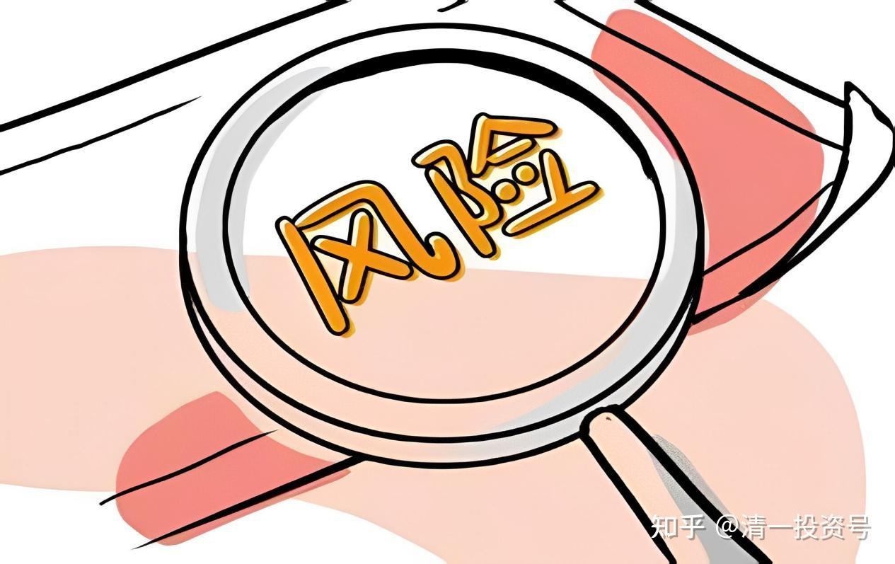
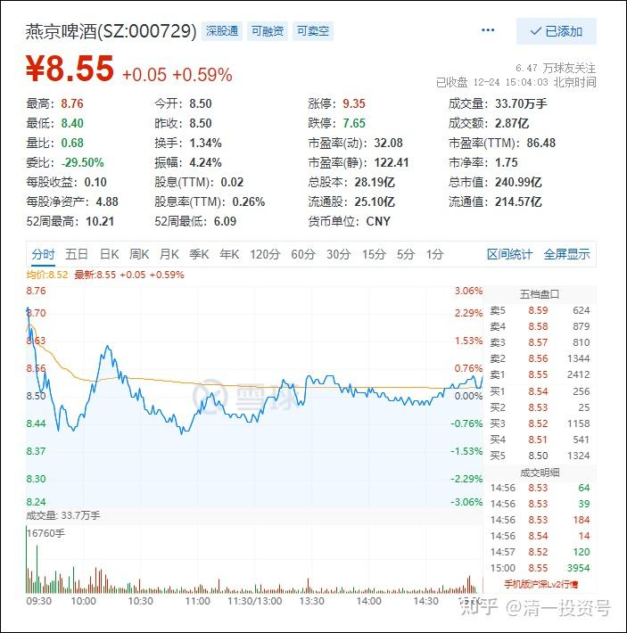
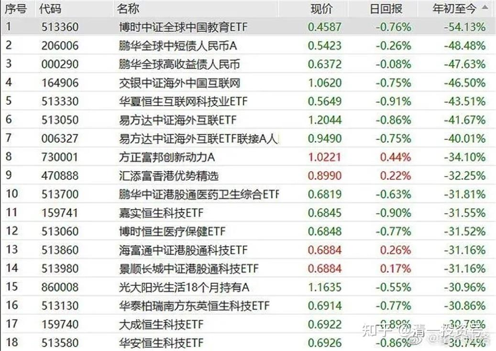

专篇13.永远回避风险，不亏损第一

清一山长 2021年12月24日

2021年12月24日YJPJ分时图

山长清一 2021/12/25 1:14:08

“清心五期**王：我这怎么打不开语音，谢谢三位老师的分享。***老师刚才提到要跟山长的主仓，能否请***老师分享一下山长前五或前三的主仓？”

山长清一 2021/12/25 1:16:55

你们谁在装神弄鬼的，好像你看了我的账户一样。我的主仓，前三、前五都出来了。股票的事情，该分享的，我已经分享出来了。不该分享的，你们也别装大神，自己做好自己的账户去。如果我分享的内容，都看不懂的人，现在还在胡乱追涨杀跌的人，这些就是来当韭菜的，我都救不了，你们还想当神人。

山长清一2021/12/25 1:20:16

燕京正在上涨中，我已经不买票了，只想什么时候下车的事情。正在研究换仓的品种。你们跟进来有啥意思？有本事来追涨，杀跌的人，不是我教的学生。你赚了钱是你的板眼，没赚钱也不关我重仓啥事情。虽然概率上，现在进入是赚钱的，毕竟刚涨。但不去买现在依然躺在底部的股，而去追涨，不是我的风格。**我的风格，永远是回避风险，不亏损第一。**燕京勾引人套住，已经不止一次了。这次是否例外？我不知道。

***王2021/12/25 1:39:05

“不去买现在依然躺在底部的股，而去追涨，不是我的风格。我的风格，永远是回避风险。不亏损第一。”谢谢山长的教诲。晚上财富心理行为群复习这次山长课程的讲解，还提出上面的问题，我太傻了，没有理解到山长讲课的内涵，影响了大家，向大家致歉。

山长清一 2021/12/25 2:26:15

山长清一2021/12/25 2:27:49

今年的投资基金跌幅榜——专业人，也一样惨。加入上了杠杆，一样爆仓玩完。所谓的专业金融人，最大的好处就是：赚钱了，是他们有本事；赔钱了，是客户赔钱。但无论赚钱、赔钱，他们都赚钱。所以——买基金的人就是傻瓜。[大笑]

**参考链接：**

专篇1 [306篇.前缘1.雪球的最后一贴--胜利曙光都已经出现](http://link.zhihu.com/?target=https%3A//xueqiu.com/2017773236/247159187)

专篇2 [307篇.被特别关照的股--前缘2](http://link.zhihu.com/?target=https%3A//xueqiu.com/2017773236/247387457)

专篇3 [308篇.立此存照--前缘3](http://link.zhihu.com/?target=https%3A//xueqiu.com/2017773236/247580614)

专篇4 [309篇.见识传说中的拖拉机账户](http://link.zhihu.com/?target=https%3A//xueqiu.com/2017773236/247973779)

专篇5 [310篇. 拉升在即](http://link.zhihu.com/?target=https%3A//xueqiu.com/2017773236/248351982)

专篇6 [311篇. 进入右侧投资时代](http://link.zhihu.com/?target=https%3A//xueqiu.com/2017773236/248658236)

专篇7 [313篇. 小主力进货的阶段](http://link.zhihu.com/?target=https%3A//xueqiu.com/2017773236/249221851)

专篇8 [316篇.两轮回调对比](http://link.zhihu.com/?target=https%3A//xueqiu.com/2017773236/249675370)

[专篇9.主力的水军](https://zhuanlan.zhihu.com/p/619400004)

[专篇10.主力完成筹码收集](https://zhuanlan.zhihu.com/p/629948708)

[专篇11.主力、游资、右侧投机客纷纷进场](https://zhuanlan.zhihu.com/p/631628731)

[专篇12.进入震荡期](https://zhuanlan.zhihu.com/p/633057526)

