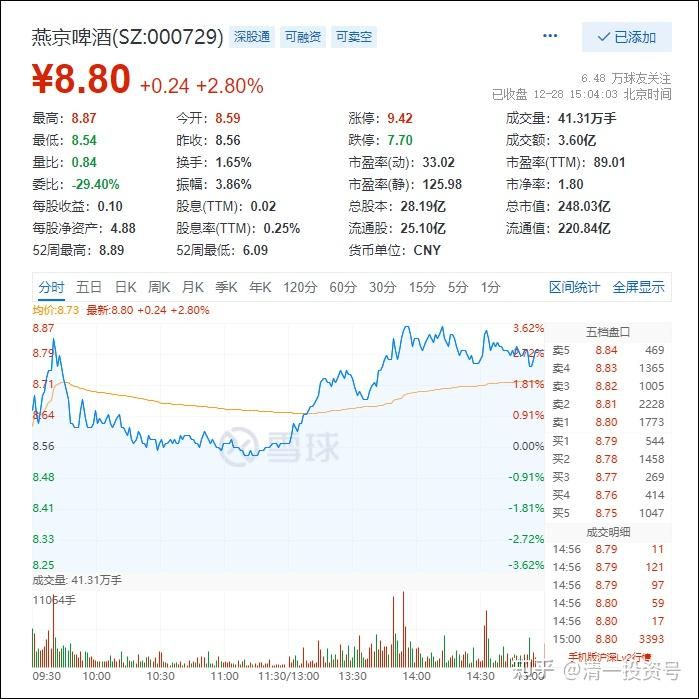
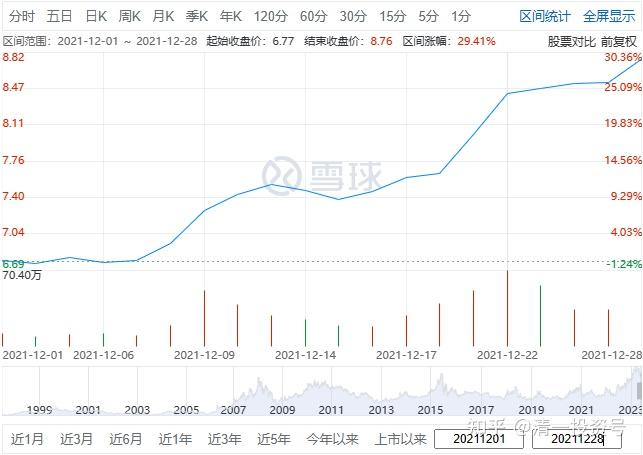
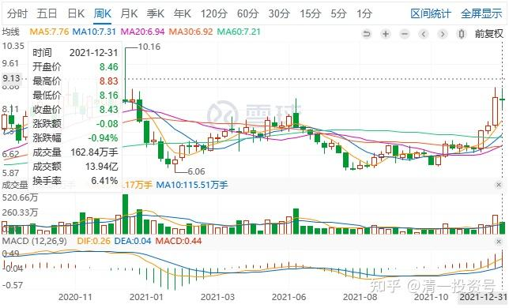

专篇15.准备起跳

清一山长 2021年12月28日

山长清一2021/12/28 13:49:31

今日解盘：YJ走势，不断冲高回落，就是正在做起跳前的热身活动罢了。昨天说了，最多7天，就会跳过9元区的，现在正在把9元作为跳高的目标瞄准，跃跃欲试的。现在震荡幅度加大，就是快到起跳时间的标志。这个原来我总看不懂的股，现在几乎变透明了。因为它现在“正常”了。原来该涨不涨，该跌不跌的，死气沉沉的，走势很怪异，其实回想起来，就是让人看不懂而放弃的。

它去年不想涨，故意压制。其实回头来想，去年涨了，今年也要消化这些高位套牢的筹码，依然是主力的负担，不如算了，压住不让涨，今年上涨就轻松多了。因此，从这个心理来推断，主力的目标绝对不是珠江和惠泉的目标。所以我才越加仓越多的。我认为它有大名堂。我是“看不懂”反而加仓，让主力的手段失望了。现在的这个走势图形，懂一点技术的人都看得出的，没啥难度。所以会吸引很多投机跟风盘进来的，这也是他需要的人。

所以，股市表面是一个，其实有很多完全不同的人来通过自己熟悉的手段赚钱。这批人都是赚聪明钱——嗅觉特别灵敏，也能影响周围一大批人。盘面语言——我准备起跳了，快来看——就会通过各种渠道发出去，以后YJ就从原来的“死股”，变成“热门股”了。**明年的热门股一定有它**[大笑]。

山长清一2021/12/28 23:25

今天上午冲高后下跌变绿，当时我看了就笑：主力正在培养做T的T飞的习惯。所以我发个帖，提醒一下大家，然后我就带小公主们去房建的现场工地，看工人们干活去了。现在马上就要过新年了，我这“主人”，要去慰劳一下我们的工人们，我教小公主们炒菜，准备新年聚会去服务工人们。买了很多酒肉，工人们准备一醉方休。宋老师关心工人，说：喝酒可以，我们会提供足够的酒水（十箱左右），但希望他们控制一下，别喝醉了，对身体不好。泰国人很不屑地说：“实在不愿意和不懂酒的人谈喝酒的事情。”意思就是：喝酒不喝个够，还算啥喝酒？何况老板请客，不喝白不喝[大笑]。

晚上回来看看YJ走势。我以为今天会像昨天一样，象征性涨个几分钱，没想到下午就一路上涨，基本上补上了上午冲高的涨幅，“解放”了上午的套牢盘，同时也缴械了下午的做T盘。在啤酒板块涨幅榜上仅次于妖股重庆啤酒，列涨幅第二名。而且它好像是唯一连续九天上涨的股票。再看最近16天，它连涨了14天，只有两天是微幅的回调，像是推土机一样，慢吞吞的但是坚决的往上走，周线上已经创新高了。大量的做T客把自己T下车了。**YJ“死股”的坏名声，似乎正在换位为“牛股”的好名声**[微笑]。

另外——今天尾盘没有刻意压低收盘价了，好像是准备秀一下身材了。所以——我判断七天内YJ就突破9元的预测，可能不太准。这架势，我看是拿出了年前，甚至就是明天，就要冲9元的架势来。所以，这一次应该会提前完成我的预判。

当然，后续YJ到底会怎样走，我还是不知道。我随时准备对我的预测失误道歉。现在都说10元是YJ多年的大顶。我看YJ的这个姿势，似乎根本就不怕10元的巨大压力。因为8元以上，9元以下的区域，是原来YJ长期盘整的高位，套牢了很多的筹码。但看现在的架势，它居然毫无费力的就跨过来了，没有啥动静。也不反复地洗盘，盘中就完成了调整。真牛[赞]。

YJ现在已经彻底变了，不再像原来一样老态龙钟的。难道这种几十年的老企业也会变年轻了吗？难道是傍上了小鲜肉的原因吗？[大笑]。YJ历史上，是曾经有超越了青岛啤酒的牛气，曾经做过全国啤酒行业的第一把交椅的。最近10年，一直被对手赶超，现在是不是要拿出了当年的豪气来了？我们就等着看好了[献花花]。

**超2021/12/28 14:07:52

巨人的肩膀很宽，通常可以站很多人。感恩山长。

**义2021/12/28 14:08:36

感恩山长解读。

程**2021/12/28 14:10:43

感恩山长！这些解读好好搜集起来，群里有家人一起组织学习下山长的财富智慧吗？

**丽2021/12/28 14:40:40

感谢山长分享。那天看了一遍清粉社区编号，看到很多资深的清粉，很多很多有智慧、思维好的新教育先行者，想想自己总是冒冒失失地发言，真是很汗颜。可是每一次看到山长分享，就觉得应该表达自己的感受，这不是山长需要这样的反馈，而是我们需要通过这样的表达来加深自己的理解和印记；还有的人，需要看到这样的表达来坚定跟随的信心。

山长在《六祖坛经》第五讲说：正法不去弘扬，别人怎么知道你是正法；邪法没有人去批评，邪法怎么会消失？

山长在坛经第四讲专项讲了普贤十大愿，其中的【称赞如来，随喜功德，请转法轮，普皆回向】也是教诲我们要弘扬正法。

现在这个群里，有800多人，虽然没有清粉群人多，没有雪球的人多，但是，这800多人，却更是需要有【称赞如来，随喜功德，请转法轮，普皆回向】的需要，因为我们是真正的密切相关者，是清粉社区的邻居。

记得之前在清粉群有人发了一张【稷下学宫】的图片，意思是，未来的清粉社区，山长给我们开讲【中华传统文化课】——《道德经》、《庄子》、《韩非子》、《荀子》、《王阳明心学》，就是这样的学术盛况。可是，在这里，山长何曾不是在讲《道德经》，讲心学？此时此地，就是【稷下学宫】。但是稷下学宫，一定不会只有老师用心的分享，没有听众的用心反馈。老师用心，听众应该更用心去表达自己的触动、收获、疑问等等。

我是这样想的，所以我这样做了，即便在许多前辈面前显得不够谦逊，也在此阐明缘由，先说抱歉！

**侠2021/12/28 15:08:11

感恩山长不断给我们分享智慧和财富，既有“渔”也有“鱼”。赞叹**丽老师信受奉行的示范，向您学习。

**义2021/12/28 16:06:45

感谢**丽老师的示范！【称赞如来，随喜功德，请转法轮，普皆回向】也是教诲我们要弘扬正法。

**峰2021/12/28 16:40:14

我们是同学，稷下学宫的学生

**参考链接：**

专篇1 [306篇.前缘1.雪球的最后一贴--胜利曙光都已经出现](http://link.zhihu.com/?target=https%3A//xueqiu.com/2017773236/247159187)

专篇2 [307篇.被特别关照的股--前缘2](http://link.zhihu.com/?target=https%3A//xueqiu.com/2017773236/247387457)

专篇3 [308篇.立此存照--前缘3](http://link.zhihu.com/?target=https%3A//xueqiu.com/2017773236/247580614)

专篇4 [309篇.见识传说中的拖拉机账户](http://link.zhihu.com/?target=https%3A//xueqiu.com/2017773236/247973779)

专篇5 [310篇. 拉升在即](http://link.zhihu.com/?target=https%3A//xueqiu.com/2017773236/248351982)

专篇6 [311篇. 进入右侧投资时代](http://link.zhihu.com/?target=https%3A//xueqiu.com/2017773236/248658236)

专篇7 [313篇. 小主力进货的阶段](http://link.zhihu.com/?target=https%3A//xueqiu.com/2017773236/249221851)

专篇8 [316篇.两轮回调对比](http://link.zhihu.com/?target=https%3A//xueqiu.com/2017773236/249675370)

[专篇9.主力的水军](https://zhuanlan.zhihu.com/p/619400004)

[专篇10.主力完成筹码收集](https://zhuanlan.zhihu.com/p/629948708)

[专篇11.主力、游资、右侧投机客纷纷进场](https://zhuanlan.zhihu.com/p/631628731)

[专篇12.进入震荡期](https://zhuanlan.zhihu.com/p/633057526)

[专篇13.永远回避风险，不亏损第一](https://zhuanlan.zhihu.com/p/635191087)

[专篇14.高位十字星缩量及主力操作的三个阶段](https://zhuanlan.zhihu.com/p/635191930)

