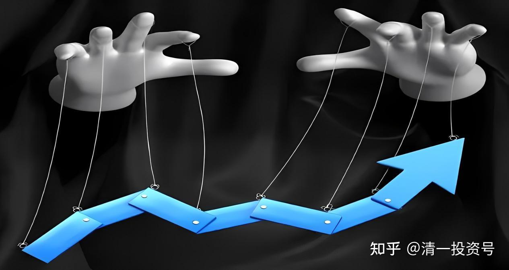
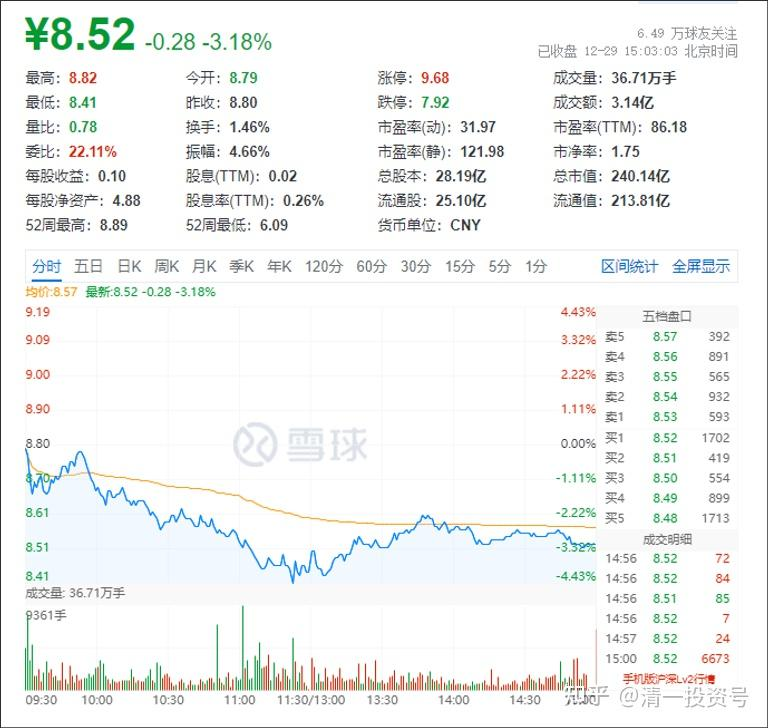
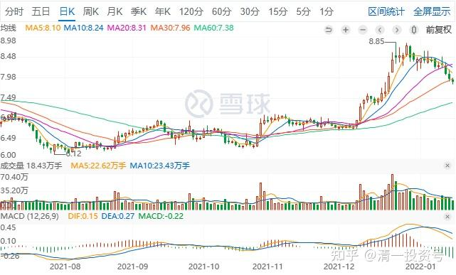
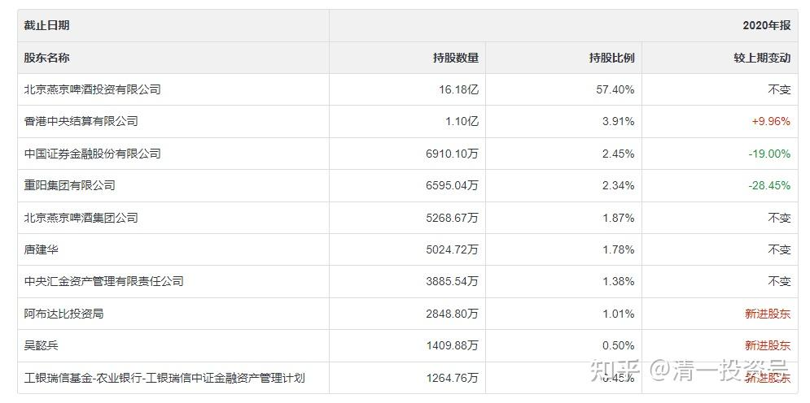
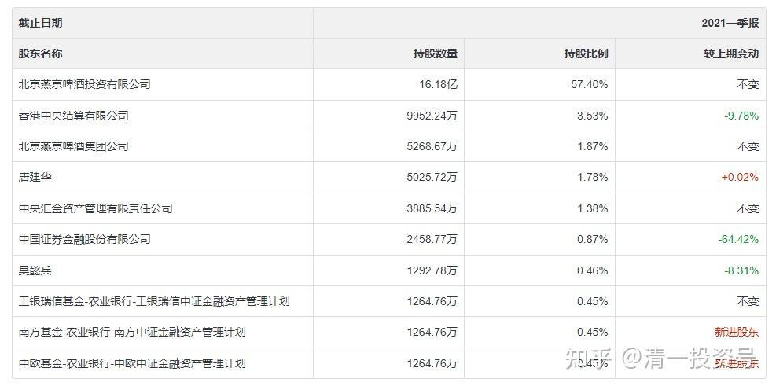

专篇16.大幅回调，老手加高手

清一山长 2021年12月29日

今天燕京啤酒YJ收盘点评：**YJ今天，总算认真的洗了一次盘。**不然它的走势，也强势得太过分了。

上周我判断应该进入震荡区了，就是“要开始大幅洗盘”的意思。结果这伙计，却不管不顾的，依然突突突的直往前冲，昨天还尾盘护盘高度。让我猜想：难道过了9元区，才开始洗盘吗？不太正常呀？按道理9元关口前需要好好洗一洗的。因为这是去年甚至多年的高位盘整压力区。去年在9元以上停留的时间很短，成交量有限，没有啥真正的压力。反而在8～9元区，是有巨大压力的密集成交区，一定要好好震荡，消化筹码的。

果然，今天总算正常出来表演了一次“相对大幅回调”。这样走势就正常了，技术图形也更容易跟上节奏了。我也放心了。不然，一路拉，走下去的人越来越少，就不好玩了。走到天上也不为过，但主力出不了货，多高都是白搭的。你们看仁东控股的主力走法，就是把自己走死了，亏了24个亿，还被证监会抓住罚款。估计就是傻瓜富二代被人忽悠出来坐庄，这些钱都丢给“帮他坐庄”的“操盘手”去了。其实真正的主力是这种人，对付一个有钱的富二代，比去抢千千万万的小股民要容易多了。

*YJPJ日K线图*

**但YJ是个老手加高手，不会像仁东这样干的。**主力超级精明，一定会尽量团结大多数人，不会一直拉下去，曲高和寡的。

2020年第四季度十大股东（阿布达比投资局为新进股东）

2021年第一季度十大股东（不见了阿布达比投资局）

阿布达比投资局，去年年底新进入YJ啤酒十大股东。买了2800万股，显然是高位冲涨的时候进来的。但今年一季度就退出去了，一点也不比散户动作慢，追涨杀跌干得不错 [大笑]。所以，机构也未必坚持价值投资。小散的自有资金，反而可以坚持巴菲特的原则，好企业长期持有股权。**YJ核心股权，我计划四年不放。**因为YJ的五年改革规划刚开始了一年。假如涨了，就只把我的融资仓位卖掉就行了，算是投机的。目前主持仓持仓成本仅6.35元，压仓物足够厚实，不怕主力的大力震荡。

**参考链接：**

专篇1 [306篇.前缘1.雪球的最后一贴--胜利曙光都已经出现](http://link.zhihu.com/?target=https%3A//xueqiu.com/2017773236/247159187)

专篇2 [307篇.被特别关照的股--前缘2](http://link.zhihu.com/?target=https%3A//xueqiu.com/2017773236/247387457)

专篇3 [308篇.立此存照--前缘3](http://link.zhihu.com/?target=https%3A//xueqiu.com/2017773236/247580614)

专篇4 [309篇.见识传说中的拖拉机账户](http://link.zhihu.com/?target=https%3A//xueqiu.com/2017773236/247973779)

专篇5 [310篇. 拉升在即](http://link.zhihu.com/?target=https%3A//xueqiu.com/2017773236/248351982)

专篇6 [311篇. 进入右侧投资时代](http://link.zhihu.com/?target=https%3A//xueqiu.com/2017773236/248658236)

专篇7 [313篇. 小主力进货的阶段](http://link.zhihu.com/?target=https%3A//xueqiu.com/2017773236/249221851)

专篇8 [316篇.两轮回调对比](http://link.zhihu.com/?target=https%3A//xueqiu.com/2017773236/249675370)

[专篇9.主力的水军](https://zhuanlan.zhihu.com/p/619400004)

[专篇10.主力完成筹码收集](https://zhuanlan.zhihu.com/p/629948708)

[专篇11.主力、游资、右侧投机客纷纷进场](https://zhuanlan.zhihu.com/p/631628731)

[专篇12.进入震荡期](https://zhuanlan.zhihu.com/p/633057526)

[专篇13.永远回避风险，不亏损第一](https://zhuanlan.zhihu.com/p/635191087)

[专篇14.高位十字星缩量及主力操作的三个阶段](https://zhuanlan.zhihu.com/p/635191930)

[专篇15.准备起跳](https://zhuanlan.zhihu.com/p/636886203)

