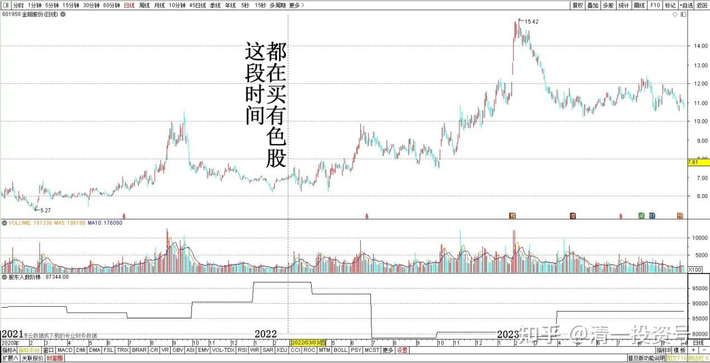
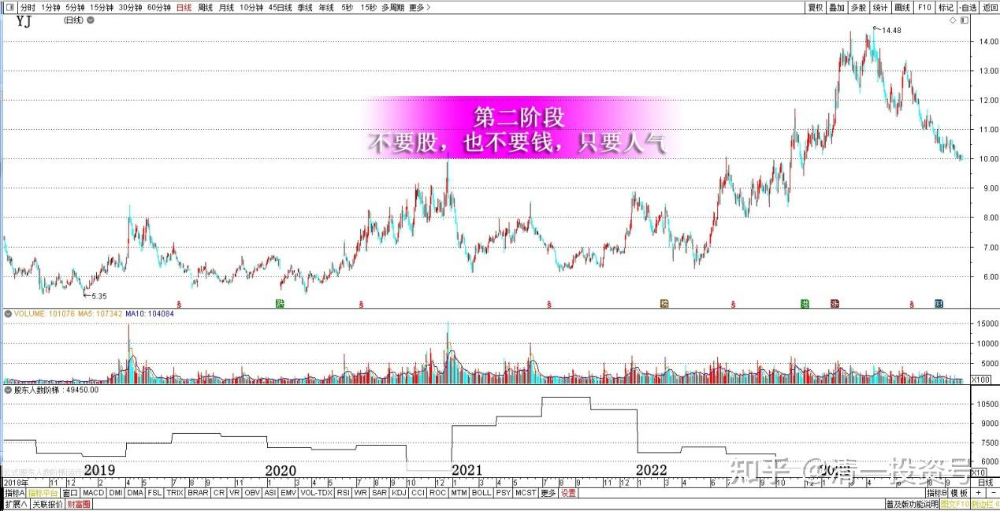
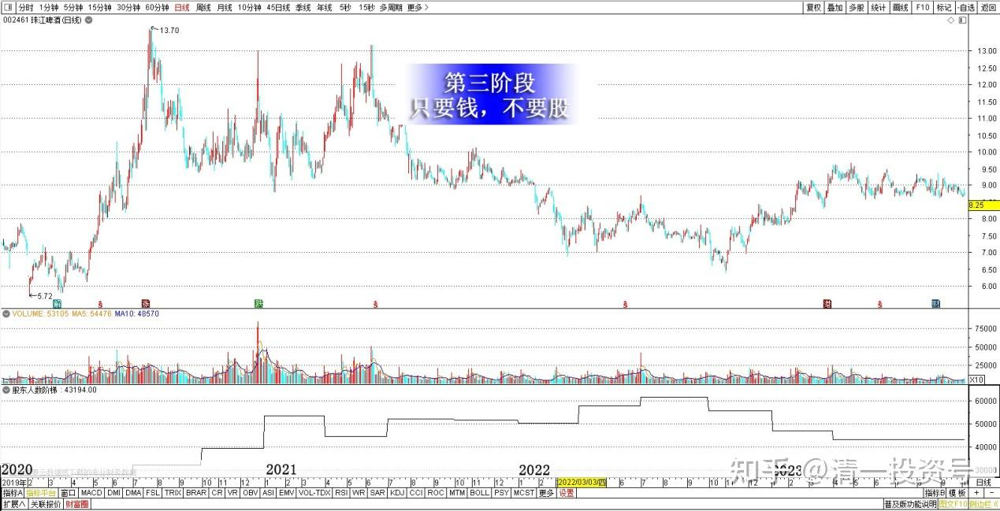
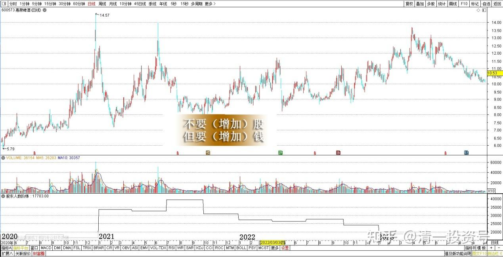
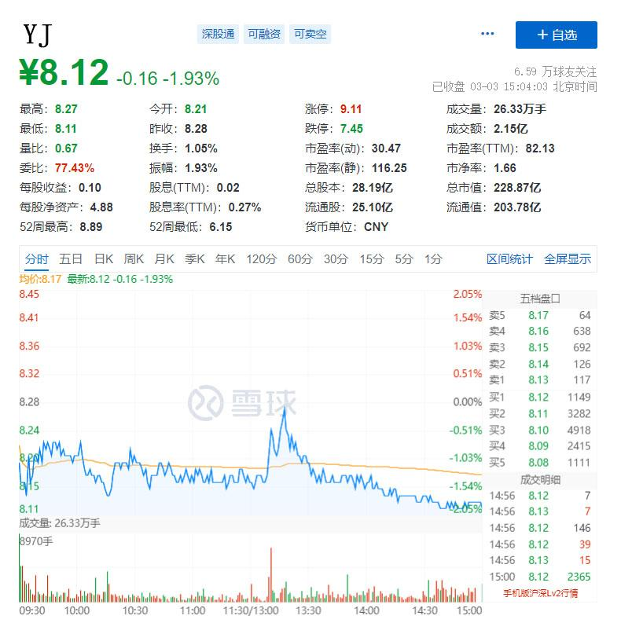

专篇27.看多不做多，主力在第二阶段

清一山长 2022年3月3日

**一、看多不做多**

YJ涨停我卖出百万级股票，并不是我预测会跌。其实技术上，心里面，以及操作面上，都应该是涨的。因为我仔细研究的结果是，这一天，我是唯一真正大单卖出的人。其他卖出的人，大多数都是散户，所以，可以说是主力成功地没收了散户手中的宝贵筹码。不应该继续跌，让这些人继续接进来的，就等于直接吃主力了。所以，正常情况下，是后期会进一步的拉升，让这些老YJ踏空。这是很正常的做盘手法。第二天就开跌，就意味着主力白白让利给小散，是很不明智的。

所以，我其实是“看多涨停的YJ”的——一切指标，背景分析，都说明YJ以后还要涨。但**我的原则是【看多不做多】，“可能”反而做一点空**。因为我的仓位太重了，主要是还有换股的冲动，想换一些处于低位的有色股票。这段时间，我都在买有色股。金钼股份我的几个账户加在一起，都可以进十大了（分散几个账户的，所以你们看不到）。我是准备卖飞YJ的。

*金钼股份2021～2023日线图*

**二、主力在第二阶段**

真没想到第二天，YJ居然不涨了，还跌，一上午就成交3个多亿。这些新进入的资金，应该就是看透了我上面说的思路的技术派高手，都是非常聪明的一群右侧投资者。想赚快钱，也会看技术图的。没想到来YJ，却被不讲套路的YJ主力套路了。这样做，对YJ主力的好处是：在不增加主力持仓成本的情况下，提升了市场整体的持股成本，换了一批人来持股。这是有利于将来拉升的。但也说明：**YJ的主力已经走到了做庄的第二阶段：不要股，也不要钱，只要人气。**

昨天这种操作，主力是不赚钱的，但会吸引一批短线高手进场。而且正常情况下，他不会花费筹码来打压，这就是典型让利了。但估计也不会快速拉升。所以YJ又会磨叽一点时间了，让一些没有耐心的右侧投资人自己退场，压低股价。然后时机到了，主力再来推一把。这是我判断的可能走势。

*YJ2019～2023日线图*

**（第一阶段，是要股，不要钱。**不在乎账面的盈亏，只要能增加股数，就做盘，目的就是尽量的把场内的低价筹码低价哄出来，所以，很多小散就算抄底了，也赚不了啥大钱，这个阶段会把这些小散给震出来的）。

**到了第三（或者第四阶段），是出货阶段。主力是只要钱，不要股。**不在乎维持股价了。**珠江最近几个月，就是这状态，**所以我判断主力走了，已经不维护股价了，只有散户对倒。所以价格重心逐步向下移动。珠江主力的进货成本，不高于5元。现在的持仓成本，肯定是负数。所以现在根本就没有拉升的动力，遇到市场跟涨，它反而乘机卖一点。**所以珠江目前超级弱势。惠泉目前主力还在，继续照顾惠泉的走势。**主力利用高抛低吸，不断做利润，属于不要（增加）股，但要（增加）钱的地步。珠江是不断减仓的状态。但也不着急，是有行情就减一点，就是不拉，不维护股价。不过，珠江如果跌到了7元区，我可能会拿YJ换一点平衡一下。以上分析解读给大家参考。

*珠江啤酒2020～2023日线图*

*惠泉啤酒2020～2023日线图*

**2022～2023年，是金属资源的天下，**我希望现在不涨。YJ多涨一点，然后换。现在换也划不来，因为YJ现在刚刚进入“收获阶段”，所以我有机会会换一点，没机会就算了。反正已经拿了不少了。

**三、小交易试探**

刚才做了一笔小交易：我（14:49:01）挂单8.14元，试探买入20万股YJ。因为看到这个价格，8.13元有3千多手买单，而且成交很清淡。8.14只有一点点卖单，几十手。我就打了这个价格上去，试一下盘面。没想到很快就全部成交了。我查了一下成交回报，从开始买入到最后一笔交易，不到一分钟时间。我就马上停止买入了。因为说明盘内的资金很像想出局。现在还不是买入的时候。仅仅两天前，盘面上是涨停，一千多万股的资金在嗷嗷叫着：都卖给我！今天就变脸成这样[滴汗]。所以，**市场先生就是一个疯子。我们不能去“理解”他，我们只能利用他。**

8.36元追进来的资金，现在看损失不大，YJ不像启动的样子，愿意损失几个点走掉，再找机会。这就是游资的脾气。这样说的话，YJ暂时还起不来。我可以再等等。

总共177个成交单，很多单子是200股、300股的，也有不少100股的，上万的单子只有三个。说明：我今天一单，就大约消耗掉了一百多个YJ的股东人数。

文章音频：

[384篇.看多不做多，主力在第二阶段_清一投资号文章同步音频](http://link.zhihu.com/?target=https%3A//www.ximalaya.com/sound/673711286)

**参考链接：**

专篇1 [306篇.前缘1.雪球的最后一贴--胜利曙光都已经出现](http://link.zhihu.com/?target=https%3A//xueqiu.com/2017773236/247159187)

专篇2 [307篇.被特别关照的股--前缘2](http://link.zhihu.com/?target=https%3A//xueqiu.com/2017773236/247387457)

专篇3 [308篇.立此存照--前缘3](http://link.zhihu.com/?target=https%3A//xueqiu.com/2017773236/247580614)

专篇4 [309篇.见识传说中的拖拉机账户](http://link.zhihu.com/?target=https%3A//xueqiu.com/2017773236/247973779)

专篇5 [310篇. 拉升在即](http://link.zhihu.com/?target=https%3A//xueqiu.com/2017773236/248351982)

专篇6 [311篇. 进入右侧投资时代](http://link.zhihu.com/?target=https%3A//xueqiu.com/2017773236/248658236)

专篇7 [313篇. 小主力进货的阶段](http://link.zhihu.com/?target=https%3A//xueqiu.com/2017773236/249221851)

专篇8 [316篇.两轮回调对比](http://link.zhihu.com/?target=https%3A//xueqiu.com/2017773236/249675370)

[专篇9.主力的水军](https://zhuanlan.zhihu.com/p/619400004)

[专篇10.主力完成筹码收集](https://zhuanlan.zhihu.com/p/629948708)

[专篇11.主力、游资、右侧投机客纷纷进场](https://zhuanlan.zhihu.com/p/631628731)

[专篇12.进入震荡期](https://zhuanlan.zhihu.com/p/633057526)

[专篇13.永远回避风险，不亏损第一](https://zhuanlan.zhihu.com/p/635191087)

[专篇14.高位十字星缩量及主力操作的三个阶段](https://zhuanlan.zhihu.com/p/635191930)

[专篇15.准备起跳](https://zhuanlan.zhihu.com/p/636886203)

[专篇16.大幅回调，老手加高手](https://zhuanlan.zhihu.com/p/638552635)

[专篇17.股东数所传递的信息](https://zhuanlan.zhihu.com/p/639002631)

[专篇18.突](https://zhuanlan.zhihu.com/p/640000051)[破9元是燕京的基本目标](https://zhuanlan.zhihu.com/p/640000051)

[专篇19.YJ、惠泉今天盘面语言对比](https://zhuanlan.zhihu.com/p/640550916)

[专篇20.暗示洗盘快结束](https://zhuanlan.zhihu.com/p/641509884)

[专篇21.现在是新主力的成本区](https://zhuanlan.zhihu.com/p/642330561)

[专篇22.成熟投资者的思考方式](https://zhuanlan.zhihu.com/p/655404597)

[专篇23.主力未走，迟早变盘](https://zhuanlan.zhihu.com/p/656816805)

[专篇24.涨停但不像拉升出货](https://zhuanlan.zhihu.com/p/657944680)

[专篇25.裘国根清仓式减持华能国际电力港股](https://zhuanlan.zhihu.com/p/659254254)

[专篇26.主力倒手，游资被动替主力杀跌](https://zhuanlan.zhihu.com/p/660162209)

