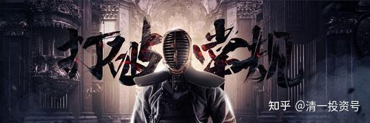
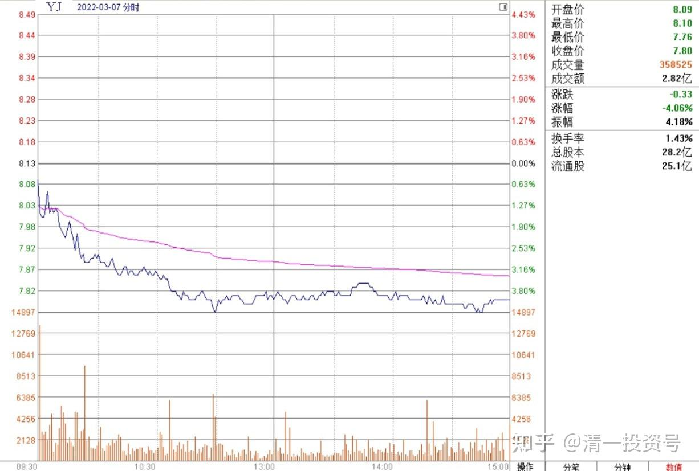
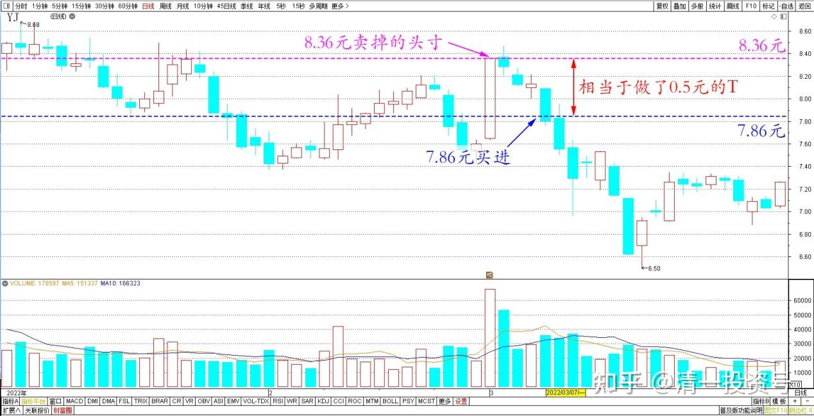
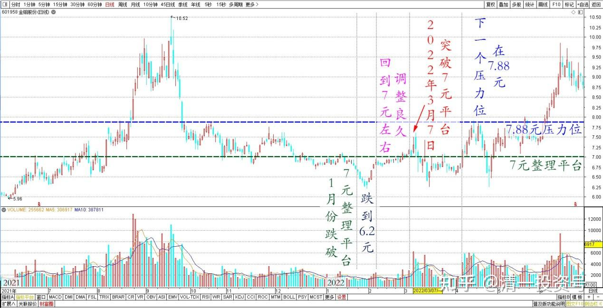
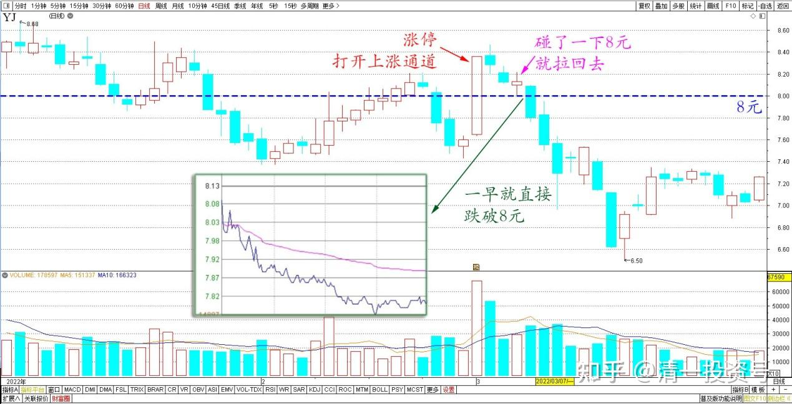
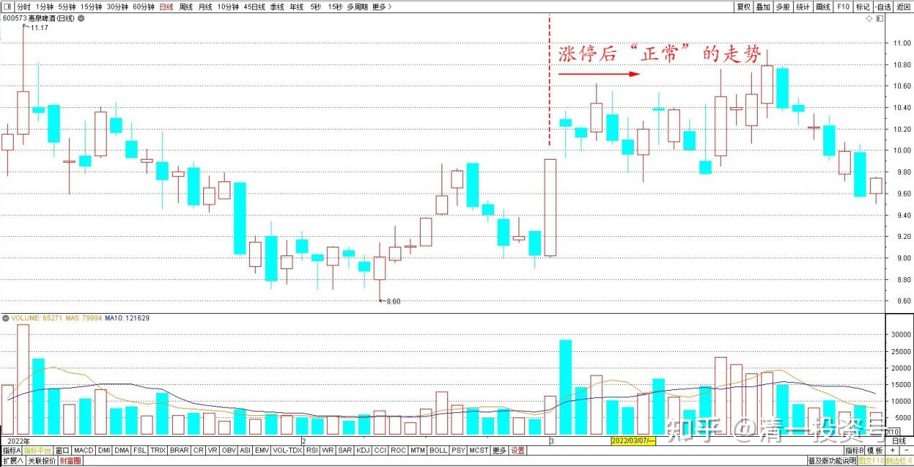
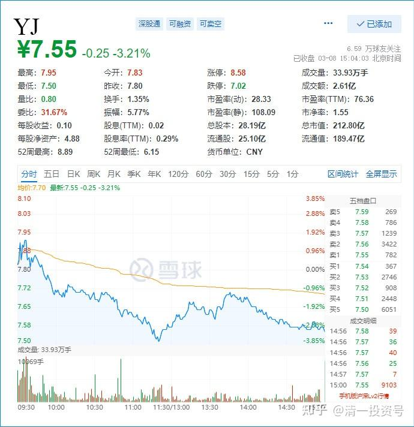

专篇28.走势打破正常思维，看空不做空

清一山长 2022年3月7日～3月8日

山长清一 2022/3/7 10:46:36

YJ果然是不断打破人的正常思维的，今天居然又跌到7字头了。

*YJ 2022年3月7日分时图*

今天挂单7.86元买进，相当于做了0.5元的T。（补充回来一些8.36卖掉的头寸）。由于其他的卖出资金，上次用来补钢铁、有色了。手上没多少余钱，能补多少就补多少吧！算是一个态度——对YJ这死样子依然不弃不离。

*YJ 2022年1月～3月 日线图*

我觉得自己运气很好，上周感觉打仗特别利好有色和钢铁，就大力补仓了300多万股有色龙头股（原来已经分享过了，现在就不说了，涨了的我就不吭气）。之后有色钢铁都在涨，看得出有资金在进入。今天金钼股份也大涨。但是只是刚刚突破平台而已，没啥好操作的。1月份，它跌破7元整理平台，跌到6.2元，这是一个典型的黄金坑。之后回到7元左右调整良久，今天刚刚突破这个平台。下一个压力位在7.88元。所以目前这个价格完全可以不理它。主力花了这么长的时间来做盘，不会为了这几毛钱就走的。可以继续耐心等一段时间，除非你没钱了要换点钱出来。

*金钼股份2021～2022年 日线图*

技术上，就是YJ我很难以理解：上次的涨停，可以说是用一笔不大的资金，打开了来之不易的上涨通道。正常情况下应该维护趋势的，回调的幅度不应该跌破8元才对，上周也果然碰了一下8元就拉回去了。但今天一早就直接跌破8元，这样其实是跌破了这个上升的趋势线。理论上说：就是该股的趋势走坏了，技术上应该出局，落袋为安。估计今天有不少聪明资金都出局了。不过，**我经常是【看空不做空，反而做多】的人，所以今天账上有钱，我就买一点，没钱就算了**。主要是我卖出的股套住了人，不好意思。今天别人不要了，我就买回来好了。**已经凭空赚了5毛钱，已经很幸运了。财主们不想要股，我就接回来拿着，抢着要股，明明是看着打开了上涨通道的，我也愿意放出，开仓放粮，反正总是与我看到的市场反向而行，满足大众的需求吧！也感谢市场先生奖励的这五毛钱的利润差，大多数中国人一年也赚不到呢！就当上周没有卖出好了。反正不涨的股，我就继续持仓。涨了就找机会卖，回笼现金。**不过，话又说回来：为了赚这五毛钱，我的账面上，YJ又“损失”大几百万了。只是总体上我持股的企业股份，还在继续增加中。所以我这一周，是赚了股，赔了钱。[大笑]

*YJ 2022年1月～3月 日线图*

涨停后“正常”的走势，参考惠泉。这个股正常一些，我看得懂，也跟得上。（虽然现在没有了）。就是YJ走势总是出人意料，我怎么都看不懂。[滴汗]

*惠泉啤酒 2022年1月～3月 日线图*

*炯2022/3/7 11:04:03

跟随山长操作买入涨停卖出的2.5万股，20个成交单才凑齐，卖的小单多。

山长清一2022/3/7 11:45:24

刚才7.81元，又补了20万股回来。一路跌[滴汗]。涨停这天这么多资金抢着买，现在价格更便宜了，却没人要了。这个市场真是神经病。[尴尬]

**霞2022/3/7 13:55:55

前几天卖掉了一部分，跟着山长赚了大儿子一年商学院的学费，今天看到山长补回了，我也跟着补回来了。我的投资哲学就是跟着山长做一只傻猫，傻得还挺喜悦。感谢山长给我们智慧，还带着我们给孩子赚学费，这好事都好到没边了。[献花花]

山长清一2022/3/8 12:25:14

今天我居然买到了7.51元的YJ。[滴汗]真有这么大方的庄家，8.36元买走，然后7.51元重新再卖给你。今天的价格，已经跌破了涨停之前的起涨价。完全是意想不到的走势。但这样走的话，基本上意味着未来不看好，上升趋势彻底破坏了。所以今天引发很多逃命的筹码割肉离场。为了不让这些人太失望，我就尽量接回我上次丢掉的仓位吧！**但我不会多买的，买回原来的头寸就够了**。不然，真的就一路涨上去的话，我还心疼筹码少了呢！目前YJ持仓成本6.03元，如果再来两个跌停，我就彻底没利润了。欢迎YJ主力下手努力干。我在6元继续等你加仓。

*YJ 2022年3月8日分时图*

文章音频：

[386篇.走势打破正常思维，看空不做空_清一投资号文章同步音频](http://link.zhihu.com/?target=https%3A//www.ximalaya.com/sound/676229468)

**参考链接：**

专篇1 [306篇.前缘1.雪球的最后一贴--胜利曙光都已经出现](http://link.zhihu.com/?target=https%3A//xueqiu.com/2017773236/247159187)

专篇2 [307篇.被特别关照的股--前缘2](http://link.zhihu.com/?target=https%3A//xueqiu.com/2017773236/247387457)

专篇3 [308篇.立此存照--前缘3](http://link.zhihu.com/?target=https%3A//xueqiu.com/2017773236/247580614)

专篇4 [309篇.见识传说中的拖拉机账户](http://link.zhihu.com/?target=https%3A//xueqiu.com/2017773236/247973779)

专篇5 [310篇. 拉升在即](http://link.zhihu.com/?target=https%3A//xueqiu.com/2017773236/248351982)

专篇6 [311篇. 进入右侧投资时代](http://link.zhihu.com/?target=https%3A//xueqiu.com/2017773236/248658236)

专篇7 [313篇. 小主力进货的阶段](http://link.zhihu.com/?target=https%3A//xueqiu.com/2017773236/249221851)

专篇8 [316篇.两轮回调对比](http://link.zhihu.com/?target=https%3A//xueqiu.com/2017773236/249675370)

[专篇9.主力的水军](https://zhuanlan.zhihu.com/p/619400004)

[专篇10.主力完成筹码收集](https://zhuanlan.zhihu.com/p/629948708)

[专篇11.主力、游资、右侧投机客纷纷进场](https://zhuanlan.zhihu.com/p/631628731)

[专篇12.进入震荡期](https://zhuanlan.zhihu.com/p/633057526)

[专篇13.永远回避风险，不亏损第一](https://zhuanlan.zhihu.com/p/635191087)

[专篇14.高位十字星缩量及主力操作的三个阶段](https://zhuanlan.zhihu.com/p/635191930)

[专篇15.准备起跳](https://zhuanlan.zhihu.com/p/636886203)

[专篇16.大幅回调，老手加高手](https://zhuanlan.zhihu.com/p/638552635)

[专篇17.股东数所传递的信息](https://zhuanlan.zhihu.com/p/639002631)

[专篇18.突](https://zhuanlan.zhihu.com/p/640000051)[破9元是燕京的基本目标](https://zhuanlan.zhihu.com/p/640000051)

[专篇19.YJ、惠泉今天盘面语言对比](https://zhuanlan.zhihu.com/p/640550916)

[专篇20.暗示洗盘快结束](https://zhuanlan.zhihu.com/p/641509884)

[专篇21.现在是新主力的成本区](https://zhuanlan.zhihu.com/p/642330561)

[专篇22.成熟投资者的思考方式](https://zhuanlan.zhihu.com/p/655404597)

[专篇23.主力未走，迟早变盘](https://zhuanlan.zhihu.com/p/656816805)

[专篇24.涨停但不像拉升出货](https://zhuanlan.zhihu.com/p/657944680)

[专篇25.裘国根清仓式减持华能国际电力港股](https://zhuanlan.zhihu.com/p/659254254)

[专篇26.主力倒手，游资被动替主力杀跌](https://zhuanlan.zhihu.com/p/660162209)

[专篇27.看多不做多，主力在第二阶段](https://zhuanlan.zhihu.com/p/661469607)

