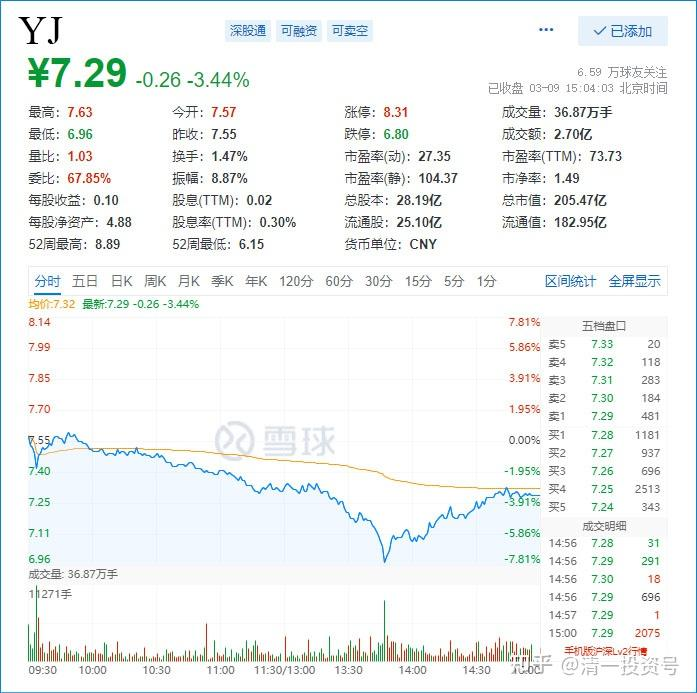
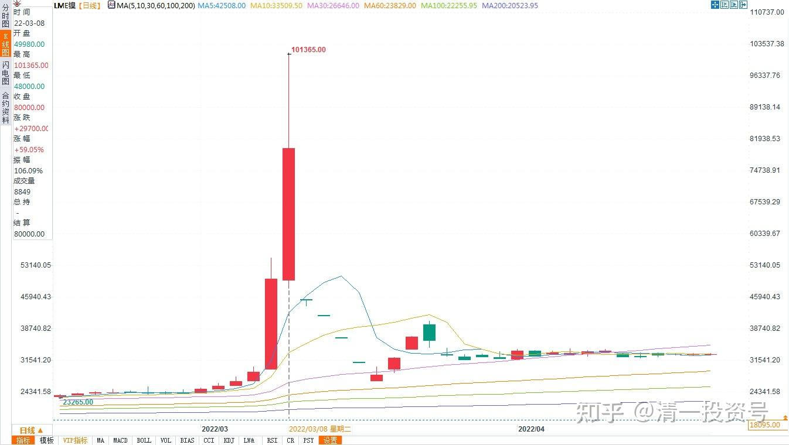

专篇29.股票•期货

清一山长 2022年3月9日

**一、股票：不恐惧的心**

*YJ 2022年3月9日 分时图*

山长清一2022/3/9 15:06:49

今天继续买入燕京啤酒。7.18元开始买进，很遗憾没有买到6.96元的最低价，因为这个时候我睡觉去了[滴汗]，我认为睡觉比看盘重要。你们看我股市上吃肉，没见我挨打的苦相——现在每天买入，每天挨打[尴尬]。**涨了，有货愿意卖出来，需要有不贪婪的心；跌了有勇气继续买进，需要有不恐惧的心。**你们啥心呢？也许都在悄悄地等看我笑话的心。股市一跌，大家就都装神圣去了。一个个庄严无比，都学庙里的菩萨了[抱拳]。

**琪 2022/3/9 15:10:55

我没睡觉也没买到6.96元是因为山长说的生了贪婪的心！挂了6.95元。股市是看自己内心最好的镜子。

山长清一 2022/3/9 15:14:58

挂了6.95元——差一分没买进，是不该你得这些筹码[滴汗]。不关贪婪的事情，就是没福气。就像我没福气买6.96元一样，7.0元都不给我买的。我就只配从7.81元买到7.18元[大笑]。

**平 2022/3/9 15:32:46

山长，您说的福气是指什么，是命运吗？这和“我的人生我做主”，有什么不同呢？

山长清一 2022/3/9 15:55:43

**“福气”就是你的“宇宙账户”资产数额。跟你的银行卡一样。你的银行卡，自然是你做主。**你的福气就是你积累的一切所作所为存下来的“宇宙钱”。**只是——虽然每个人都有银行卡，但——里面的钱，每个人都不一样。如果你走错了银行，固然取不出钱来。**比如俄罗斯的银行就不太容易取出钱来。但更糟糕的不是你取款的银行和动作，而是**如果你账户没钱的话，你的取款动作再优美过人，取款的条件再好，银行服务再周到，你也取不出钱来的。**这道理是一样的[大笑]。有些人，也许生来就是带着私人银行卡出生的，有些人是拿着一张亏损的账户出生的。因为上一世，每个人在自己账户上存的钱不一样。

**平 2022/3/9 16:04:11

感谢山长回复。

山长清一 2022/3/9 15:30:48

今天成交，买入了几百个小散户的成交单，百股级别的。恐怕都是割肉盘——也就是恐慌的出逃盘。因为最近两个月进来的小散户，这个价格是不可能赚钱的。说不定还有涨停抢进来的货，今天吃了比跌停更多的亏。你们今天亲眼看到了恐慌——是如何让人夺路而逃的。然后也看到了什么才是 “**别人恐惧的时候，我贪婪；别人贪婪的时候，我恐惧**。”这些话，说出来很容易，做出来很难。

**美 2022/3/9 15:44:43

无比感恩山长的不断示范。无论股市如何起伏，只要看到山长发言就瞬间安心，自从2020年财富课遇到山长后，对股票投资完全小白的我跟着山长踏踏实实做傻猫。我们夫妻所有上课的费用，孩子的就读费用，海外社区房等……感觉都是山长额外赠送。

遇到山长真是非常幸运。所以无比感恩我的推荐人**丽女士。

山长清一 2022/3/9 15:48:41

这是你的福气，不是我给的[抱拳]。吉祥之人，自然有吉祥之相。

**美 2022/3/9 16:00:55

但是相比而言，财富只是“最小”的收获，遇到山长整个三观被修正，灵魂被升级……我想每个遇到山长的人，都经常会庆幸自己是无比幸运的。

**二、期货：残酷的金融战**

**莎 2022/3/9 15:14:35

山长，看这架势，是金融战开始了吗？

山长清一 2022/3/9 15:26:58

金融战——你们看青山控股现在遭遇的，才是金融战，金融大鳄定向攻击自以为是的市场期货新玩家，以为期货可以有逻辑的。结果——这两天，镍价期货暴涨200%多，目标就是爆仓做空镍价期货的商家。

[惊魂16小时！还原青山控股被逼仓事件|上海证券报](http://link.zhihu.com/?target=https%3A//paper.cnstock.com/html/2022-03/10/content_1577501.htm)

*LME镍期货 2022年2月～4月 日线图*

这家中国企业，可能注定要破产了。据说亏损达80亿美金，跟去年的石油期货价格跌破0元一样极为荒诞，不可能的事件出现了。就是要等你爆仓了，他就恢复原价了。所以，**我绝对不单吊一只股。我这燕京十大股东，如果被主力盯上了，他们就可以当天让我爆仓，又当天恢复原价，直接把你的账户抢光光**（港股可以一天到位，A股难一点，但也是可以操作的）。所以唐建华持仓的5000多万股，居然一点融资都不用。这才是高人——太了解金融的残酷了。**我根本就不玩期货，就是：这个市场根本不用理性，只用钱来说话。谁有足够的钱，谁就能爆掉对手。**西方金融大腕太懂这种策略了，中国的期货大鳄也太懂了，可以瞬间赚大钱，也可以瞬间亏光光。逍遥刘强，就是吃了股指期货的大亏，他自杀了。因为知道再也没有翻身的机会。**我要做的股市投资，我知道我可以犯很多次错误而不会起不来。其实——我的A股亏光了也不影响我重新起来的。这就是我不恐惧的根本——不去会让自己死翘翘的地方玩。**

文章音频：

[390篇.股票•期货_清一投资号文章同步音频_免费在线阅读收听下载 - 喜马拉雅](http://link.zhihu.com/?target=https%3A//www.ximalaya.com/sound/681372060)

**参考链接：**

专篇1 [306篇.前缘1.雪球的最后一贴--胜利曙光都已经出现](http://link.zhihu.com/?target=https%3A//xueqiu.com/2017773236/247159187)

专篇2 [307篇.被特别关照的股--前缘2](http://link.zhihu.com/?target=https%3A//xueqiu.com/2017773236/247387457)

专篇3 [308篇.立此存照--前缘3](http://link.zhihu.com/?target=https%3A//xueqiu.com/2017773236/247580614)

专篇4 [309篇.见识传说中的拖拉机账户](http://link.zhihu.com/?target=https%3A//xueqiu.com/2017773236/247973779)

专篇5 [310篇. 拉升在即](http://link.zhihu.com/?target=https%3A//xueqiu.com/2017773236/248351982)

专篇6 [311篇. 进入右侧投资时代](http://link.zhihu.com/?target=https%3A//xueqiu.com/2017773236/248658236)

专篇7 [313篇. 小主力进货的阶段](http://link.zhihu.com/?target=https%3A//xueqiu.com/2017773236/249221851)

专篇8 [316篇.两轮回调对比](http://link.zhihu.com/?target=https%3A//xueqiu.com/2017773236/249675370)

[专篇9.主力的水军](https://zhuanlan.zhihu.com/p/619400004)

[专篇10.主力完成筹码收集](https://zhuanlan.zhihu.com/p/629948708)

[专篇11.主力、游资、右侧投机客纷纷进场](https://zhuanlan.zhihu.com/p/631628731)

[专篇12.进入震荡期](https://zhuanlan.zhihu.com/p/633057526)

[专篇13.永远回避风险，不亏损第一](https://zhuanlan.zhihu.com/p/635191087)

[专篇14.高位十字星缩量及主力操作的三个阶段](https://zhuanlan.zhihu.com/p/635191930)

[专篇15.准备起跳](https://zhuanlan.zhihu.com/p/636886203)

[专篇16.大幅回调，老手加高手](https://zhuanlan.zhihu.com/p/638552635)

[专篇17.股东数所传递的信息](https://zhuanlan.zhihu.com/p/639002631)

[专篇18.突](https://zhuanlan.zhihu.com/p/640000051)[破9元是燕京的基本目标](https://zhuanlan.zhihu.com/p/640000051)

[专篇19.YJ、惠泉今天盘面语言对比](https://zhuanlan.zhihu.com/p/640550916)

[专篇20.暗示洗盘快结束](https://zhuanlan.zhihu.com/p/641509884)

[专篇21.现在是新主力的成本区](https://zhuanlan.zhihu.com/p/642330561)

[专篇22.成熟投资者的思考方式](https://zhuanlan.zhihu.com/p/655404597)

[专篇23.主力未走，迟早变盘](https://zhuanlan.zhihu.com/p/656816805)

[专篇24.涨停但不像拉升出货](https://zhuanlan.zhihu.com/p/657944680)

[专篇25.裘国根清仓式减持华能国际电力港股](https://zhuanlan.zhihu.com/p/659254254)

[专篇26.主力倒手，游资被动替主力杀跌](https://zhuanlan.zhihu.com/p/660162209)

[专篇27.看多不做多，主力在第二阶段](https://zhuanlan.zhihu.com/p/661469607)

[专篇28.走势打破正常思维，看空不做空](https://zhuanlan.zhihu.com/p/662755132)

