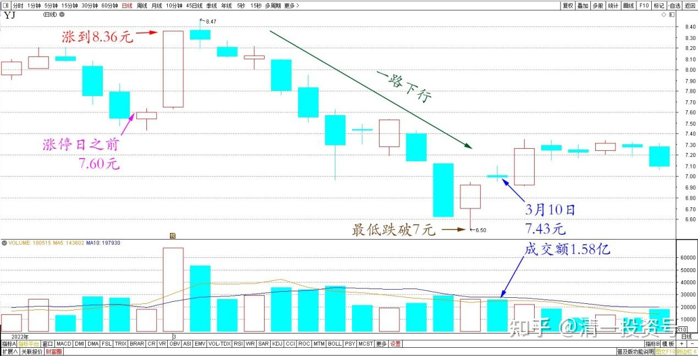
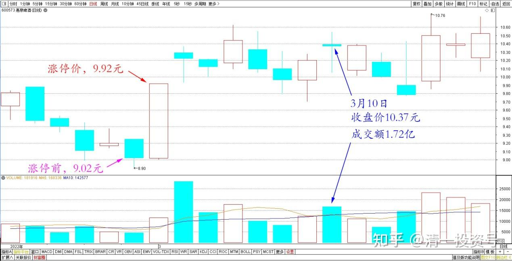
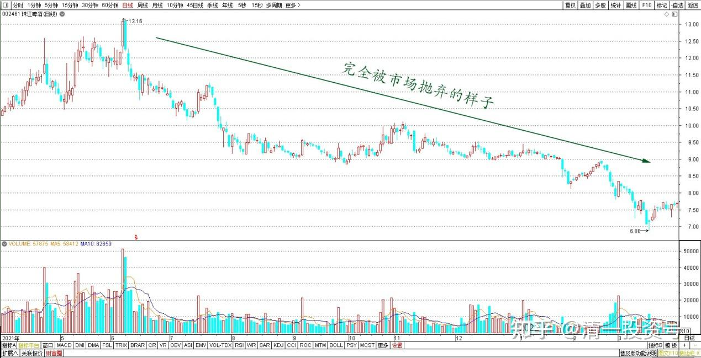
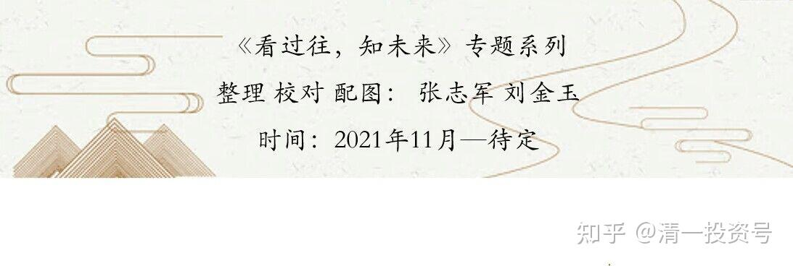

专篇30.谁是真强势？谁是真弱势？

清一山长 2022年3月10日

解析一下今天的盘面：今天刚去看了一下，挺有意思的。涨停日之前，燕京啤酒是7.60元。涨到8.36元，之后居然就一路下行，最低跌破7元，怎么也想不到这个可能性。走到今天，是7.43元，一路挺凄惨的，是吧？害得我一路地补，基本上都补回来了。下次再妖怪风气,继续玩涨停，我就再卖出去好了。就算等一年，涨停一次也行呀？我相信只要耐心足够好的话，燕京啤酒会给我这种机会的。

*燕京啤酒 2022年2月～3月 日线图*

而惠泉是从9.02元，涨停价9.92元。今天的收盘价：10.37元。

*惠泉啤酒 2022年2月～3月 日线图*

你们说：谁是强势股？你们一定认为是惠泉强势，所以有人会放弃燕京啤酒去追买惠泉。认为燕京啤酒弱势，不能碰。不过，多看几眼就出问题了。

燕京啤酒今天的成交额是1.58亿，惠泉是1.72亿，居然比燕京啤酒更高。如果算流通值的话，今天惠泉有13%还多的流通筹码，已经倒手了，远远超过一个股正常的成交情况。但燕京啤酒的股本比惠泉大十倍，成交比它更低。是不是不正常十倍？其实，为啥惠泉涨了，它就是不跌？原因很简单，因为主力怕它跌，所以才拼命地用各种方法来维护股价。**包括成交量高，也是维护股价的一种方式，真实的成交，并没有这么多，有人在里面买买卖卖的，使劲维持股价。这是庄股的特征。**

所以，我觉得惠泉很吃力的样子，如果我是主力，我觉得累死了。但燕京啤酒就完全相反，主力根本就不怕跌，甚至还喜欢跌的样子，故意地推波助澜，走势让人崩溃。**为啥？就要反过来多想想了。**我猜测的一个版本就是：涨停的这天，抢进来的人太多了，主力并不想带这批人一起走（中国只想吃独食的主力很多的，不想共赢）。所以，想要设法把他们都赶走，就放弃了维护股价，甚至第二天把涨停买进来的股票，全都卖出去了，套住了这批想要跟风的人。但令我想不到的是——主力居然借机调整，大幅打压，居然比跌停还跌多了不少（最低居然破了7元）。这完全就是一个彻底破坏信心的主力，根本就不在乎股票涨不涨的主力。所以，这些“聪明钱”一看，主力根本没有维护上升通道的样子，自然绝望，给点反弹就逃走了。而且——这些人大概率不会再回头，吃了大亏，知道庄家不好对付。所以盘面的结论就是：燕京啤酒近期，是不会涨的了（这个判断真假，我就不知道了，反正盘面语言就是这样的）。

但是，谁才不怕跌？只有强势股才不怕跌呢！所以，我反倒以为，现在应该是燕京啤酒更强势一些，相比惠泉而言，反正我现在不敢买惠泉。当然，真正的弱势股是谁？其实是珠江。它才是完全被市场抛弃的样子。我有点奇怪。它怎么被抛弃了？看它的市场经营情况，基本是正常的。我很庆幸：珠江是我赚钱几乎最多的一只酒股（惠泉快赶上它了）。幸亏高点卖掉了，不然留到现在，大部分利润就没了。所以，中国特色，与巴菲特不一样，长期持股似乎不划算。当然，要做对了才行。**短期收益，取决于你的交易水平。交易水平不好，还是不如长期持股。**比如珠江，在我买入的低点买入，长持到现在，还是赚钱的。起码比中建更赚钱[大笑]。

*珠江啤酒 2021年4月～2022年3月 日线图*

(标题、图片为编者所加)

**文章音频：**

[408篇.谁是真强势，谁是真弱势_清一投资号文章同步音频](http://link.zhihu.com/?target=https%3A//www.ximalaya.com/sound/698382901)

**参考链接：**

[专篇21.现在是新主力的成本区](https://zhuanlan.zhihu.com/p/642330561)

[专篇22.成熟投资者的思考方式](https://zhuanlan.zhihu.com/p/655404597)

[专篇23.主力未走，迟早变盘](https://zhuanlan.zhihu.com/p/656816805)

[专篇24.涨停但不像拉升出货](https://zhuanlan.zhihu.com/p/657944680)

[专篇25.裘国根清仓式减持华能国际电力港股](https://zhuanlan.zhihu.com/p/659254254)

[专篇26.主力倒手，游资被动替主力杀跌](https://zhuanlan.zhihu.com/p/660162209)

[专篇27.看多不做多，主力在第二阶段](https://zhuanlan.zhihu.com/p/661469607)

[专篇28.走势打破正常思维，看空不做空](https://zhuanlan.zhihu.com/p/662755132)

[专篇29.股票•期货](https://zhuanlan.zhihu.com/p/665201830)

