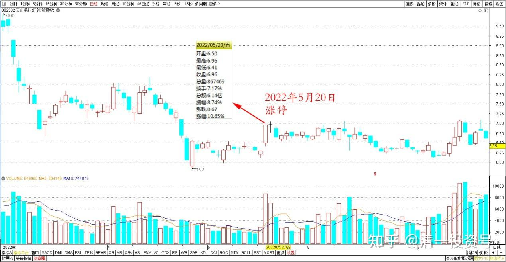
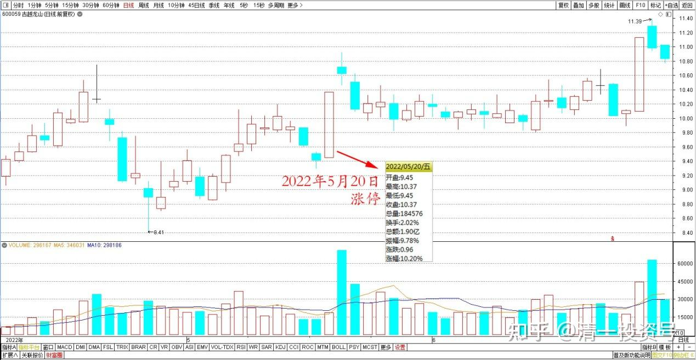
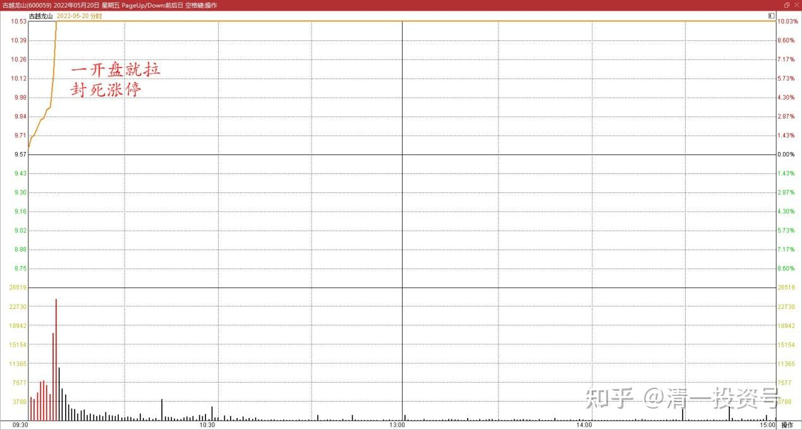
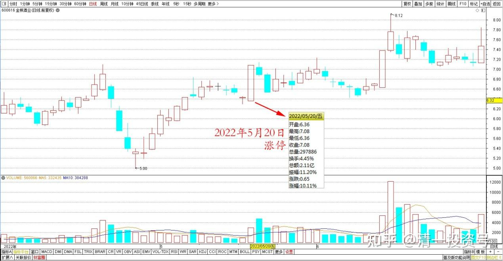
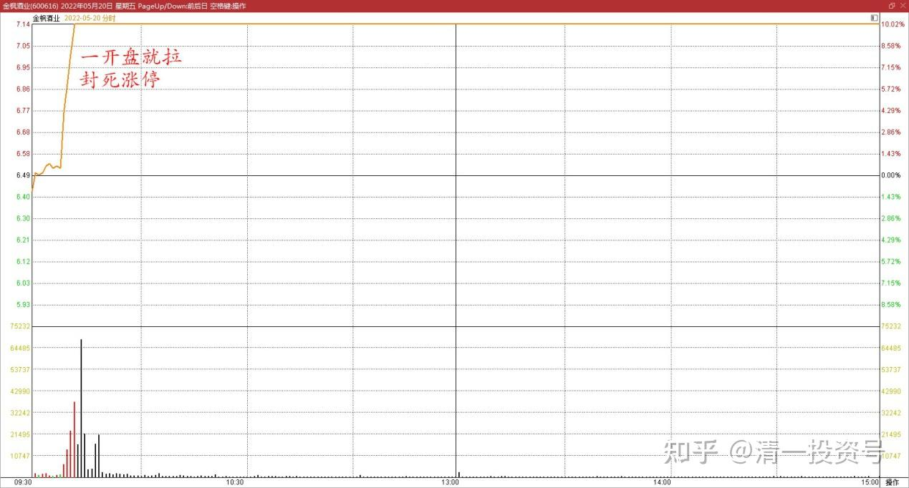
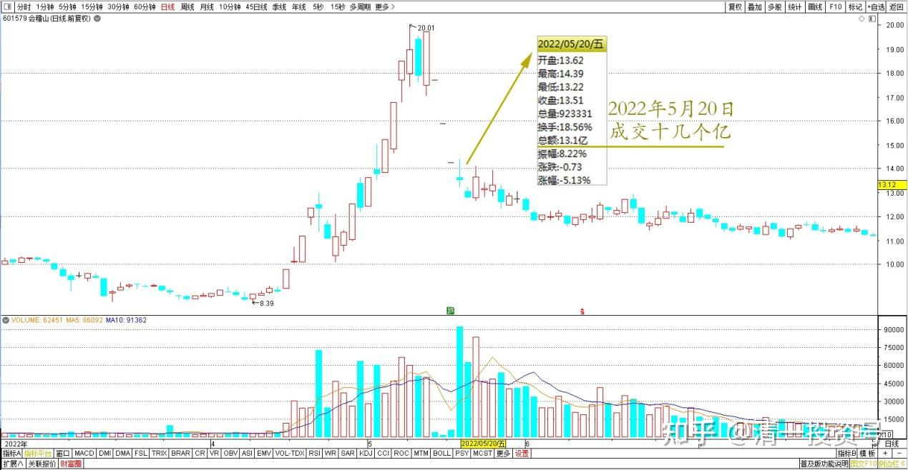
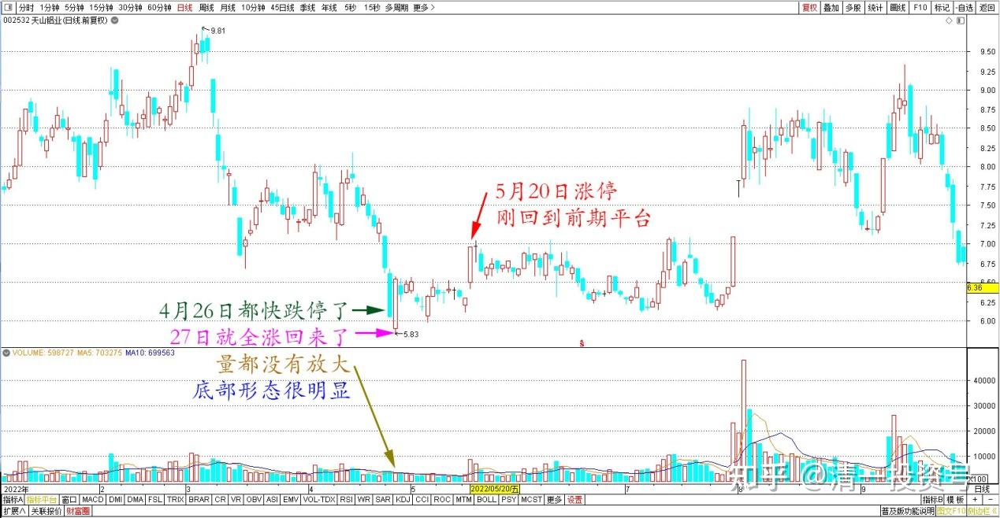
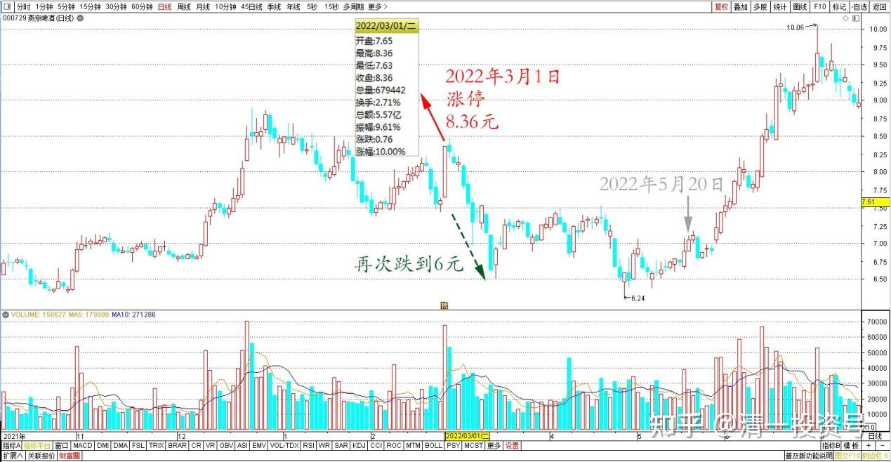
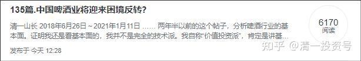

专篇32.三种涨停的原因

清一山长2022年5月20日

**一、天山铝业涨停**

**湖2022/5/20 15:19:44

前几天您讲的天山铝业，今天涨停了。

清一山长2022/5/20 15:21:10

我都没看行情。但我买了[大笑]，希望你们也买到，大家都发财。

**霞2022/5/20 15:22:10

还能买吗？

清一山长2022/5/20 15:26:04

涨停了，你还想要呀？我手上有天山，就卖点给你吧！看样子，你的钱多，反正我的股也多，让点筹码给你也没啥！古人说了：别人要就要舍得分享。我拿涨停的钱回来后，再去买点别的跌惨了的股算了。

天山铝业2022年5月20日前后日线图

**二、古越龙山、金枫酒业涨停**

清一山长2022/5/20 15:41:45

今天古越龙山涨停，金枫酒业涨停，都是一开盘就拉封死涨停的。

古越龙山2022年5月20日前后日线图

古越龙山2022年5月20日分时图

金枫酒业2022年5月20日前后日线图

金枫酒业2022年5月20日分时图

你们知道是干啥的吗？是来救市的。救谁？救会稽山。让小股民假想黄酒股有行情。资金涌入，不然就套死在会稽山了。我原以为只是套的小股民呢！原来还有大鱼。但你们也看到了大鱼的凶悍，一旦被套，反抗很剧烈，果断地断臂而逃。而小股民往往舍不得亏本，结果又亏钱，又输时间。如果我说的是对的，明天古越和金枫就会跌，完成了掩护任务的资金，明天就会快速地撤退，他们绝对不会恋战的。如果掩护资金运气好的话，还可以赚一点钱。另外，今天会稽山成交十几个亿，总市值也就几十个亿。我认为今天救市成功，明天继续阴跌。如果没有两个股的涨停，今天就算跌停也无法出货的。散户不愿意思考，不好好学习，不懂人心，只懂自己，来股市就是送钱的命。（又套牢了一批小散户）[滴汗]。

会稽山2022年5月20日前后日线图

**三、三种涨停的原因**

清一山长2022/5/20 16:26:05

有三种涨停，你们要知道，原因都不一样。

1.**有些涨停，主力是用涨价来“收货”的，盘面上，涨得犹豫不决的样子，还多次破涨停**。

天山今天的涨停，就不干脆，有点像是“要收货”的样子，快速把浮动筹码清扫掉。今天天山，封住涨停的资金很少，才一百多万股。总资金一千万左右，一个大户就打掉了。其实4月26日大跌，都快跌停了。27日就全涨回来了，量都没有放大。说明是资金有意打压，但舍不得筹码，这是个黄金坑。后来又跌了，我就买入了。底部形态很明显，我才敢告诉你们的。现在涨停，也只是刚回到前期平台而已。

天山铝业2022年日线图

**2.有些涨停，是为了出货。涨停，往往是借利好出货，涨停之后，又慢慢阴跌。**

3.**还有一些涨停，是假装天山这样，假装“到拉升时候了”，做一回“假涨停”。好像要货的样子，量也不放大。其实是为了出货。**比如燕京上次的涨停8.36元，几年了，第一次涨停，价格也不高，我以为是“真涨停”，没想到是假，害得我的大部队都没动（你们看到明面上，我的主账户从1600万减持到了1400多万，还有其他账户，见不到的）。其实当天我总共就出了250万股。由于不是知道要跌，只是我心想：我已经赚不少了，让点筹码给别人吧！收回一些资金备用也好。我认为：几乎铁定燕京会继续涨的，只是想：过10元我就再卖一点。没想到——居然再次跌到6元多。当然，燕京跌到了6元多，我就把卖掉的筹码全部都买回来了，我还多买了上百万股，不买白不买，6元多，我就尽量筹钱来买的。

燕京啤酒2022年3月1日前后日线图

这第三种燕京上次这样的涨停，就是最阴险的庄，最善于把握人心，把任何人都算计的准准的。而且绝对实力很强，资金也大，谋定而动，不打无准备的仗。他想怎么走，就怎么走，永远也让你想不到。他还是恶庄，最不愿意跟其他小庄、小散分享利益，他最喜欢吃独食。这种庄，要比古越、天山、会稽山的庄要阴险很多倍，吃他的红利很难。但再难，我也认了，我看准了燕京正在转型。而且转型已经证明是成功的，我以失败者燕京的价格，买入成功转型者燕京的股份，是不会亏的，极限价格，就是6元了。我就死死咬住它，陪它一路玩下去。我就是看这条龙太大了，才从计划的几百万筹码，不断加到现在的一两千万。好在我的买点低，成本刚过6元，我还耗得起。不然追高，就被他吃死了[滴汗]。但是，再看好，我也不敢单仓独买燕京跟他对赌，不然我用信用账户持有燕京的话，这个主力是看得到我账户的人。所以，他一定会找机会让我爆仓的。为了防止被恶庄爆仓，再好的股也不敢单押。所以我拿了主力最没有办法的中国建筑来作为平仓石，对赌燕京。而且中建股息良好，低于5元买入，不怕融资的。所以——勉强度过危险。不然，为了吃掉我的筹码，这种庄会把燕京跌到4元，打爆我之后，再涨回来的。你们看唐建华，就是老狐狸，他的股全是普通账户持有的。假如他敢融资，这种主力，窥探到他账户资金有限，就会让他爆仓，拿走他的5000多万筹码。我见过金融狼群，把一个大户的几十亿的账户打空掉，这个大户就是满仓满融，拿了比亚迪的港股。但一群金融之狼，就从50多元直接打到18元。此人爆仓，几十亿都没了。当年亲眼看到此惨相，对融资买股心有余悸。所以都设法加上种种保险措施。我的券商的经理，后来当副总了，看了我的融资账户，就说我的融资账户是打不爆的，因为我设计了层层的保护[大笑]。你们不懂里面奥秘的，就别动用融资。不然神仙打架，池鱼遭殃。我猜当年杀大户的时候，一些单押比亚迪的小散也一样被打爆了。现在看比亚迪涨到几百元，肯定气死了。

**丽2022/5/20 16:38:06

谢谢山长分享。燕京的主力，对舆论控制非常非常的严重。上次燕京低下来，我把中建换了燕京，换过头了，也是因为时刻都感受到雪球上对燕京话题的控制非常夸张。投资号的文章，一直被限流，涉及啤酒的被限流，涉及燕京的更是限流。今天这篇整理文，发出来很久，都没什么阅读量的，到现在，也勉强6000多个阅读。这个数据应该都是山长的铁粉给贡献的。越是控制，那越是增加对燕京的肯定。

**丽2022/5/20 16:38:22

清一山长2022/5/20 16:42:51

燕京封我账号，才让我涨停不走的。因为大概率不会因为这点小钱动作这样大，我认为快到涨升时间了，才封我的账号的。当时判断三个月之后就会涨了。早知道现在这个样子，燕京不会封我账号的。因为依然在盘整、洗筹、折磨人。我认为是燕京主力可能推迟原计划了，封我封早了。只要燕京没涨，他们还想动作，就不希望我说话。

(标题、图片为编者所加)

**文章音频：**

[433篇.三种涨停的原因_清一投资号文章同步音频](http://link.zhihu.com/?target=https%3A//www.ximalaya.com/sound/721039024)

**参考链接：**

[专篇22.成熟投资者的思考方式](https://zhuanlan.zhihu.com/p/655404597)

[专篇23.主力未走，迟早变盘](https://zhuanlan.zhihu.com/p/656816805)

[专篇24.涨停但不像拉升出货](https://zhuanlan.zhihu.com/p/657944680)

[专篇25.裘国根清仓式减持华能国际电力港股](https://zhuanlan.zhihu.com/p/659254254)

[专篇26.主力倒手，游资被动替主力杀跌](https://zhuanlan.zhihu.com/p/660162209)

[专篇27.看多不做多，主力在第二阶段](https://zhuanlan.zhihu.com/p/661469607)

[专篇28.走势打破正常思维，看空不做空](https://zhuanlan.zhihu.com/p/662755132)

[专篇29.股票•期货](https://zhuanlan.zhihu.com/p/665201830)

[专篇30.谁是真强势？谁是真弱势？](https://zhuanlan.zhihu.com/p/676527421)

[专篇31.中建换啤酒和资源股](https://zhuanlan.zhihu.com/p/677138763)

