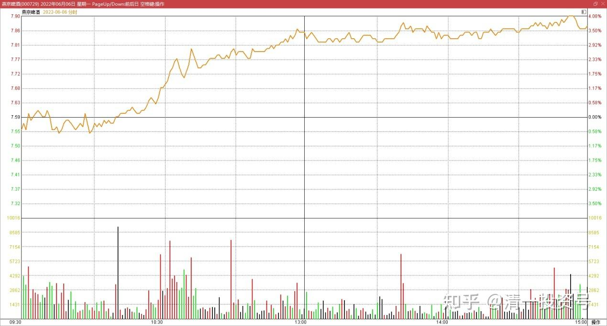
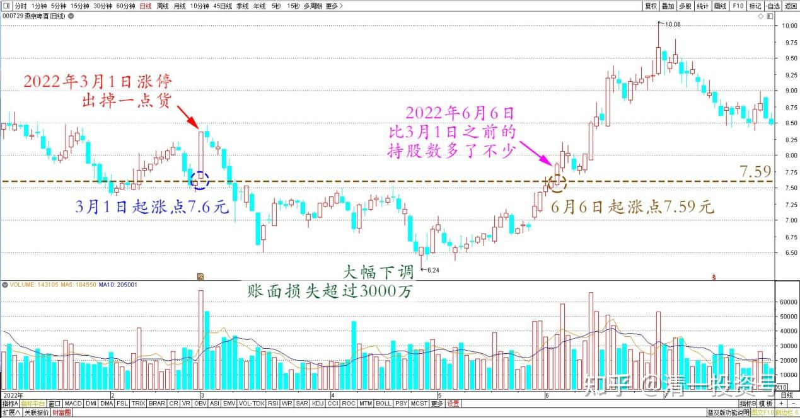

专篇34.涨跌无意，笑看云起云落

清一山长2022年6月6日

燕京今天涨过7.80元了。3月1日涨停的时候，起涨点是7.60元。今天的起涨点是7.59元。目前盘面很轻，比3月1日轻多了。下午会不会冲涨停？我也不知道，也不期待。但上次涨停出掉一点货（两个账户一起抛掉了250万股）。随后燕京大幅下调，我的账面损失超过了3000万，幸亏我也不当一回事。现在账面上，燕京比3月1日之前的持股数，要多了不少。重新回到原位的话，不仅仅满血复活，其实是燕京市值再创新高。因此，**要学会淡定一点，笑看云起云落。不再过于在意账面的涨跌，而要在意自己的投资逻辑对不对**。

燕京啤酒2022年6月6日分时图

燕京啤酒2022年1月～7月日线图

**如果持有中国好股票——将来不会亏损的股票，跌了何妨淡定一点，不去计较得失。有钱还可以再买一点。就算手中持有好股票，涨了，没有涨到你心中的理想价位，也何妨抱一种“分享利益”的心态，把好股也卖一点给别人，拿钱回来备用。这样，无论涨跌，大家都可以开开心心的。如果你斤斤计较要抓到股市上的每一分钱，不说结果，光过程中，你就输了。你绝对每天活在地狱里。**

(标题、图片为编者所加)

**文章音频：**

[461篇.涨跌无意，笑看云起云落](http://link.zhihu.com/?target=https%3A//www.ximalaya.com/sound/741303470)

**参考链接：**

[专篇28.走势打破正常思维，看空不做空](https://zhuanlan.zhihu.com/p/662755132)

[专篇29.股票•期货](https://zhuanlan.zhihu.com/p/665201830)

[专篇30.谁是真强势？谁是真弱势？](https://zhuanlan.zhihu.com/p/676527421)

[专篇31.中建换啤酒和资源股](https://zhuanlan.zhihu.com/p/677138763)

[专篇32.三种涨停的原因](https://zhuanlan.zhihu.com/p/688788024)

[专篇33.多赚了几十万股](https://zhuanlan.zhihu.com/p/693300690)

