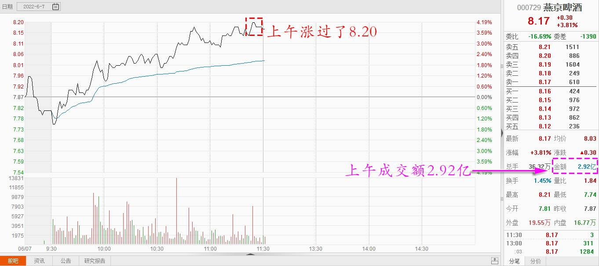
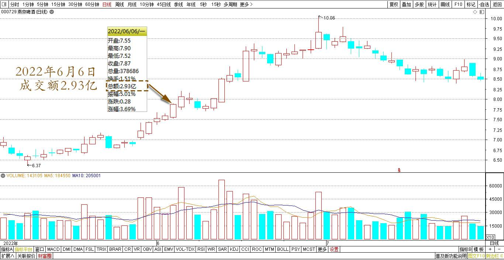
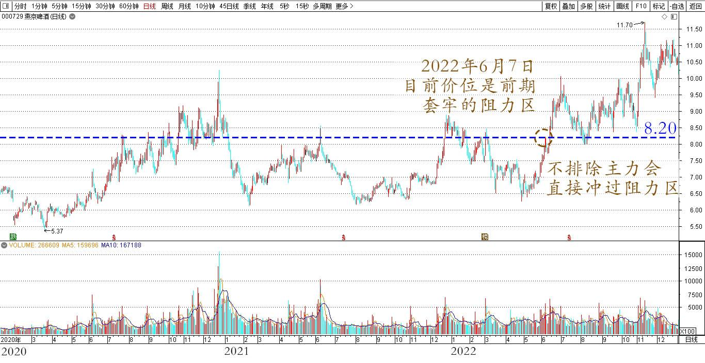
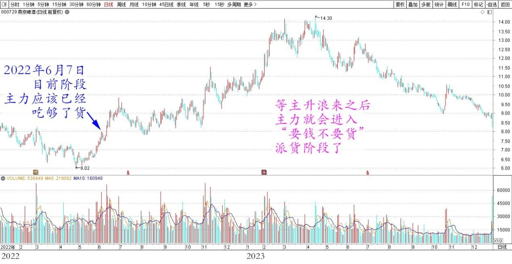
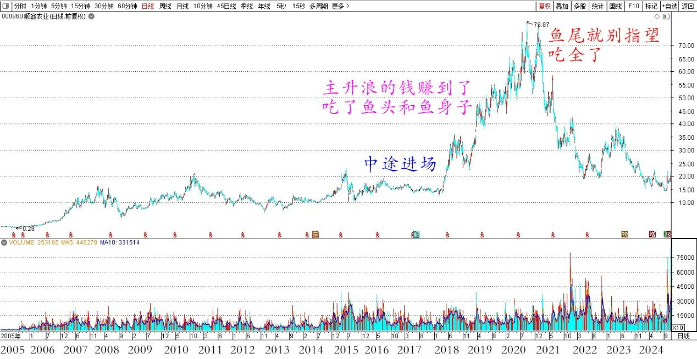
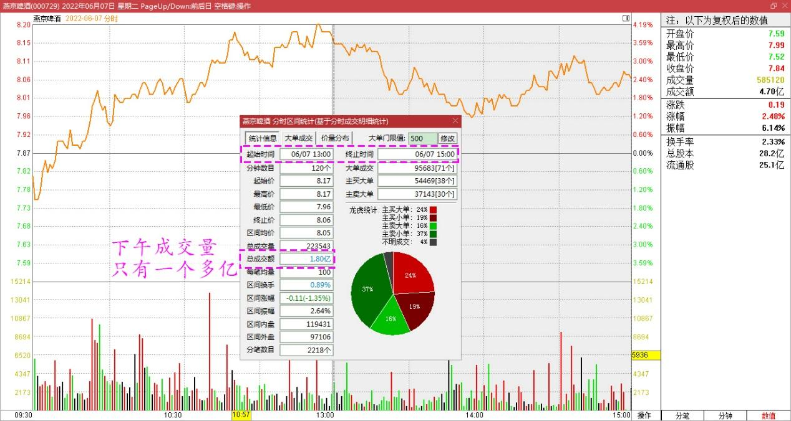
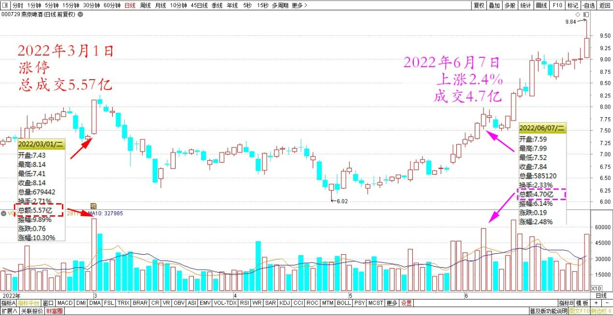
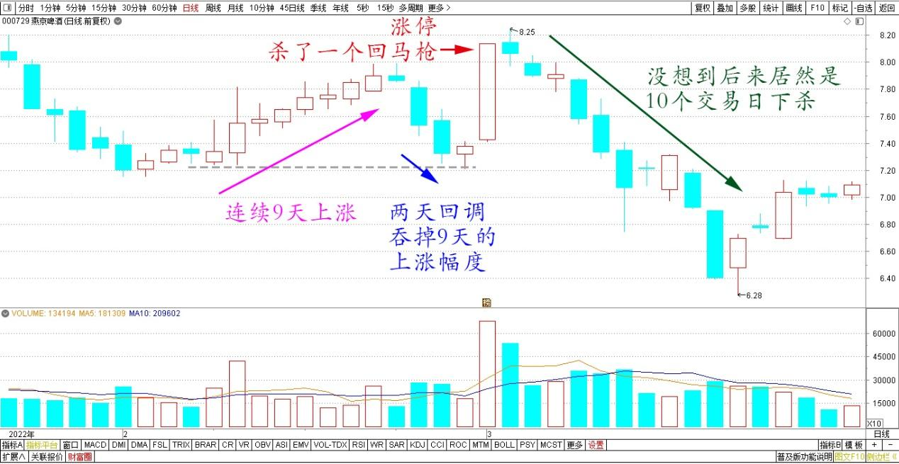

专篇35.燕京主力已吃饱，唯一办法“屁股功”

清一山长2022年6月7日

**一、燕京正在秀身材**

上午陪小木兰们练拳，刚回来看行情，今天的燕京，已经重回8元上方了，今天上午涨过了8.20元，成交量在今天上午已经达到昨天一天的成交量了，有一点点放大。

燕京啤酒2022年6月7日上午分时图

燕京啤酒2022年5月～7月日线图

说明今天上午有不少资金进入，也有不少资金退出。前段时间套牢的人，估计骂骂咧咧地回本就走了。主力给了这个机会，让这些人拿钱走路。目前价位是一个前期套牢的阻力区，按道理，需要消化一段时间的。但不排除主力会直接冲过阻力区，吸引大量的跟风盘进来。现在的燕京，正在“秀身材”，勾引投资客。**等它风采万端，隆重登场的时候，也就是该走的时候了**。不过现在看，时间还早。现在只是“犹抱琵琶半遮面”，美人还未登场，只是在做登场的准备工作罢了。

燕京啤酒2020～2022年日线图

今天，我的账户也“满血复活”。所以，真不需要纠结原来跌了3K多W。你纠结，你就输了。跌下去就买，不仅仅买回原来高位卖掉的仓位，还比我最高持仓多买了1M多。这就是用实际行动，对燕京主力耍手段的“报复”。

**二、主力目前已吃饱**

根据我的判断，目前阶段，主力的账户已经吃饱了，不想多要的。主力应该已经吃够了货。现在玩这些东西，就是吃吃吐吐，制造人气的。如果你确信跟得上主力的节奏，就跟着做T，大T、小T都可以。主力就在每天的拉拉打打中，不断地换位，“激活人气”，造成燕京的赚钱局面，吸引短线高手入局。因为它已经把主要的燕京老手都熬走了，现在新冲进来的人，也不熟悉燕京的股性。主力可以在这种不断的拉拉打打中，不断赚一点小钱。**主力的大钱，还要等主升浪来之后，主力就会进入第三阶段“要钱不要股”——派货阶段了**。

燕京啤酒2022～2023年日线图

**三、参考顺鑫看燕京**

由于燕京显然是一个长庄，与珠江和惠泉的庄都不一样，所以，未来的派货过程可能会很长，不会一下就派掉的。各位别担心出不了手，就看你能赚多少钱了。大家可以参考顺鑫农业原来的走势，这就是“长庄股”的走法。我甚至有点怀疑，现在的燕京就是原来的顺鑫主力。当年这个顺鑫的老庄，也是恶心人恶心得要死的。把很多老手都熬垮了。很多人刚涨一点点就走了。我是中途进场的顺鑫，都被这庄傻熬了两年。幸亏后来守住了，结果还算不错。主升浪的钱赚到了，吃了鱼头和鱼身子。**虽然最后的晚宴中，似乎鱼尾巴最好吃，但我们就别指望吃全了。**

顺鑫农业2005～2024年日线图

燕京的唐建华进场很早，也被他熬得够呛，五年多了。我幸亏实力不够，当初只是跟了珠江和惠泉的庄，因为看得懂这两种庄。我真正的主力资金，是这一两年，才全面转到燕京上的。你们也看到我进入十大的时点了。不然，五年前进场，也会被他气死的[滴汗]，会错过别的搞几轮的机会。

不过我判断：顺鑫的现在结果，不会是燕京的未来结果（顺鑫现在几乎跌回原地）。**其实燕京的前途，比顺鑫更广阔，竞争力更强。如果配合燕京基本面的改良，燕京会是长牛，慢牛股。这也是我长期坚持燕京的原因**。虽然现在看很傻，浪费了大量的时间等待价值发现。但转过来想：今年很多雪球大V都惨兮兮的，甚至到处传了很多爆仓的消息。别说赛道股了，也别说风光过的融创、恒大等。甚至重仓安全度最高的大蓝筹，如万科、平安、格力的人，这两年都在凄惨度日。我这个玩冷门股的人，居然今年还创市值新高，也算有福之人了。（重仓的中建、燕京，今年表现都比赛道股好很多了）。所以，**看别人吃肉，也别嫉妒，守住寂寞，有一天你也会被别人羡慕的。**（说明，这两年都没操作，除了把6.44元进的一半货让给新人之外，其他燕京仓位都老老实实地守住不动，等主力给减仓的信号。我就再让一些筹码出来[大笑]）。

**四、唯一办法“屁股功”**

下午成交量只有一个多亿，远远比不上上午的2.9亿成交。看起来跌了一点，其实没啥跌幅的。盘中消化了今天的上涨冲动。

燕京啤酒2022年6月7日下午分时区间统计

值得比较的是：3月1日的涨停，总成交5.57亿。跟今天上涨仅仅2.4%，就实现了4.70亿的成交相比，完全不在一个档次上。

燕京啤酒2022年2月～6月日线图

也就说说：一点点上拉，就清洗掉了很多的浮动筹码。也反过来说明：上次的拉涨停，筹码交换不充分（当初我就是看没有上量，才没有跑光的[滴汗]）。估计是上次，主力想要震仓，换筹的动作，战略没有实施出来，所以才有后面的继续疯狂打压。今天，刚回到前期的高点，就有很多人解套盘跑掉了。所以说明现在的燕京筹码相对上次松动了很多。也说明外围跟进的人更多了，股性激活。上次拉涨都不热火，主力做盘没有跟，当然打下来再说了。这一回怎样走？其实我也说不清。只是认为再打下去一次吗？似乎不合逻辑。从主力稳稳上升，不急不躁的架势来说，恐怕还没到需要打压的地步。上一次，2月份也是这样推升，连续9天上涨。结果用两天来回调，就全部吞掉了9天的上涨幅度。此后，也是二天之后就涨停了，突然杀了一个回马枪。我当时看，是一个漂亮的缴枪动作，一些投机客就马上蒙了。但我没想到后来居然是10个交易日下杀。这些动作都是说我不好惹，不按套路来，让人离开的动作。

燕京啤酒2022年1月～3月日线图

按道理坐庄不是这样做的。不过恶庄就是这样的，不给你好的预期。总是打你的冷不防。对付这种恶庄，唯一的办法就是**“屁股功”——跌了死拿不放，涨了卖了就不回头。**不然——随时会被他吃死的。当然，高手可以做做T，祝福大家。我今天啥都没做，账户都没打开，就是看看盘，练练眼力。

(标题、图片为编者所加)

**文章音频：**

[512篇.燕京主力已吃饱，唯一办法“屁股功”](http://link.zhihu.com/?target=https%3A//www.ximalaya.com/sound/779986221)

**参考链接：**

[专篇28.走势打破正常思维，看空不做空](https://zhuanlan.zhihu.com/p/662755132)

[专篇29.股票•期货](https://zhuanlan.zhihu.com/p/665201830)

[专篇30.谁是真强势？谁是真弱势？](https://zhuanlan.zhihu.com/p/676527421)

[专篇31.中建换啤酒和资源股](https://zhuanlan.zhihu.com/p/677138763)

[专篇32.三种涨停的原因](https://zhuanlan.zhihu.com/p/688788024)

[专篇33.多赚了几十万股](https://zhuanlan.zhihu.com/p/693300690)

[专篇34.涨跌无意，笑看云起云落](https://zhuanlan.zhihu.com/p/708781915)

