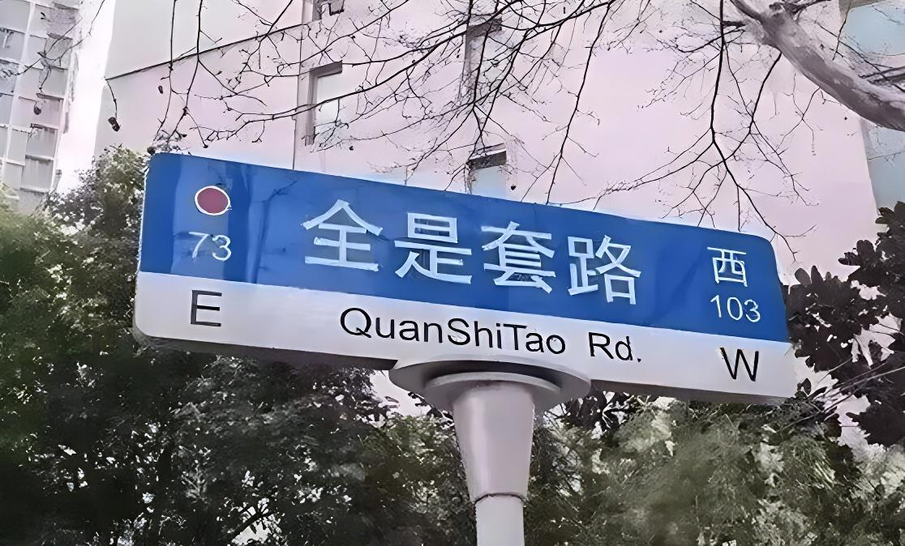
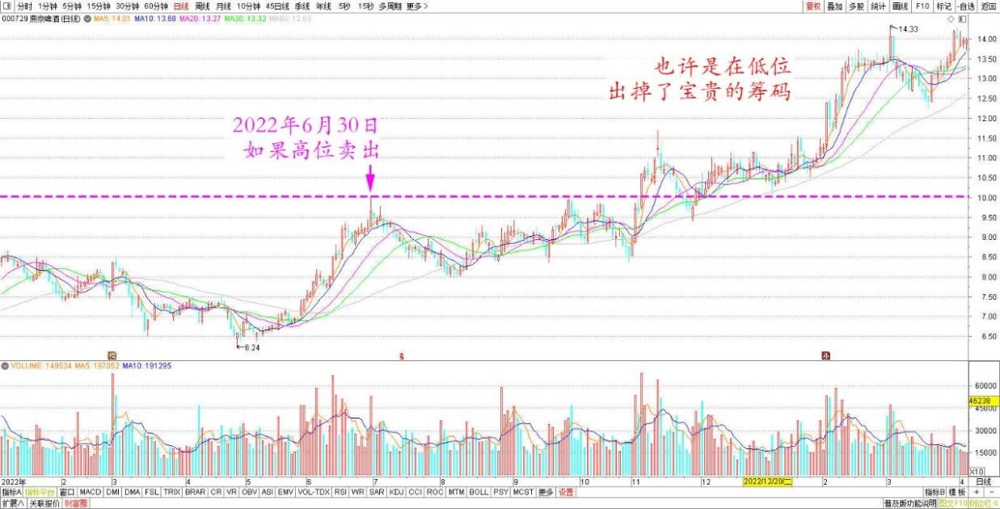
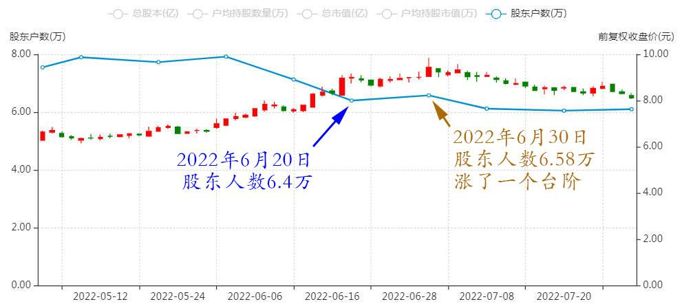

专篇39.燕京的警戒区

清一山长2022年7月1日

A股逍遥侠：

燕京啤酒000729昨天有做T就爽了，这只票可以反复做T，只要不跌破10日线就没事。

清一山长：

相信他，你现在赚小钱，将来亏大钱。**这是鼓励你做T。看懂了你偏不做。因为你没法知道他什么时候走**。**比如昨天之前做T的，全都被甩掉了。昨天高位出的当然划算了，但下周的高位来看，也许你是在低位出掉了宝贵的筹码。**

燕京啤酒2022年1月～2023年3月日线图

燕京啤酒股东人数出来了。与6月20日相比，已经涨了一个台阶。

燕京啤酒2022年5月～7月股东人数

**按道理股东人数应该大幅下降的，但相反涨了一千多人，说明——高位已经有新人进来了**，**这是一件好事，燕京人气正在聚合**。虽然不明显，我认为这些增加的人，都是昨天高位进的货。正常情况下，要磨他们一下的，让他们站一段时间岗了。但量不大，所以显然不是主力出货，而是散户新旧人换岗、站岗。我们继续耐心等待。直到大幅上涨，连连突破之日到来，总有一天的。一个提醒：股东人数超过10万就是警戒区，小心主力派货。

**文章音频：**

[531篇. 燕京的警戒区](http://link.zhihu.com/?target=https%3A//www.ximalaya.com/sound/801477149)

**参考链接：**

[专篇33.多赚了几十万股](https://zhuanlan.zhihu.com/p/693300690)

[专篇34.涨跌无意，笑看云起云落](https://zhuanlan.zhihu.com/p/708781915)

[专篇35.燕京主力已吃饱，唯一办法“屁股功”](https://zhuanlan.zhihu.com/p/6778261298)

[专篇36.燕京逆势大涨，自觉卖出部分](https://zhuanlan.zhihu.com/p/11402979763)

[专篇37.卖洛阳钼业，燕京换中建](https://zhuanlan.zhihu.com/p/15817619966)

[专篇38.燕京过10元，今昔对比](https://zhuanlan.zhihu.com/p/17902318069)

