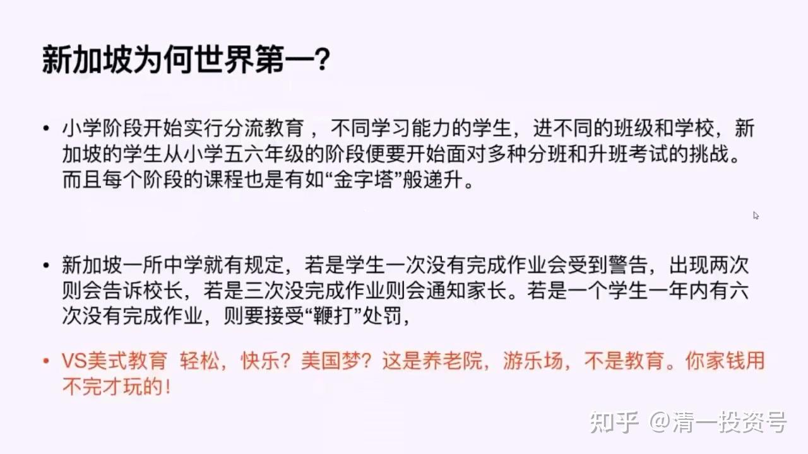
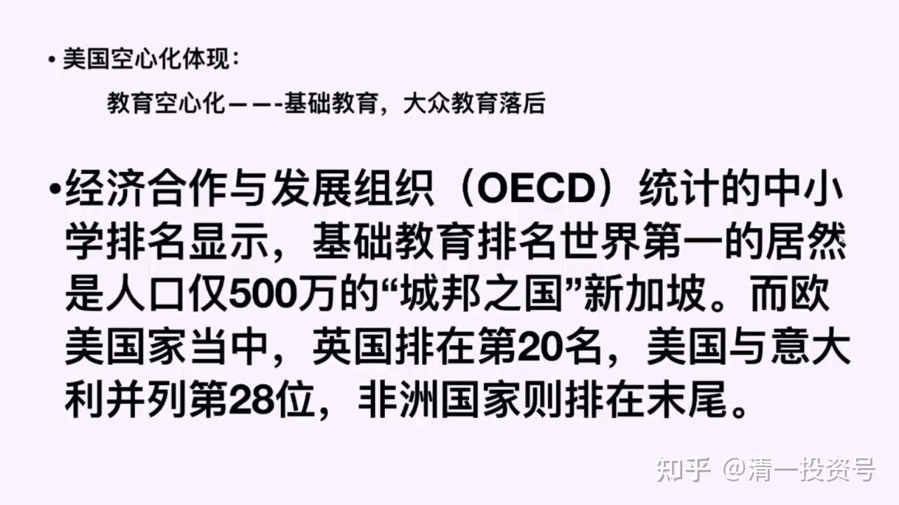
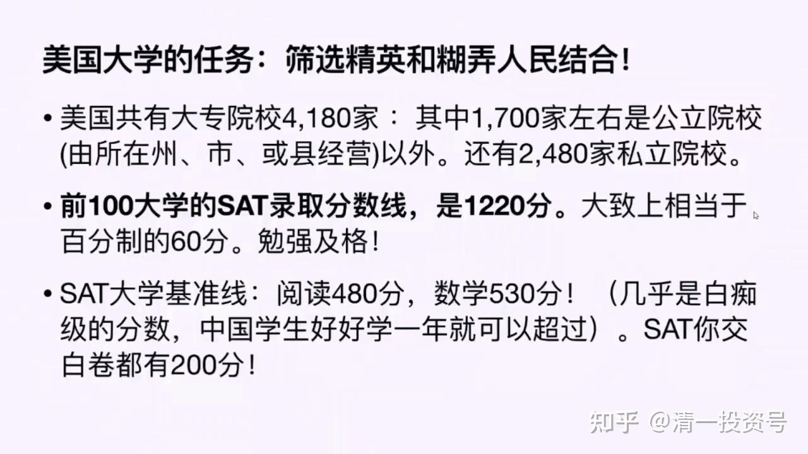
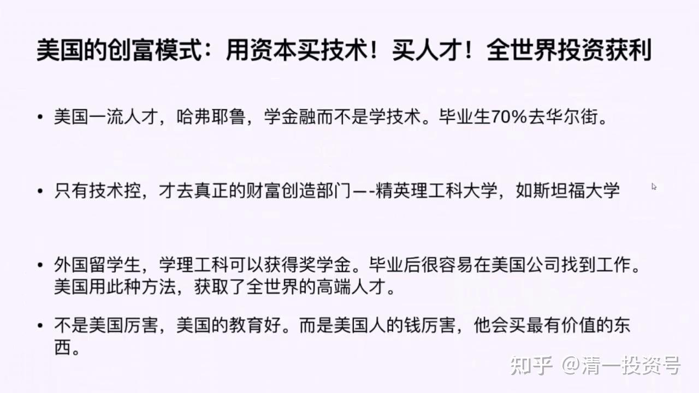
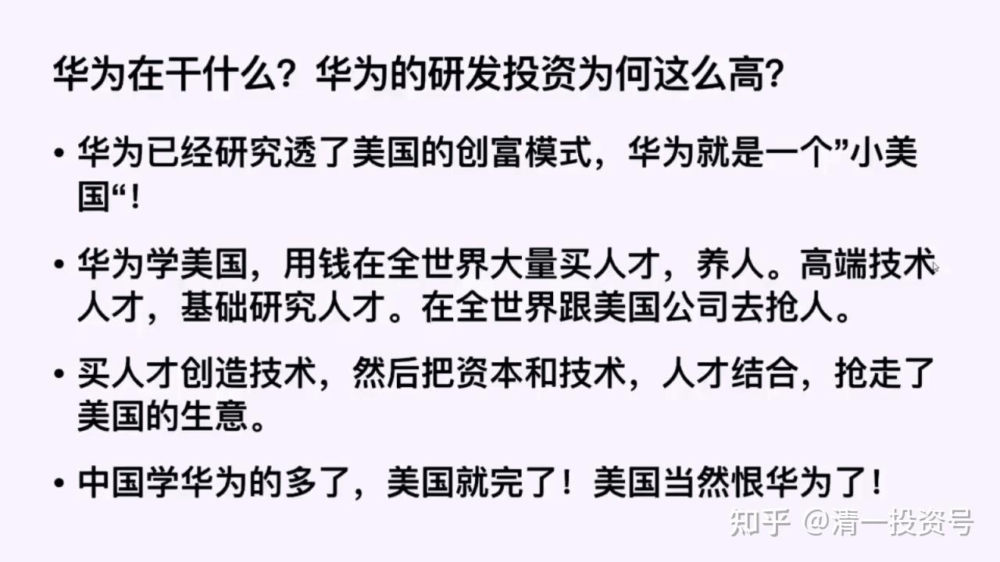

12篇.教育在财富三要素中的作用

——节选清一山长 2020年演讲 泰国的投资与生活解析

**1.教育让劳动力实现价值——新加坡教育世界第一**

**怎样让劳动力实现价值呢？很聪明的办法就是教育**。全世界基础教育最好的国家是哪一个？我猜你们都会认为是美国，中国人没脑子，总想把自己的孩子送到美国去。其实我告诉你，全世界教育最好的一个地方不是美国，而是我们华人很多的一个国家，这个国家是新加坡。

**新加坡的教育是世界第一**。新加坡为什么世界第一？因为新加坡是一个城国，它就是一个城市，它的面积比香港的面积还要小。这个国家原来跟马来西亚是在一起的，后来新加坡独立，而且得到国际社会的支持。但是它不可能划走大量的土地，它只要了靠近海边的一小块土地，差不多一个城市的土地。这个国家有没有资源？没有。这个国家有没有资本呢？有一点。因为新加坡聚集了很多华人，华人很勤奋，手上有钱，但华人手上的这点钱跟欧美资本相比是九牛一毛。所以新加坡立国的根基就是技术，它就把作用点放在了第二条。因为它去拼劳动力，它拼不赢。低端劳动力，它拼不赢马来西亚，拼不赢印度，拼不赢东南亚任何国家。它太小了，新加坡的人口也还有点多。但是**新加坡为了获得世界竞争力，拼命在技术上想办法，它的办法就是提高人口素质**。因为技术是用人来掌握的，所以新加坡非常重视技术。它的技术是很精心的，而且很强行的。

我们看看它怎样考试的。新加坡在小学阶段就实行分流教育，因为有些人从小就看出来不是读书的料，或者他的特长就不一样。新加坡认为你读不进去就别读了，别浪费时间。所以新加坡的教育严格分级，不同学习能力的人上不同的班。中国学了美国搞无差别教育，不排名。那叫混日子的教育，中国学了混日子的教育，中国为什么不学新加坡？中国学新加坡、学德国、学日本都是对的，学美国就是错的。因为美国根本不重视基础教育，所以美国的基础教育很差的。等一下会讲到美国。

新加坡的学生小学五六年级就要面对各种分班考试，还有升班考试。分班——不同的人上不同的班，升班——你不及格就不能升。每个阶段像金字塔一样地升，金字塔随着阶段提高越来越少，下面的最多。所以一些最差的人怎么办？你去做最低端的工作，你去做劳动力。你不要浪费教育资源，教育资源永远只提供给能学的人。跟今日学堂差不多，**今日学堂永远给最能学的学生，给他最好的教育资源。而不能学的学生来，我们不录取你，我们让你回家去**。我也建议这些人，你去做点普通的工作，因为我让你学习你不学，或者你不想学，不想学你就完蛋了。你不想学就不学，我们不会要求你们，我们不是国家。

但新加坡觉得你不想学，你就是这国家的负担，你就是个混蛋，它会怎么办？它会用鞭子打学生的。新加坡一所中学的规定就是，学生如果一次没有完成作业就会受到警告。因为你实在学不好是你智力有问题，你态度不好，一定收拾你。这个态度我非常强调，这跟今日学堂很像。**今日学堂觉得你学得不太好，但是你很勤奋，很努力，我们可以给你多一点时间。但是你学都不想学，你学习就在那混日子，在那偷懒之类的，我们就会把你开除掉**。新加坡类似，但是它比我们要严格得多。第一次没完成作业，受到警告；两次没完成作业，告诉校长；三次没做完作业就通知家长了。这种压力大不大？一个学生如果一年之内，请注意是一年之内，有六次没有完成作业，就要公开在全校学生面前接受鞭打的处罚。大家知道新加坡是有鞭刑的。

你再想想中国的家长，居然是让孩子追求快乐教育、自由教育，孩子想学就学，不想学就不学，这叫放羊教育好不好？放羊教育是从美国学的，你学美国有什么好结果，等一下我们就知道了。但是新加坡这样做，它的教育世界第一，竞争力世界第一，它比香港强得多。所以我们说未来的希望是新加坡。新加坡值得我们借鉴和学习。美式教育的什么轻松快乐美国梦，**大多数美式教育是养老院、游乐场，学生们在里面开开心心学习。除非你家里面的钱永远用不完，否则你别去搞什么美国式教育**。

**2.美国基础教育排名靠后**

接下来我们看看美国教育，美国空心化。美国现在很紧张，要制造业回归美国。请注意，新加坡的制造业相当不错。大家去看新加坡的产业构成，它并没有制造业空心化。

香港学了美国，香港在几十年前四小龙阶段也是亚洲制造业的一个中心，香港后来也尝到了资本的甜头，干吗不把这些活包给那些又穷又臭的大陆人去做？香港人要过好日子。所以香港资本市场的人发了大财，香港的几大家族通通是发大财的人。但香港的老百姓可遭罪了，他们没办法把自己弄成技术人才，也没有把自己弄成资本人才，他们依然只能拿一份小小的工资。结果香港现在日子很难过。

新加坡尽管地盘少，但是它是一个制造业中心，它为全世界生产了很多产品。其实以色列也是这样做的，以色列也特别值得学习，就是美国不值得学。关于劳动力，**美国觉得可以让全世界几十亿人为它工作，美国人可以过得舒服一些，美国的精英可以过得更加愉快，美国的老百姓们——把他们养活就够了，这是美国人的思维方式。所以美国人根本不重视教育，特别不重视基础教育**。所以经济合作与发展组织统计的中小学排名显示，基础教育排名第一的是人口500万的新加坡。而英国，我们觉得它好牛，它排在第20名。美国和意大利并列第28位。意大利可以说教育很烂的，美国跟它排在第28位，这个排名就说明了美国的教育很不好。但是美国教育勉强排在28名，是美国还有精英学校，精英学校的教育是很好的。如果以美国的普通公立学校而言，就是混日子，它根本就不培养劳动力，因为它不需要劳动力。

**3.美国大学——有精英也有垃圾**

我们来研究美国，我们怎样看美国的竞争力，我们不要一棒子打死，因为美国有不同的学校。我们要看这个国家的竞争力，就看这个国家的精英大学的情况。美国总共有大专院校4180家，其中由国家拨款，由所在的州、市或县来投资的公立院校有1700家，还有2480家私立院校。大家都知道美国私立学校很厉害，这是指精英私校。很多私校就是混日子的私校，别相信这种学校。美国前10名的大学有8所还是9所是私立大学，但是排名最坏的全是私立学校，所以不要迷信私立，而要注意私立精英学校。

美国4000多所大学里面，我们来选美国的前100名大学是不是精英当中的精英呢？应该是。但是我们看看它的录取分数线，我们通过录取分数线来评估它的能力。**美国前100名大学的录取分数线是1220分，大致相当于60%，勉强及格**。这个分数，说实话，比我们的高中要求都要低。这个分数还是前100名大学的录取分数线，要是在美国上大学，你需要多少分呢？美国有个大学基准线，大学基准阅读是480分，数学是530分。我对这个指标的评价就是，几乎是白痴级的分数。我们中国的学生只要认认真真好好地拼一年，就可以超过这个分数了。因为SAT你交白卷都有200分，你随便做对几题分数就上去了。它的评分方式跟我们的普通方式不一样，并不是得200分就做对了20%、15%，只要你写了个名字，交白卷都有200分，所以480分、530分，其实没什么技术含量。中国学生，英语勉强有一点点小基础，死拼一年就可以超过这个分数了。**通过美国前100名大学录取的分数线，你就看得出来，美国100名以后是什么大学呢？我们基本上可以说，以后的大学都是一些垃圾大学**，因为收垃圾学生的大学当然就叫垃圾大学了。这大学里面就是混个文凭，混日子，而且没有人重视这个文凭。可能前100名还有点希望，100名之后什么都谈不上。但是你说美国还是教育很强盛，你不能这样说，我们这里研究美国前100名大学是什么。

**4.美国的创富模式：用资本买技术！买人才！**

我们研究出来的美国的创富模式，我们发现美国人真的很聪明，很了不起。**美国是用资本买技术，买人才，在全世界投资获利的**。美国的一流人才，耶鲁、哈佛培养的人都在干什么？这些人大多数在毕业的时候，不管他学什么专业，70%的人要去金融界，去华尔街，去金融方面发展。美国的金融非常发达。很多人也在批评美国的金融业已经失去了美国精神，他们不再为社会服务，他们都是在全世界宰割钱，因为全世界宰钱实在来得太容易了。他轻而易举就能让自己变成千万富翁、亿万富翁，他干吗去辛辛苦苦干活？美国还有第二种一流人才，叫做技术控。是哪些人呢？就是比尔·盖茨、扎克伯格、乔布斯，这些人着迷于技术，着迷于创新。这些人上的学校是精英理工科大学，斯坦福、麻省理工以及加州理工。这样一些大学培养了美国的技术精英。

请注意，一种叫金融精英，全世界去掠夺财富，一种叫技术精英，创造技术标准，让全世界不得不找他们交买路费，这样全世界宰钱。但是在美国有一种情况，固然有扎克伯格、比尔·盖茨这样的人，但在美国，有相当多的人不愿意去学理工科，因为学理工很辛苦。

我当初是上工科学校的，我上工科的时候，我去看那些上文科的学生。我已经上午考完试了，找他们玩去，结果他们一屋子的人都还在睡觉。他们学文科，怎么都可以通过。在美国就是这种情况，美国富裕人家的小孩宁肯去学金融，宁愿去搞文科，不愿意去学技术。但是在美国学文科是没有前途的，美国人自己学了文科，可能还找得到一个工作。你是外国人，就算你在美国上了精英大学出来，你连一个工作都找不到，因为你没有创造财富。所以**外国人要在美国找到工作机会，要获得居留或工作资格，必须去读美国的精英工科大学**。理工科大学出来几乎百分之百都可以拿得到offer，可以留在美国工作，但是学文科的话，你就只好到处混日子，几年之后回国来骗人。

美国就是用这种方式，给全世界大量的精英学生，最厉害、最聪明、最勤奋、最努力的学生，让他们去上美国工科大学，给他们奖学金。你去学文科的话，你拿个奖学金给我看看！但是理工科很多人、穷人也可以拿到奖学金，也可以在美国找到工作。美国用这种方法获取了全世界的高端人才。所以请注意，美国是厉害，美国是最棒的，但是**美国最棒是美国的资本家特别聪明，他用资本去买全世界的人才，买全世界的技术，收购全世界的精英，你这个国家什么东西最厉害，他就把你买走**。中国的阿里巴巴、中国的腾讯、中国的京东，中国这些大企业，你自己看看是中国人买得多，还是美国人买得多。这些公司实际上是属于外国人的，阿里巴巴不是中国人的，它是中国人打工的，中国人负责技术那部分，但是资本正在的权力，老板是外国人，是美国人，这就是中国的现状。

只有一个公司，是真正典型的中国公司。我建议大家全力支持这家公司，就是华为。**华为的股权是华为人自己掌握的，中国人在掌握它，不拿它去上市。如果华为愿意上市，美国人一定会买走，它是中国人的骄傲，这样的公司很难得**。阿里巴巴其实跟华为相比，不好说，它是很赚钱，但是它技术含量没有那么高，没办法对西方形成技术垄断。别人从技术上完全可以做一个阿里巴巴出来，但是它已经获得了流量优势，大家习惯性的依赖路径，不愿意用别的东西。比如现在微信，你觉得厉害，难道就没有别人做出一个比微信更好的东西吗？有。只是因为你不用，你已经形成了依赖，你习惯用它。就像中国人习惯了吃臭豆腐，你以为全世界都会吃臭豆腐吗？但你习惯了吃臭豆腐，它很好吃。所以这是一个惯性问题，不是技术问题。但华为创造的就是技术，全世界领先的技术。

**5.华为在复制美国的创富模式**

华为为什么这么厉害呢？告诉大家一个秘密，因为**华为是中国研发投资最高的科技企业。它投资干吗？它在全世界买人才，它正在做一个“小美国”，它是一个“小美国”模式**。华为都说我自己的技术自己创造的，但是自己创造哪那么容易！它从全世界买高端人才，花高价买人才，比如200万年薪买全世界的一些高端人才，没有任何经验，刚刚大学毕业、研究生毕业、博士毕业，但是他学业表现特别优秀，好，就把你买过来。

我记得华为老总说的一个案例非常精彩，他买了一个俄罗斯的数学天才过来，这数学天才在华为工作了7年，什么东西都没做出来。他就在研究一个模型，但是华为还是把他好好地养着。这个人他就只会坐在电脑面前，只会研究，他别的什么都没有，没有娱乐，没有生活，也不能跟你交流。华为老总还关心他，咱们是不是找个姑娘跟他结婚，照顾一下他的生活，要关心到无微不至。但是他七年什么创造、什么成果都没拿出来，但是我们养着他。这些东西都是华为的研发，他就在搞研发。但是这个人第七年过了之后，他拿出了一个算法。这个算法就帮助华为在5G技术上快速地领先。而且清华大学的校招生当中，华为招的人最多，它招的人比第二名、第三名，比阿里巴巴、腾讯全部加在一起的人还要多得多。这就是华为。它已经懂得了美国的创富模式。它用资本去买技术，用技术结合人才、结合产品，产品要人做出来。甚至产品可以包给富士康做，包给别的公司做，它并不限定在自己的工厂。

这样创造出最大量的财富，又不断地循环这个过程。在这个过程当中，华为这几十年走对了路径，它做对了，所以它抢走了美国的生意。美国为什么恨华为？华为是唯一把美国人研究透了的中国企业。它把美国已经看透了，它已经把美国的那一套全部都玩得很好了。华为以后再这样做下去，就是一个超级的大公司。虽然华为现在跟微软、跟美国的四大公司相比，还差很远。但是趋势上去的话，美国就会在技术上失去优势。一旦中国掌握了技术优势，中国又有一定的资本优势，美国从此就要沦为二流国家。所以美国对中国的敌意是不可改变的，美国一定会对中国下手，一定会防止中国崛起。**别的国家崛起不起来，你看别的国家，走到一定地步，中产阶级陷阱，美国给你搞个金融危机，美国资本给你玩个危机就把你玩完了**。日本是这样的，德国是这样的。所以长期就只能是千年老二，你只能在那老老实实呆着。中国不甘心坐老二的位置，更不甘心做千年老二。中国有野心，你有野心，老大就要把你收拾死。

所以，未来中美对抗的本质就是资本、技术、人才，这三者资源谁在掌握。谁在掌握技术发言权，谁在掌握资本发言权。中国现在没有资本发言权，所以中国只好搞一个什么东西呢？**为了防止美国的资本发言权影响中国，中国搞了一个外汇管制。我不让你进来，我不跟你资本玩，不让你的资本市场随便进入中国。其实这样保护了中国的资本市场，不被狂洗。**

**日本、泰国，其他所有国家全部被美国狂洗过**。它要求你开放，开放了之后，它就可以随便闯进来。中国已经看透了美国这一点，很聪明，所以中国是这几十年唯一没被美国洗过的国家。它曾经发动了几次对中国的洗，但是都失败了。中国吃了一些小亏，但是没吃大亏。

但是在技术上，中国开始领先，你的资本必须找技术联合，而中国的技术不愿意跟美国的资本联合的话，美国就要完蛋。比如阿里巴巴会找美国人投资，阿里巴巴第一次就到美国去找，结果美国人不理他，把马云气坏了，但是最后日本人找了他。后来第二次融资就到美国去，很多大资本来拥抱它，给了它很多投资，这就是阿里巴巴。美国人能够买到中国最好的技术，只要你愿意卖给它。美国人手中大把的美元，它想印多少就印多少，中国人愿意把中国最好的技术公司都卖给美国的话，美国没问题的，美国会允许中国人做老二。**现在中国的技术不想跟它合作，中国要保持自己的技术独立选择权，资本又要跟技术结合，中国不让美国的资本跟中国的技术结合的话，美国就会失去世界的控制优势，所以美国一定要打中国**。在这种情况之下，未来大家准备过苦日子。

