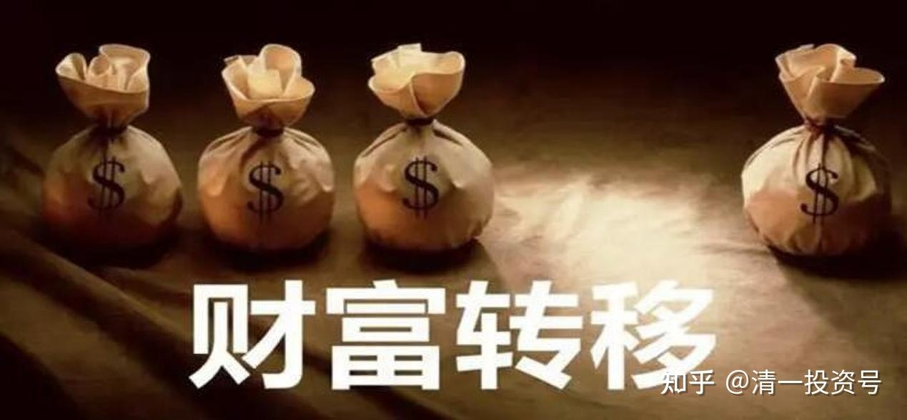

15篇.网络带来的财富转移——节选清一山长2014年演讲

来源：清一基金会博客

上午的主题为“**网络带来的财富转移已经开始**”。为了说明互联网经济的本质，张校长引用了Twitter创始人威廉姆斯关于**互联网创造财富的秘诀：“选择一个人类的基本需求或者平常的活动，利用技术进行完善赋予其便利性。”**以打车应用为例，从一个地方到另一个地方，这是人类非常古老的需求，打车应用去除了所有中间步骤，在顾客和的士司机之间建立了联系。由此我想到很多其他例子，例如阅读，传统的方式下，一个读者要阅读到某位作者的作品，整个流程是非常复杂的。首先，书的作者在完成作品后，通常要有一位经纪人，通过经纪人找到愿意出版这部作品的出版社，书籍印刷出版后，要通过代理商，代摆到各大书店，供读者到书店选购，直线流程可以表示成：作者➔经纪人➔出版社➔代理商➔书店➔读者。而现在的网络时代，阅读网站，**例如“起点中文网”直接在“作者”与“读者”之间建立联系，中间的所有环节均不再需要。因此，从这个事实来看，网络时代将使许多传统事务中的中间步骤消失，从而导致这些中间步骤的从业者失业，例如经纪人、介绍人、代理商、中间商。**

接着，张校长总结了由网络产生的新财富时代的十大规则。

**【新财富规则一：超速成长性】**

著名的社交软件Facebook是一个超速成长的典型案例，从以下数据可以清楚地看到这一点：Facebook最近以190亿美元的价格收购了仅有50名员工的Whatsapp公司，Facebook的市值达1700亿美元，美国历史上只有30家公司的市值超过1500亿美元，其中的微软件从上市到达这个里程碑用了11年；亚马逊用了17年；苹果用了27年；英特尔用了27年；IBM花了漫长的83年，而Facebook仅用了1年半！

**【新财富规则二：赢家通吃】**

奥运冠军的名字常常被人记住，可是有多少人能记住第二名的名字呢？看看手机市场，市场占有率仅为9%的苹果，却占有了行业利润的75%！典型的赢家通吃；市场占有率19%的三星瓜分了行业利润的24%，其他所有厂商虽然有着高达72%的市场，却只能赚取行业总利润的区区1%！

**【新财富规则三：跨界竞争】**

跨界的含义是外行击败内行，击垮你的对手你可能从来不认识。目前正在上演的一场跨界竞争大戏就是乐视网对传统电视机厂商的摧毁式的打击。乐视刚刚推出2999元的4K智能电视，以其超高性价比，迅速吸引眼球，首批3.3万台在几分钟内被抢购一空！这个从来就不是电视厂家的乐视网，只是一家提供视频内容的互联网公司，突然之间，就用价廉物美的超级电视不断鲸吞传统电视的市场份额。张校长对此点评，传统电视厂商的售价包含了其经营多年才能造就的品牌价值，这个品牌价值也是传统电视厂家的主要利润来源。而互联网电视，价格中根本不需要叠加任何品牌价值，它的主要利润来源于用户购买电视之后的内容付费。所以，对于传统电视厂家来说，这是一场无法打赢的战争。

更多的跨界竞争的案例：世界最大的零售商沃尔玛在淘宝网的竞争下开始大量关闭门店、360击垮杀毒行业、微信拿走三大电信运营商的奶酪等。

**【新财富规则四：轻资产模式】**

传统时代（工业文明的经典经济模式），总是强调“规模优势”，要做到更大、更强、更廉价。传统的经营手段则是：上量、兼并、并购，强调齐全的产品线，要大投入，大产出！而网络时代的今天，规模不再是优势，“轻资产”成为企业的新生存模式，只要有独特的个性和概念，一个小小的微博，就可以传播全世界，一个人就可以是一家企业。张校长说到这里，大家都能想到今日学堂，这个就是一个典型的轻资产，轻到几乎没有固定资产。（所谓轻资产，是指一个企业、组织、机构的固定资产在总资产中所占的比例很小）

**【新财富规则五：创新或者死亡】**

讲到这个规则时，张校长举了AOL(美国在线)的例子。2000年AOL以1600亿美元的天价收购了“时代华纳”公司，堪称蛇吞象，两个公司合并后，市值高达3500亿美元，而时至今天，AOL虽然仍在，但市值仅剩35亿美元。对这个例子，我后来查阅了一些资料，AOL是当时著名的因特网服务提供商，是新媒体的代表；而时代华纳原是经营平面媒体的时代公司和经营电影媒体的华纳公司合并而来，两者都有着非常悠久的历史，是传统媒体的代表。这个新媒体与传统媒体的合并为什么不成功？其深层次的原因是什么？这一点我尚未理解透彻。我准备在近期对这方面多加研究，或许可以有助于理解目前国内众多新媒体与传统媒体行业的各种趋势。

**【新财富规则六：个性，而不是规模效应】**

**传统时代，跟随和模仿可以活得很好；而在新财富时代，再做模仿者、跟随者，很难取得成功。**苹果公司，因其不媚俗，专心做最好的自己，不迎合消费者却赢得更多的消费者。这就是以个性取胜。乔布斯说：“消费者不需要知道他们的需求，那不是他们的工作！”，在iPhone发布之前，如果苹果去做市场调查，问消费者需要什么样的手机，那时估计不会有人告诉苹果“我需要一个大屏幕、可以多点触摸、能上网、摇一摇就能交到朋友，同时还具有无限功能扩展可能的手机”，但这并不影响苹果推出这样一款手机，当这样一部手机摆在消费者面前时，消费者立即反应过来，这就是我想要的！

校长进一步以【**今日学堂**】为例，某种角度来看，这也是以个性取胜的例子，10年前，在今日学堂创办前，很难想象会有人敢于提出“我的小孩要以学习为乐趣、小学入学1年内就要从不懂英语到能用英语与老外自如地交流、14岁以前要能在公开的辩论赛中击败名牌大学的专业辩论队......”，但当【**今日学堂**】在今天轻松地让学生做到这些从来没有被提出过的需求时，家长们都说我希望我的小孩也能这样！

齐白石曾有名言，“学我者生，似我者死。”美国思想家爱默生也说过：“羡慕就是无知，模仿就是自杀。”因此，校长也鼓励大家，只要你有个性，做最好的你自己，而不是模仿者，你若能在某一方面做到最好，在这个新财富时代，一样充满了成功的机会！

**【新财富规则七：大数据运用，信息领先于实体变化】**

经典的案例：2008年金融危机发生前半年，马云即通过阿里巴巴的后台数据提前预知，因为那时，阿里巴巴平台上的整个买家询盘数急剧下降；而在实体世界，欧美对中国的采购也在下滑，海关是卖了货之后，货物出去以后再获得数据；相比之下，阿里巴巴平台上的数据远远领先于实体世界的数据。因此，先知先觉们都会从互联网平台上的数据先于实体世界预知经济形势，所谓“一叶知秋”者是也，这个平台大数据就是那预示秋天到来之前的第一片落叶。

**【新财富规则八：管理层次简化】**

传统时代，以我国封建王朝的官僚体制为例，那时实施的九品中正制，九个等级，每个等级再分上中下，一共九三27级，信息从最底层传达到最上层非常困难，即使传达到了，其实信息也已变形；从末端到达决策者，一个坏消息可能最后被传达成好消息，影响决策者的判断和决定。这也是为什么传统时代，大到一个国家，小到一个企业，都可能在短期内轰然崩塌的原因所在！

而相比较，网络时代，管理模式不断扁平化，直至只有两层，直接管理。可以想象，现在企业内部一般都建立了各种各样的QQ群，老板直接与一线员工的沟通渠道是通畅的。校长在【今日学堂】也是这么做的，他可以随时获取任何一位学生和老师的信息，确保这些信息的真实和准确。

**【新财富规则九：个人与机构同样重要】**

在传统企业这种大机构中，个体只是零件；而互联网企业的大机构却是为个体服务的，这一点可以通过对比沃尔玛和淘宝中的个人角色深入理解。

**【新财富规则十：去组织化——个人地位空前提高】**

校长先回顾了黄色时代（即农业文明时代）个人的地位，那时，个人不重要，个人要服从组织（组织可能是家族、宗族、部落，也可能是国家），个人地位低下；这一点从问候语可以反映，在黄色农业文明时代，问候语通常是：你是谁的孩子？你的族群？你来自哪个地方？你在那个组织内的地位等级？**黑色工业文明时代：你的单位？你的层级（职务、职称）；而在互联网时代，你本人才是主角，这个时代，互相之间，开始重点关心：你是谁（你区别于他人的个性）、你知道什么、你能做什么。**

**【结论：“小国寡民”的时代到来，互联网为每个人开启了机会之门】**

