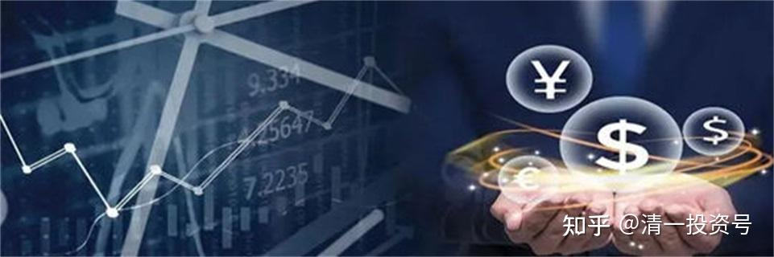
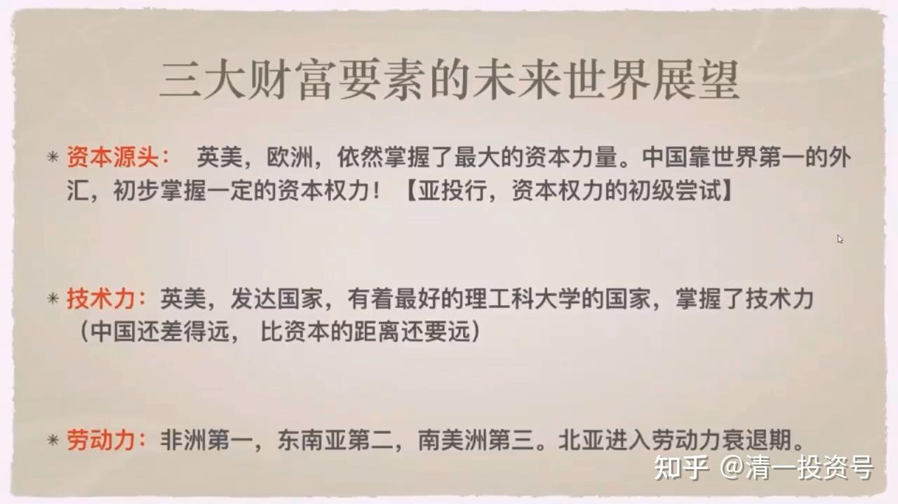
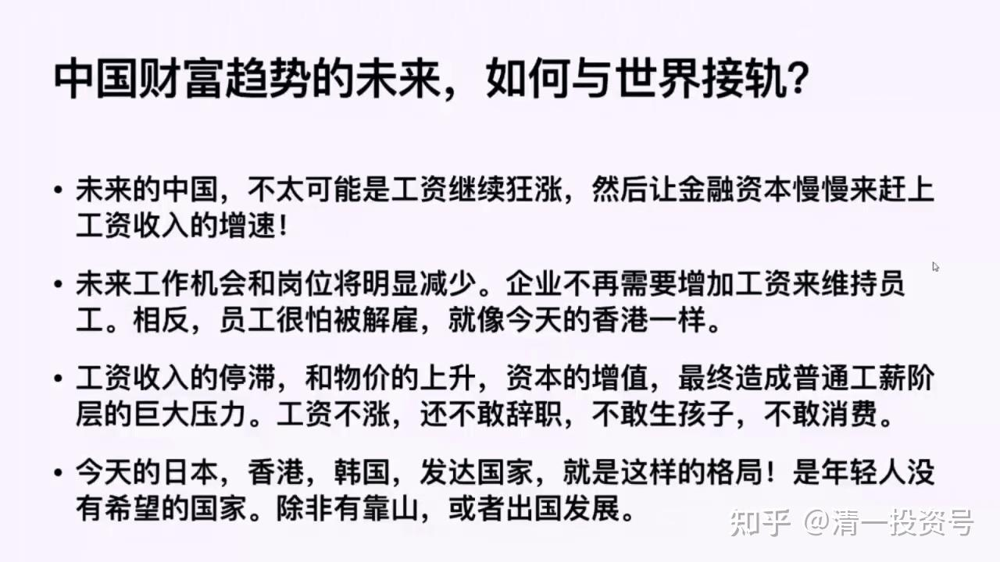
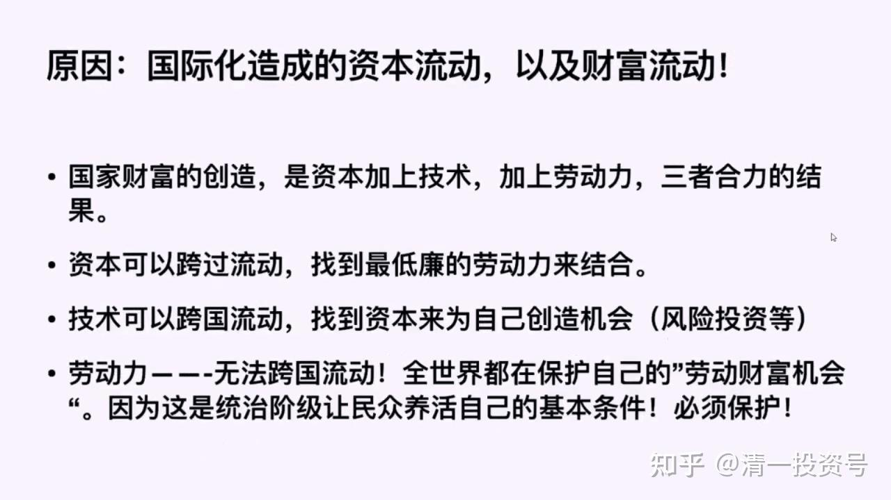
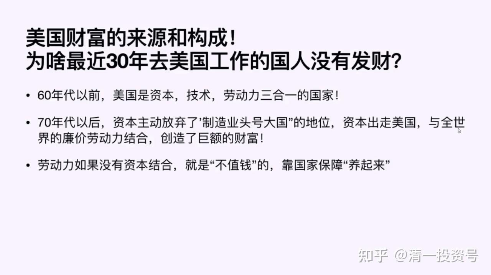

——节选清一山长2020年演讲《泰国的投资与生活解析》系列一

17篇.财富三要素的未来展望及原因分析

——节选清一山长2020年演讲《泰国的投资与生活解析》系列一

**1.三大财富要素的未来世界展望**

我们看一下三大财富要素的未来世界展望。从资本源头这个要素来看，全世界的资本源头，**最大的资本权力依然掌握在英美、欧洲**,他们依然是最大的资本力量。中国靠过去40年大量的外汇出口累积了目前为止全世界第一的外汇存款、外汇储备。所以中国现在基本掌握了一定的资本权力，但得好好用。**资本拿来是要增值的**，如果资本不去与技术结合，不去与劳动力结合……中国人不懂，**中国人把资本拿来，只会跟西方的奢侈品结合，跟法国红酒结合。这些结合根本不能产生任何财富，只能产生一大堆粪便**。所以中国人不懂得资本的运用。如果懂得资本的运用，就应该知道拿这些东西跟国外的人结合。

我们在泰国正在做，用中国的资本跟泰国的劳动力结合，跟泰国的市场结合，跟泰国的企业结合，跟泰国的技术结合。我们能够做到多少不知道，但是我们不会到泰国来买一大堆什么……**你们在泰国喜欢买什么？买鳄鱼皮、买蛇药，中国人来买都买这些东西。资本拿来这样用，就是把资本丢水里面去了，浪费掉了**。但资本拿来跟这个国家的技术和劳动力结合，比如现在在聘任泰国人，跟泰国人结合，给他们发工资，跟劳动力结合。但是他要为我们创造财富，创造我们需要的财富。这就是未来，资本要寻找出路。在座各位，你们手上有钱的人，也要**为你手上的资本——管它是大资本还是小资本，都是资本，为它寻找出路，不能把它拿去买些消费品，而是拿来买投资品**，这就是在资本源头方面我给你们的一个建议。

第二个，我们看看三大财富要素，技术力，掌握在哪里？**技术力依然掌握在英美和发达国家**。哪些国家拥有技术力？**拥有最好的理工科大学的国家，它就掌握了技术力量。**中国的大学虽然已经有那么多了，但是**中国依然是一个技术上的落后国家。在技术和资本上，中国都乏善可陈。**

劳动力上面，中国已经出问题了。中国培养出了一大批懒鬼，现在的小孩子，身体差得要死，一个军训让他站半个小时都有人晕倒。最近复课居然有些人跑点步就把自己跑死了。这些东西，他是什么劳动力？他不是，他是废物。我们这个国家，**我们的教育，中国的这几年**，中国人有了点钱，烧包，**把这些孩子都往废物方面培养，只会吃喝玩乐，啥活不会干，啥脑子不会动，技术也没有**。你以为你有资本？**你有点钱算什么？那点钱几个贬值下来，我已经说了，未来的中国，你手上拿的钱可能就是日元。**你要这样去看的话，你不会觉得自己多有钱的。

所以中国必须培养自己有这种能力，我们现在有资本的话，我们要用资本去拥抱技术，去拥抱劳动力。我们要用投资，比如**投资到孩子身上，让孩子掌握真正的技术，他有能耐，他得有本事**。用中国的话说这叫本事，我用钱，我让孩子上好学校。这样拥有了本事，这个本事可以拿来创造财富，OK。你就有了技术力，你把他培养成一个真正精英的硕士、博士，不是在那混日子的，那就好。中国把钱拿来送孩子出去英美留学，买个文凭。这东西我觉得太搞笑了。你拿回来的有没有钱？有一个人花了几百万出去留学，回头来找我，这十年前的故事了，找我干吗呢？能不能给他找个工作，只要1000块钱。留学几年英语都没学好，这就是中国人的笨蛋，花了几百万的投资，连英语都没学好，这多差劲啊！

中国现在，资本不占优势，技术不占优势，**中国的劳动力占不占优势呢**？过去中国有人口红利，中国是世界上劳动力最有优势的地方。**现在不能说没有优势，但现在的优势只能够维持不快速衰退，不太可能发展。所以资本创造红利的速度会大大下降**。我说过这叫温水煮青蛙，你会觉得温度慢慢地增加，但是不会一下子把你烫死。所以大多数人会缓慢地感觉到转变，我相信大家已经有感觉了，好像现在钱越来越难赚了。没错，就是这样的。

**未来劳动力红利的地方，非洲排第一**。从劳动力这个因素来讲，创造财富的能力，非洲排第一。但非洲必须得到资本或技术的注入，这个劳动力才有用，否则就是废物，天天闲在那没事干。**排在第二位的是东南亚**，**东南亚中排第一位的应该是越南或者菲律宾这两个国家**。由于菲律宾现任的总统对美国、西方保持一种不逊的态度，所以可能西方资本投资越南会更多一些，但中国资本好像投菲律宾要多一些。这两个国家都是东南亚很有希望的国家。大家说为什么不是泰国？泰国是东南亚国家基础建设最好的国家。**泰国原来是东南亚发展最好的国家，所以它的劳动力成本比别的国家要高一些，因此它这方面的优势不太明显，但是相对中国依然有一定的优势**。这就是这几个国家的情况，纯以劳动力而言。**第三个是南美洲**，南美洲和东南亚到底谁强，我不太清楚，但是有可能西方会更重视南美洲，亚洲的中国、日本和韩国更重视东南亚，因为人种的问题吧！所以东南亚排第二、南美洲排第三，到底怎么样不太清楚。

北亚、日本、韩国、中国这些地方加在一起，这些是亚洲比较发达的国家。他们都经历了劳动力衰退这样一个阶段，衰退的结果是什么呢？

**2.中国财富趋势的未来，如何与世界接轨？**

我们看一下未来的趋势，我们一定要预测，未来一定会走这种趋势的。**未来的中国，你不要期待你的工资继续狂涨**，就算是涨了账面，一定不涨本质，工资涨1000块钱，可能通货膨胀还超1000，这1000对你来说几乎没用，你的钱的真实购买力会逐步下降。**未来的工作机会或岗位将明显减少**。为什么？因为很多资本开始流出，技术开始流出，岗位开始流出。在这种流出之下，我们就发现另外一种趋势会发生，企业不再需要增加工资来维持员工了。相反，员工收到工资之后，他越来越怕没有工作。怎么办？他就要死守这个工资，他可能很快就被解雇。今天的香港是这样，今天的韩国、日本就是这样的。**工资收入开始停滞，物价开始上涨**，因为资本回报，企业回报依然会很好，因为它在全世界投资，资本的增值就造成普通的工薪阶层巨大的压力。**工资不涨你还会怎样？还不敢辞职，你还不敢生孩子，不敢消费**。为什么日本生育率很低？为什么韩国生育率很低？为什么中国的发达地区生育率也开始降低了？因为年轻人面临巨大的职场压力，他没办法，他不敢轻易地辞职，因为辞职换个工作很困难，他必须在岗位上死干。在这情况之下，还有一个东西——生活成本会很高。生活成本很高的话，养个孩子、家庭，这样会让他觉得负担巨大。这就是日本的现状，他们变成了低欲望社会，不愿意结婚，更别说生孩子了。按照某种说法，如果这个局面持续下去的话，日本再过八十年还是几十年，日本就没人了。当然，这是一种理论推演，降低到一定程度，劳动力又会变得紧缺起来，大概也不至于那么差。像日本，现在已经出现了劳动力紧缺，它从东南亚要最初级的劳工，它只要最初级的。

如果今天的日本，今天的香港，今天的韩国，现在的发达国家，就是这样的格局，是年轻人没有希望的国家，你该怎么办呢？我们的下一代，他们面临的竞争局面跟我们这一代不一样。我们这一代好像左右逢源，怎么做都行。实在不行了，我去摆个地摊，我都可以发达起来，到处都有机会。**在这样的情况之下，我们就不能指望未来跟我们今天一样，我们的孩子不要指望他一定比我们更好**。目前为止是年轻一代总比老一代混得好一些，未来不一定。

**未来哪些人会混得好呢？**第一个，这个国家总要精英阶层的，所以**这个国家的精英大学，像日本、韩国精英大学的学生依然供不应求**，大企业依然都只要（这些大学的毕业生）。但是那些小大学、普通大学毕业的学生，毕业就是失业，你白出这笔钱，你的培养费一点用处也没有。中国，我个人认为**以后985、211之外的大学基本上没有上的价**值。上出来了之后，你可能跟农民工的收入差不多，甚至你可能还不如农民工好找工作。因为农民工作为低端劳动力，依然受到需求。所以现在你们就发现一些奇怪的现象，你会发现有些甚至名牌大学的学生跑去做淘宝的送货员。为什么？他找不到工作，只有最低端的工作给你。高级点的工作，他没有技术，没有能耐，他的学校也不对劲，专业也配不上。所以他们没法去做高技术工作，低技术的到处不要人，所以他只能去干什么？他就只能去送送外卖，去美团干点体力活了。干这种活，一个大学生跟一个普通的高中毕业生相比，你有什么优势？你一点优势都没有。这就是我们财富趋势的未来。所以各位家长，**你如果还不把你的孩子培养成精英，你想做个普通劳动者的话，就注定你的财富降级，就注定沦为下层**。

**3.财富趋势变化的原因分析**

造成这个现象的原因就是，资本是全球化流动的。全球化资本，它可以在全世界寻找能够跟资本结合的最低价的劳动力，也可以在全世界寻找最精英的技术，可以通过寻找掌握最精英技术的人才，轻易地组合在一起。所以资本、技术、劳动力三者合力创造财富的话，**资本跨国流动，技术更是所谓的科学无国界**，技术无国界，流动起来很快，所以**只有一个东西不太好流动——劳动力**。所以劳动力就必须升级，跟我们国家一样，我们国家在搞产业升级，我们劳动力也得升级。**原来混日子的那种劳动力，他不符合需要，你必须往上流动才有机会**。

我们现在来观察一个指标，美国财富的来源和构成。最近 30 年去美国工作的中国人是没有发财的。（二十世纪）60年代以前，美国是资本、技术、劳动力三合一的国家。（二十世纪）70年代之后，美国资本主动放弃了头号制造业大国的地位，资本开始出走美国，与全世界的劳动力结合。这就是美国为什么使劲倡导国际化的原因。国际化就是我出钱，你出力，你给我打工，最大的钱给我，小头给你。比如中国，给你1%你就应该满意了。在这样的情况之下，中国获得了机会。

**劳动力如果没有与资本结合，是不值钱的**。如果你不理解这个意思，我问你，煤值不值钱，铁值不值钱？整体它是不值钱的，因为只要它埋在地下，埋个100年、200年，它都不值钱。你说埋个100年、200年之后它比现在还值钱，不好说的，比如现在中国的煤，埋在地下的煤现在不开采出来，再过100年之后，到底这些煤还有没有用？100 年之后可能它根本就永远不需要再开采，它没用了。因为100年之后，肯定发展了更新的能源。煤作为能源，它就没有价值了。作为化工原料可能还有点价值，但化工也不需要那么多。现在中国的煤大量是用来烧掉的，所以大量的煤就不需要采挖。可能有些煤一辈子都得不到用一次的机会。只要不用你，你的价值就是零。劳动力也一样，劳动力你不用他，就是零。

参考链接：

[系列二：清一投资号：20篇.跟随资本走向的三种创富模式](https://zhuanlan.zhihu.com/p/599465414)

[系列三：清一投资号：22篇.通过国际化资源配置来聪明地工作和生活](https://zhuanlan.zhihu.com/p/601835486)

