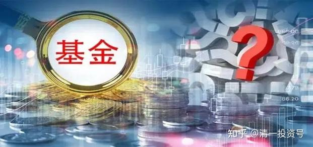
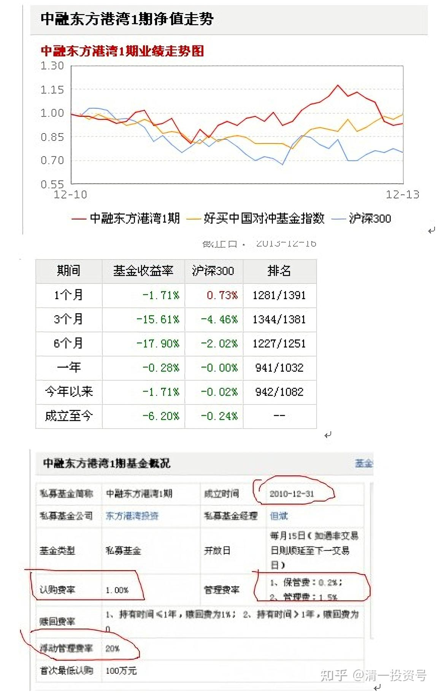
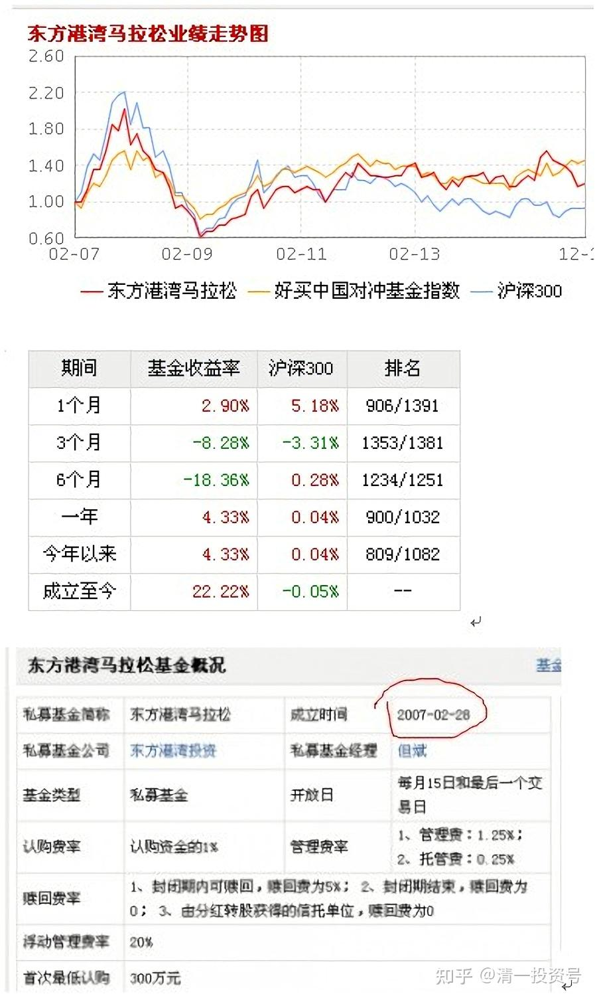
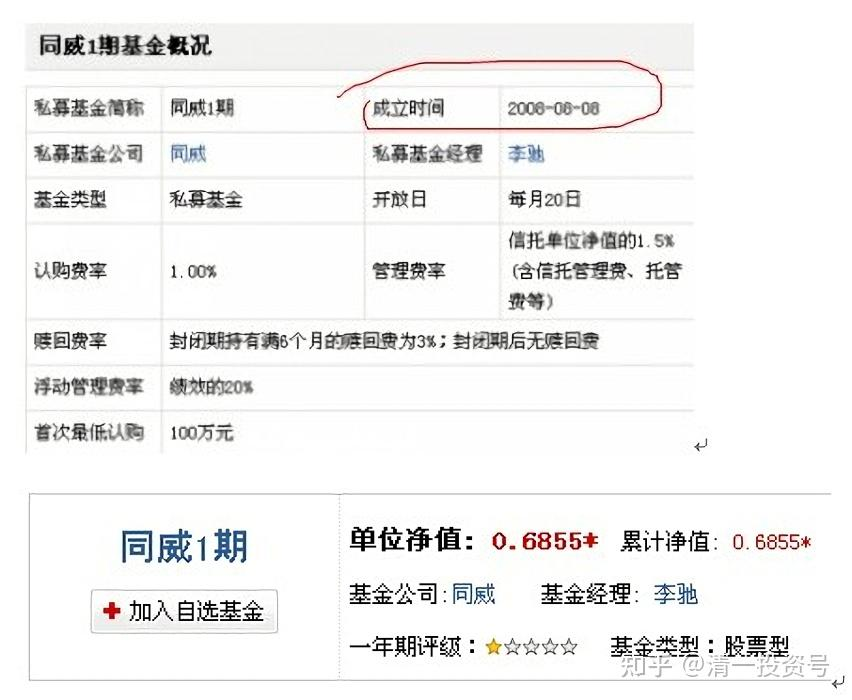
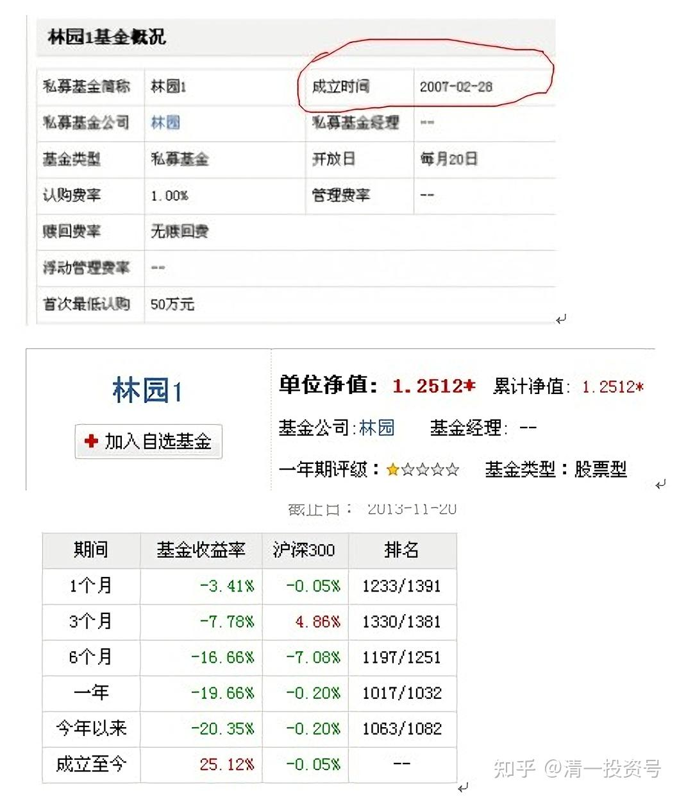
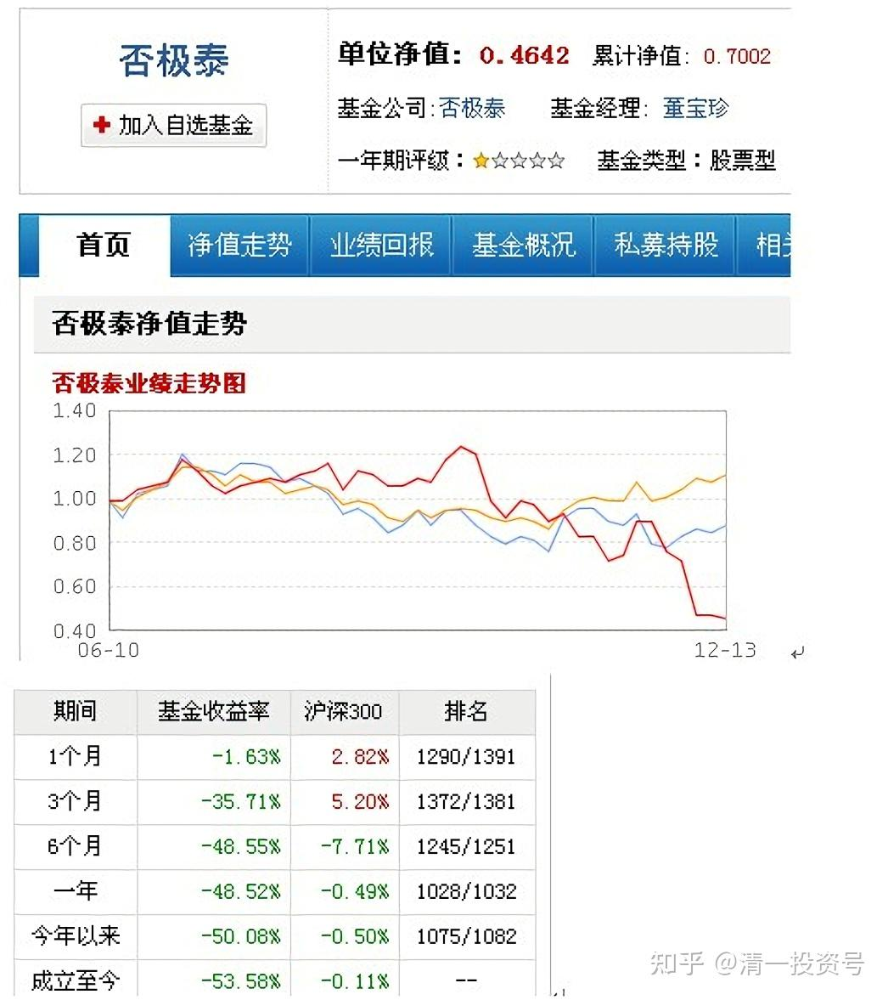

1篇.基金系列之一：从博弈学看金融市场上专家比不过大猩猩的逻辑

清一山长2014年1月21日

昨天在会员群里公布了本月的推荐书目，这本书会员们不少人读过。不过如果没有人指点读书方向的话，读了可能也没有什么实际的体验。因此，我特别给会员们指导了“阅读方向”。

另外，会员群的气氛很好。大家后来还讨论了一个某股票专家每位收费五万元一天的培训课程，专门讲技术分析，如何抓黑马股。会员们对此讨论很热烈，大多数表示不会去参加。也有些会员是此人的粉丝，居然建议我把今日学堂的基金，委托这位高人去管理和增值。这简直是灭自己志气，涨他人威风。学员们也太小看学堂的金融智慧了。

我认为：一个真正的“金融大腕”，居然热衷于搞培训赚钱是不可思议的。因为：真正的金融大腕，在成功地经历了20余年的洗礼之后，资金至少是数千万元（其实只有数千万元，在金融界根本就谈不上成功）。这数千万元，一天波动2-3%，就是数百万元。这种人如果真的看得出股票涨跌的趋势，每天都可以至少赚到上百万元。哪里还忙得赢去到处做宣传、写文章、发广告，推销他的“超级炒股秘法”呢？还不如自己埋头赚钱来得简单。因此，我一向对这种“专家”抱怀疑的态度。股市上，只要你预测的成功率能够保证超过60%，你一定可以轻轻松地拥有亿万身家。更别说这些吹牛者，似乎自己找到了股票市场的密码，可以“十拿九稳”，才吸引这些国人蜂拥而去（如果他说只有60%的成功率，恐怕就没有什么人愿意花五万元听讲了，因为中国人就喜欢神话）。现在这个时代，有些人特能吹。我认为**一些股票名家赚的钱，主要来自培训费，而非他们的投资收益。**

最近听说一个号称从8千元做到20亿的中国股市“大神”（应该炒股的中国人都知道此人大名）。最近却因为在170元左右以1.5倍融资买进茅台，目前已经爆仓的传闻。当年的20亿可能是真的，但是在特定时期以特定方式赚到的钱，恐怕是无法复制的。如果你居然因为他原来的业绩辉煌，就去花大钱学习他的技术，希望有一天也可以赚到20亿，恐怕会失望的。因为他自己恐怕现在连“保本”都做不到了。看看下面的一个资料吧！一大批中国投资大师的真实业绩：

一个基金产品，成立3年、5年、6年还没有一个像样的收益，还不能说明问题吗？真不知道这些人成天在吹嘘什么，他们的钱怎么来的只有他们自己知道，但肯定不是在二级市场得到的。

大神一：但斌

点评：成立三年，收益-6%，收费吓死人！成天吹嘘抓到XX牛股。

点评：大牛市期间成立，鸡犬飞升的年代，至今只录得22%收益，收费高昂，价值投资高手，时间的玫瑰，中国巴菲特。他自己可能真搞到不少钱，不过基金管理得一塌糊涂。

大神二：李驰

点评：2008年8月成立，1664点的千年大底，这样的战绩，无语！只有收费不含糊。

大神三：林园

点评：2007年2月成立，大牛市，猪都被吹上天的年代，至今25%的收益。

大神四：董宝珍

上面这些“超级大神”的业绩表现，这些你原来您连投资他们的资格都没有的大神（据说他们的投资人要求一笔至少100万以上），居然炒股的业绩连普通的大妈都赶不上，你会不会很奇怪？我认为这些大神的最佳出路，还是利用他们的影响力，去做“股票培训班”更好，收益要稳定得多。毕竟中国是一个钱多人傻的地方。

从博弈学看基金经理的投资心理和结果：如果了解“博弈学”之后，就很容易了解一些难以解释的原因：我们会发现一些明星基金经理，其实其业绩跑不过很多“老股民”，即使是目前最牛的基金经理王亚伟，其业绩相比一些个人投资者来说也是乏善可陈的，更不用说大多数平庸的基金经理人了。比如：华富竞争力优选基金的基金经理张琦，**年换手率超过16倍**，**三年亏损51%**，连续7个季度跑输业绩比较基准。一个正常的小股民也没有这样疯狂的。居然该经理还一直呆在位子上不动（现在已经下课了）。

为什么这些号称“杰出的专业投资者”，其水平还不如普通的股民呢？为什么一些人，在自己做个人投资者的时候，业绩很好。但是一旦当上基金经理后就变得“平庸”了呢？

真正的原因，就是“博弈学”的原理。（比如“囚徒困境”，就是一个典型的博弈论问题）。

设想一下：如果你是基金经理，面对一个重大的投资决策，你会怎样想？

你面临做以下方案：你一定会从中选出一个对你最有利的方案。这就是“博弈”

第一种，你的投资选择是随大流，同时结果又正确（市场走势符合预期），这是最理想的局面；因为你不用担心受到别人的批评和质疑。

第二种，你与大众相反，由于坚持自己独立的投资立场，看好别人都不看好的品种。你受到大众和投资者的质疑，还好，最后结果，是市场证明你是正确的（结果赚钱了）。你将承担巨大的压力，直到最后市场为你说话为止。你将成为投资英雄。比如，巴菲特在科技股泡沫的时候坚持不跟进，坚持“传统估值原则”，结果美国的投资杂志拿他做封面，说“你的脑子哪里出问题了”，自家的投资人也纷纷质疑他。当然，还好最终老巴赢了。但是，连续五六年，自己管理的基金业绩平平。而科技股不断创出新高，老巴承担的压力非一般人所能承受。（其实最后一年他也扛不住了，开始投资一家网络公司，结果大亏90%，但幸亏头寸不大，马上到来的网络金融危机挽救了老巴）。

第三种，你选择随大流，但是结果是错的：你的投资赔钱了。对基金经理而言，这后果并不严重，至少不会丢掉饭碗；因为“大家”都做错了，你可以“很无辜”。就像是科技股泡沫时期的很多基金经理，他们的失败是“市场的责任”，大家都错了。

第四种，坚持独立立场，但是结果错了。或者一定较长的时期内是错的，市场走向与你的判断相反。你怎么办？你就太惨了——定会被抛弃。

在这四种选择中，你作为基金经理，必须选其中一个作为你的“基本投资原则”。**毫无疑问，你一定会选择“随大流”**。因为只有这样，你的“博弈”才是合理的，无论输赢，结果你都可以接受。而要选择“独立立场”，无论胜负，你付出的代价都太高了。

特别是在中国，更难以想象基金经理们会选择“特立独行”。因为在中国，基金经理们面临中国式的社会环境，更需要与领导、同事、同行、持有人的良性互动。于是，**宁肯犯错，也要跟大多数人在一起，必定成为绝大多数基金经理的选择**。因此很难指望中国的基金经理中会出现索罗斯一样的“金融叛逆者”，自然我们也就出不了大师。

可是，金融市场的原则，在大多数情况下，都会证明“大多数人一定是错的”。特别是给予一段较长的时间周期后更是如此。不过，股民（基民们）基本上都不会拿5年或者10年的时间来验证你的对错。因此，“抱团取暖”一定会成为基金经理们的共同选择。因此，“平庸”自然就成为基金的特色了。

那么，你在了解了**“基金经理的博弈学原理”**之后，你的决定是什么呢？怎样进入金融市场，才能使你的投资价值收益最大化呢？你一定会根据你自己对情势的判断，得出一个符合你博弈最佳结果的答案。

对于我来说，了解到中国基金经理的基本思路和价值观后，我的博弈结果很简单：

**第一、我不会选择把钱投给这些中国基金经理。**

**第二、我太喜欢他们了。因为有这样一大群跟风的人，甚至居然是跟风的专业机构投资者。因此，我在中国投资，一定能够获得比在美国投资更大的收益。无论涨跌，这些人都会创造更大的空间。他们会创造更深的底部，也会营造更高的顶峰。这不是很美的市场吗？**

我问过专做投资的吴学员：我讲的一些标的投资价值，我认为基金经理们也应该懂。不仅仅安全，未来收益空间也大。但是为什么他们没有布局呢？吴学员答：他们不敢。因为我选的都是“被市场抛弃”的品种。如果他们配置了，就会遭遇周围领导、同事以及基民的质疑，甚至遭遇索回基金份额。因此，他们宁肯观望，宁肯在你选的标的已经明确了上涨趋势之后再抢进。对于他们来说，这才是最没有风险的决策。

其实，我自己想想：如果我去做基金经理，也只能这样做了。因此，还是自己做自己的资金更好。最不需要“做给人看”，最自由。也最能发挥自己的独特个性和选择。

最后，公布一个华尔街的真实笑话：金融专家还不如一头大猩猩。

上世纪80年代末期，由美国投资理论界提出设想，《华尔街日报》出面组织，一场比试选股水平的历时数年的著名公开竞赛拉开了帷幕。竞赛的一方是由当时华尔街最著名的股票分析师组成的若干专家组，另一方则是一头通过掷飞镖选股的大猩猩，比较谁选出的股票组合产生的投资收益率高，结果是大猩猩赢了。

这个投资界真实的笑话，说明了什么呢？（我认为绝对不是说投资不需要智慧和思考）

请各位读者思考。

参考链接：

[清一投资号：44篇.基金系列之二：博弈学：与傻子和疯子作战其实也不容易](https://zhuanlan.zhihu.com/p/535582518)（整理文）

[清一投资号：45篇.基金系列之三：彼得·林奇 谈沃顿商学院的教育价值](https://zhuanlan.zhihu.com/p/535585835)（整理文）

