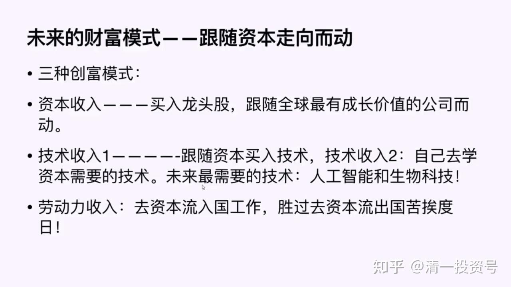

——节选清一山长 2020年演讲《泰国的投资与生活解析》系列二

20篇.跟随资本走向的三种创富模式

——节选清一山长 2020年演讲《泰国的投资与生活解析》系列二

今天讲这些内容，并不是让大家开开眼界，编造一个宏大的故事。**我们了解这个世界的财富走向，最终目的是要让我们每一天的生活更充实，更有目标，生活得更好。**我们要看透这个世界是怎样玩的，我们怎样才能让自己和家庭、家族的财富跟随着流动。我们就有了三种创富模式，跟随财富而走的模式。

**一、资本收入模式**

第一种模式，我们想要获取这份收入的话，我们挣到的钱千万不要拿来买消费品，不要把它拿来买包包、买手表，也不要买泰国的七七八八的。这些东西都是资本家愚弄你的东西，因为资本拿到这些上面是资本死亡模式。你必须变成资本创富模式。

做得最好的就是软银，建议大家参考软银的模式。它的目标就是300年模式，这300年干吗？这300年它要买到全世界最好的企业。它要买到全世界的number one，number one不是说只有一个。只要你是number one，大的number one，小的number one，只要代表未来趋势的都要买。不断地用利润投入，这样它就会维持 300 年的趋势。这就叫资本创富模式——资本收入、资本创富，跟随全球最有价值的公司而动。这就叫被动收入，你什么都不用干，就可以获得这个收入。不过话又说回来，我猜，今天听我讲课的大多数人，并没有太多的资本，特别是被动收入能不能完全地让你的家族无忧，这很难说，所以对大家可能不是太妥当。但是如果你是资本家，家里面原来已经赚到了钱，我建议你必须考虑这种模式。**就算你不是资本家，你是小康之家，你也必须拿出投资的钱来做这件事情。你把买一个GUCCI包的几万块钱拿来，买一家长期来看不会损失的企业**。不一定是新行业，只要它是代表这个社会的龙头企业，特别是在新兴国家，龙头企业就没问题。

如果你要去买欧洲的一家银行，或者买美国的银行，你就是找抽，你是找死。德意志银行、汇丰银行、美国银行，不管价格多少，我都不建议你买。它可能会有涨，可能会有跌，这个东西我都不管，但是我们可以说长期趋势它们就是下降的。

中国的银行可以买。中国银行为什么可以买呢？因为中国的银行代表未来的上升趋势，只要中国这个国家未来是上升的。中国资本、技术、劳动力合作，即使劳动力不再有优势，它也是可以买的，起码它可以稳定。当然中国的银行不是最好的标的，哪个银行是最好的标的呢？发展中国家的银行，它的涨幅最高。中国过去35年的银行都是最好的标的，你买入的话，会取得非常非常巨大的回报。你去看看它的走势图就知道了。未来中国会陷入平稳期。中国的银行比美国好，比欧洲好，但是它不如东南亚国家、南美洲国家好。但是这些国家你只能买number one的，你不能买那些后面的，这跟国家地区没有关系。所以**银行股现在不是最佳的投资机会，因为它失去了成长性。但是它可能会变稳定，它会稳定相当长时间。而另外一些大量需要劳动力的行业会进入衰退期**。不同的企业，会走不同的趋势。像华为这样的企业，我认为还是在上升期当中。银行稳定期，需要大量劳动力的普通纺织业、制鞋业，这些行业会走入衰退期。今后的日子会越来越难过。

我认为未来几年之内，很多中小企业会破产。中国的很多中小企业没有什么核心的技术，就是靠中国的劳动力赚钱而已。这样一些没有核心技术，没有护城河的企业，在未来资本流向产生改变的时候，就会破产、倒闭。所以现在你有钱的话，千万不要继续再投资这些，你不要去重新再买设备。**如果你是一家纺织厂，你不要再买最新的设备了，就算要买，你到越南去，你到菲律宾去，你到南美洲国家去，你在那些地方买，用当地的劳动力没问题。在中国，劳动力就会把你拖死**。

巴菲特在买哈撒韦公司的时候，它是一家纺织厂，估值很低，各方面看起来都很好，但是它没有前途，所以最终它也是破产了，但是巴菲特很聪明地用这家企业赚到的利润，不再投入买机器了，把买机器的钱全拿来买了股票，买其他有前途的股票，所以伯克希尔•哈撒韦现在变成了全世界股票最贵的一家企业，就是因为他的投资，这就叫资本收入。资本收入我只是大致上讲一讲，不能多讲。

在泰国，我们现在是靠资本收入来维持运行，我们现在在泰国取得的资本收入，已经足够我们整个团队、我们的学堂在泰国生活。发展还做不到，因为发展需要更多的钱才能够进行。但是生存我们已经解决了，也就是我们整个团队，我们在泰国已经获得了生存机会，仅仅靠着我们在泰国进行的投资，获得了一个资本收入，我们可以生存了。这就是第一种创富模式。

我们刚刚说了全球生存问题，这就是全球生存，其实不仅在泰国，我们在全世界都可以全球生存，我们可以投资全世界的公司。我们就算在泰国，也可以享受到在中国以及在香港投资带来的好处。我们可以直接投资美股，我不投资美股的原因就是我认为美国长期趋势并不好，我认为现在已经到了一个逆转期，财富正在从美国往外流。但是它现在还不甘心快速退出历史舞台，退出也会很慢。看英国就知道了，英国最近几十年退出了世界老大的位置，它让给美国之后，一直没有回来。但是英国也没有衰退到一个很差的国家，只不过英国老百姓可能比美国老百姓这几十年要差一些，但是英国的权贵、资本阶级、精英阶层依然过得很好。美国未来走的路是跟英国一样，它会经过几十年的衰退，中国可能慢慢会变成老大。最近十年是决战期，而且最近十年中国不能发生失误，一旦中国发生失误，中国就会完蛋。

**二、技术收入模式**

**1.两种技术收入**

我们接着来讲第二个，技术收入。技术收入有两种，第一种就是买入技术。不过我不建议大家去做这一条，你没本事做。软银可以做，因为它的资本实力太雄厚了，它几乎有无穷的钱可以用，它当然可以这样干。但是我们的钱，你投入之后，万一你买的这个技术过时了怎么办？

**第二种技术收入方法，就是我们要给自己孩子的任务了，他要去学技术，学资本需要的技术，未来能够产生价值的技术**。曾经有一个笑话，一个有点小钱的人，据说是亿万富翁，到底是不是我也不知道，反正就感觉良好。他觉得自己赚了一辈子的钱，他自己的小孩一辈子不赚钱，他都可以养得活。他到我们学堂来，觉得我们学生学的东西太辛苦了，他说犯不着学这些东西。他想学什么东西呢？他把孩子送去一个“贵族学校”去学习了。“贵族学校”教他的孩子什么呢？教他绘画，写毛笔字，装模作样，读读古书，穿穿古装，做做表演。他说孩子天天很快乐。没错，孩子是很快乐，但是他学到了什么本事？他学的琴棋书画，能创造财富吗？这就是**中国富人的笑话，眼光短浅。过去几十年，他们凭运气赚到的钱，现在会凭“本事”输掉，因为他们没本事。**他们还在做企业，他们的企业是没有竞争力的企业，未来几年这些企业、这些人的亿万财富很快会灰飞烟灭的，因为他们根本不懂财富走向。

中国人才刚刚富裕，有些人只富了10年、20年，现在能够富裕超过 20年的人，我看都数不出几个来。20年前我也没钱。**中国没有几个人有长期富裕的经验，更别说未来100年能不能富裕了。**未来 100 年富裕，今天教的这种本事价值多少？大家自己评估去。**你学会了今天的东西，其实就保证了自己的家族将来在社会上不会被降级。你的家族永远是处在社会的中级、上级。**如果你不注意到这一点，很快你的整个家族后代就会沦为赤贫，他们必须从底层开始打拼。所以现在我们的后代要持续创富，自己要去学资本需要的技术，未来最需要的技术是什么技术？

**2.未来最需要的技术**

给大家透露一下。两个技术代表未来，我们也看到资本在大量地砸入这些领域。这两个技术就是**人工智能和生物科技**。说得再细一些，一个巨大的风口，资本拼命地往里面砸，有钱就往里面砸，而且不是每一笔砸进去一定有回报，砸错了就没有回报的。比如我们看看大家非常熟悉的乐视贾跃亭，贾会计，这人可有本事了！他不仅骗了中国的几百亿，他还骗了融创孙宏斌，多了不起的人！多聪明的人！又骗了他100多个亿。恒大许家印、孙宏斌，以及那么多的大佬，拼命地杀入新能源汽车这个行业，这就叫资本动向——资本拼命往里面杀。

我用这个案例来讲一讲我们怎样才能够把握到未来的财富趋势。你看资本在拼命往里面杀，他去买乐视，你也买乐视，他去买美国的贾跃亭的公司，你也跟着去买，你买不赢他，你再怎么买都没用。我们怎样才能跟上这个财富趋势呢？如果你有足够的钱当然可以去拼了，你把所有新能源汽车的公司都买一下，可能有一家就是成功者，当然这些财富可能最后会灰飞烟灭，就像贾跃亭的公司一样，他做的汽车也垮了。蔚来汽车好像前段时间很糟糕，现在好像又有一点回升，未来会不会好？我也不清楚。

那么我们应该怎样去介入这个行业？你说我让孩子将来学一个新能源汽车制造行业就好了吗？错了。如果你要赶上新能源汽车行业的资本的风口，你要去投入技术，你要学相关的技术，你该去做什么呢？你当然不能去学什么琴棋书画，那个东西在古代可能还有点用处，现在不说一钱不值也差不多，它可能还是负资产。你要去学有价值的技术。你不是看到汽车，就去学汽车，你要学它的上端、前端的东西。新能源汽车的前端是什么呢？新能源汽车最大的看点，一个是它的能源部分。但是能源部分太狭窄了，而且已经有好多高手在钻研，你应该去学新能源汽车的灵魂。**新能源汽车的灵魂是什么呢？就是AI，就是人工智能**。如果你看到大量的资本在进入新能源汽车行业，看到新能源汽车里面大把地烧钱，几百亿都烧进去，你就要赶快去做这个玩意，这个玩意价值要高得多。中国在共享单车上也花了很多钱，但是共享单车毫无技术含量，没有前端技术，就是资本在瞎搞一气。

新能源汽车的资本不是瞎搞，它代表了未来趋势。中国如果未来掌握了新能源汽车的趋势，中国就能掌握全世界的财富之源。不过这东西竞争很激烈，欧洲、日本、美国都在竞争，而且他们的技术也不差。中国在技术上不占优势，中国是希望靠市场快速地降低成本。原来中国参与全球竞争，把很多大佬打翻地下的办法是什么呢？是靠中国市场庞大的潜力，让这个产品迅速地获得比较大的销售量，获得之后又快速地降低成本，结果别人跟我们一竞争就完蛋了。比如说我们有一种技术，它也是新能源技术，它未来也是很强大的，这就是太阳能技术。特斯拉其实原来是搞太阳能的。太阳能被中国人干掉了，太阳能原来技术最先进的是美国，还有欧洲。太阳能技术、风电技术等等，都掌握在外国人手上。中国掌握了这些技术之后，竞争不赢，怎么办？中国是靠大量制造，平摊成本。因为技术有一个特征，比如技术开发成本费是1亿元，一个人用它的成本就是1亿，如果1亿个人用它，人均成本只有1块钱，技术成本就变得微不足道了。所以西方，特别是欧洲，它最大的障碍就是量不够。美国国内的量也不太够，它必须到全球去搞量。中国可以靠国内发展出一个很大的量，靠国内的消费量的提升，去分摊技术的成本。这就使得中国跟全世界竞争有一个非常非常大的优势，全世界竞争不赢中国。在这个意义之下，我个人非常看好中国未来的新能源技术。如果要我选，我宁肯选比亚迪，不会去选特斯拉，为什么呢？我觉得比亚迪，中国人做，它可能得到了更有优势的资源。我选的不一定是对的，因为特斯拉又跑到中国来造车了。

我们现在没有必要学造车，我们让孩子去学造车也太落后了，而且那么多人都会造车，我们要学习新能源车的灵魂部分，就是AI——人工智能。未来的车一定是自动驾驶的，未来的车有很多敏感的、前端的人工分析判断的东西，所以下一个风口是人工智能，下一个要出未来的马云的风口。上一轮财富的风口是IT，资本大量投入IT业形成风口，下一轮技术就在人工智能上面。**人工智能的基础又是什么呢？是“万物相连”。“万物相连”的基础又是什么呢？就是5G**。5G我们不用去学了，这个技术已经成熟了。

现在回过头来再想一想，为什么美国要打压华为，美国打压华为不是打5G。华为说你要我的技术，我卖给你好不好？你找家公司来，我华为的5G技术全套打包给你，说我掌握了这个技术会拿来对国家造成威胁，你把我技术买了不就得了，你给我点钱就行了。美国人没有这个技术，为什么不去买华为的技术？其实他想要的不是5G的技术，他想要的是5G基础之上存在着的未来世界的发展机会，就是人工智能。

如果我们投人工智能，这个钱要得太大了，我们没有人投得起，我投不起的，但是我可以观察这个技术，我会鼓励大家去学跟人工智能相关的科学技术。你不要傻乎乎地只会去学一个工程制造、机械制造。山长说学理工科了，山长是电力系统自动化专业的本科生，你说山长学的，我也去学这个专业，因为是理工科。错了！

**你在选学科、选专业的时候，要看这个专业、这个大学是不是number** **one的。就算不是number one，它一定是第一流的，某个单项的number one或者某个国家的number one，它一定要是最棒的，不是最棒的不值得学**。这是第一个，你要学的方向，找谁学？**找最棒的人学，找最厉害的人学**。据我所知，人工智能这些东西掌握得比较好的好像是日本、德国这样一些地方。当然这是供第一流人才选择的，第二流人才你找个工作就不错了，反正你去了之后也是被别人狂虐的，那就算了。如果是第一流人才，你就要去这些地方学。美国不让我们学了，美国为什么不让我们中国人学了？因为这是它的财富之源，它不想让中国拿到这个东西，你为它打工它都不干，而且它知道你是中国人，你最终还会为中国打工。因为中国很容易买动你，它买不动。原来它可以花钱来买，中国人出 1 万块钱，它可以出 10 万块钱，你看跟谁？那肯定跟美国人走了。现在美国人出10万块钱，中国人可能出20万块钱来买走这个人。美国人现在在人才竞争上跟中国相比属于劣势，因为中国人急眼了，中国必须要挖人才，他们拿高薪去挖人才。

**3.技术、人才、教育**

中国现在的技术进步也跟人才的进步有很大的关系。可能大家已经发现了中国的一个特征：最近一二十年，中国好像在各方面技术上得到了很大的进步。而且在军工技术上，咱们原来造飞机跟美国相比差几十年的距离。现在咱们的四代机都出来了，航空母舰也出来了，各种先进的大飞机也出来了。你们明不明白是什么东西导致这些变化的？美国人说这是中国人偷了技术，其实不是的，中国人是花大钱砸，用人才带来的。中国今天在国防军工、大飞机等很多领域，突然产生的大规模的爆发，就是中国用了我今天告诉大家的这种模式，中国已经有一点点小钱，中国用资本买入了技术和人才，技术和人才一结合产生了市场，再跟中国的劳动力结合，产生了今天这个惊人的效果，中国在很多领域上开始领先。你以为光靠间谍偷得来啊？间谍能偷到的是很有限的。是中国利用了苏联解体之后的资本——组成苏联的一个大的联邦国家，这个国家叫乌克兰。它是苏联的国防军工以及其他产业的产业重镇，乌克兰有很多很好的工程师，但是在解体之后突然失去了订单。比如我们买的辽宁号，其实就是乌克兰制造的，最后它造不出来了，没钱了，没资本，这个舰造不出来，最后这个舰以废铁的价格卖给中国。中国把它拿过来研究，咱们就造出了第二艘、第三艘，每一艘都形成了一个升级换代，每一艘都有10年以上的进步。俄罗斯没有乌克兰之后就没有航母建造能力了，所以现在俄罗斯没办法造航母，它只能造别的东西去了，这是一个很奇特的现象。中国人不仅买了航母，而且还利用苏联动乱的时候得到了一大批专家，美国不需要这批人，因为美国有这些技术，美国有这种专家，它不需要。但是美国就忘记了，中国需要，中国把这些专家全部弄过来。大量的乌克兰工程师到了中国，这些工程师是技术资本，帮助中国实现了产业超越。不仅是在造舰技术上，各方面都超越。中国现在军舰的制造速度比美国还快，我们像下饺子一样地下。美国造一艘超级的巡洋舰可能需要十几年的功夫，中国两三年就可以造一个新舰出来，叫做075舰。如果没有乌克兰的科学技术，没有苏联处于世界顶端的军工制造技术，中国在这方面不可能跟美国抗衡，这个抗衡现在看来是很有必要的。中国原来只是傻傻地跟俄罗斯买飞机，过几年淘汰了之后又买新的飞机，不断地把钱丢给俄罗斯，自己的技术一点都没办法进步。但是，随着乌克兰工程师的过来，中国就解析了这些大飞机技术、大舰艇技术，中国这些东西都可以自己造了，这是一个很了不起的进步，这就是技术跟资本结合。俄罗斯没资本，中国有资本但是没技术，中国买了苏联的遗产，在苏联垮台这件事情上，中国是最大的赢家。现在回过头来，中国未来要跟美国竞争，中国就必须把技术搞上去。

有一些中国有识之士在搞这件事情，比如深圳南方科技大学、西湖大学。为什么中国这些民间资本都要投资科技大学，而不是去投资一个耶鲁、哈佛？因为只有这个东西才能跟美国竞争。但是很遗憾，南方科大在创立的过程当中遭到了中国教育部很大的障碍，不给它机会，让它招不到好学生。**只有中国最顶尖的学生愿意进南方科大，愿意进西湖大学，中国人跟美国竞争才有机会**。如果中国第一流的学生都跑到北大去学一些没有价值的东西，中国不会是美国的对手，所以中国必须在科学和技术上面培养出自己的人才。因为咱们不能光靠买人才，买人才的价格很高，而且也不容易，别人还不见得给你，而且现在别的国家的科技大学还对我们封锁，我们派人去学，别人都不让学，你只能自己建，自己做。中国现在已经有了技术力，就可以自己建造出来。比如我觉得让华为去办一个科技大学，它他肯定有这个本事。放手让它去办，教育部根本不要管。美国的世界大学有什么厉害？美国的精英大学有什么厉害？国家不管，国家的官僚只懂得做官，让科技大学自己管理自己。斯坦福大学、麻省理工全是自己管理自己。它的教授有最大的自主权。这些科技教授，因为要跟全世界竞争，他必须拿最新的技术才能竞争，而且他必须找到最好的优势，他得到了最好的优势，他能够培养出最好的学生，大资本会给他投资，帮他建实验室，给他项目去研究，这样就形成了良性循环。我觉得科技教育方面该放开了。好了，这就是未来你的孩子该学什么。

第二个概念就是生物科技，因为未来生物科技上面也有很大的空间。所以孩子如果以后想学，优先学理工科技术。当你掌控了技术之后，起码是个中产阶级，你不会下降的。

**三、劳动力收入**

如果中国这个样子，我们还能得到劳动力收入吗？如果我就不是顶尖的技术人才，我的孩子脑子也不好，勤奋度也不够，他就没办法像这些顶尖科技人才一样地工作，他只想过一个普通日子，但是他又想过得比别人好，应该怎么办？我也可以教你。**你是底层人，你就用底层生活方式也可以**。但是**你要获得劳动力收入，要得到好一点的报酬，你就必须去资本流入国工作**，胜过去资本流出国苦挨度日。比如日本就是资本流出国，资本进入日本是进入金融市场，不进入产业市场，日本本土的企业是不太有希望的。所以日本适合旅游，你去玩一玩可以，度假、消费没问题。但是你要到日本去挣钱，难度有点高。劳动力收入就要去资本流入国工作，你的工作机会很多，提升机会也会很多，而且生活成本很低。**你去资本流出国工作，你只能找别人不要的工作。**比如你到日本去，你可以找个最基本的劳工工作，做劳工输出，但是提升一点的工作，中等工作、技术工作、中层白领工作你得不到的，它要把这个机会给到自己的本国人，每个国家都是这样的。

参考链接：

[系列一：清一投资号：17篇.财富三要素的未来展望及原因分析](https://zhuanlan.zhihu.com/p/596692830)

[系列三：清一投资号：22篇.通过国际化资源配置来聪明地工作和生活](https://zhuanlan.zhihu.com/p/601835486)

