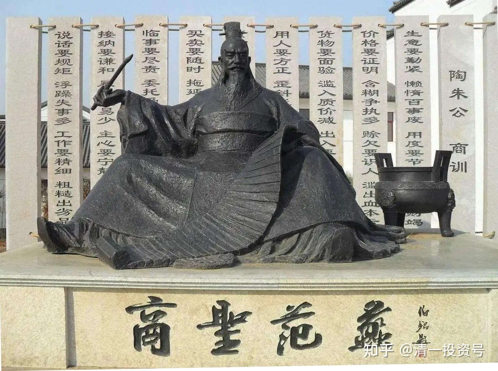
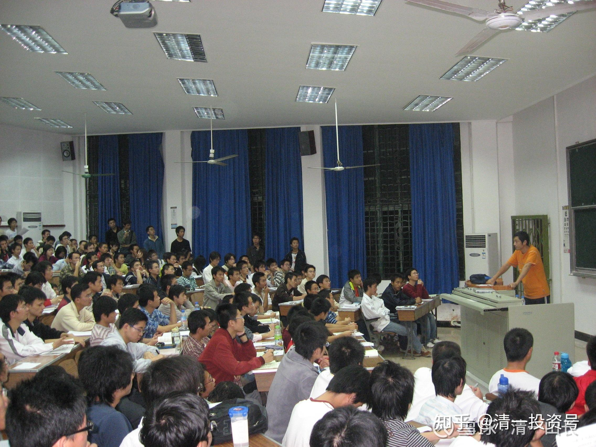

23篇.赚钱比花钱容易

——节选清一山长 2008年演讲《投资与人生》

**1.道家人如何花钱？**

请大家想想道家的金钱智慧，到底道家会不会赚钱？在这之前，我先提一个问题，以各位的观点来看，是赚钱容易还是花钱容易？其实**按照道家的观点来说，是赚钱容易，花钱难**。你们一听，哪有此事？花钱你拿给我多少我都花得了，你给我几个亿，我几天砸完也可以是吧？但道家人不是这样想的。道家赚钱容易是什么？他是“观天之道”，用这种思想去赚钱，他经常看得到钱在哪里。用我个人的观点来说，由于你的眼光跟一般人不一样，因此你发现金钱的眼光也跟别人不一样。有时候你一天赚个几十万也不难的，这是真的。但是，每天要花个几十万，对道家人来说，我就觉得难极了，怎么都花不出去。

比如我，一天赚个几十万的事是有的，这是实实在在有，不过也不是天天有，偶尔，但一天亏几十万也有。大家说这些东西都是虚的，都是搞搞玩的。但是你说我花钱，我怎么花？我现在一天吃一餐，这一餐我再怎么花，花得了多少钱？我还不喜欢进餐馆吃，进了餐馆只点一个最便宜的菜。不是没钱花，而是不敢吃。为啥不敢吃？不能随便吃的，随便吃要中毒的。因为按照道家的观点，很多东西是有问题的。问题食品是不能吃的，是不是？**道家要俭，俭的目标不是要勤俭，不是要抠自己，而是要对自己好**。你不能盲目地拿一些多余的东西往自己身上背，比如多余的毒素、多余的毒品往自己身上背，那不是傻吗？

比如这次咱们开奥运会，美国人就提出不吃咱们的食品，但是咱们的食品招待得很好，咱们是全世界的美食全部集中在一起，而且24小时敞开供应，一分钱不收。咱们对全世界的运动员做了如此承诺。这种承诺把伦敦的那批人给吓坏了。伦敦说我的老天爷，你北京这样搞，咱们下次伦敦怎么玩呢？伦敦绝对玩不赢我们北京。我们定了一个很高的调子，开场那个气派多大，是不是？那种气派，我绝对相信伦敦玩不赢。而且我们对运动员的招待也特别好，那么好的招待，免费的食品，一分钱不要，让你吃。美国人还不领情，不吃。你说你不吃我吃，咱们吃是吧？请注意，北京奥运会的食品比我们周围的食品还干净，还经过了很严格的检疫等等，但是美国人都不肯吃，我们吃的不知道是几等食品。你们还敢随便吃吗？

**第一是东西不能随便吃，第二还不能多吃**。我一天只吃一餐，就是不能多吃。但一天只吃一餐有什么后果？主持人老早就知道我一天只吃一餐，他总是很好奇。这次见到我，他说你会不会有时候晕倒？我说我的精力比一般人还好一些，比如我开车一天连续开13个小时。开车是一定要集中精力的，没有人换，而且中间也不休息，我可以开下来，这么说精力不会有问题，是不是？至于其他方面有没有问题，你们也可以观察得出来。比如我现在是快50岁的人了，看起来不太像是吗？因为我不愿意害自己，我不吃很多东西害自己，也不用别的一些生活方式害自己，结果花钱的速度总是比我赚钱的速度要慢很多。慢到我现在觉得赚钱毫无意义，毫无趣味，所以就不赚了。所以就不赚了。

**2.财神范蠡的故事**

你说张健柏神经病，跟我们开玩笑，我真没开玩笑。我们说个古代的故事，我这人算很小很小的小人物。我在商界也是混了十几年的，在他们的观点来看我曾经很成功，但是我觉得很失败，特别比起我们的老祖宗。我们道家老祖宗，说到金钱，道家真能赚钱哦！老子不赚钱，老子聪明，他觉得赚钱一点用处没有，他根本不赚钱。有一个人没事干，他赚钱玩去了。这个人我很佩服，某种意义上比较崇拜，但是我得不到太多的资料，只是从史书上看到一点点小资料。

我们有一个人叫财神爷，范蠡，知道吧？做生意的人知道，这个人是商界鼻祖，也是财神之一。一个是赵公元帅，叫财神，另外一个就是范蠡，是财神。他为什么是财神呢？他学了道家的东西，学了之后他总想玩一下，结果一玩，玩了个宰相，帮助越国复国，打败了吴国，所以他官居至位，最高的位置了。当上了官之后，他觉得不好玩，没意思。**道家总是想我干这事在干吗呢？他不是说当着官当了就很舒服**。他想想没意思。没意思怎么办？结果他找了全世界最漂亮的女人，当然就是西施了，跑到西湖玩去了。玩了之后，生了一大堆儿子。生了这堆儿子，他干吗呢？他觉得生了儿子总得让儿子干点事情吧！他就做生意玩。玩了之后赚了很多钱，变成亿万富翁。有人说，当时的首富应该就是他了。当时古代的人很聪明，他说你这个人能够赚几个亿，变成首富，证明你的头脑很好。你脑子很好，干吗呢？请你当官去。齐国和其他好几个国家马上请他，你去当我们宰相吧！他改了名字，当时不叫范蠡了。他改的名字叫“鸱夷子皮”，后来又叫“陶朱公”。反正到一个地方，改一个名字。别人一请他当宰相。他说完了、完了。但他没这样说，他说官居至宰相，经商又赚了那么多钱，不行。最后他干吗呢？把钱花掉，花不完了，他就请人花，请那帮邻居、那帮朋友，把钱送给他们，来来来，你们帮我花，我钱花不完了。那是不是花钱难啊？要请人帮忙才花得完。赚钱他一个人就够了，是不是？

他就把他的亿万财富全部花掉了。花光了之后，带着漂亮的妻子，带着一帮儿子走了。这回他走到海边去了，在海边张网捕鱼，又做生意。他做生意有一套窍门的，结果又变成了全世界首富，当时的世界首富。变了首富之后，又有人来请他当宰相，一定要请他出去。他这一下就说不行了，他又把千金全部散完，把钱全部给人了。给了人之后，他又搞了一次，好像一共搞了三次。最后一次他说再也不玩了，连钱都懒得赚了，消失了，以后史书上再也找不到他了。你看我说的故事，不骗人吧！赚钱容易，花钱难，是吗？

**3.投资是什么意思？**

但是大家说好像我们觉得赚钱蛮辛苦的，我一看有些人赚钱蛮辛苦的，辛辛苦苦、勤勤恳恳干一个月，赚个2000块、3000块、4000块，还得看领导的脸色，还得看这个看那个。其实说穿了，不是钱真的很难赚，而是你没找到赚钱的方法而已。省图（湖北省图书馆）希望我讲一下金钱智慧，讲一下投资。因为很多人很关心，我就以这个主题来给大家分享一下自己的心得，我的想法。

如果我现在说一句话，就是在座的任何一位，其实你们都是亿万富翁。你觉得我有没有说谎？我们每个人生下来，我们的财富有多少呢？如果要用金钱来衡量的话，我们用1亿来衡量，可能还少了，因为我们有一种宝贵的资源。**投资是什么意思？投资就是把我的东西，把我拥有的资源拿出去，投出去之后使它产生我需要的更大的价值，这就叫投资**。但什么是你要的东西？那就看你的要求了。比如我要的是金钱，我就把我的资源投进去，换金钱回来。如果要的是别的东西，那你再说。但是我们这个生命资源，从小生下来，**每个人都要活这几十年，这几十年的资源就是最宝贵的资源，我们用它换了什么，就决定了你这一辈子、你的生命的走向**。如果你的目标就是我要换一堆的金钱，你真的走对了路，你用正确的方法的话，金钱会很多的，但你光有金钱不够。我觉得**投资的主要目标是我们把我们的生命付出去之后，换来我们人生的幸福**。而人生幸福就有很多标准，这些标准就需一项一项地换。

我先说一个大的投资概念，等一下再讲怎么赚钱的概念。由于我们每个人的观念不一样，所以换来的东西不一样。就像我认为身体的健康是第一位的，所以我比较注重饮食以及运动等等一些东西。所以就换到了这个结果，经常被人搞错。前几天我在武汉大学做演讲的时候，没开讲之前，我习惯在教室外面透透气，因为里面的人都很多，我的讲座基本上都是很多人要坐在讲台周围去听的。你知道路过的一个学生怎么招呼我吗？他说这位同学，请问到哪里怎么走？我变成他的同学了。其实我恐怕比他父母年龄还大呢。当然，我一点都不生气，我很开心，我说重温一下大学时光。我进大学已经是28年了，我进大学那年生的人，今年博士都要毕业了。这就是我投资的一部分，换来我的身体健康。投资的另外一部分，换来了我的家庭幸福。我能够讲男人和女人关系，是得益于我太太的大力协助。因为我们很和谐，在跟她的关系当中，也让我理解了很多男人和女人的一些问题，特别是从她那能够印证到中国古代对于男人和女人的一些心理、生理方面研究的成果。所以给别人讲的时候，别人觉得我是婚姻问题专家，你看这是家庭方面得到的好处。当然了，金钱上得到的好处就是，曾经做了企业。我做企业的时候曾经做到湖北省第一，其实当时别人还说我们是全国的第一，小行业第一，让松下公司认为我是商界奇才。后来四五年前退出商界了，因为我觉得赚钱没用，我这人要求很低，吃饭一天只吃一餐，而且吃得很便宜，当然也就花不了多少钱。花不了多少钱挣钱干吗呢？那我一回头不挣钱了，做别的事情玩。

现在的事情就是做做教育，做做一些有意义的事情。今天下午是在青少年宫讲教育问题，晨报上已经登了，所以今天一天都蛮忙。**现在我觉得能够把我学到的知识，学到的中国古代的智慧跟大家分享，能够让更多的人了解，把中国的传统文化继承下去，我觉得是我的使命，比我赚钱还要开心一些**。

我们人生下来之后，**道家要求一个人随时要对自己的行为负责。我每做一件事情，要得到什么结果，绝对不肯浪费自己的时间。因为我们的时间，我们的生命就是我们最宝贵的资源**。**在这种情况之下，我们每天都要规定自己按照自己的使命去走，最终就走到了自己比较需要的结果**。但据我了解，大多数人不成功的主要原因是什么呢？是因为他生下来是糊里糊涂地活。为什么糊里糊涂地活呢？比如一个人说我要赚钱，赚钱怎么办？他嘴上说要赚钱，但是他去干一个活，随便给他分配一个工作，他就去工作了。这样行不行得通呢？这是投资失败。

*2008年前清一山长在武汉大学教四201讲课*

**4.百万富姐的故事**

我就说我身边一个例子，这个老板现在每年都赚100多万。这个老板年纪多大呢？30出头。她的学历是什么呢？是初中。初中毕业然后上了个中专。另外，她是女性，很年轻，也没什么特别的东西，看起来很温和。但是她对自己的投资是成功的。我通过这个案例告诉大家，什么叫投资，金钱上的投资。她中专毕业以后，家里给她找了个国有企业的工作，她工作了几个月就跑掉了。她为什么跑？她说我在这学不到东西，她爸她妈坚决反对，托了好多朋友好不容易给你找了国有企业，当一个工作人员，你自己又跑了。她说我要打工去。一般人都会想，再怎么也比你打工好吧！但是她自己有一个思路，她说**我在这什么东西都学不到，我今年做的东西跟去年做的东西、跟明年做的东西完全一样，我不能这样**，我要去打工。

她在武汉读的书，就跑回武汉来了，找了一个推销卫生巾的工作，也没什么稀奇的。她开始是业务员，非常卖力地做事情，做得最优秀。推销了几个月，领导要提升她的时候，她走了。她走的原因是什么呢？**她说在这已经学不到东西了，老板教的东西她全部都会了**。她怎么办？再找一个老板，再学。这样不停地学。每次都是别人要提升她的时候，她就走。这样她的水平是不是一步步提高了？她刚刚毕业的时候，才20岁。一个很年轻的小女孩，这样冲，冲了两三年之后，她碰到了一个老板，她唯一接受了这个老板的提升。这个老板今年也是40多岁，当年大概30多岁，今年这个老板四五十岁了。现在这个老板比她这个徒弟还要差很多。现在这个老板的生意很一般，但这个徒弟很厉害了，但她没有去抢老板的饭碗。为什么这个老板她跟的时间就长一些？她发现这个老板蛮厉害，各方面都不错，就跟着她学。而且她学到什么地步，学得很彻底的地步。**这个女孩子，她以前是漂亮的长头发，一直到腰部。这老板也是个女老板，是精干的短头发。她觉得这个老板太厉害了，要跟着老板学，干脆把长头发都剪了，发型都模仿这个老板，她学的彻不彻底呀？**她那么崇拜老板，对老板也一直心存感激之情，到现在也很感激。但是两三年之后，老板要进一步给她提工资，让她好好做的时候，她又走了。为什么呢？她说我已经学会老板的东西了，她觉得在这边待下去学不到东西，最后辞职了。辞职了之后，她要不要找别的老板呢？

这回她不用找了，她就开始自己做老板。离她毕业离开校门仅仅5年的时间。这回她开始模仿她老板的工作，但是没抢老板做的行业，她换了一个行业去做，做一家产品的代理，刚开始钱也不多，等做得比较成功之后，她又发现了她这个行业前途都不大，竞争对手太多。她说她找一个收益更大、金钱流动性更高的行业，她又换了一个行业。她换的这个行业到现在才四五年的时间，但她仅仅进入这个行业两年左右的时间，她的年收入就达到了100万以上。一个普通的初中毕业的女孩，在武汉市闯了十二三年，其实她在四五年前就已经是年收入百万的富姐了。

这个例子是不是证明了我今天说的一点都不错，是吧？赚钱难不难？赚钱不难。当然了，这个女孩现在也遭遇了跟我一样的问题，花钱难。她家里爸爸妈妈经常说，你赚那么多钱干吗？钱赚了也不用。但是她自己也在做别的事情，**她现在也把钱拿出来帮助贫困学生，她在做一些慈善事业。自己业余时间在读书，读道家的书，读佛家的书，也跟一些和尚、道士做朋友，其实她是证智慧的，她觉得做这样的事情比赚钱更感兴趣**。原来她自己想做连锁店，做很多很多。为什么她在四五年前就已经是百万富姐，现在还是呢？因为那时候她突然证悟到一个东西，赚钱没意思，不好玩了。所以她就不再继续发展。她要发展，会发展得很快。现在说不准年赚500万、1000万都不好说，天知道。但是她为什么还保持呢？她说能够保持就不错了。她只要求什么呢？**做自己喜欢的事情，就是花功夫去做这些文化方面的事情**。这是她的故事。

从这个故事里面，我希望大家有信心。**如果你的目标是赚钱，赚钱其实很简单。如果你发现你不需要赚那么多钱，你应该把你的生命花在更有价值的一些事物上去**。

参考链接：

[清一投资号：24篇.依时而动，把握投资机会](https://zhuanlan.zhihu.com/p/605752276)

[清一投资号：26篇.跟随时代趋势，掌握赚钱智慧](https://zhuanlan.zhihu.com/p/607757560)

