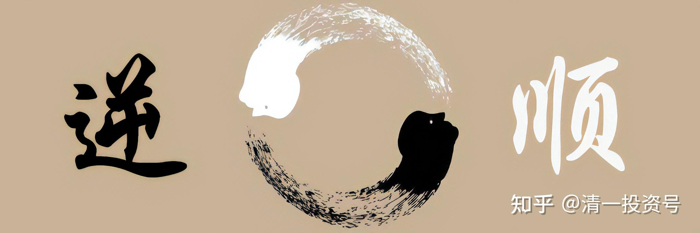

——节选清一山长 2008年演讲《投资与人生》

28篇.赚钱思维——逆取顺守

——节选清一山长 2008年演讲《投资与人生》

我希望中国人尽快富裕起来，希望在座的各位，赚钱比花钱更容易。所以我多讲点道家，让大家把咱们中国的传统继承一下。要赚到这样一笔道家的钱，一是思维要变异，还要随时因时而变，因地而变，知常守变。变的方法是什么呢？变的方法，有个基本原则，叫做“逆取顺守，阴阳变转”。

**一、《道德经》的智慧**

**1.天下皆知美之为美，斯恶矣！**

讲到“逆取顺守，阴阳变转”。咱们先讲道家的基本经典——老子《道德经》。“天下皆知美之为美，斯恶矣。”这个字读wù。不读è。一般人都把它读成è，错了。“皆知善，斯不善已。”一般那些没有学过真正道家的学术家（会读错），我是“不学无术”，我不是搞学问的，我是做事的，也是修道家功夫的。所以我们是用比较实用的观点来看它。一般人说天下都知道什么是漂亮，就有不漂亮的。这是传统的说法。天下都知道什么是善良，丑恶的东西就暴露出来了。这是传统的解释，听起来很别扭。为什么呢？这简直是说废话，而且毫无价值。老子说的不是这个意思，因为在老子那个时代，“美”并不是美丽的意思，“美”是喜欢、赞扬、欣赏的意思。所以美跟恶（wù）放在一起，这不是恶（è）。善恶是现在的说法，那时候恶这个字念wù，恶（wù）就是不喜欢。老子是对立的，所以叫一个喜欢，一个不喜欢。所以天下都知道什么是喜欢的，都去追逐这个喜欢（的事情），这件事情就会变成不喜欢了。原话是这个意思。这里面有什么道理呢？有道理呀！**一件事情，你可以去喜欢它，但是你喜欢它，你要注意它会随时变成你不喜欢的**。你喜欢得越过分，它可能就越让你不喜欢。

“天下皆知美之为美”的事情曾经发生过一次。在去年的时候，我妹妹给我打了几个电话，她一打通就问我：“哥，明天中石油上市，你买不买？”我说：“中石油上市就上它的呗！我买它干吗？“她说：“它是亚洲最赚钱的公司呀！”我说：“它是亚洲最赚钱的公司，但它不一定是亚洲最赚钱的股票。”你看，这就叫“名可名，非常名”。我的脑子很清楚的，我不跟着它转。（我妹妹说）“但是大家都买呀！”我说：“大家都买的话，就是‘天下皆知美之为美，斯恶矣’，这不行。”结果我妹妹听不懂，她说：“这什么意思。”我说：“就是大家都喜欢的东西，你就要不喜欢。”她说：“大家都喜欢，凭什么我不喜欢？大家都喜欢，我也要喜欢呀！”我说：“你要喜欢就要倒霉的，一定会让你很不开心的。”她说：“好吧！哥，我听你的。”她总算听我的了。第二天（2007年11月5日）中石油上市，大家都是“天下皆知美之为美”，都去美。美就是喜欢，喜欢就要把它搞到手。所以中国的老百姓一下子搞了一大堆的中石油。那些人拿了中石油之后，喜不喜欢呢？不喜欢，他们是“恶”。“恶”到写了一首诗，叫做“问君能有几多愁，恰似满仓中石油”。从48块钱的高价一直跌到十几块钱。如果你有四十几万、五十万，一下就变成只剩十几万，你说你赚五十万多难啊！当然这一难我逃过去了，我凭什么逃过去？就是老子教我的智慧。但是据说中国人有上千万人上中石油的当，我觉得好奇怪，那么多人去买它，为什么呢？后来一想，有道理，这些人都没听过我讲的老子课，是吧？他如果听了今天的课，他不会去买那个东西。这也就证明，用我的话说，老子是个炒股天才。在很多年前，他就说明了一个自然之性的道理。

自然之性什么含义呢？**世界上有些东西，如果所有的人都把它作为爱好，它本身肯定不会是爱好**。假定现在有一个女子，我喜欢她，比如她叫章子怡，我觉得她就是世界上唯一的我愿意娶的女人。好吧！我一个人这样想没关系，最好只有我一个人这样想。如果只有我一个人这样想，别人都不会追章子怡，我跟章子怡一谈就成了，你说呢？没人追她，她嫁不出去，是不是？我再差劲，她也得嫁我。但如果有少数几个人，天下少有几个人知道她“美之为美”，我再去追她，她比较比较，觉得张健柏还行，说不准嫁给我了。但现在不行了，章子怡现在叫“全世界最有魅力的中国女人”，好像她有这样一个称呼，是吧？这就叫“天下皆知美之为美”喽！这个时候我再去说：“章子怡，你能不能跟我结婚呢？”章子怡怎么说？她说：“啊呸！癞蛤蟆想吃天鹅肉。”没这回事了。但是我很知趣，我知道天下都知道你章子怡是最好的女人，亚洲最美的女人，我就不去“美”你了，我去找一个别的人去，比如说找到我太太，我太太就嫁给我了。但是人不一样，一般**人都喜欢追逐别人的眼光走，他就只知道一个固定的方向，都往一个方向走，而且一直不回头，其结果就是自讨苦吃**。你拼命要去追章子怡，最终结果是什么呢？最终结果你可能变成疯子，她怎么都不理你，你要见她一面都很难。就像曾经有人去追刘德华一样，一个女的追刘德华，那天下皆知刘德华为刘德华，你就再也追不上他了。结果她把自己都追成了疯子，把老爹的命都送掉了。大家知道这事，那就是你有问题，你干吗要这样走？

反过来，要赚钱怎么赚？“逆取顺守”。注意，“**逆取”，跟别人反着来**。天下都知道中石油不好的时候，你就去买中石油；天下都知道中石油是全世界最好的公司的时候，你如果有，赶快卖。当时我对我妹妹说的话是，可惜我手上没有中石油，我没中签。如果有，我立马在第一时间全部卖给你们这帮想要它的人。我还说我在做慈善事业。

还真有这样的。有一个尼姑，她就去买股票，怎么买怎么赚钱。别人问她什么道理呢？她说，阿弥陀佛，我佛慈悲。**在别人都不想要股票，股票怎么都卖不出去的时候，她为了救市，只好去买一点**。她说：“我不入地狱，谁入地狱。”但是大家都去抢股票的时候，她又想，**大家都想要，我这样拿在手上，跟大家抢，不好意思**，我是佛教中人，所以**你要我就给你**。这叫什么？叫布施。结果她这样布施来布施去，自己的钱越来越多。你们觉得呢？

现在是什么时候？现在我建议各位，是你不入地狱，谁入地狱的时候。透露一下我的行踪：下星期我准备入市。我在今年春节的时候逃出来，逃了不少，没有逃干净，但是还有相当一部分钱在里面，我一直在等，没想到它跌得那么惨。我现在开开心心的，我说下星期已经跌得差不多了，可以考虑去——我佛慈悲，你们都不想要，我收拾一点破烂吧！说不定就会买中石油。说不定，我说了玩的，大家别太认真，跟着我买中石油以后亏了本，别来骂我。

**2.皆知善，斯不善矣**

同样的话，“皆知善，斯不善矣。”这句话也跟一般人理解不一样。善，我们都说是善良，不善就是丑恶。错了。“善”是技巧高超，超人一筹，对不对？这是中学的古文水平，不难。但是有些专家非要把它乱解释，咱们不说他了。自己才是专家，相信自己吧！各位，你们都应该相信自己。“皆知善，斯不善矣。”怎样理解呢？

一件事情，我有个秘方，这个秘方别人都没有。这件事情，我就很了不起喽！可口可乐，靠什么打天下？就靠一个可口可乐的秘方，是不是？使它变成了全世界最有价值的企业。据说可口可乐的秘方保存在一个保险箱里面，这个保险箱要三个不同的人同时拿钥匙来才打得开。它是非常秘密的。但是有一天我突然说我要贡献给全世界，把我这个秘方让全世界都知道，就叫“皆知善”。都知道秘方，这个秘方还是不是秘方？各位。这叫斯不善矣！它就已经不是秘方了。**你有一个本事，如果只有你一个人知道的话，这个本事，你就是number one。如果所有人都知道你这个技能、本事，那就不是number one**。

篮球明星姚明，身价很高，他赚钱比他花钱更容易，信不信？他是这句话很典型的例子。现在我再告诉大家，如果在座的各位，每个人都是姚明，他姚明就不是姚明了。你看，每个人都是姚明，姚明就不是姚明。这句话就是老子的辨证思想，也就是阴阳变转。这一变就变完了。每个人都当了姚明之后，还要姚明干吗？姚明讨饭去了。

你说张校长，了解了这种东西有什么好处呢？这个好处就是**你要做别人不能做的事情，你要想别人不能想的事情，这才是你的价值**。但是别人不能想、不能做，并不是要求你做超人，你换一种思维就行了。就像我刚刚讲的，中石油这种事情，能不能证明我是超人？不能，**我只是有正常人的智力，但是拥有老子的智慧而已**。我的智力并不超人。但是你要想到别人想不到的，多想那么一点点，你就赢过别人了。但今天我一讲，大家都知道这句话，别人就没用了。我要想另外一个别人想不到的点去。**当你在市场上的时候，你永远要看到别人看不到的东西，这才是真正的智慧。**

**二、何谓“逆取顺守”**

**1.逆着别人的思路，守住自己的优势**

那么，“逆取顺守”，“逆”就是跟别人不一样。但是取到手了之后，你要顺势而为，绝对不能勉强。比如大家说张健柏，你觉得姚明不错，你去学姚明吧！那就不顺了，因为我不擅长。第一，我长得没那么高；第二，我不喜欢篮球。我跟姚明在一起，我宁可说：“姚明，咱们来学武当内家拳吧！”他绝对不是我对手，所以我要跟他比赛，我会很得意。我可以说我跟姚明比了一场，结果我赢了。比什么呢？比篮球绝对我输。我说我们比内家拳好不好？肯定我赢。然后我跟另外一个人，跟刘翔比什么呢？讲老子，你估计刘翔能不能比赢我？他也要输。所以，**比，你就要逆，但是守，你要顺**，我守住我的东西叫顺。如果我的东西都经常丢掉，我去学刘翔的本事，我学不来；我学姚明的本事，我也学不来；我学章子怡，我更学不来，连性别都学不来，是不是？我要去勉强学他们，勉强去做他们的事情，就叫不顺。所以我要**把自己的优势顺势地守住，把我没有的优势，要逆着别人的思路把它取回来，这叫“逆取顺守”**。“逆取顺守”，就形成了一个阴阳变转。阴阳变转什么东西呢？你没钱会变有钱。当然你有钱也会变没钱，怎么变呢？你变错了，你玩戏法玩错了，是不是？怎样玩得对，玩得不错，依据是什么？准则是什么？准则就是一个字——“道”。所以，关键是要把真正的道掌握在我们手里面。

**2.玩别人不懂的东西**

道家在中国称为精英意识。什么叫精英？就是这个社会上顶尖上的一小群人，只有这部分人才能掌握。他要求自己是精英，因此他不做别人做的事情。我这个人做生意就顺着这条路，所以走的跟别人不一样。当年做生意的时候，我觉得这件事情别人都没做，行业里面很差，我的对手都蛮差，我就开始做。我在五年前退出商界了。为什么退出商界？第一，觉得做生意不好玩，没意思；第二，觉得那个行业也没意思了。为什么呢？这个行业里面很多人都已经会按照我的方法去做。我当年做的时候，别人绝对都不懂，我全是玩别人不懂的套路，那叫“逆取”。但是别人都懂了之后，那就是“天下皆知善，斯不善矣”。天下都知道这个本事，都知道这个窍门了之后，这件事情已经不再成为本事。既然不再成为本事，我再去玩什么呢？我去玩别人不懂的东西。现在我也在玩别人不懂的东西。比如我们的今日学堂，玩的教育，别人怎么都搞不懂。怎么不懂呢？我们的小孩子学个三年多，就可以达到武汉大学正式录取学生大二以上的水平。一般人玩不懂吧？我玩起来很简单，很轻松，而且是一批一批的小孩子会达到这个水准。别人觉得稀奇。我们的小孩子还有别的一些本事，看不见的本事，别人也觉得稀奇。**这些你玩不懂的东西我玩。所以我是把人生当作一个很有趣的，很精彩的经历去玩，玩得自己开开心心，也让别人开开心心**。就像家长把小孩送来我们这边，一年、两年，小孩子变化好大，很有出息，高兴得不得了。别人感谢我，我也感谢他们，我也很开心。是不是？我们的老师也很开心，大家都开心嘛！

**3.独立思考、精英意识**

我喜欢玩这样的游戏，那么这个游戏就是什么呢？**我要有独立的思考，我要有自己的精英意识**。英语并不是我在小孩身上玩的。我在一、二十年前考研究生的时候，我就玩了。我考研究生第一次考试失败了，不好意思，你们说张老师，看你蛮聪明的，其实蛮笨的。我第一次考研就失败了。失败的主要原因是什么呢？英语差了几分。就几分哦！这几分定天下。我别的分数都超过分数线不少，就是英语差。但是一门就把你“枪毙”了，只要你哪一环弱，你就不行。“枪毙”了之后，我就开始独立思考了，独立意识。我说英语不好，我们要找原因。第一个原因就是张健柏有点笨蛋，脑子不好，搞不定英语，输了。我想半天，决定为了面子也要否认这个事实。我认为应该不是，其实我也认为本来就不是。我考大学很轻松的，稀里糊涂就这样考进来的。那么，好像不是脑子不好，如果不是我张健柏脑子不好，而我居然考英语考不过，是什么原因呢？学习方法错误，只有这个可能性。学习方法是谁教我的呢？老师教我的，并且是老师教错了。老师教错了，学习方法错误，该怎么办呢？重新换一套学习方法。其实后来第二次考试的时候，我的英语是我们年级的第一名，也是我们专业的第一名，总分也是第一名。所以我是以第一名的成绩考取了研究生，那是十几年前的根子。后来我就总结了一套学习英语的方法——跟传统方法都不一样的方法，最终结果变成了现在的教育契机。

但这个教育契机很奇怪，在五年前，我就把我这个心得写出来了，写出来之后告诉大家，说这个方法很好，天下都不知道它是好的方法，我认为它是好的方法。结果我惨极了，被人骂成是骗子。因为我那本小册子，我写的是“十岁达到大学英语水平”，我说五岁学，学五年，十岁就可以达到了。别人都说我是骗子，但现在，别人说我是很聪明的人，很能干，为什么呢？他的确十岁达到了。现在我那批小孩，十来岁、十岁、十一岁，都是这个水平，他就没话说了。所以就天下不知道的时候，他就知道，天下知道了以后，再过几年，我估计所有人都知道这个窍门，这个窍门也没什么稀奇了。大家认为这很正常，但是如果大家是真认为很正常的话，我觉得我为我们国家的教育做了一大贡献，是不是？但大家要了解很简单，大家上今日学堂的网站就可以看到里面的一些资料了——我写的一些东西。

好了，可是大家说，好像很简单，不就这样做吗？但需要你有独立思维，**我们大家都习惯了跟着别人的思维在跑，老师怎么教，我们就怎么学**。一般人是不是都是这样？结果学得很辛苦，学一辈子都学不通。一辈子学不通，你脑子一转，你知道是不对的呀！哪里不对？一个外国人的小朋友，是不是五岁的小朋友比我们大学生学得还好，呱啦呱啦一开口，大学生都说不出来，是不是？一个外国十岁的小男孩，他读的书我们大学生也读不来，会不会？那就证明十岁小朋友，外国人能够做到的，中国人也一定能做到，所以一定是方法错了。通过这个思路，你再去找，那不就找出来了。这并不是什么世界级难题，很简单的。但是为什么那么多人很辛苦地在学？包括在座的各位，以及我看有些年纪比较大，你的小孩子为什么那么辛苦？就是因为我们没有思考。你思考之后发现这件事情真的不难，很简单、很简单。

所以，这一章的主题就是独异于人，要独立思考，但**思考不是我为了跟别人不一样而不一样，而是要发现这里面的问题，并且解决这个问题。你能够顺着这条思路走，你的人生一定是非常成功的**。但**如果你是跟着主流走**，有一大好处。好处是什么？**好处是错不到哪里去，但是也好不到哪里去**。比如你去当个公务员，当个普通的职员，这样混下去，这好不到哪里去，但是也差不到哪里去。像现在，我发现一个惊人的现象，就是大学生一千多人，甚至几千人竞争一个公务员的职位。在我看来，我绝对不去，我一定跑远一点。知道为什么吗？这就叫“天下皆知美之为美，斯恶矣”。不行呐！几千人去竞争，那里边，我们不说有猫腻吧！但是争下来的结果，就算胜了，也是惨胜，而且很有可能失败。那何必把精力花在这上面呢？我有精力，我有这个功夫，我如果能够战胜一千个人，我有这个实力，我去做另外一件事情，价值更高。守住一个公务员的位置，一杯茶、一杯水，这样混，我觉得那不是有点划不来吗？当然，据说有些人不是靠能力来的，有些人可能是靠关系。咱就不说了，那是别人的本事，关系也是本事，起码他有这个资源。咱们是很实事求是的，是不是？咱们这些人没资源，只好靠自己。其实现在社会，我觉得**当今这个社会给我们最大的好处和机会，就是让每一个人都可以有各种不同的方法来实现自我。可惜很多人都没有找到这种方法，很多人都以为我们只有一条路，只有固定的方法**。这就错了。（演讲结束）

参考链接：

[清一投资号：23篇.赚钱比花钱容易](https://zhuanlan.zhihu.com/p/604725702)

[清一投资号：24篇.依时而动，把握投资机会](https://zhuanlan.zhihu.com/p/605921235)

[清一投资号：26篇.跟随时代趋势，掌握赚钱智慧](https://zhuanlan.zhihu.com/p/607757560)

