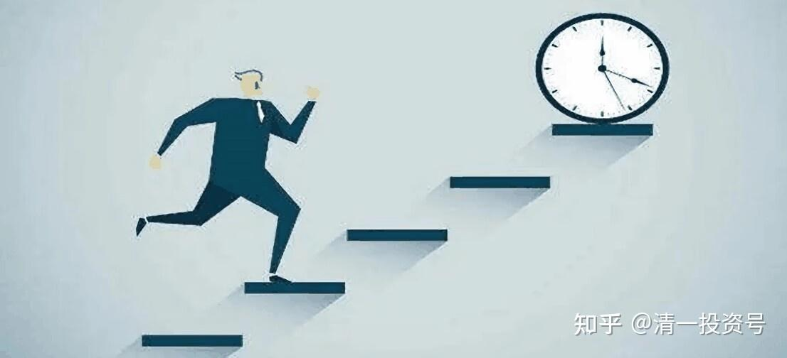

30篇.[《人生十二讲》](https://zhuanlan.zhihu.com/p/608151379)自由讲投资：（4）自我投资和人生目标

清一山长 2007年9月30日

一：自我投资和人生目标

刚才讲了金融投资，讲了实业投资，还要不要讲别的投资？你们现在没有时间，也没有实力去做投资，将来你去做，你也得思考一下你喜欢哪种投资。

假定你的目的是要去致富、去创业，那么现在你们有一种投资是每个人都少不了的，就是自我投资。

从理论上来说，我们每一个人都是无价之宝。如果你愿意把无价之宝去换成金钱，你可以换到手；如果你愿意去交换，你也可以去交换幸福、快乐等等，就是我们上第一节课讲的：**你的人生目标即你想要什么？**你有这个资本，我们每一个人的资本就是我们的生命。

从资本的意义上来说，在座的每一个人，你们都比我富有，是吗？绝对的，你们一定要相信这一点。你们这个优势，我拿钱都换不来。如果我有机会回过头去跟你们换，花多少钱都可以，把我的钱全拿走，我都愿意退回年轻时代。但是退回去有一个条件，我的脑子要保持原状，我愿意把我的知识经验拿回去，重新寻找一个二十岁的机会，我觉得这个人生会比我现在的人生更辉煌更美好，所以我特别希望做这种交换。大家谁愿意交换的告诉我，咱们换一下位。到目前为止，看样子还没发明这种新技术。

但是各位，你们又有多少人意识到，其实你们有一笔巨大的财富呢？好像没想过。你们如果没去想，结果会怎么样？

比如说咱们想象我手上拿的这个东西，假定我以投资家的眼光，发现这个东西是个钻石，我其实有一笔很大的财富。我已经说了，你们都是无价之宝，你们的财富都比我大。糟糕的是我拿了钻石在手里，但我不知道它是钻石。然后我会不会轻易地把它随便换出去？换个烧饼，甚至你连烧饼都换不到，把它扔掉，有没有可能？

你们有没有发现你们身上是有钻石的，身上是有很大很大的一笔财富的？这些财富，你们每天交换了什么东西，就决定了你将来的身价。我已经说了，我用我的时间、我的青春，而且直到现在，不断地对自我投入、对自我投资，我换了我想要的东西。

1. **我换到了想要的身心健康。**我不断地在做，至少到现在为止，我的健康状况表面上看起来还是能糊弄人的。我已经换到了，大家看到了，没有假的。

其次，我不是连说话都说不出来的样子，不是很衰弱的样子“哎呀，对不起，我好累呀。”如果我是那个样子，是我没换到我想要的，是我骗你了。身心健康，我很看重，我换来了。

**第二，我想换到我的家庭和婚姻的幸福。**这点我也去换了，我投资了，这个投资是无价的。如果说买宝马车，我觉得这个思路有点问题，好像人们不知道她嫁谁了，还以为嫁宝马车了。

**第三，事业。**事业就像我刚才所说的，我绝对追求财务自由。正因为我有财务自由，对我的老板（院系的领导）对我说的话，我可以都不在意。他们说：张健柏，你必须按教学大纲讲。我说：我不喜欢教学大纲，我不按它的教，行不行？他会说：你不按，我就扣你工资。我说：你扣吧！真的扣了我的工资，害得我现在一个月只有一千多块钱。

但是大家知道我不在乎，这就叫选择！这就叫**财务自由。如果自由，可以像陶渊明，不为五斗米折腰，我也可以不为一千块钱折腰。**

当然，这种自由不容易。如果我家里面有嗷嗷待哺的孩子，自己生活很窘迫，我真就缺一千块钱。怎么办呢？好吧，老板我听你的，我就去按大纲讲。

我追求这种财务自由，是我拿我的时间换到的。上次有个学生提问题，他说：你有资金、有钱，你当然不在乎这武大的职称。我就跟大家说了：“你这样说不对，你这叫做因果倒置。”

**因为我不在乎这些东西，我才有今天。我不把时间拿去换职称；不把时间拿去换混日子；不把时间换跟那些人搞关系。**

**我把时间放到另一方面——去投资自我，这才有今天的另外一个我，这就叫做自我投资**。但这种自我投资的风格、思路，据我所知，很多学生都没有。有很多学生的概念，是跟着大家走，大家干什么他们就干什么，跟着课表走，跟着学校走，跟着家长的意见走，很少跟着自己“要做什么”走，很少意识到自己的价值在哪里。

如果没意识到自己的价值在哪里，你就没有自我投资，就不知道你这一辈子该做什么事情。如果你没为它做准备，怎么能指望再过十年、二十年后，能过上你想过的生活呢？因为你没有把你的时间拿来换自己想要的呀！

假定以最粗俗的、最简单的方式举例，你身上有一大笔钻石，你想要把钻石换金钱，你要去换啊！钻石我要卖一万，这个钻石我卖你多少钱。如果你没去换，而是把它丢掉了，到了四五十岁，突然发现你没钱。没钱很正常，因为你没去换。

**你不重视健康，也不知道怎样为健康进行投资，每天稀里糊涂地混。现在绝大多数学生的健康状况是很糟糕的，这是事实。我相信你们自己也知道。而且你们生活、作息各方面都有问题，你们没去研究怎样使自己更健康。既然没去研究，就是没去为自己投资，你能指望你三十岁的时候很健康吗？**我说你四十岁就该Game over了。不是说笑话，周围发生过很多这样的事例。不是假的，是真的，因为他们当年赚钱去了，去做了别的投资，但就没想到为自己的健康投资，到四十多岁，很多人死掉了，甚至三十多岁就死掉了，而且三十多岁突然死亡的人多的是，为什么？他们大学时期很聪明，但是养成了一些不懂健康、没为健康投资的习惯，最后没办法了。

你没有去研究感情，作为男人不知道自己该怎样做男人，作为女人也不去研究女人该怎么做，更不去研究自己讨老婆该怎么讨、丈夫怎么找，你不去研究，不去为这些东西投资、伤脑筋，你能指望你的婚姻有多幸福？有可能，绝对有可能，但是这一种像彩票中奖，你中了大奖，算你运气好，但它不是一种必然。

现在，我们看到有些人稀里糊涂地也过得很幸福，但是永远要把他当作中奖者看。就像我看到一个人中了几百万、几千万，我觉得他挺有办法的，但我绝对不想去模仿他。

我从来不买彩票，为什么呢？因为我相信那是我做不到的，不能去模仿做这种小概率事件、运气性事件。我只能做什么呢？**我只做能够确定的，能够控制的东西。我不能控制的东西绝对不做，这也是投资的基本原则**。

二：反自我投资的行为

在自我投资这方面，再讲细一点，就更简单了。

你每天的时间在做什么？每天的时间是在指向你的生命目标，还是在等待、在混、在郁闷？如果你是后者，就等于你把身上最宝贵的资源、最有价值的钻石，在换无聊的东西。

如果一个老师上课，你不喜欢，你又觉得没价值，但你还是坐在教室里面打瞌睡或在那傻傻地瞪着他。那么你也在投资！你绝对在投资，但你换到了什么呢？每天你换到了什么有价值的东西？

今天讲了这个投资课，我希望你们知道一个事实：其实你们每天都在投资，每分钟都在投资，只不过是投到哪里的问题。如果你的投资是打水漂的，那你就打水漂吧！

就像有一些现在比较流行的事情，比如说流行玩网游。玩网游把生命的投资去掉了，把金钱的投资也去掉了，你换来了什么？那是你想要的吗？如果你将来想变成一个网游高手，也可以。假如那就是你的目标，那你就去做。但假如那不是你的目标，你发现你要的不是那个东西，那么你完了，你惨了。

**我觉得大学里有一个投资很重要，就是要投资一批很好的朋友，很厉害的朋友。只有朋友厉害，你才会厉害。想当年，我在我那群朋友中是最笨的一个，这不是开玩笑的。**

比如我那帮朋友中，在各方面有所成就的人有很多。我的朋友，不是我的同学。在我的同学里面我算是比较厉害的一个，但在我的朋友里面我算比较笨的一个。

在我的朋友里面，有一个朋友是四家上市公司的总裁，两家在国内上市，两家在国外上市。但当初我还觉得我比他聪明，其实是他更聪明。

这帮人都很厉害，正是由于他们很厉害，我在他们面前经常感到有压力，经常觉得，我怎么就不如他们？所以在这种压力之下，我也不甘落后。他们还好，还算看得起我这个小弟，天天在一起混，大家在一起搞，时间长了，慢慢地，大家都还不错。就算我做最后一名，做第一阵营的最后一名，总比做最差阵营的第一名好一些吧。这就叫投资。

但是我发现有些学生的投资走错了方向，有些学生的投资是找一个异性朋友谈恋爱，谈来谈去。我觉得，这也不是投资的东西。我就在想，你的青春、你的生命换了这个投资，据我所知这个投资大多数都还没结果。你浪费时间将来能换到什么呢？**其实你要和一个人相处，特别是要和一个异性相处，这件事情永远是不需要着急的。到了某一个年龄，某一个时段，反正总有一个人，你想甩也甩不掉，就是要在一起混的。**那么这种事情是人生最不需要着急的事情，你着什么急呢？但是这样想的人有多少呢？没有，很少。

**既然不用着急的事，你先着急去办了，该着急的事，你不着急，最后你得不到想要的东西也很正常。这就叫投资学原理。**

当然我讲的投资学，大概和你们看到的很多“科班出身”的人讲的不一样，和你们看的投资学原理也不一样，这也是一种幸运。**我创造了一种张氏投资学，我认为投资就存在于我们日常的任何时候，包括我们年老的时候也存在这样的机会。**

**参考链接：**

[25篇.《人生十二讲》自由讲投资：（1）复利的魅力](https://zhuanlan.zhihu.com/p/606914565)

[27篇.《人生十二讲》自由讲投资：（2）金融投资和实业投资的差别](https://zhuanlan.zhihu.com/p/608151379)

[29篇.](https://zhuanlan.zhihu.com/p/610852390)[《人生十二讲》](https://zhuanlan.zhihu.com/p/608151379)[自由讲投资：（3）张氏投资法：看大势的“基础研究”加“心理分析”](https://zhuanlan.zhihu.com/p/610852390)

[32篇.《人生十二讲》自由讲投资：（5）学生自由提问](https://zhuanlan.zhihu.com/p/613765261)

[34篇.《人生十二讲》自由讲投资：（6）投资杂问（完结）](https://zhuanlan.zhihu.com/p/615302216)

