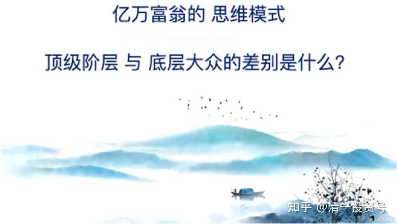
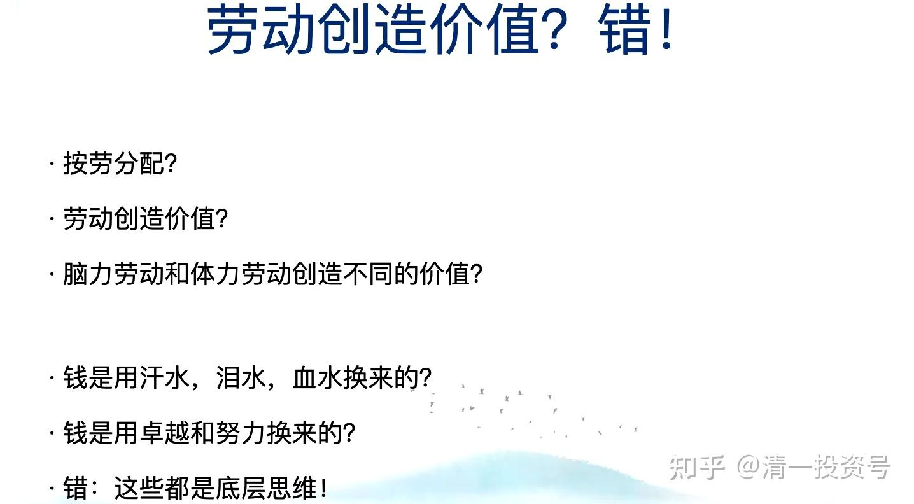
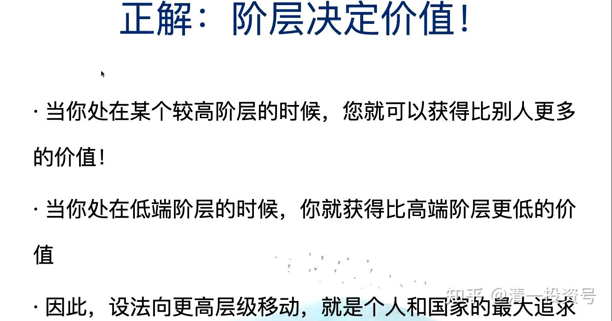
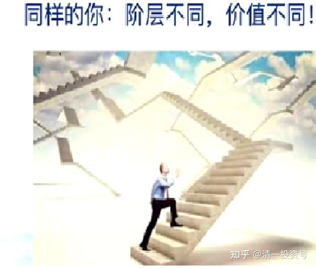
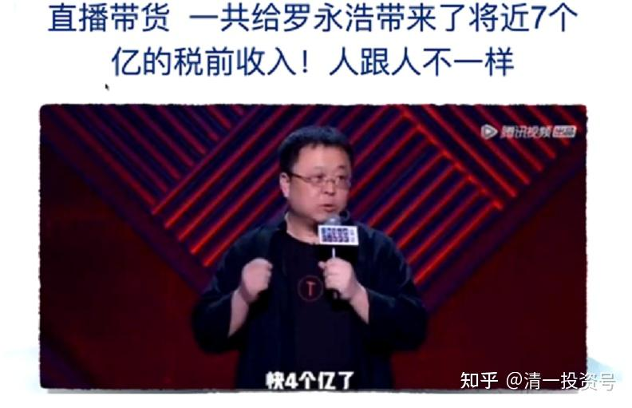

——清一山长2021年演讲《亿万富翁的思维模式与人生顶层设计》节选一

31篇.这几十年学的是错的？

——清一山长2021年演讲《亿万富翁的思维模式与人生顶层设计》节选一

清一山长 2021年1月1日

**一、决定财富的是物质还是意识？**

先介绍一下我不太光荣的历史：我在上研究生的时候，我的本科课程是工学，但我觉得工学太没意思了，要学就要学形而上的东西。我的研究生读的是哲学，但我研究生哲学的老师对我是很有意见的，他说我是一个唯心论者。我们上学的那个时候，很讲唯物唯心的，老师说我是唯心论者。

实际上，今天告诉大家的就是唯心论者的东西。唯物论者就是“物质决定一切”，唯心论者是“心生种种法生”。**我研究出来的最有价值的东西，其实就是唯心的东西**。什么叫“唯心”的东西？**我们的信念系统、我们的心理系统、我们的价值观，决定了我们的现实。**

今天这样一个现实：新教育已经在全国铺开。不仅在全国铺开，其实现在正在向世界铺开。国外一些国家的人也非常地想要新教育。我们已经出去的一些学生，去香港的，去澳洲的，他们已经开始把孩子送到新教育这边来，开始在回流，中国原来都是往外走。

今天这个局面是怎样形成的？今天这个局面的形成，是因为一颗心形成的。心里面有一个信念：**中国应该有一个中国的教育，中国这个教育不应该比国外的差，中国这个教育应该比国外的还好。**而且一个基本观念：过去的教育是工业时代的教育，它已经过时了；应该有符合这个时代的、新的教育模式出来。这一切是不是都是思维模式？而这种模式就是今天要讲的东西——创造性思维，是一种创造的模式。那么，这种创造的模式带来的结果是什么呢？今天，在座的有1000多人坐在这里，还有更多的人，他们会在网上去关注这样一个活动。我们这么多人，这么多的实实在在在发生的事情，它是什么东西创造的？是当初的一个观念：当初，我觉得**我要为我的孩子做一个最好的学校、最好的教育**。这个模式，把它推展开来。如果当初没有这颗心，没有这个念，今天就不会有这个结果。所以，这就是亿万富翁的思维模式。那么，我的资产符合这个要求，我做的事情符合这个要求，我现在来讲这个，估计从事实上来说，是可以接受的。

我们也去研究了：为什么有一些人可以从中国过去四十多年来的发展当中，取得非常好的结果？在我这个时代，跟我年龄一样的人，有大批的、很多人比我更成功，他们成为中国的财富顶尖阶层。但是，我们也同样地看到：在这样一个时代里，大批的、我这个年龄的人，他们变成了下岗工人，他们变成了边缘化。当我们今天，能够在这里做一些更高级的创造性的活动，甚至，我虽然在泰国拿的身份，是一个已退休的中国教授的身份在这边生活，但是我们的生活其实正在开始，未来的十年、二十年，我们依然在创造我们的新的教育生活。但与此同时，我的同龄人，很多人是广场上的大妈，她们过着一种等待死亡的生活。

那么，这种差异是什么东西造成的？绝对不是这个时代没给这些人机会，这个时代给所有人的机会都是一样的。但这个时代，有些人出来，有些人没出来，是因为他的底层思维不一样。我们脑子里面装的东西不一样。我们要装什么东西，可以让你白手起家，成为亿万富翁？我们装错了东西，会不会导致我们的亿万资产在瞬间灰飞烟灭？我们的下一代，我们到底给他装了什么软件？所以，一台电脑跟另外一台电脑的不同，绝对不是取决于这个电脑是什么硬件。我的电脑跟你们的电脑都是一样的，都是很普通的电脑，但是，我在里面装的东西可能就价值千万、亿万。比如我里面装的课件，你的电脑是不会有的，而我这边会有。

所以，取决于我们每个人脑子里装的东西。**如果“物质决定意识”，你身上的那一堆肉，决定了你是千万，还是亿万，还是乞丐**，你相信吗？**这叫“物质决定意识”**，你相不相信？**我不相信的**。我认为我们的**身体是一个基础，我们的精神、我们的灵魂、我们的意识深处那个东西才决定了我们跟别人的差别。**

今天，给大家送上的最大的礼物就是：**我们要非常小心我们脑子里面装进的是什么样的东西。你装进的东西是不合适的东西，是错误的东西，结果很可能就导致了你今天不够富裕，你想赚钱但赚得很辛苦，你想赚钱却怎么都赚不到，你想成功但怎么都无法成功。**更糟糕的是——我们知道，这次来参加会议的人，有很多是亿万富翁——中国的亿万富翁，说句不客气的话，你怎么挣到的这笔钱，可能你都不知道。可能是在中国的这几十年的财富增长过程当中，我们运气比较好，我们一些素质正好配合了这个要求，然后就出来了。

那么，你知不知道自己是怎么挣到钱、成为亿万富翁的？我们就从一件事情可以看得出来：你的孩子能不能学会你的那一套？你孩子能不能像你一样，能够让你的财富发扬光大？李嘉诚肯定是知道的，因为他的两个孩子继承他的东西继承得很不错。那么，你能不能把你的孩子培养得像李嘉诚的两个孩子李泽钜、李泽楷一样？如果他们能够继承你的家业，他们能够传承你的精神，他们能够让你的财富增光添彩，那么你的财富就是应该得到的。但是，**如果你不知道，你用错误的方式去带领你的孩子，有可能导致你们富不过——不说三代——可能二代都富不到。**因为，**未来是财富剧烈分化的二十年**。未来二十年会非常的剧烈分化，一些人在未来这几十年里，会变得更加的富裕；另外相当多的人，而且我认为是大多数人的财富，会在这二十年里灰飞烟灭，他们的财富会变成一个记忆。所以，今天这一堂演讲，我觉得是新年送给大家最大的礼物。

今天大家坐在这里，我们已经跟中国的其他人不一样了。中国的其他人，新年过年干什么？吃喝玩乐。我们的新年，是在给我们的软件进行一次更新，进行一次版本的升级。那么我们就跟他们不一样，我们正在做一件亿万富翁的事情。所以，各位可以为我们今天的行为给自己一个奖励。（观众鼓掌）

**二、创造价值的是什么？**

**1.劳动创造价值？错！**

首先，给大家说一个我们从小被我们的学校、被我们的老师、被我们的家长灌输的错误观念。这个观念就是：劳动创造价值。这个东西，你要说错也不完全错：没有劳动就没有价值，这是对的。但是，**劳动并不真正地创造巨大的价值。按劳分配，**骗你的，**这个世界绝对不是按劳分配的。**

这个世界，有些人过得比我们辛苦。我的孩子，我经常带她去看周围泰国的农民，我们经常去采购，我们经常买水果买各种各样的东西，我们跟这些市场会打交道。

然后我每次问我孩子：“你觉得他们辛苦还是爸爸辛苦？”

当然，她每次都回答：“他们比我们更辛苦，他们比我们更用功，他们干的活比我们干的更好。”

我还会带着孩子们在这边砌墙，干一点活，我们干得很笨，我亲自带着他们一起干。我们干的效率也很低，然后笨乎乎的，做出来的东西都不像样子。但是，看这些农民、这些工人他们工作得非常好。然后，我问她：“你说爸爸跟他们相比，我跟他们竞争，难道他们比爸爸更不用功、更不努力吗？答案都是错误的。”

当然，她也很好奇：爸爸为什么跟他们不一样？为什么爸爸说说话就可以赚很多钱？在上个星期，一个老板正好找我进行了咨询，小孩也在旁边看了一下。说说话，就赚了5万块钱的咨询费。然后我把钱打到武道馆，支持我们未来的世界冠军去了。

我就告诉她：“爸爸说这几个小时的话，难道会比那些农民更辛苦吗？会比工人更努力吗？你说这些是脑力劳动，错了！你说话是不是也是你的脑子在转？你说话就不值钱。”

“对啊！”我们小孩就说，“奶奶说话不值钱。”因为奶奶说好多，说得别人都跑掉了。

我说：“对。”

为什么？不是劳动创造价值，也不是脑子说话创造价值，而是**你的能量值创造价值**。我这个能量级，我说的东西，跟你这个能量级说的东西可能不一样；我做的事情就是你这个能量值做不出来的东西。

所以，**金钱不是用汗水、泪水和血水换来的。**等一下我会告诉大家，金钱可以因为一句话就可以换来，而且换来巨大的金钱。**钱，也不是用我们的卓越和努力换来**。我告诉你，一个笨蛋，什么都不会的人，他也可以换到很多很多的钱，比你多得多的钱。所以，**相信“劳动创造价值”，相信“体力劳动和脑力劳动有不同的价值”，都是你的错误的思想。**

当然，我说的这些东西，已经颠覆了我们得到的几十年的教育。没错！**我们几十年的教育，不是制造亿万富翁，它是制造穷人的，制造工人的，制造打工仔的。**打工仔，你就要相信这一套，不相信这一套你没法活。但是，另外一些人，相信另外一套东西的人，他们创造世界最精彩的东西。比如，我们的教育，今日新教育，绝对不是相信“只要我努力教了我的孩子，我的孩子就会教好”。如果你有这套思维，你就错了。全中国最努力的学生，是体制学校的学生；全中国最辛苦的教师，是体制学校的教师。当然指的是体制精英学校，比如衡水高中，你觉得他们容易吗？但是，他们学生的成绩跟我们没得比。难道我们的学生比他们更辛苦吗？他们每天熬夜熬到12:00，他们每天早上跑步之前，还要站在那读书。

这些都说明了这一套**“我们付出就有回报，劳动就能创造价值”是底层人思维**，是错误的。工人，要相信这一套：我干八个小时和我干两个小时的收入不一样。但是亿万富翁不一样。亿万富翁认为，你干十个小时，你干一年不如我干一个小时，**我怎样在这一个小时内创造比你一年更高的价值。当你懂得了这一点，你就变成了高级人、上层人。不懂，对不起，你永远只能停留在下层。**这是今天给大家的一个最大的启示。

**2.正解：阶层决定价值！**

现在，给大家提示一点，阶层决定价值。刚才说的还玄虚了一点，劳动不创造价值，那价值是什么决定的？**阶层决定价值，阶层创造价值。**

**阶层，说白一点就是当你处在一个较高阶层的时候，你就可以获得比别人更多的价值，而且更容易；当你处在低端阶层的时候，你就获得非常低的价值，甚至无法获得价值。**那么在这样一个过程当中，就决定了我们的价值体系。我们要相信这套东西。我们每个人都在无意识当中——很多人在无意识当中都在追求一个更高的阶层。但是，更高的阶层是什么阶层？今天就来给大家解释。

比如用我们新教育的概念来讲，大家更容易清楚地看到，尤其我们内部的人看得到：比如现在，我们的今日学堂，是处在新教育这个体系当中的塔尖，我们是较高的阶层。那么，我们这个较高的阶层跟其他的新教育学堂相比，以及跟下面的普通的家庭学堂相比，你发现我们要获得价值就容易得多。比如说，我们有定价权，而下面的学堂可能就不太有定价权。我们定了一个价格，下面的学堂想定得比我们更高，那就完全没戏，不太可能。而且生源也一样，申请人数也一样。所以，就形成了一个金字塔。假定我们把新教育看成是一个价值链，我们用企业的眼光来看它，先不用教育来看它。我们用企业的眼光来看，发现今日学堂在金字塔的塔尖，甚至刚刚成立的清一学塾也在塔尖。清一学塾是2019年成立的，到现在一年半时间。清一学塾成立一年半，它就成为了顶尖之一，跟今日学堂相同的顶尖。为什么？因为它是我创造的，它属于我所做的学校。如果你去成立今日、清一塾，它就不会是塔尖，它可能是塔中，也可能塔基。你去新成立一家学堂，它就是最基础的，你连学生都招不到。而清一学塾刚刚成立，它就能招到跟今日学堂一样的学生。

这是不是告诉你价值是什么决定的？层级。清一塾是我创立的、我建立的，跟它是你们去建立的，命运是完全不一样的。所以，价值怎么创造的？阶层决定的。在经济价值上也是一样的。所以，我们每个人，无论是学生还是教师，都更希望向更高层移动。我们一级一级地要找更高级的学校。体制学校的学生拼命要去清华、北大，新教育的学生要考清一学塾、国际今日、清一大学。为什么？因为这代表了这个系统的上层。所以，**是阶层决定价值，不是劳动决定价值。**所以，你是同样的一个你，完全一样，但是，你的阶层不同，你的价值就不一样。

比如，我们清一塾的教师，他同样有这个教学能力，把他放到外面去，他的阶层就变成了中层，甚至是底层。他如果完全不借助我们这边的资源，完全凭他自己的能量，他说他能够教，他就成立一家新学堂，然后别人就不理他。当然，他借了我们的能量，借了阶层能量，他就不一样了。比如，清一塾的教师说“我是山长的弟子”，好，他就得到了能量，至少他会在中层，不会下去了；或者说“我是山长的学生，我在这边学了多少年”——你看你们宣传的教师都会说在我这边学过多少年，其实就是告诉大家“我的层级在哪个层级”；如果没有这些，说“我是外面自学的，我是粉丝”，别人给你的价值就完全不一样了，你就得一点点地、慢慢地证明，慢慢地PK，慢慢地把能量提上去。这就是阶层。

所以，我们一定要注意，自己要不要上到一个个的阶层。上到某一个阶层之后，你就会发现很轻松。但是，没上到那个阶层之前，很艰难。最艰难的地方在哪里？底层。所以，我经常带我们的孩子到外面去，我们打交道的很多都是泰国的底层。底层阶层他们活得非常的辛苦。学校里面也一样，所有的学校底层阶层非常辛苦，又很费劲，还赚不到钱。

我们再看看人跟人有什么不一样。罗永浩，今年疫情，他开始搞直播。他做过很多生意，原来是新东方的老师，然后又做教育，后来又去做手机，做了一个手机名字叫“锤子”，给人感觉那个手机是不是要用来锤什么东西的，名字也没取好。锤子手机其实他是花了很多功夫，用了很多钱去堆。结果，失败了。失败给他带来了很多的债务，一个人背了好几个亿的债务，近10个亿还是多少，我不太清楚。他自己说他要还。怎么还呢？他打工给你还吗？打工还一辈子也还不了。

他就想到了利用互联网思维，利用他的影响力。他的好处就是，他的影响力是全国比较顶尖的，他影响力比我还大。他用这个影响力，用直播的方式，把他的粉丝进行了一点整合。不见得是他说话比我说得更好听一些，而是因为他在中国社会的影响力和能量级不一样。结果他搞直播带货，今年他赚到了7个亿的税前收入。他被采访的时候，说他自己今年还了4个亿了。你说这是不是很吓人？你一辈子都赚不到4个亿，一辈子都得不到7个亿。但他说说话就得了7个亿。区别何在？他是脑力劳动还是体力劳动？他是技术？他说的话，换了另外一个人，都会说。还有很多话其实不是他说的，是厂家或者说周围有个团队告诉他的台词，然后，他照着台词去说，要的是你这个人往那一站，要的是你这个人的形象。

新教育当中，我要出来，大家会有1000多人聚在这；我不出来呢？换了一个人，就不会有这么多人在了，有人会说“那我不想去了”。因为什么？因为人有一种特征，人喜欢向高能量的人靠近。那么罗永浩在他这个圈子里面，他就是高能量的人。**我们每个人都要想办法提高我们的能值。当你提高了你的能值之后，很多人就被你吸引**。**什么叫能值呢？**我们可以这样来理解：你能够吸引十个人，那么你的能值在这十个人当中就是最高的；你能够吸引一千个人，你的能值在这一千个人当中就是最高的；你能吸引一万个人，你的能值就是这一万个人当中最高的。所以，用能值这个范围来评判人的话，有的人一个人相当于几千万人，几千万人之一，他就是这种人。我们说万里挑一，千里挑一是有的，就是指能值——我的能值用这个值来比较是算什么级别的。所以，**我们影响的人，能让人喜欢、让人欣赏、让人愿意接受的人越多，你的能值就越高。所以，很多年前我就告诉学生们：你们要学一个很重要的事情，要让别人喜欢，你要提升别人对你的喜欢度，提升得越多，你的能值就越高。这就是亿万富翁的思维模式。所以，我们要创造为人服务的精神。**

为什么那么多人喜欢罗永浩？不是罗永浩说“我很拽”，也不是说“我很富”，也不是说“我很穷”，而是我们就喜欢这样一个人。我们喜欢，觉得罗永浩这个人很有意思。我们甚至喜欢看他直播带货。他说这个东西不错，我看看，好像我也需要，我也买一个吧！我们喜欢随喜。当你拥有这个能值之后，你可以把它兑现。当然，你可以不兑现。比如，今天我在这给大家讲课，就是一种能值。这个能值，不但不会因为我讲课而降低，反而会因为这个讲课而增加。

互联网还有一个概念，这个概念非常好，这个概念就叫做“**流量变现**”。罗永浩做的事情就是流量变现。**流量就是我说的能值**。很多人对你的欣赏度，对你的美誉度。那么，大家那么多人在一起，大家知道我今天出来，是不收一分钱的，是做免费的服务。也就是说，我没有把流量兑现。如果我需要兑现呢？需要兑现的话，我说清一大学现在建校资金不够，大家愿不愿意支持一点？来开会的人或者外面的人，你能够给点捐款。这就是一种变现，可能瞬间我们建一栋楼的资金就凑齐了。但现在不需要。现在我赚到的钱，我的啤酒赚到的钱足够我们盖楼了。所以感谢中国的啤酒业，大家喜欢的话，回去多喝点啤酒。

好了，这个就是告诉你人跟人不一样，不要以为你跟别人是一样的。我们看罗永浩不要看他那身肉，不要看他那身物质、他的骨头、他的肉。要分析一下这是什么——我们要分析他的脑子里面是什么。

**参考链接：**

[33篇.白酒的价值是谁创造的？](https://zhuanlan.zhihu.com/p/613971066)——清一山长2021年演讲《亿万富翁的思维模式与人生顶层设计》节选二

[35篇.人类的阶层与分类](https://zhuanlan.zhihu.com/p/617160743) ——清一山长2021年演讲《亿万富翁的思维模式与人生顶层设计》节选三

