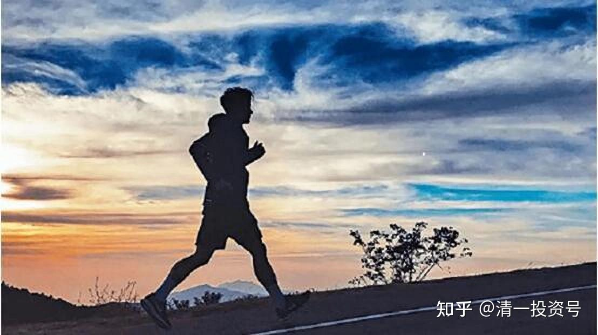

32篇.[《人生十二讲》](https://zhuanlan.zhihu.com/p/608151379)自由讲投资：（5）学生自由提问

清一山长 2007年9月30日

好，这节课自由提问，有问题就问，没问题就算了。但提问的时候，秩序要好一些，不要叮叮当当的。

一、对乞丐的态度，责任意识的培养

我相信大家今天对投资已经有了一个基本的概念。**现在就是你怎样在今后的实践中去把它实施，不管你的投资是资本投资，还是人生投资。我更愿意大家向自己的人生投资，把你的人生投资做到最好，创造一个辉煌、创造你想要的生活。**

我这个人有一个很“残酷”的地方，对于乞丐是不同情的。我不同情乞丐。比如这个人老了，有时候我会给他们钱，不是不给，但我从来不同情他们。你知道我为什么不同情他们？

**因为他们没有对自己投资。有些人老了，过得很贫困，过得这个不好、那个不好。但是以我的理论，社会应该给他们保证。如果是我顺手，也会给他们一点钱，但也不会多给的。**

而且在心里面，我永远告诉自己，也告诉我的孩子：**千万要注意这种情况，你想不想你将来长大的时候变成这个样子——没办法，只能在街边讨点饭吃，特别是你老的时候是这个样子？**

当然了，答案都是否定的。他使劲摇头，说绝对不干。他绝对不会说：“我聪明，我不会这个样子。”因为乞讨的，聪明人不少的。

但是我告诉他为什么不这么做的理由，就是投资学的概念。我告诉他，因为当年他该做正确的事情时，他没有做，当年他肯定瞎混日子，肯定做了不合适的事情，所以他现在才这个样子。因此**你小的时候必须做你该做的事情，必须为你自己的每一件事情负责任，你将来才能得到你想要的结果。如果你没对自己负责任，那么你将来就不能指望有一个好的结果等着你。**

因此这是从小给他的概念。所以我相信我的小儿子长大后，女的嫁给他，会很好的，他肯定很负责，因为他从小就被告知负责是什么意思。

他干错任何事情是必须吃苦头的。比如选择打屁股，我都会让他选择负责。我说你干第一件事情我奖励你，干第二件事情不会批评你，干第三件事情我要打你屁股。他就故意选第三件事情，看我怎么办？

我就笑嘻嘻地对他说：“对不起啦，既然说了，我也得守信用。既然你选了打屁股，那我就打吧。”他说：“爸爸能不能不打？”我说：“当然不行，这样的话，爸爸就是不守信用。但爸爸一定要守信用，对不对？”他说：“是的。”“那么你把屁股亮出来打吧！”所以每一次他都要承担自己的后果。

可惜我们社会上现在很多人的想法，就是好像别人会给一个好结果似的，总在依赖别人。

我是很强势的人，但我的小孩从来不依赖我。他碰到任何事情，首先问“我该怎么解决它”，而不是说“爸爸，这应该怎么做”。他解决不了的，才来找我，没办法对付的，才来找我。实际上是从小养成的习惯，而这种习惯，在我们的教育当中被破坏了。我们的教育中好像都是某一个人该为你负责似的，这就违背了投资学的观念。

刚刚说的乞丐就是这种概念，他没为自己的行为负过责任，他总要求别人对他负责任，这种情况违背投资原理。

还包括一些子女不孝顺，说：我好可怜啊，子女不孝啊，老了把我赶出来，如何如何的，诉一大堆苦。我很理解，但我仍然不同情他。为什么呢？

这子女不孝是谁培养的？古人说，“子不教，父之过。”这就是你培养出来的，你培养出一个大混蛋。他小的时候你在干什么啊？你也没尽到一个父亲的责任。

二、旅游的目的和意义

学生：提到“旅游”的主题，我对旅游也比较感兴趣，对于你来说旅游是一个怎样的形式，是为了放松自己？还是有某种目的，比如说你要去探索情报之类的？

张老师：**我一般是顺便旅游**。我曾经买了一辆车，买了汽车之后，汽车公司奖励我到它的厂里去参观一下。我参观了这个厂，发现这个厂好厉害，它的管理等各个方面都不错。回来之后，我就买了这个厂的股票。你看这就等于做了市场调查，而且因为它的股价正好跌到了我认为不可思议的低价，是三块多钱，我大概是三块四的时候买了一大堆，什么时候跑的呢？我12块钱就卖光了。你可以说是调查，其实也是一个习惯。

第一，我免费跑一趟，有什么不干的？因为我买了它的一辆车，上市第二批的车，它自己觉得这个客户还不错，愿意组织这个活动，然后我就去了。去了之后，我关注的东西跟其他一起去的人不一样，一起去的有好几十个人。但这批人没去关注我关注的东西，他们就是看一下、玩一下、吃了一下，最后到风景区去玩了玩。

其实到风景旅游区玩是最没意思的，他们那次到了九华山，这个地方我去了一次之后，我决不愿意去第二次，真不好玩。但是这个厂反而给我留下很深的印象，虽然我把它的股票卖光了，但是还在想有机会的时候，我还是会重新介入的。

第二，人不需要过分的功利。仅仅想“投资就是投资金钱”，这是一种很狭隘的观点。如果做任何事情都在想怎样赚钱，这个人也太没有意思了。你们觉得呢？投资要投什么东西呢？

**第一要投资自己的健康；第二要投资自己的家庭；第三要投资自己的自由，财务自由和事业自由**，这些东西都要投资。

旅游是什么呢？**旅游是一种增长见识的机会，同时旅游也是在自我的放松和寻找自己喜欢做的事情。**

为什么我们要财务自由？为什么我要赚钱，我赚钱不是想当首富，其实我根本不想当首富，连首富的尾巴都不想当，为什么不想当呢？**我只有一个很简单的目的，只想财务自由，只想不受金钱控制，只想做金钱的主人，我来控制它，不要它来控制我。**

那么我达到财务自由指标后，剩下的时间干吗呢？**做我喜欢做的事情。**

我不喜欢跟团旅游，比较喜欢开车去一些别人都不去的地方，并且不要门票的地方。要门票的地方不是说不好，而是要门票的地方，我发现去了都是看人，人在哪看不着？**人多、话多，听人讲故事，那就不要去了，特别无聊。我喜欢看最自然、最淳朴、最原始的东西。**

我去了很多地方，包括这次去了丽江，丽江是最不好玩的。但是从丽江城再往外面走，到那些不要门票的地方去，我在最漂亮、最奇、最险的地方，照了些照片，感觉非常舒服，还在那个地方，静静地待着看风景。我们一家三口觉得挺快乐的、挺开心的。然后慢慢地走，到了什么地方想停就停下来了。我们还可以停下，在车上睡觉。还有个帐篷，如果愿意搭个帐篷也行，跑到车里睡觉也行，只要不想走了就这样。当然也可以找个小旅馆睡觉，因为我不讲究那么多。这是我最喜欢的生活。

但是有些人就是坐在车上睡觉，下了车撒尿，然后到了景点拍照，就旅游完了。这是很多中国人的旅游方式，在我看起来很奇怪。

其实，我也会去一些旅游景点，因为有一些旅游景点很不错。比如说在冬天的时候，我跑去云南，气候特别好，顺便地避避寒。

也跑到一个景区去过，什么景区呢？是温泉度假区。到里面找了一家很舒服的酒店住，一住就住了一个星期，每天都跑到游泳池里面去游泳，而且游泳池每天都换水，挺舒服的，也很干净，这样的生活质量很高。

但是我发现那边每天都有人到温泉来，下了车，急急忙忙地去找吃的，在酒店里面大吃一顿，之后下去泡了二十分钟，然后上去，在旁边找个房间，在那打牌。大多数人是这样过的。

在我看来，泡温泉的感受不是这样的，泡温泉是一种享受，而且也是一种闲暇、是一种自我放松、是一种很综合的东西。但绝不是他们那种打牌的方式，他们不是去泡温泉，而是去泡澡的。

第三，旅游方式也跟人的价值观有关。其实这种人也很可怜，他们是做标准答案做惯了的人。今天我要旅游，我要度假，我干吗呢？我就找个地方，那个地方叫温泉度假村，我们去一下，去了肯定要游，把它当任务完成一下，上来了，可能还要照张像，就觉得完成任务啦，却忘记了过程才是最重要的。

这样一个过程，什么时候发生呢？大家观察我说的现象，会在未来的七天之内（国庆节），你们会大量地发现我说的这种现象。

有时候也觉得很悲哀，中国人其实玩都不会玩。不是说我一定会玩，我这种玩法也不叫玩，有人玩得比我更疯、更精彩，让我看得目瞪口呆。我跟他们比，就不会玩了。

但我绝不认为在度假村里面、到旅游区里面打牌叫玩，回来宣称自己玩了，那叫什么呢？那叫完成任务，完成了旅游任务。像那种玩法很累的，因此有人越玩越累，但我玩下来精力肯定是很充沛的。你们在10月8号就会看到很多很累的人，度假哪有什么累的？

三、客观理性的对待乞丐

学生：张老师，你开始说，你不是很同情乞丐，虽然常常有些乞丐，确实不愿意付出体力劳动来获得收入，但是也有一些乞丐他们是有缺陷的，他们自己也很努力了，但是由于某些客观的原因，没有得到他们想要的回报，这些人所生存的环境确实有点残酷，那么你如何看待这些人？

张老师：首先，我强调一个观念，对乞丐不同情，是基于我的价值观。

**第一个，他们没有能力做事情，同情也不该由我们来做，我没资格去同情他们，也没有权力去同情他们，这是一个自我认定的问题。**

不同情乞丐是基于我自己，我不能容忍我到了这个地步。如果我到了乞丐这个地步，我绝对先把我杀了，我千万不要成为社会的负担。如果我认为我是社会的负担，我宁愿死去，因为我的价值观第一。因此我是把乞丐跟我做一个对照，但是我不比他高，我没有资格去站在高高的地方说我同情你，不管你是因为什么原因。

**第二个，他有缺陷、有问题、无法自我保证，也不该我去同情，为什么呢？**我们这个国家收了很多税，我已经为社会贡献了不少税收，几乎每个人都在贡献税收，是吗？因为每一次消费也是贡献税收的，那么在这种情况之下，国家应该做一个保证，保障这些人生存，同情弱者，关注社会的弱势群体，但是不归我同情，是这样一个机制来源的。

**千万不要以为自己是救世主**，**我经常提醒自己不是救世主，我们每个人都不是救世主，就算我们比别人高。**

但是每个人的生活都应该是对自己的一种提醒，乞丐的生活对我就是一种提醒，提醒我：我不要像他。我也告诉我小孩不要像他，而且我让我的小孩给乞丐施舍，绝对没有一种高高在上的心态：我施舍给你。

比如说，我让他施舍时，往往是处于鼓励乞丐的情况。他们在卖艺，在做什么东西，他们很辛苦、很不容易，赚钱好难，抱着这样一种心态支持他们，欣赏别人的卖艺。

不管你觉得好不好，你都应该付出，这是一个基本观念——不应该白白获取东西的观念。很多人不了解，这个观念是很重要的，不要让孩子有不劳而获的观念，也不要把他培养成一个高高在上的观念。

有些家长肯定也会这样教育小孩的，“哎呀，你要同情别人、支持别人”，反而培养了他虚荣骄傲的观念，不应该这样做的。

四、社会繁荣，贫穷而艰难是一种耻辱

学生：我前几天读到台湾第一大名领张敏锐的一段话，他年轻的时候问他的师父：师父啊，这个年代做什么能够很快的获得财富？他的师父就告诉他，做行销行业，然后他就做了。我想请问老师，现在这个时代做什么行业能够快速的致富？

张老师：我同意张敏锐的观点，行销行业的确能够快速致富，而且他是可以努力致富的，投资就不一定了。投资是有概率的，而且投资只适合一部分人做。但对于所有人最有效的快速致富的行业就是行销行业，投资只适合于百分之几的人去做，所以我不支持所有的人去做投资，而且不需要所有人都去做。这个是第一个观念。

第二，补充另一位名人的一个观念，这个名人说：**在一个好的、给你机会的社会里面，如果你不富裕，如果你穷困潦倒，是一种耻辱。**

**中国自改革开放以来，所有的人实现自己梦想的机会是一样的，中国是目前世界上最有机会的地方，在这样一个最有机会的地方，我们居然贫穷而艰难困苦，那实际上就是一种耻辱。**你们同不同意这句话？

当然了，在一个非常恶劣的地方，在一个正直的人无法容忍的地方，你如果又富且贵，也是一种耻辱。

我觉得也是的，比如说在一些黑社会当道的地方，你居然又富又贵，那的确是一种耻辱。

这位名人很有见识，他就是我们古代的思想家孔子，孔子就说了这句话：在一个很好的社会，你凭什么没有很好的成就。现在有很好的机会给大家，希望大家在二十年之后不要遗憾后悔。

五、思维的自我训练的方式、路径

学生：张老师，我想问一下你能不能具体的告诉我们一些如何训练思维的方式、方法？你像我们这样的时候，在自我训练方面做过哪一些努力，比如说你除了看书，还有哪几方面？

张教师：这的确是一个挑战，因为这种训练本身是一个无法用语言能够表达的东西。其实自我训练很简单，就是要去找到自己的毛病、要认识自己，并加以改进！

我现在也在不停地找毛病、不停地改变自己，对于这个过程不是一句话就能够解决的，是一个不断的持续过程，在这个过程当中，怎么解决呢？

第一个，就是充实自我，要读万卷书。我早就破万卷书了，中国古代的一卷没多少的，然而读书很有必要，为什么呢？因为要见识广，我觉得读书是最划算的事情。

你们想想一个人要有经验，没错！但要得到这个经验很麻烦。如果一个人什么事通通都要去体验一遍，他没体验几遍，人就老了，这是最悲惨的事情。

所有最聪明的人应该做什么事情呢？用别人的体验来完成自己的升华。

我不能去体验一次死亡才了解死亡，《人生十二讲》中有一讲是讲生命和死亡。死亡，我不能去体验后才知道，但是我可以通过别人的体验去体验，也可以通过别的方法去体验，我就需要去研究别人是怎么研究的。

刚才有人问我，找什么书看才好？这里面也有诀窍的，比如我要去找别人赚钱的经验，怎么找？我就找比尔•盖茨写的书，我去找写李嘉诚的书。李嘉诚不写什么书，但他有演讲、传记，有一些对他的描述，我去找来看，让我看他是怎么想的，他是怎么做的？知道了他怎么想、怎么做后，我就去模拟他！等我能够模拟他的思维的时候，我就发现我得到了和他差不多的经验，或者就算差一些，总比我自己去摸索好一些吧！

中国话说“失败是成功之母”，其实我觉得这句话不太有道理，我个人经常会怀疑一些大家认为是常识的话。因为我会问为什么“失败是成功之母”？一个人天天失败怎么行呢？

就像刚刚我举的那个例子，投资失败一次差别就大多了，所以说我们要想办法不失败。怎样不失败？我天天去想怎样不失败，我才能成功，而不是天天去想“失败是成功之母”，那东西只可以安慰一下自己。因此**不失败才是最重要的，投资的基本定律：不投资失败，是最重要的。**

从这个意义上来说，学习、读书，开拓自己眼界就是最大的要点。我看到这些优秀的人，就要找到自己的毛病：李嘉诚能够做到这一点，我为什么做不到？

台湾还有个首富叫王永庆，这个人我看了都自愧不如，我觉得我就是不如他，当然我也没他有钱。我怎么不如他呢？他那么大年纪了，每天早上起来还要跑一万米。他的医生后来就不准他跑了，现在他改跑少一点，改打高尔夫，做别的东西去，这是他每天例行的公事。

成功者都有一个特征，都很喜欢运动。当然这一点我就做不到，我觉得我比他差劲很多了，但我在想他为什么要这么做，他这样做有什么道理？

我不能说我一天懒洋洋地说：我要跟他一样。还有他在做人做事方面，对人要求特别严格，这些东西就是我的毛病。

中国古人唐太宗说“以人为鉴”，以他人作为自己的镜子，照一下自己。

我看不到我有什么毛病啊？如果每天只是照着家里面那个镜子，越看越顺眼、越照越舒服、越照越自恋。

当然如果用别人来照自己，越照越惭愧。我周围一帮朋友就是我的镜子，那帮人都很厉害，显得我很惭愧，我怎么就是比他差一些？

所以我就不敢去放纵自己，真的不敢。如果周末去瞎混了一下日子，回来会谴责自己的，会觉得我怎么能这样浪费青春呢？那不行的。这就叫以人为鉴。

那么你用来照自己的人越高，你照出来的自己也就会越全面完善，发现自己的问题也就越多。

千万不要拿比自己低的人来照。比如说我每天拿街头的乞丐来照自己，越照自己越完美、越照自己越觉得自己好得不得了！所以，关键看你用什么人照。

但是人都有一个习惯，喜欢拿不如自己的人照。比如说今天我不看书、不学习、去混日子，然后别人一批评，自己还给自己找一个安慰，说：某某某，他昨天就没看书了，我昨天还看了的！

这就是人的习气，我的习惯是以那些比我好的人来照自己，一照就照出很多毛病，我就得去改。如果我用那些比我差的人去照，我就进步不了，这是一种照的方法。

还有一种照的方法，就是看书。但最好的方法是用高明的朋友来照自己，千万不要拿周围比你差的朋友来照。

怎么看你的朋友的层次呢？你的朋友周围的人是什么档次的人，他就是什么档次的人。包括选人也是一样。比如说你要选对像，你就看他交什么样的朋友，他周围的朋友有什么性格。他自己可以掩盖，但是你看他周围的朋友，如果都是一帮很虚荣的人，他肯定也是；他这帮朋友，如果都很朴素，他肯定也很朴素。因为所谓的不是一个圈子进不去，你也要决定自己进哪个圈子，周围朋友都吸毒，你要不吸，也蛮难的，是不是？

**无论选择朋友，还是选择书籍，对自己苛刻一些、严格一些就行了。当然其中有一些训练方式，包括个性训练方式，我觉得最好的，就是武术，以后再讲。**

**参考链接：**

[25篇.《人生十二讲》自由讲投资：（1）复利的魅力](https://zhuanlan.zhihu.com/p/606914565)

[27篇.《人生十二讲》自由讲投资：（2）金融投资和实业投资的差别](https://zhuanlan.zhihu.com/p/608151379)

[29篇.](https://zhuanlan.zhihu.com/p/610852390)[《人生十二讲》](https://zhuanlan.zhihu.com/p/608151379)[自由讲投资：（3）张氏投资法：看大势的“基础研究”加“心理分析”](https://zhuanlan.zhihu.com/p/610852390)

[30篇.](https://zhuanlan.zhihu.com/p/612686722)[《人生十二讲》](https://zhuanlan.zhihu.com/p/608151379)[自由讲投资：（4）自我投资和人生目标](https://zhuanlan.zhihu.com/p/612686722)

[34篇.《人生十二讲》自由讲投资：（6）投资杂问（完结）](https://zhuanlan.zhihu.com/p/615302216)

