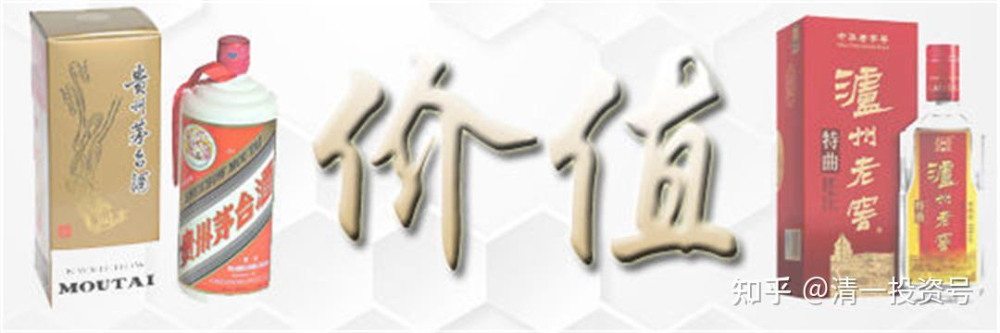
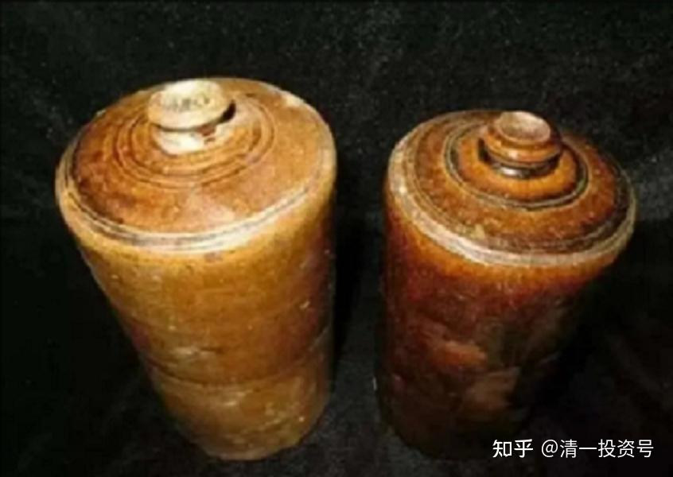
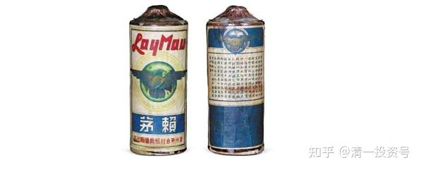
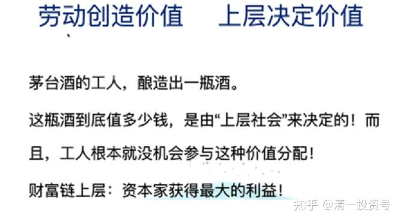

——清一山长2021年演讲《亿万富翁的思维模式与人生顶层设计》节选二

**

**

33篇.白酒的价值是谁创造的？

——清一山长2021年演讲《亿万富翁的思维模式与人生顶层设计》节选二

**1.茅台的价值是平台的价值**

我们再看另外一件事情，很有意思，我都在给你讲能值是什么。四十年前，中国可以说是世界上最穷的国家之一，可能跟现在的北朝鲜差不多。那么四十多年前中国为什么变那么穷？四十多年前的中国比七十年前、八十年前的中国要穷得多。你不相信你就看看历史。民国时期中国不穷，为什么四十年前的中国很穷？民国时期，你看看我们的达官贵人，你看看我们的上海、北京的繁荣度，看看我们那时的生活水准。民国时期，中国绝对不是穷国，虽然不是世界最富国。因为，民国时期的中国跟世界保持了良好的价值交换关系。

然后，解放初期我们干了一件笨事，有人说是聪明事，我认为是笨事：就是跟联合国打了一架——朝鲜战争。朝鲜战争一打，以美国带头的联合国对中国进行封锁。这一封锁，你觉得封锁咱们也没饿死呀！中国人是没饿死，但中国人从此变得很穷。我在少年时期、幼年时期，就是过这种贫困生活的。活是活得下来，但真的很穷，什么东西都没有。我当时印象最深的就是，我记得父亲带我去看看百货大楼，然后看到一瓶酒，我爸告诉我这是好酒啊！7块多一瓶。然后我爸看看，舍不得买，太贵了，我们不买。7块多钱一瓶的茅台酒，我爸说太贵了，不买。

好了，国酒茅台今天那么俏，国酒茅台现在很贵，为什么那个时代不值钱？同样是这瓶酒，那个时代不值钱，为什么现在变得值钱？是因为我们国家在1979年跟美国建立正常化关系。尼克松、基辛格做了这件事情，中国融入了世界价值分配体系，允许你进入这个体系分钱，大家一起来吃肉。因为那时候他们的目标是对付苏联，为了对付苏联拉拢中国。中国那时候脑子也转过弯来了，觉得跟着苏联混没前途，所以愿意跟美国在一起，所以，愿意跟随美国。说白了，是给美国打工，但是给美国打工，也就参加了它的价值链。

现在，美国要跟中国脱钩，原因也是因为觉得中国对它有威胁。为什么有威胁？等一下会讲。今天下午很多人提问提了这个问题。我就告诉你，现在的国酒茅台卖现在这个价格，不是因为茅台酒就值这个价钱，没这回事；而是因为这个茅台酒摆在中国这个平台上。**平台价值，中国的平台价值使茅台酒今天值钱了**。看看茅台酒现在有多值钱。

这是一瓶1956年出产的土陶瓶子的茅台酒，还不是后来的瓷瓶。现在是瓷瓶，那时是陶瓶。陶跟瓷，差一个级别啊！这个价格是多少我不清楚。我只知道在（二十世纪）70年代，我父亲带我去商场里看的，当时我印象很深，他说这是中国最好的酒，也是最贵的酒。最贵的酒7块多。那么1956年出产的这个茅台酒大概也就7块多吧！但现在它的拍卖价格是多少？184万元。哪个土豪买走了，我不知道。这就是它的价格。它能卖那么高的价格，是谁决定的？我如果告诉你，茅台酒能卖这个价格跟美国人有关，你绝对不相信，但这是事实。如果美国人不允许我们1979年开始，关系正常化，跟美国进入美国主导的世界经济体系——这个世界经济体系到目前为止，都是由美国来主导的——如果没有进入这个世界价值分配体系，这瓶酒现在照样是7块钱一瓶，没什么稀奇的。

茅台酒还有更值钱的，看看，这瓶赖茅酒价值1070万元。看起来一个烂瓶子，1935年生产的，很早以前的，400克。这瓶酒是宁德市企业家赖先生买了。为什么他买了？他也姓赖，“赖家的茅”。其实他买它，不是因为这瓶酒。这瓶酒是谁做的？你觉得造这瓶1000多万元的茅台酒的工人得到了多少钱？我觉得可能只得到了两块钱、一块钱。因为这个价格那个时候（1935年）按人民币算肯定还不值7块钱呢！

**2.谁创造了茅台的价值**

但现在，这瓶1070万元茅台酒，（造酒的）工人分到了多少钱？卖这个酒的老板又分到了多少钱？没分到的。由谁得到了这笔钱？或者由谁创造了这个价值？所以，我们相不相信，这个价值是由谁决定的？是由心决定的，他的信念决定的。我觉得它值这么多，它就值，而且正好我有钱。假定再过10年，可能又一个大赖先生出来了，老赖先生出来了，他说这个东西价值更高，有没有可能？然后出一个亿（买这瓶酒）。有啊！中国国运如果十年、二十年之后越来越发达了，可能就再出一个土豪来，花一个亿把它买走，也难说。现在它已经变成了一个概念，它已经变成了一个珍藏品，它绝对不是拿回去喝的。他拿回去摆在柜子里面，告诉别人：我有这个酒，我有这个身价。它已经是一个象征的意义。它里面的酒好不好喝已经不重要了。别以为说1000多万元的酒，它就好喝1000多万倍。没这回事。然后再过十年、二十年，这个工艺品可能别人会抢购它，因为它已经变成了一种象征，这个时代已经没有了。

所以，这个**价值由谁决定的？脑子里面的观念**。我们认为它珍稀它就珍稀。但是，如果中国没有今天的国运，中国没有现在这个世界第二富裕国家的身份，茅台酒卖不出这个价钱来。你拿个泰国的酒卖卖试试？泰国的酒卖不出价格来，因为泰国在国际市场体系里面，它的地位不够。日本的清酒可以卖出价钱来，因为日本的国际地位够高。甚至不值钱的东西，像葡萄酒，在欧洲国家很便宜，一美金、两美金一瓶，拿到中国来可以卖几百块，甚至更贵。法国的葡萄酒世界知名，不是因为法国葡萄酒真的味道最好，而是因为法国曾经是世界第一强国。所以是这些东西不一样。

所以，茅台酒的工人，他造了一瓶酒。这瓶酒全是工人造的，其他人都没造。但是，茅台酒的工人，他得到的工资在分配的价值链上一定是最低的。谁得到的最高？根本跟酒没关系那个人，得到的最高。你们猜是谁？贵州省国资委，以及贵州省税务局。相不相信？贵州税务局、贵州国税局、贵州地税局，它抽走的税是最多的。茅台酒的利润90%以上是毛利率，净利率只有40%几，利润的一大半就交了税。他干了什么？他啥都没干。税务局的人需要素质吗？需要卓越吗？需要聪明吗？需要努力吗？不需要。需要什么？需要有文件，你必须交这个税给我。为什么？因为在贵州，贵州省国资委、贵州省税务局，它代不代表上层？它代表上层。它代表上层，它说一句话，你就得把钱给我。

最近发生的事情，去年发生了一次，今年发生了一次：茅台酒厂把它的股份无偿地送给贵州省国资委。送给它干嘛？它拿了去卖。5024万股，拿了去卖。去年卖了600亿，今年大概卖800多亿。它开始卖，现在涨那么高，它不卖才怪呢！所以，这1000多个亿，国资委顺利把它兑现了。谁去买的单咱们就不谈了。但是，这个价值，是不是上层决定价值？难道这件事情，赚这么多钱，是茅台酒的工人能够得到的吗？茅台酒的工人得不到的。茅台酒厂的工人只能得到可能比在别的酒厂打工略高一点点的工资，绝对高不了一倍、两倍、三倍。高一些，就已经不错了。因为他们不是平台，他们不代表上层，他在这个酒厂做工人，到那个酒厂还是做工人。甚至于，茅台镇上有没有比茅台酒做得更好的酒？我敢说，绝对有。茅台镇上有很多茅台镇酒。为什么那些茅台镇的酒就卖不出茅台的价钱来？不是它的品质，不是它的工艺，不是它的成本。是什么？它不在这个价值链上，它不是茅台酒，它是茅台镇酒。茅台镇的酒很便宜。我家里还有一箱茅台镇的酒，挺便宜的，周围的人喝了都说跟茅台酒差不多，它只卖几十块钱一瓶。

所以，这个**世界的价值，是由级别决定的**。茅台酒它代表一种级别，它代表了国酒，代表了很多概念。这个概念是很多人花了很多时间把它造出来的。

**二、泸州老窖的利润分配**

还说一个笑话，我有一个表妹，她是泸州老窖的一个地区级代理。几年前，大概是2014、2015年，当时泸州老窖跌到了20元左右，之前还跌到16元，我在16元买了泸州老窖，20元之后也继续在买。然后，我去找她，去她的酒窖看，看她的经销商，问她做市场调查，因为我也不知道这个酒到底卖得怎么样。我问她酒卖得怎么样。她说卖得还不错，顶级的酒卖得也不错，都是供不应求。她说销量没问题。

然后，泸州的老板告诉她，让他们这些经销商多去买点泸州老窖的股票，当时是20块，他说将来会涨到40块的。他们觉得能够涨到40块就顶天了。

当时我告诉她，我说：“你应该相信你的老板。为什么呢？你做这个东西，你看你的东西在正常销售，并没有销不出去。所以，你就可以做它（的股票）。”

她花了钱，她就只敢去买酒。她说：“我不敢买股票，股票会跌。”我说：“股票会跌，就意味着股票也会涨啊！”所以我告诉她：“我会使劲买这个酒（的股票）的，我要支持你，支持你们酒厂，我要买你们家的股票。”我就鼓励她买。

我也告诉她不要去存酒了。他们那个东西有压货——压货就是你存这个酒，我就给你让一个点、两个点、三个点，然后你就给我多压点货。她为了赚这几个点，她就使劲去压货。我说：“你赚这几个点干嘛啊？你去买20块钱的泸州老窖，买了之后存起来。”我告诉她，“肯定比你卖酒赚得更多。”她不相信。

今天的结果是什么呢？现在泸州老窖是200块了，不是40块。她知道我买了好多泸州老窖的股票，结果，她碰到我的朋友，就嘀嘀咕咕，碰到我妹妹，也嘀嘀咕咕，她说：“我都是给你哥打工的。他赚的钱比我赚的钱还多，但酒都是我卖的。”

好了，那么我们就说一下，我持有泸州老窖的股票，我就是资本代理者，我就相当于，在泸州老窖当中，我处在一个上层的地位。其实我不用干活，不用辛苦，我也不用懂酒。酒到底好不好，我根本不用管它，下面的人要管。她是代理商，是中层。造泸州老窖的工人是下层，只能得到一份生活费。她是中层，比一般人已经不错了。但是，她觉得，她辛辛苦苦卖10年的酒，还不如我一年买泸州老窖的股票赚的多。因为她的层级分配不一样。这就是告诉大家，不要相信“劳动创造价值”。

在泸州老窖这个过程当中，我一点劳动都没做，按了按键盘。但是，天天在那酿酒的工人赚到的最少；卖酒的，我的表妹赚到了中间；我不卖酒，而是卖主意的那个人，寻找时机的那个人，赚到的最大。这就是金字塔。**在这个世界上，利益金字塔是按照塔来做的。底层，就是下面的基座，人数最多、最大，但是他们分到的利润最少。而顶尖的人，他们人数最少，但是他们拥有最大的资源分配权，也拥有最大的利润。他们不需要聪明，不需要能干，他们只需要掌控到资源。拥有这个平台的资源，他们就能掌握最多的资源。这就是我今天告诉你们的，亿万富翁的思维方式。**你必须要有这种思维方式。**如果你傻到只会乖乖地去劳动创造价值，然后你也训练自己的孩子去当打工仔，那么，你就不懂得我今天说的道理，你也不懂得今日学堂在干什么。今日学堂在做的事情，就是要帮助学生从底层往上走。**

**参考链接：**

[31篇.这几十年学的是错的？](https://zhuanlan.zhihu.com/p/613765281) ——清一山长2021年演讲《亿万富翁的思维模式与人生顶层设计》节选一

[35篇.人类的阶层与分类](https://zhuanlan.zhihu.com/p/617160743) ——清一山长2021年演讲《亿万富翁的思维模式与人生顶层设计》节选三

