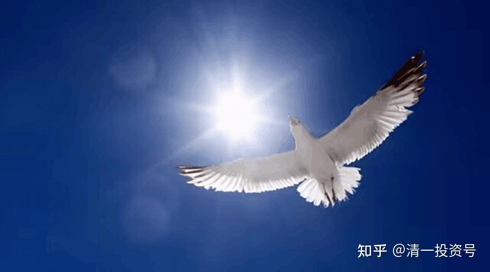

——心灵自由的问题

36篇.《人生十二讲》第六讲：心灵与财务自由（2）——心灵自由的问题

清一山长 2007年10月12日

一、《[穷人缺什么](http://link.zhihu.com/?target=https%3A//pan.baidu.com/s/1jGr3Mi6%3Ffid%3D1423020487)》读后感分析

我再问一下，剩下的那三分之一的人，看了[《穷人缺什么》](http://link.zhihu.com/?target=https%3A//pan.baidu.com/s/1jGr3Mi6%3Ffid%3D1423020487)之后，有什么感觉？

看了之后，觉得挺好的、很喜欢的，请举手！OK！

看了之后，觉得很不喜欢、很讨厌的，请举手！OK，好，还有几个。

说一下，你为什么不喜欢这本书？

学生1：“感觉太残酷了！看完了之后觉得，自己一直在做一些很无聊的事情，在被别人利用，尤其是在给别人打工的时候，被利用......”

老师：“给别人打工，没什么不好啊！”

学生1：“感觉自己做的那些事情都是给别人打工......我尤其对书中‘跟别人打天下’的那一章，感触特别大！”

老师：“既然感触那么大，如果对你有所启发、有所触动，那你为什么不喜欢呢？”

学生1：“应该说，是触动太大了！”

老师：哪位有不同的想法？

学生2：“我觉得，那本书跟我看过的很多书都一样，没什么意思！”

老师：“不过是刺激刺激人而已，是吧！OK！”

学生3：“我觉得书中的好多观点，我都看过了，而且有些观点，我觉得很肤浅！”

老师：“好，有没有反方的意见？说一下。”

学生4：看这本书的时候，我不是单独看的，是跟托马斯·弗里德曼写的《[世界是平的](http://link.zhihu.com/?target=https%3A//zhidao.baidu.com/question/1762689425412108268.html)》这本书一起看的。这种书都有一个缺点，就是都比较浅显，而且大同小异。我是先看《穷人缺什么》，没什么感觉！但如果跟《[世界是平的](http://link.zhihu.com/?target=https%3A//zhidao.baidu.com/question/991690150171350779.html)》一起看，感觉是不一样的！

《[世界是平的](http://link.zhihu.com/?target=https%3A//zhidao.baidu.com/question/1762689425412108268.html)》一开始就说了这样一段话：当太阳从非洲草原上，升起来的时候，羚羊要奔跑，因为它不奔跑，它可能这一天就被吃掉，那么狮子也要奔跑，如果它不奔跑，它这一天可能就没有吃的东西。

接着就开始讲整个时代的发展状况，美国面临的挑战。

如果把视角转向中国，其实中国跟美国在政治上是分立的，但是在面临竞争的时候是完全相同的。

在《穷人缺什么》这本书中，有一个问题没有阐述清楚，就是穷人为什么缺那么多的东西？这个问题，实际上就是狮子和羚羊的问题。

狮子和羚羊这两种动物都在为生活而奔跑。但它们的目标是不一样的——狮子奔跑的目标是为了找东西吃，羚羊奔跑的目标是为了生存。这反映到社会上，就是穷人和富人面对整个社会的态度是不一样的。羚羊也不一定就是穷人啊！如果折射到社会现象，我们可以把穷人归为相对的劣势群体......

老师：好了，你暂停一下，《[世界是平的](http://link.zhihu.com/?target=https%3A//zhidao.baidu.com/question/1762689425412108268.html)》有两本，一本是橄榄树与凌志汽车的故事，那是讲经济的，另外一本讲希腊社会与文化。你看的是哪一本？（《[世界是平的：凌志汽车和橄榄树的视角](http://link.zhihu.com/?target=https%3A//zhidao.baidu.com/question/1762689425412108268.html)》托马斯·弗里德曼）

学生4：我看的是橄榄树与凌志汽车的故事。

老师：好的，有一个主要观点，我需要澄清一下。**在西方，不认为穷一定是弱势，也不认为富一定是骄傲。这种价值观是我们东方人的想法。**

东方价值观认为，我开宝马一定神气一些，而他们认为，你开宝马就开宝马，我开富康也可以开得舒心，虽然价格不一样，只要我开得舒心！这两者的观点不一样，怎么不一样？我们以后再讲。

作者已经说了：他认为狮子和羚羊是完全平等的，他并不认为羚羊就一定是弱势，只不过它们生活方式不一样而已。一个生活方式是被追，必须跑得足够快，而另一个生活方式必须追得足够快。不管是哪一种生活方式，都必须做到在其所在的种类中的最优者。这是中西方观点不一样的地方！”

好了，这本书先讨论到这，现在我们再问下一个问题！

二、财务自由的前提是什么？

今天讲的是财务自由，当然也会涉及到心灵自由。现在，我想问一下各位，你认为你是自由的举手？

OK,1,2,3,4......13个，我们那么多人，只点出十几个自由人来！

这十几个自由人有没有愿意陈述一下的，你为什么是自由人？那些不是自由的人就不说了。

学生：因为每天都不必担心自己被饿着或者……想去图书馆看书就去看书……

老师：好，剩下的那么多的“奴隶”们，你觉得你被什么奴役？谁来告诉我？什么在奴役你？

学生：我认为，一个是被环境奴役，更重要的是被自己奴役。

老师：好，说得挺好的。我们想想，如果我们每一个人或者大多数人觉得自己是不自由的，自己是被奴役的，那是不是都过得很悲惨？

学生：不悲惨，奴隶有奴隶的快乐！

老师：有些人要提抗议了，说：老师，我不是自由人，但我也不是奴隶。

不自由，就是被奴役嘛！这个奴役，不管是谁奴役了你，其实都是你自己自找的。这个世界上，绝大多数人的确是被奴役的，而且实际上，大多数人是被自己奴役的。

现在就回到我们的主题——**心灵自由的问题。心灵自由，中国人不理解。中国人认为：“我要自由，你给我自由!”**

在上世纪，八、九十年代的时候，我正在读研究生，那个时候我的观点和主流的意见是相反的。我说：“大学生到处游行要自由，这帮人要自由，但他们连自由是什么东西都搞不清楚。”所以我还经常与那帮人的主要干将发生冲突，我经常持反方意见，当然没有到被打成反动派的地步，我跟他们的关系一直都很融洽。我说：**“你们使用最不民主的方式争取自由，证明大家都不知道什么是自由。如果让你们去实施你们所谓的自由，那就叫乱套了，那也是完全见鬼，这是有毛病、有问题的。”**

回过头来说，**在我们这个国家，我们很多人并没有认识到自己的自由，也没有去追求自己的自由。我们习惯了被奴役，习惯了不自由。因此，谈财务自由就是白讲。如果你的心不是自由的，你的财务自由从何谈起？**这就是最大的障碍。

所以我认为，**尽管我们的主题是财务自由，但一定要先讲心灵选择的自由**。那么这个自由我们怎么得来呢？

其实，我们没有进行过选择，也根本没有思考过自己是有选择权的。

你说，老师讲课，讲得不好听。因此你很郁闷，没有办法，不自由地坐在那里听。那难道你真的没有自由吗？其实，你有两种方式可以获得自由：

第一，你可以逃课，这时候，你是不是就自由了？你可以做自己想做的事情。你可以去看自己喜欢看的书。

1. 你还可以抗议：“老师，你讲得太臭了！”“老师，你讲的就是垃圾！”

但你担心老师给你不及格，对吗？

如果你说他讲得太臭了，他敢给你不及格，你可以去告诉校长。因为是他讲得不好，不是你不想学。你不想学是另外一回事情。你学得不好，你没资格说任何话；他教得不好，你真有资格说话。在这种情况下，你是不是自由的？

你会觉得，你自由了。你开始主动去选择，开始去行动，开始获得自己想要的东西。就像我上大学的时候，开始选择，思考我自己想要的是什么。

事实上，自由是什么呢？**现在大家应该会想得到，自由，就是自我选择的权利。**这样事情就变得简单得多了。比如曼德拉，现在是南非总统，他曾被关到监狱里面去，被关押了很多很多年。大家想想，在监狱里的时候，他应该是自由的还是不自由的？

我认为他是自由的。为什么这样说呢？因为这是他自己选择的，所以他是自由的。

他平静地接受了这种生活。**在狱中，他仍坚持写他的著作，坚持他的信念，领导他的政党，最后成为他们的领袖。即使在狱中，他仍然是他们的领袖，是吗？然后带领南非取得了不可思议的成功。这也是他选择的，因此他是自由的。这和他的身体不自由没有关系。这是大家一定要记住的观点。**

自由的主题，用中国的古话说，就是“反求诸己”的问题。中国古代，包括国外一些中西民主的斗士，他们所提的自由，都是“反求诸己”这个概念。

就是说，**如果你的心是不自由的，那么给你任何东西，你都是不自由的。**即使把你推到皇帝的位子，你还是不自由的。

相反，**如果你的心是自由的，你的选择是自由的，即使在监狱里面，你仍然可以活得很自由，因为那是你选择的道路。**

就像苏格拉底，在选择死亡的时候，他是自由的。他的弟子告诉他：你可以活，我们可以贿赂看守，让你逃走，也可以拿赎金，把你赎走......他的很多弟子都非常有权势，都有很多办法的。

但他却说：“不。”

然后当局说：只要你收回你的观点，也不用关在这里，你可以被放出去。

但他说：不。

他非不，等于他非要去找死。他就是要选择死，因此这个死是他选择的自由。这个时候，我们就可以看到人性的尊严和人性的光辉。

三、心灵自由的人与“被动等待的人”的不同命运

我认为，中国的学生最苦恼的是：经常认为是别人为自己决定一切。

比如，你认为，你在学校的好坏，就是老师帮你选择的。你这个观点是错误的。因为老师的好与坏，可以很重要，也可以是不重要的。

我上大学的时候，老师并不见得都很出色。我认为，他们的总体素质应该比现在的老师高。但是，我想学的，不是他们教我的东西，所以他们讲的，对我的帮助不大。更多的东西是我自学的，来自于我自己的思考和实践，而不是来自哪个老师教给我的。

如果老师教给你，你才知道，当然是你的幸运；**老师没教你，但因为你要追随自己的目标，你要顺着自己选择的道路去走，自己去学，这才是你选择的自由。**

同时，我们想想看，国家那么多的人，文革期间，那时的条件更差。我们很苦恼，我们的大学不是我们想要的大学，我们找不到很好的老师学。我们在那里埋怨、在那里郁闷、在那里说一些不好听的话，甚至伤心都没有用！也不应该做那些事情，我们应该做的是选择的自由。

如果这个老师教得不好，我们是不是可以自己教自己，自己学习呢？

当然，自己教自己，并不等于闭门造车。现在社会资讯那么发达，条件那么方便，你如果觉得武大的老师不好，你是不是可以跑到其他学校，去听其他讲得好的、你喜欢的老师的课呢？今天我在这里讲课，就有华工大学、武汉理工大学、中南民族大学的学生跑过来听我的课。这是他们的选择。如果觉得武大的老师不好，或者武大指派给你的老师不好，你是不是可以到另外的你认为讲得好的老师那里听课呢？

但你没去选。这谁的问题？

是你自己的问题。

好了，就算武大所有的老师都不好，我认为这种可能性是极小的，是最极端的。你可不可以自己教自己？图书馆有那么多书，有那么多厉害的人，还有那么多讲座，这是你们在武大的幸运。

因为武大毕竟有这样的牌子，那些知名人士、很厉害的人愿意在这里演讲。那些小学校才可怜，那些知名人士，你花多少钱都请不去的。因为他们的时间是很值钱的。但是，他们到武大来，你不花一分钱就可以听他们的讲座，多好啊！这些是不是你学习的机会呢？

你在武大，就有那么多的机会，那么好的平台。所以，不能说：在武大，学不到东西。关键要看你对自己的要求是什么，你选择了什么？

如果你选择了“等着别人告诉你应该怎么做，怎么走”，那是没用的，你是走不出来的。所以这就是心灵自由的问题。

**心灵自由，指的就是一个人如何为自己的生命作出决策、如何为自己的生命负责、如何才能自动找到出路。**

我想到电影《侏罗纪公园》里的一句经典的话，讲得很有意思，**“生命总会找到自己的出路，只要你是个生命。**”

另外，我们别忘了，现在市场经济那么发达，现在在市场上叱诧风云的这批人，你们认为他们当年是什么人？在上世纪七十年代的时候，在他们像你们这么年轻的时候，他们在干什么？你们知道吗？

对，在“上山下乡”。“上山下乡”之前，他们在干什么？

在造反！你去研究那段历史就知道了。

那帮人当年就是不安分的人，没有机会搞经济，就搞政治，毛泽东号召干什么，他就干什么。听毛主席的话，把他们的省长、市长斗了一通，毛泽东告诉他上山下乡，他们就上山下乡。

看一下那时的记载都知道，他们当初就跟你们现在一样年轻，充满了青春的活力，这个世界就是他们的，世界的确也是这批有活力的人的。再过二、三十年，接力棒会转移到你们其中一部分人的身上，绝对不是全部人的身上。他们那批人当中，有人做了财富榜上的多少多少位。我们不算今年新出现的一个笑话式的26岁的人物，那不算，那是他父辈传给他的。

他们这些人善于决策，也勇于决策；善于思考，也勇于思考。他们最大的财富就是：他们反省了年轻时犯的错误，读了很多书，读了《马克思恩格斯全集》、《黑格尔逻辑学》、《费尔巴哈》，他们的确读了这些很枯燥、很无聊的书。读了之后，升华了，脑子清楚了。

1977年、1978年改革开放，邓小平上台，他们有机会脱颖而出，现在成了经济的精英，各行各业最重要的人物就是这批人了。

与此同时，另一批心灵不自由的人、被动等待的人、有被奴役性格的人，他们现在在干什么呢？

他们现在是下岗工人，这就是事实，千真万确的事实，这就是历史。我们要怎么知道我们的未来呢？看历史就知道了。我们将来也一定是这种局面。

关于这个局面，大概是德国曾做过一个调查，统计了500个名校的大学毕业生，并跟踪了40年。这500人当中，有要做百万富翁的、要做议员的、要做总统的，说起来神气十足。

但是这500人当中，现在有相当一部分已经不在了，大概只有10%～20%还很正常地活到六十多岁，目前他们已退出了生活的竞争。

中国的知识分子平均寿命只有52岁，所以各位写自传的时候，不用超过60岁。如果你不为自己生命负责，到时候就是这种情况。

据统计，大学四年是生命消耗最大的四年，种下的病根最多。今天的报纸说，一个学生参加1000米比赛，跑了一圈之后，就倒在地上死了。据说，学生长跑已经取消了，因为怕昏过去了。大家在周围也看得到，你们军训的时候，有没有晕过去的？

因为你没有对你的身体健康进行投资，你怎么知道你能活到40年之后呢？

还有一个调查结果，500个关心财务成功的人中，只有一个人是非常的成功，还有大概5%的人不是那么成功，但已经获得了财务自由。除了这些之外，其他人都没有获得财务自由。为什么？

因为，这些人没有为自己心灵打开那把枷锁，没有让自己进行决策，没有为自己的生活进行安排。因此他们在生活的浪尖上随波逐流，到了60岁已经无法奋斗的时候，变得没有财务自由了。

但是，他们不是没有挣到过钱，中间有人挣到过钱，但又失去了，这里面起起伏伏。所以，人生要看谁能笑到最后，到60岁之后，仍然能笑到最后的是哪些人？

这就是国外的统计资料。了解了这点之后，我想问一下，你们所了解的财务自由是什么？

学生1：在任何情况下，财务可够自由支配。

老师：你想去月球了，你的资金足够支配吗？

因此，考虑到这种情况存在的可能性，大概这一生都别指望自由了。

学生2：大于或约等于欲望。

老师：挺好的，建议学老子，清心寡欲，欲望越小，需要的金钱越少，得到财务自由就更容易些。这个比上一位学生得到自由的可能性要大一些。

学生3：财务可帮助自己做正确的选择，不会为了钱做自己不愿意做的事。

老师：挺好的，不为五斗米折腰。

学生4：不受财务强迫和约束。

老师：李嘉诚是不是也不自由？财务自由不是定义个人消费。

财务是公有的，牵涉到利益的时候，才会讨论支配。首先，对大家提出一个目标，我希望听我课的所有学生，今后大家都必须做到，并争取能获得财务自由。没钱，绝对是不自由的，欠一屁股债肯定是不自由的。

但是，有多少钱才算自由？有钱了怎么安排才算自由？这些是对我们自己人生的考验，这也是人生十二大问题中，很重要的一部分。

**财务自由是很重要的一关，很多人都没有过这一关。而且几乎所有人都没过这关。原因是他们不知道什么是财务自由，也不知道怎么样达到财务自由。因此一生随波逐流，稀里糊涂地混，最后就会变成我说的那95%的学生一样，最终是不自由的。**

**参考链接：**

[35篇.《人生十二讲》第六讲：心灵与财务自由（1）](https://zhuanlan.zhihu.com/p/618669737)

[25篇.《人生十二讲》自由讲投资：（1）复利的魅力](https://zhuanlan.zhihu.com/p/606914565)

[27篇.《人生十二讲》自由讲投资：（2）金融投资和实业投资的差别](https://zhuanlan.zhihu.com/p/608151379)

[29篇.](https://zhuanlan.zhihu.com/p/610852390)[《人生十二讲》](https://zhuanlan.zhihu.com/p/608151379)[自由讲投资：（3）张氏投资法：看大势的“基础研究”加“心理分析”](https://zhuanlan.zhihu.com/p/610852390)

[30篇.](https://zhuanlan.zhihu.com/p/612686722)[《人生十二讲》](https://zhuanlan.zhihu.com/p/608151379)[自由讲投资：（4）自我投资和人生目标](https://zhuanlan.zhihu.com/p/612686722)

[32篇.《人生十二讲》自由讲投资：（5）学生自由提问](https://zhuanlan.zhihu.com/p/613765261)

[34篇.《人生十二讲》自由讲投资：（6）投资杂问（完结）](https://zhuanlan.zhihu.com/p/615302216)

