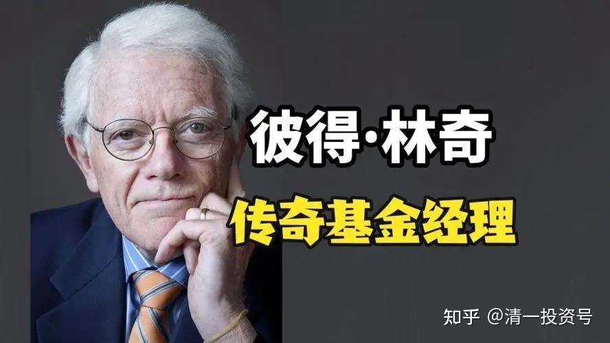

3篇.基金系列之三：彼得.林奇谈沃顿商学院的教育价值

清一山长 2016年10月21日

我对欧美名牌商学院的不敬态度，以及我自己出来为儿子办一所“只有一个教师的商学院”，惹得一批卫道士对我冠以“狂妄自大”的称号。视我为疯子、狂人一个。

不过，瞧不起欧美顶级学府的人其实很多的，而且都是些真正有本事的人。不止我一个人会说疯话。

大家知道：欧美号称最牛的商学院，并非哈佛商学院，而是沃顿商学院。巴菲特曾经是它的“前学生”，他很自豪的事情是只读了两年就跑掉了，没有被终身绑定。因为“他不觉得在这里学到了什么东西”。这是个实在人，看不懂商学院的价值就跑掉了，一点也不肯浪费学费。当然，后来他还是去哥伦比亚大学学到了一些投资的东西，但不是大学的课程教了他，而是有“华尔街教父”的真正的投资人格雷厄姆当时在这里教书。他运气很好，能够跟一个真正懂投资的人学习，而不是跟一批只会纸上谈兵的“专家教授”学成傻瓜。巴菲特自己说：**“在大师门下学习几个小时的效果，远远胜过我自己过去10年里自以为是的天真思考”。**因此，他认为他受到的真正的投资教育，只来自于格雷厄姆和费雪两个投资大师，什么正规的商学院教育，专业的教授和专业教材、金融学课程等等，一向是巴菲特在“年会”上嘲笑的对象，认为他们的唯一价值就是作为反向指标。

作为退学生，也许您认为巴菲特也没有资格去评论沃顿商学院和美国的大学教育。但有一个很认真地读完了沃顿商学院的投资家，他的投资生涯的成绩比巴菲特还好，他管理期间的富达基金，年度符合增长率是29%，这一惊人的成绩和数据，您会认为他对沃顿商学院，以及西方商业和金融教育的评价，会有点参考价值吧？

这个人就是彼得·林奇。我从他这里，学到了很多有价值的投资思想。当然，也包括他对西方名牌大学的非常负面的评价。我认为这些评价是客观的、冷静的、真实的评价。虽然也是无情的评价。因此，实际上我认为超越西方商学院，并不需要什么特别的本事，只需要不去玩虚的、假的东西，踏实一点做投资就够了。

他说：“**在沃顿商学院所学的课程，本来应该能够帮助你投资成功，但是在我看来，却只能导致你投资失败**”。简单一点就是说：想学投资赚钱，去读美国的商学院正好走反了路。

彼得·林奇是靠他在市场赚到的钱来做学费去商学院读书的。他正好买到了一只十倍股。因此，他不是那种对投资毫无知识的白痴，进大学就只能被教授们洗脑。他的实战经验，成功地避免了他被商学院的无聊课程迷惑，而是充满疑问地对待他所学的东西。不然恐怕也无法取得良好的投资回报业绩了。“我在富达基金实习一段时间后，我回到沃顿商学院继续读研究生二年级，此时的我比原来更怀疑学术界的股票市场理论究竟有没有真正的价值”。

幸运的是，他总算找到了一点安慰：在他已经发现沃顿的所有课程都毫无价值的时候，有一件事的发生，让他认为他的沃顿生涯，总算有了一点点美好的回报：他觉得“这段求学经历还是很有价值的，因为我在这里遇到了卡洛琳（他的妻子）”。

一家著名学府的唯一价值，居然被认为与一家婚介所的价值相当，我相信这个是多么大的笑话。不过，这其实也是我认为的结论：**西方著名大学的真正价值，不是来自于它教学的内容，而是来自于它吸收了一批全世界最优秀的学生。与这些人做同学和伙伴，共同前进，这才是西方大学真正的价值所在。教授和课程什么的，都是摆设而已。**

当然，彼得·林奇还有更不客气的评价：美国的商学院的真实教育价值是负数。他描绘他一个投资非常成功的朋友彼得·德洛特的时候，使用的话语是：“他成功的秘密在于**他坚决不到商学院读书**。想象一下这样的话，他可以节省多少的时间和精力。**不然他毕业以后不得不想办法把他学习的那些有害无益的课程全部忘掉**”。

如果您觉得这些人跟我一样是疯子，您认为这些牛人对美国大学的认识和理解的深度，还不如您遇到的某个夸夸其谈的留学中介更懂得美国教育价值的话，我就对您超常的理性和判断力，就真的感到无语了。

是的，我看了美国商学院的金融学和投资学的教材后，我得到的结论是一样的：**如果你想要做一个真正的投资者，你去认真阅读了这些教材，上完商学院后，就注定了你不太可能会成为投资家了**。想要学真正的投资，你必须远离正统的商学院以及商学院的教材。事实上，20多年来，我一向对“证券界专业人士”给我的投资建议，抱有非常的怀疑和不信任的态度。我至今还没有发现一个“专业执牌人士”是我佩服的投资家，具有值得我学习的投资思想。正是因为我对于“专家”的不相信，才让我成为一个取得了丰厚投资回报的投资人。相信美国商学院正统投资理论的人，包括他们自己在内，很多人自己的账户都是很难看的，都不愿意拿出来给人看的。

当然，您还是会反驳我：如果真的商学院培养的学生都不会投资，为什么这么多学生还是要去商学院读书？而且有充分的数据和调查表明：这些人毕业后的收入，远远超过其他专业的毕业生。这些人在华尔街都是呼风唤雨的人物。

是的，我知道这些数据。所以，我认为西方商学院还是有价值的，他们的价值就是：不是培养这些学生自己赚钱的能力，而是**培养一批靠吃客户来赚钱的“聪明人”**。简单一点说，我认为这些**商学院毕业的专业人员，去华尔街工作的主要目的，不是用自己的投资本领来赚钱，而是用自己专业知识来忽悠傻傻的不懂投资的客户，把客户的钱套到自己的口袋里面**。几乎可以认为这些人就是骗子，只不过他们看起来很合法、很专业。**实际上他们的收入并不是来源于市场，而是客户。**因此，我认为，这些**大学商学院存在的真正价值，就是让一个人取得可以去金融市场上合法唬人的资格证和入门证**。它并不负责教会你投资，只负责用各种专业投资术语和各种模型理论，把客户的脑子弄乱，然后委托他们“替你赚钱”，实际上就是变换各种方法拿钱给他们赚。如果你不知道我在说什么，请搜索一个词汇“客户的游艇在哪里？”。

当然，您还是会说我很偏激。华尔街这么多精英，专业人员这么多学问，怎么可能会无能？一定是我吃不到葡萄就说葡萄酸，考不上西方大学就说西方大学不好。

我就再用彼得·林奇自己的原话来说吧：**“基金经理人中绝大多数属于以下类型：心智平平的基金经理人、愚笨迟钝的基金经理人、懒惰懈怠的基金经理人、溜须拍马的基金经理人、懦弱犹豫的基金经理人，以及各种各样盲目从众的随大流者。因循守旧的老顽固，死搬照抄毫无主见的模仿者等等。”**

当然，如果您还是怀疑的话，我们就拿事实来说明好了。用投资的结果来说话：这些专业人士的投资业绩如何呢？美国90%的基金跑不过指数。中国私募基金做了一个调查：只有8%的私募基金跑赢了指数。也就是说：这些专业人士的投资水平，恐怕还比不过大妈的投资业绩。不过，业绩不佳，并不妨碍这些资金管理人拿高额的管理费。只是分摊下来，您觉得似乎对于您个人的“影响不大”，但集中一起的收益，就已经足够他们发财了。

所以，您认为，我会傻到把我的资金委托给这些“专业管理人”去帮助我赚钱吗？还是帮助我赔钱？或者您会认为，我居然会愿意把孩子送去这些商学院，把孩子培养成其中的一员？这对下一代太不负责了吧！也许您认为中国的商学院就会好一些？好吧！也许您是对的。

既然我已经了解了西方商学院的真正价值，我当然犯不着让我的儿子先去被他们骗一顿，然后又去骗别人。我是学道家的，讲究实在一点。不玩这些骗人的玩意。

也正因为这样，我才会开办我的“清一商学院”。别看没名气，还很不起眼，今天会被你嘲笑。但可以确定未来教育的结果，肯定会比欧美中的商学院教出来的学生会投资。因为我请的“客座教授”，全都是投资高手们。而不是商学院只会纸上谈兵的，夸夸其谈古怪理论的“资深教授”。虽然我不能保证所有的学生都能够学会投资，但成功率显然要比普通商学院的毕业生高得多。唯一的遗憾就是：他们没有文凭。幸亏入市没有文凭要求，只要到了18岁都可以开户的。所以呢，**我们的学生就不能用文凭去忽悠人了，只能用真实的本事去说服人**。因此，学会真的投资本事，就是他们最重要的任务和目标。而不是去学忽悠人的专业名词。

参考链接：

[清一投资号：43篇.基金系列之一：从博弈学 看金融市场上专家比不过大猩猩的逻辑](https://zhuanlan.zhihu.com/p/535572286)（整理文）

[清一投资号：44篇.基金系列之二：博弈学：与傻子和疯子作战其实也不容易](https://zhuanlan.zhihu.com/p/535582518)（整理文）

