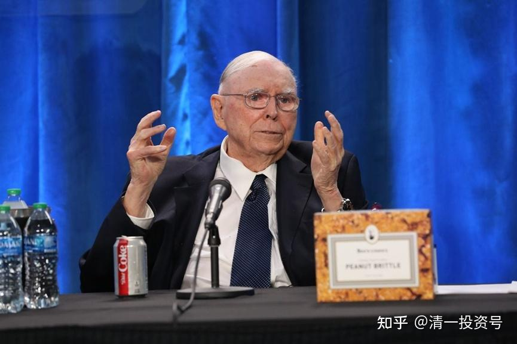
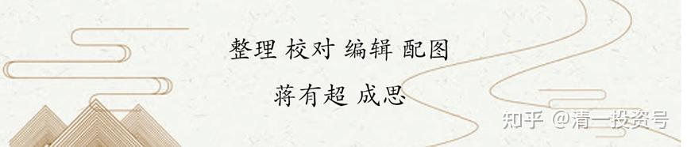

47篇.今日网校课程：查理•芒格的成功秘诀5——自尊

清一山长 2018年

**一、自尊尊人——关系之中配得上**

第12条，我做到了的第三个。表达了对查理·芒格的敬意，也是我的内心跟他的呼应。“**如何才能找到一个优秀的配偶？”查理·芒格说：“最好的方法就是让自己配得上他**，因为优秀的配偶都不是傻瓜。”

这代表什么？这代表的就是自尊、代表的就是你们说的经营者；管理自己叫自尊。同时，也代表《与神对话》中的那句话：“让自己进入关系的最好方式是让自己成为一个礼物。”我们用不同的话表达的是一样的意思。他用这句话看起来很普通，但是代表了一个强烈的自尊。

你们要成为山长的弟子，你要想的一件事情，就是你怎样才能配得上这种关系？你们怎么让别人看到你，就说：“哇塞，山长的弟子是这个样子的！我觉得好棒！”当你天天在想这件事情的时候，我不想让你成为都不好意思，对吗？但是如果你天天只想说：“我想沾个光，因为山长的弟子很受尊重。”那你就是中国人思维模式，这种思维模式很奇怪的，跟你打交道，他不会去想我怎样能够为你提供什么，怎样配得上你。比如，你可以寻求我的帮助，但是我要晓得——就是你怎样才配得上我的帮助？

比如说假定我是个堂主，我肯定会说2.0老师我很想要，1.0老师就不要了，我想要2.0老师。你可以这样想，但你首先要怎么想才是正确的？我怎样让2.0老师能够喜欢我、能够接受我？我怎样为他们提供一个礼物，对还是不对？当你天天在想这样的问题的时候，这就叫：栽了梧桐树，不愁今春凤凰不来栖。

但有的人，他不是这样想的。他想：你就应该帮助我。不对，而是你要提供什么样的条件才能够吸引他们，他们不是我的，是他们自己的。要到什么地方（他们自己决定）。

我居然是免费培养了你们,像**（学生1）、**（学生2），我从来没给你们提要求说：“你们出去，必须怎么怎么做……”这就叫自由，给你们尊重和自由。但是他们要找你们，他们就必须给你提供更好的东西，就像我要把你们留在身边。如果我想把你留在身边，我就要把这些学生变成你们更喜欢的样子，你们觉得离开了今日学堂，别的学堂没有你们更喜欢的这个样子，你们才会愿意留下来，对还是不对？现在在考虑你们嫁人，还有考虑到嫁人生仔，生仔怎么做？还要考虑你们养老怎么做？

那这一系列是为什么？就叫“筑巢引凤”？我要给你们创造，作为一个礼物，我有那么一个礼物，一个很好的礼物。你们作为最优秀的人，你说好吧，我很愿意留下来。如果留下来，你跟我说：因为你们是我的学生必须留下来。我觉得对不起你们，因为那也不是我的自尊，这就是查理·芒格的思维模式，不要仅仅想他如何配上他的配偶，而要去想他的这种思维模式——强烈的自尊，而且也正因为强烈的自尊，他一定会做得很漂亮，对还是不对？

他一定会让很多人很喜欢他，一定会让很多人很愿意留在他身边，对还是不对？因为**他永远在想，他怎样才对得起你**。包括我对刘老师就是这种态度，我觉得刘老师对我的用情很重。那么我对她就会有一种东西，我说我如果出轨不仅我理性上不认可、不愿意，同时从感情上也无法接受的原因就是一个道理——**我必须配得上她对我的尊重、爱护和关心。**

当你抱这种观点的时候，你在感情上，你在私生活上，以及你在行为上，你都会做得很好，不需要别人讲道理。所以**去偷偷做事的人，都是不自尊的人。**因为他们没有去考虑做好尊严。

你们也一样。我可以离开我的家庭，如果她不再在乎我，包括前面的关系。在跟她的关系当中，因为她觉得我不再有价值，没有价值的话，我觉得我就该离开了，或者我的价值是你不看重的，你觉得没有意义的，对不对？

你觉得我的生活方式没有价值，但是我不太可能为了你改变生活方式。因为我就是这样的人、我就是朴素的人、我就是不喜欢热闹的人、我就是不喜欢垃圾的人、我就是不喜欢消费的人。因为有了钱，你让我拼命去消费，我受不了。这个时候选择转身是一种尊重，对你是一种尊重，尊重你的思维方式，我不想改变你，我更不想折磨你。也是对自己的尊重，我也不想折磨我自己，但如果你珍惜我的东西，好吧！我愿意给你更好的东西，我愿意更加努力、更加坚定。所以我们可以想象，查理·芒格的感情生活一定很好。其实巴菲特的感情生活也很好，巴菲特跟他的上一任妻子苏珊，也是很协调的关系。

所以这些东西，你就观察出卓越人的特征：**自强、自尊、以及对自我的价值认定：就是配得上**。他总在想自己配得上，怎样才能配得上？但是为什么很多中国人从来不想自己配不配得上？他自己总想：我要、我要，而不是说我配、我配。结果他要的东西就是得不到，求之即不得。而认为我要让自己配得上的时候就最强。如果你鄙视了我，那我认为看来我还不够好，我可以让自己更完善，而不是你鄙视，我就趴在地上去。

所以我这种人就变成了精英，越打越强，百炼成钢。（成为）高级精英，是不是也是自强模式？所以这些东西——你来观察怎样找到一个配合的东西。我们关注了他的爱，反过头来也是对自己的爱。所以，我们关注的他的思维模式、他的价值观，这两个东西就可配在一起。

其实你会发现，我根本没去关注——他拥有什么样的知识？他读了什么样的书？以及他为什么会找到一些好的股票？我就关注他怎样想问题？怎样处理问题？他的价值观是什么？这就把价值观和思维联系在一起了了。

当我这样研究的时候，我就会得到他的“神”，而且**我经常跟他的“神”共振，并且欣赏这些东西。我就会跟他一样强，或者至少跟他很类似。**

你们写作业之类的，总在听我的知识点，包括找这篇文章，总在找一些比较精彩的知识点的时候，很抱歉，你没看到我出题的宗旨。我出题的宗旨是：**让你去找到跟自己灵魂最能够共振的地方**，最能让你叹息、感叹，这个人真了不起！因为他这样，因为那样。

我讲完这三点之后，你们有没有觉得这个人挺了不起的？可能比你自己阅读时候觉得他更高了。阅读者认为他是一个死板的人、呆板的人。现在你觉得这个人在人格上面，真的很完美，他真的是用中国的表达，应该称之为圣人，至少也是君子，堂堂正正的君子。你不得不油然而生出一种敬意，你不会去鄙视他。但是看了那个——我要钱，你有钱，所以你应该给我；你有能力，你应该帮我；你有本事，你就应该提携我。当你碰到这样的人的时候，你就会从骨子里面升起一种鄙视来，对吗？

**二、芒格想要什么——更完美的灵魂、思维与自己！**

你们都有资格得到世界上最好的东西，但不是因为你要，而是因为你愿意让自己成为世界上最好的东西。当你把自己成为世界上最好的东西、最珍惜的东西、最让别人无法拥有的东西之后，你要什么不可以呢？但是这个时候往往很奇特，你什么都不想要了。太奇怪，这个世界上见了吗？古怪。你们看完整篇文章，能不能告诉我，你发现芒格想要什么？说说看，你们研究出来他想要什么？

学生3：他没有要任何东西，就是要求自己做到最好。

山长：棒！他真的是富可敌国，一些国家他都可以全部买下来的，但居然他什么都不想要。他想要的就是：我有良好的身体、良好的视力，我要读书。但是这也不是他要的，他最想要的是：我有更完美的灵魂，我有更完美的思维，我有更完美的自己，对不对？所以他要的是一种精神品质更加的完善，或者说他要的是根除自己身上的毛病，我们看不到他对物质的迷恋。对还是不对？但是你看周围的那些大老板，包括**（学生2）你看到的那些大老板，你能不能感觉他们要什么？你可以感觉得到跟他们在一起谈论，他们感兴趣的东西。你们都可以看到他们要很多很多的物质，他们很少去关注“我的智慧，我的信念的提升、以及我的品质的卓越和我的自我控制”，对吗？昨天你看到那位老板。别人给他50万的筹码做诱惑，他就坐着飞机，跑去打球、跑去赌场玩。然后，进行消费，然后高高兴兴地回来了，肯定是他要的东西。对不对？你看得到他要的这些东西，而且很兴奋地参与这些东西。你认为这些东西，对我会不会有吸引力呢？

我会觉得这个时间我更愿意拿来干嘛？我拿来睡觉都更好，这是我的选择。我宁可把这些去消费、去赌场、去娱乐、去飞来飞去，把我累死的时间拿来好好睡几个觉要好一些，但更多的可能是，我可能会拿来让自己闲着，让自己看书，对还是不对？然后，我会想想，我有时间了之后干嘛？那就教教你们，做点好事帮着你们提升。然后，今天下午我看看，我还有精力、还有时间，然后就安排说至上组过去给他们训练一下，我宁可拿这个时间去训练你们，而不愿意把这些时间拿去打高尔夫或者说去赌场里面潇洒一下子，赚了钱分一半，亏了算别人的，不就50万嘛？

那么对于我来说，你们有没有觉得，我觉得教教你们比我赚钱更有价值？显然是！然后一些大老板说要请我去潇洒一下，或是什么东西之类的。我说：“好吧！但我更愿意跟我的学生在一起。”因为在我的心目当中，我觉得学生比大老板更重要吗？不是，是因为跟他们在一起没有做我想要的价值、没有提升理性、没有帮助别人得到更好的收益；并且他们只是消费了我，所以我非常拒绝去消费别人。有没有发觉这一点，就跟那个优秀的配偶，这一点很像的：你能够提供我想要的东西，作为一个女性来说，刘老师的优雅、理性、责任、付出、关爱等等，我觉得非常非常好，我觉得我也挺享受。但是我想的就是我怎样配得上她。你要招待我，我也想我怎样配得上你，而且一定物超所值。你请我吃顿饭，我免费给你10万、20万甚至100万的建议。

所以昨天讲了，他们几个老板说：“以后你过来一定要来看我们。”我说：“没事，我就不过来了，不耽误你们。”这是自尊。因为他们得到了很好的礼物，他们一下子觉得好多问题解决了，很开心。OK，我要达到的最终效果。如果去了之后，你们好好招待我一顿，让我享受一下，你们给我拍拍马屁、说说废话，我就走了。那我不能原谅我自己，那我宁肯不去。如果只能做这种，你只会跟我说废话，我就宁肯不去，除非什么时候偶尔忍不住去一下。

这就养成了一个至上人的工作习惯，你们自己慢慢去总结吧！你们在生活中，特别是将来长大之后，你们会碰到很多类似的选择。你的每一个时间都用来让自己至上，还是每一个时间都用来让自己浪费？你如果在想一件事情，是理性，但是好像是自尊，也是自强；我什么都没思考，这一天是不是也照样会过去？你今天什么都没做，这一天，是不是也照样会过去？你今天混日子，是不是这一天也照样会过去？你把时间花了，今天到处找好吃的、满城去逛——漫无目的的东逛逛、西逛逛，然后把自己逛得很疲倦，溜回家了。这一天是不是也照样没了？那么，你还是愿意把这个时间闲下来，在家里面看本书、跟好朋友多说几句？然后，讨论有价值的事情，或者做一点功德、做一点好事——周围看一下，谁需要我帮助，我去帮助他做一点什么事情。

当做前面那件事情的时候，我们的生命是浪费的；当做后面这件事情的时候，是我们在不断给自己的“宇宙账户”中增添我们的公德、增加我们的“宇宙币”，对不对？我们的智慧以及我们对别人的帮助，两个东西就形成了我们后面的人生当中的辉煌和不辉煌。但辉煌不辉煌不是我们追求的，**我们追求的是：我对得起我的今天**。**（学生4），你说要至上，你不应该学至上，你要学后面这些东西就对了。

**参考链接：**

[39篇.今日网校课程：查理•芒格的成功秘诀1——逆向思维](https://zhuanlan.zhihu.com/p/641398367)

[41篇.今日网校课程：查理·芒格的成功秘诀2——清一派成功学思维模式](https://zhuanlan.zhihu.com/p/642327054)

[43篇.今日网校课程：查理·芒格的成功秘诀3——理性（1）](https://zhuanlan.zhihu.com/p/642327095)

[45篇.今日网校课程：查理•芒格的成功秘诀4——理性（2）](https://zhuanlan.zhihu.com/p/643847923)

