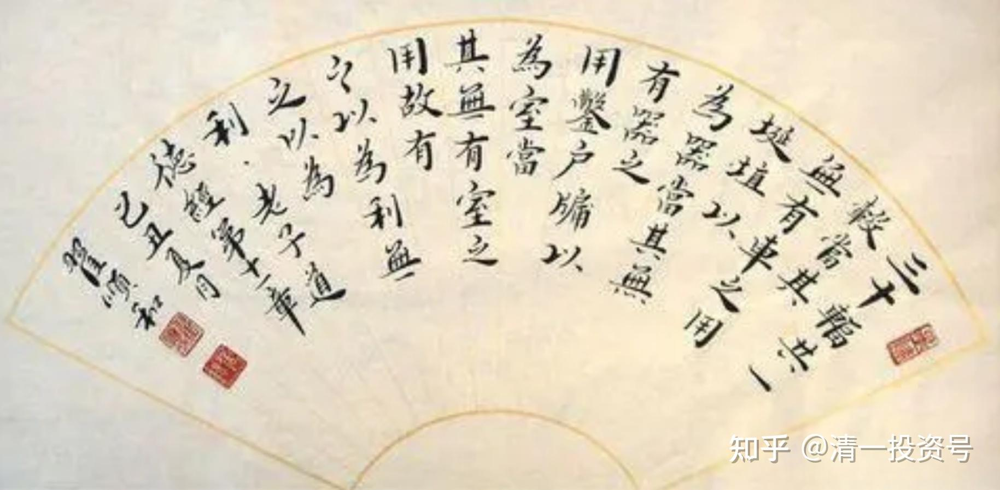

48篇.老子股经（五）——无之以为用

清一山长 2007年6月10日

王弼版原文：三十辐共一毂，当其无，有车之用。埏埴以为器，当其无，有器之用。凿户牖以为室，当其无，有室之用。故有之以为利，无之以为用。

帛书版原文：卅辐同一毂，当其无，有车之用也。埏埴为器，当其无，有埴器之用也。凿户牖，当其无，有室之用也。故有之以为利，无之以为用。

这一章其实不需要怎么讲，因为这章太简单了。他就是举了几个例子，然后告诉大家“有”和“无”是怎么回事，**不要太过于注重“有”，而不注重“无”**。如果这个房间都是“有”，都是满满的，大家就坐不进来了，所以一定要有空的东西——“凿户牖以为室，当其无，有室之用”。

讲了那么长时间，大家其实已经了解了，这种思想就是老子一贯的作风——他经常看到别人看不见的地方，我们经常忽略我们思维当中的一个境界，就是空的境界、虚的境界。空是佛家的概念，佛家讲空；道家讲虚、讲静。这里讲“无”，他特别提醒你“无”很重要，因为我们眼睛里面只看到“有”。

**一、“无”在投资中的运用**

就像炒股票的时候，不懂的人只看到“有”。“有”是什么意思？有钱就要往里面去买，他觉得不买就是浪费。这方面巴菲特就很伟大，巴菲特曾经有几十个亿还是几百个亿的资金，有几年的时间你知道他天天在干吗？这些钱在账上，他不动，不买，这就是“无”。但是他也不存银行，也不乱去干别的事情，就天天闲在那。下面的人就着急呀！钱闲在那干吗？他说，我在等时机呀！他等到了时机可能就赚了大钱。这就是典型的“无之以为用”，但一般人做不到。

就像我在证券所大户室看到的，他们好像随时都是满仓的，好像觉得资金不放在里面用就可惜了。其实哪里需要这样的，**你该买的时候买，该卖的时候卖，就行了嘛！然后你随时要准备“持而盈之，不如其已”，就是“持而盈”了之后就该空出来呀**！这种思想很多人也没有。

巴菲特最厉害的一次就是他买铜，把“无”字做到了最高的境界。他一直观察铜价的起伏，观察了十几、二十年之后，有一天他突然买铜了，他从一无所有的铜，一下子变成世界上铜的最大的拥有人，只用了一两天功夫。而且后来铜价果然如他所言，迅速上升，然后赚了一大笔钱。这就是很奇特的一点，他研究了十几年就是不动手。别人觉得我研究了就要动啊！我学到了本事马上就拿去炫一下，今天学了一加一，明天就告诉你、也告诉他：“我也会算数了！”

好了，这就是这一章的核心思想“有”和“无”，**不要把“拼命地做”当成是“做”**，也**不要把看得见的东西当成实的东西**。**有时候你不做是最佳的做，不去为是最佳的为**。

**二、“无”让生活更幸福**

中国最缺老子思想的道理，如果中国人真懂得老子思想的话，全体民众就会突然发现自己很幸福。你们认为呢？老子就是希望你得到这种幸福。

其实，现在我们中国人已经很富足了。原来很穷，但我觉得自己小时候穷的时候，挺快乐的，还很充实。现在已经很富足了，有了很多东西，但我们中国人全体都有一种共同的表情，你们知道是什么表情？严肃和焦虑。你们看大多数中国人是不是就是这个表情？所以外国人对中国人有一个评价：中国人就是不会笑，中国人没有笑神经。是不是这样的？

**中国人焦虑得要死，就是因为有一个“有”字，填满了心胸，填得很满，什么都是“有”，什么都是“要”，什么都是“有为”。我要车，我要房……已经有这些的时候，我要更好的车、更大的房……然后完全不考虑它实不实用，完全不考虑它有没有价值**。就像住别墅，现在我们的老师住别墅，住了之后他们觉得别墅不咋地，不是太喜欢住。小燕，现在让你买，还买不买别墅啊？使劲摇头，是吧？

很多人问我，张健柏你为什么不买别墅？我这个人还有一个好处，我这个人是思维派的，我没做过就知道怎么回事，所以我从来不买别墅。我说，别墅不就是一个小房子嘛！盖的地方湿气又重，空气流通也不够好，还不安全，很容易被盗贼袭击。我说这种房子在中国这样的地方不适合，在武汉这个地方也不适合。但在北美那个地方还可以，北美的气候总体来说比较干燥。你看湖北多湿啊！尤其是在湖边盖个别墅，那不是自讨苦吃吗？就算你在二楼又怎么样？二楼还是不够好。所以，我在武汉买来自己住的房子都是六层以上。而且我喜欢买套房，我觉得住在套房里面宽敞明亮，像这个房子的结构，就比我们的别墅好。我喜欢选这样的东西，但是当初我买这套的价格是一套别墅的价钱噢！当然是郊区的别墅，现在那个价格高。但就算是一样的价格，我也愿意买这样的房子，不买那样的别墅。

但是中国人呢？好多人不是。武汉大学很多老师就在汤逊湖那边买了别墅，但从来不去住，然后让它在那长草（众笑）。还有一些人更笨，花几十万装修好了，住了一两个月，不行，搬回来了。所以现在周边这些别墅都是拿来干吗的？（学生：长草）对，是拿来长草的。这些人买了别墅，你知道给谁住了？给猫住了。我有时候逛一些空别墅，看到猫在里面生小猫。绝大多数的别墅是空的，而且现在去的人也觉得住得不太舒服。这就是老子这句话“圣人为腹不为目”啊！那些就是给人看的，告诉别人我在那边买了一套别墅啊！很神气的。但没用啊！

**这就是一个价值，你心目当中有一个概念，然后你就累死了**。像武大很多买别墅的人，经济条件比我差很多的，不是差一点。他就是拿工资的，只不过经常拉点项目赚点钱，平常省吃俭用，然后买了套别墅，划得来吗？买个东西放在那晾着，当然有可能将来他们聪明一点，有一天再把它卖给下一个不知情的人。不过你们听到我的讲座，大概你们就不买了，让别的人去买吧！

**参考链接：**

[38篇.持而盈之，不如其已；揣而锐之，不可长保（上）](https://zhuanlan.zhihu.com/p/641031041)

[40篇.持而盈之，不如其已；揣而锐之，不可长保（下）](https://zhuanlan.zhihu.com/p/642329173)

[42篇.老子股经（二）——强分违背天性](https://zhuanlan.zhihu.com/p/643941532)

[44篇.老子股经（三）——善于管理、治理](https://zhuanlan.zhihu.com/p/644751640)

[46篇.老子股经（四）——“无为”的智慧](https://zhuanlan.zhihu.com/p/646940810)

