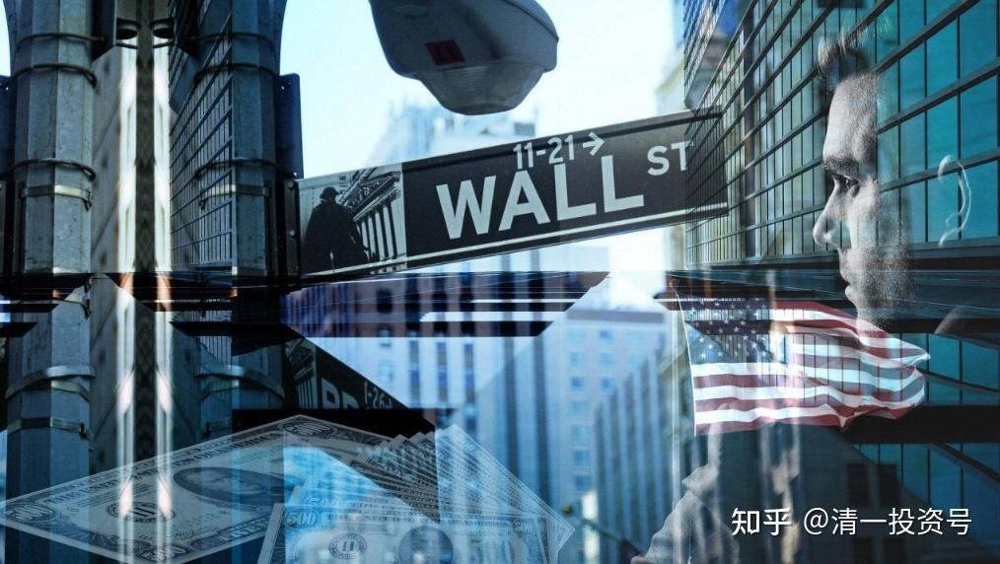

50篇.今日网校课程：华尔街金融专员赚钱之道——朴海娜课题课前作业

清一山长 2016年9月6日

资料参考链接：

**[绝了，她在盈透证券开了一个外汇账户，骗了1.56亿！_朴海娜](http://link.zhihu.com/?target=https%3A//www.sohu.com/a/288032293_189372)**

作业一：这个人在华尔街做了十年的金融行业专业人员，她到底是靠什么本事来拿工资的？

作业二：她在社交网络上的表现，说明她的心理和个性以及行为特点。

作业三：最近六年，她离开华尔街之后，估计是什么样的心理和念头，使得她走上了诈骗的道路？她到底做了什么本质上与前面的十年不同的事情？导致了她最终彻底的改写人生？

作业四：哈佛大学毕业的大多数学生，都会进入咨询行业和华尔街就职。但名校的专业人员如此下场，说明了什么实质问题？

作业五:如果你是朴海娜，你将如何做事情，才能避免这样身败名裂的局面？你将如何运用你名校毕业的身份，为自己找到一个体面的工作？

作业六：你怎样才能成为一个专业的投资人员？（商学院学生做）

你怎样才能找到真正的专业人员帮你理财，而不是骗子？

**商学院学生专题作业：**

一：文件中，朴海娜杜撰了她的疯狂战绩，从2009年11月的100万本金，经过64个月的高超投资增至4778229元，累计收益率达393.2%，64个月里只有4个月亏损。而同期，著名的罗塞塔基金也只有55%的收益率。

请查看同期的美股指数上升幅度，判断朴海娜虚假的盈利战绩和真实的业绩差距，表明了什么特征？同时，罗塞塔基金相比美股指数，有何差异？

二：我本人2012年到今年，真实投资账户的资产增值10倍左右。从2014年年中到现在，两年账户增值6倍。这说明中美投资环境有什么样的差异？这种差异将导致什么样的不同结果？你如何才能利用这种差异特征来获得更大的投资收益？

三：你预期未来的中国和美国金融行业将有何未来的趋势和走向？从业人员将有何分化？中国的银行业对此分化会有何不同的走向模式？

**参考链接：**

[39篇.今日网校课程：查理•芒格的成功秘诀1——逆向思维](https://zhuanlan.zhihu.com/p/641398367)

[41篇.今日网校课程：查理·芒格的成功秘诀2——清一派成功学思维模式](https://zhuanlan.zhihu.com/p/642327054)

[43篇.今日网校课程：查理·芒格的成功秘诀3——理性（1）](https://zhuanlan.zhihu.com/p/642327095)

[45篇.今日网校课程：查理•芒格的成功秘诀4——理性（2）](https://zhuanlan.zhihu.com/p/643847923)

[47篇.今日网校课程：查理•芒格的成功秘诀5——自尊](https://zhuanlan.zhihu.com/p/643859353)

