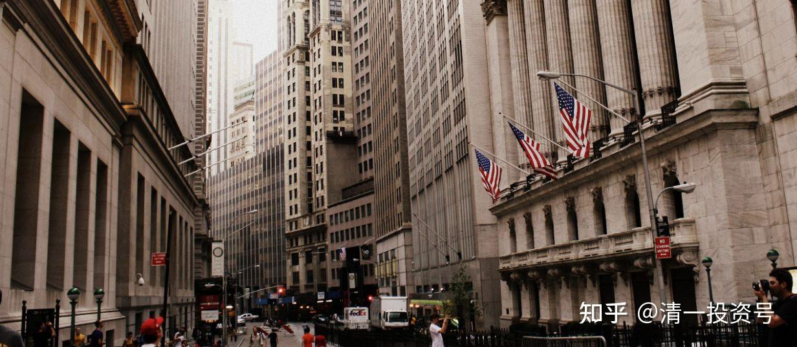

52篇.今日网校课程 华尔街金融专员赚钱之道：（2）西方金融业的游戏规则及应对之策

清一山长 2016年9月6日

西方银行是这样服务的，我体验了西方银行我才知道它的厉害。包括其它银行也一样，汇丰银行、香港那些银行，它服务收取的费用远远高过大陆的费用，而且账户都是有账户管理费的。香港汇丰银行收的账户管理费比较便宜，每个月才380块钱。

山长：张钟瑞感觉如何？

张钟瑞：好多啊！

山长：瑞士银行比它贵10倍。

学生1：每个月3800？

山长：差不多吧！准确数字我不知道，反正它是按美金算的，反正贵5～10倍是很正常的。

汇丰银行一个普通银行收的是每个月380块钱，你要不要开个汇丰银行去？嗯，你开的那个招商银行还不错，每个月只有8块钱，对吧？所以下次大家要开，开个便宜的。现在知道为什么你们可以在国内敢开一大堆银行卡了吧？在香港你们去开一大堆银行卡试试！开得越多越倒霉。所以香港人都不多开卡的，多开卡多倒霉，而且服务也不见得好。其实我觉得汇丰银行的服务，包括网上银行的界面之类的，都不如招商银行，显得很死板。但是他们的钱就是这样赚的，所以国外的银行家特别富有，好像特别牛。为什么？“吸血鬼”！

我们再想想另外一种“**吸血鬼”——大金融行业**。你们要是进入这个行业，你们就能天然地得到这种权利了。因为你客户不得不通过银行去进行各种各样的转账、付各种各样的费用。它为你每做一件事情的服务，一大堆金额就没了。

**大金融还包括证券、期货、投资、资金管理人员、专业人员，这批人的钱也是一帮傻瓜给他们使劲出的，那么哈佛大学毕业的人当中，大致上有60%～70%的人都是到华尔街和商业咨询公司从事咨询工作。**所以一些教师很忧心忡忡地说，哈佛毕业生现在变得越来越俗气了。我们培养的就是不俗气的人，但我也不排除，我们学校百年之后会不会俗气到培养出来的学生全去为别人捞钱去了。

他们说**哈佛学生就盯着了钱，像朴海娜这种人就是他们典型的生活模式。但是这种典型的生活模式，有些人就做得特别的成功——忽悠人忽悠得特别成功。**她呢？她大概忽悠得不太成功，但是她在华尔街也混了10年，而且她有自己的个人账户，这个例子很有意思哦！

因为华尔街大多数工作人员，他自己私人的钱是不拿来投资的，他拿来消费、买房子干啥的，他不拿来投资的。为什么不拿来投资，因为在这个行业当中他算过账了，以他们这些人的投资水平基本上只是帮人亏钱。只不过客户的钱亏了，他也赚，赔了他也赚。特别是在市场好的时候，很多客户资金会涌过来，市场差的时候，客户资金会撤离。他的日子会难过一些，但是他总有下一次收割的时间，他只要在里面熬得足够久，他就有足够的钱赚。而且，他总有理由告诉客户。

比如，大家知道我买了一个股票叫做中国宏桥，我买它的时候，它的价格才3块多钱，当时因为欧美投行、摩根大通等各个大投行都在那里说，铝业全球形式不好，如何如何。这家公司价格下跌、这家公司面临严重的竞争，未来不看好，所以预期价格3块，甚至两块多。然后它的价格就从8块多狂跌，跌到3块多钱。

但是我研究了一下，**这家公司是行业第一名，而且它是成本最低的公司。也就是说全世界只有一家铝业公司能够剩下来的话，一定是它，不是别的公司。而全世界是不是不需要铝业公司呢？答案就是，绝无可能。我们世界上一定需要铝业的，对吧？而且铝业的竞争还没有钢铁行业的强烈，所以投资铝业其实是很好的一个标的，而且关键在于那时候竞争激烈，现在价格是在下降。但是价格总有回升的时候，因此我选我就选择了这家公司。**而且我投入了重资——非常大的一笔资产，买了好几百万股。这笔资产投进去之后，我就守着它，不管它了。结果现在的价格是7块钱差两分。

同样一家在半年前说中国铝业只值3块钱的公司，在它涨到6块钱的时候，这家公司发了报告说它值7块钱，现在马上又说这家公司值8块钱、值10块钱。同一个股票、同样一家公司，半年它就有那么大的差距。半年这家公司有发生什么变化没有？并没有实质性的变化，它还是一家公司。半年前的今日学堂跟半年后的今日学堂，它还是一家优秀的学堂。对还是不对？半年前的这家公司，跟现在的这家公司，同样是行业第一名的铝业公司，为什么半年前它只值3块钱，半年后它就值8块钱呢？那它值8块钱，甚至值12块钱的时候，你会去买它吗？

这里再告诉大家一个例子，这个例子就是中国恒大。中国恒大在半年前，这些公司说它只值两块钱，因为它负债率高。但中国的公司负债率高都很正常，它赚钱也很厉害，所以说它值两块钱的时候，我就在3块钱买了它，结果后来它涨到6、7块，7、8块的时候，这些证券公司出券商报告说它值12块钱。那么这意味着什么？

**这就是华尔街的专业人员，就是这些大公司的，从大学校、名牌学校毕业的人，他的嘴巴两个月前跟两个之后都不一样。他像个疯子，但是他每次都神气十足，每次他都假装自己很了解，而且他要收取非常昂贵的服务费。**这些公司经常问我要不要一种服务，就是专业人员提供研究报告给我，我拒绝了，我不要，甚至免费的我也不要。免费的还费我的脑子来读它。

现在就告诉大家一家香港的公司，它给我提供的咨询服务。在两个月前，我的香港证券公司的客户经理打电话给我，告诉我说他看了我的持仓，房地产股占了相当大的重头——比例非常大，他觉得这样的持仓比较危险，因为房地产业正在走向低谷，所以建议我是不是把这些仓位换一点他们推荐的什么什么股票。我说我不太喜欢换股票，所以就算了。没要他的证据，当然也不知道他想要什么。

最近一个多月不到两个月的时间，房地产的股票涨得很厉害，我买的所有的房地产的股票都涨了30%、涨了50%甚至更高。如果我听了他的话，我变成什么了？听了他的话我要去买一大堆他给我推荐的乱七八糟的垃圾股，我看他原来推的几只股到现在跌了50%以上。但是我买的股都往上涨，而且涨得不错。

但他是正儿八经的专业人士，他还给你做咨询！当时我在想，什么小屁孩，你的钱还不如我的钱多，你还给我提建议。我要听你的建议，就相当于武林高手听小屁孩说该怎么练武，那我不是神经病嘛！对还是不对？我根本就不理他。

但是他们拿着高额的咨询服务费来为你提供服务，其实他是为他自己提供服务。当对我这样做的时候，他们至少可以赚一笔交易费，对不对？

第二，很可能这帮家伙在害我，让我替一些他的关联公司、他们做的这些东西买单，他是把我当傻瓜耍的。所以别看这些咨询人员对你很客气，“你是我们尊贵的客户、你是我们的大客户，我推荐这个产品是因为我们公司觉得这个产品很有潜力……”赚了钱，他说你看是我推荐成功的，我很了不起。但是赔了钱，他完成了他的推销任务——把这家企业推销出去了。所以你现在知道这个世界的运行规则了。

你们商学院的一定记住——**没头脑的人只会听所谓的专家的建议，但专家不是来帮你的，专家是来吃你的。只不过有时候专家让你吃点甜头，但从长远来看、从概率来看，你都是他的一盘菜，你都是会被他吃死的人。**

华尔街的工作人员并不是创造了什么价值，他们的智力不值钱，他们的服务也不值钱，在我看来他们不但不值钱，而且全是负值。但是他们利用他们的这种身份、地位，利用了全世界其他人的无知。

因为对金融了解的人非常稀少，对还是不对？大多数人都不了解金融是怎么回事，像我这种一看就能看出漏洞的人很少。我找的东西都是大公司说它不行的时候，我居然去买它。别人都说我像傻瓜，但我像傻瓜我赚到了很多钱，这就是不一样的地方。

所以，**这个世界的游戏规则非常明确，就是骗子和傻瓜的游戏。大量的骗子，在愚弄更多的傻瓜。你们可以去做骗子，也可以去做傻瓜。**

山长：**（学生2）你是去做骗子还是去做傻瓜？

学生2：都不想。

张老师：**都不想那就更了不起了，都不想那就只能做圣人了。你参与游戏，你要不就是傻瓜，要不就是骗子，对不对？**

**当然，我们也可以像巴菲特这样，巴菲特其实算是个圣人了，圣人是什么？超越凡人的就叫圣人。对不对？他赚钱来，他没有骗你。他一直说的都是实话，但华尔街基本上都是在骗你，所以你要去参加华尔街、你要去做这些金融家，你就是骗子。但是这些骗子说的话都特别的好听，我说的话就不好听。所以，那么多年很少有人会愿意按照我说的方法去做。**

你们想想看，我的账户20多年来一直是盈利的，你们有没有想过一种可能性，我的证券公司的经理和券商的工作人员能不能看到我的账户？他们是看得到的，他们知道我持仓，甚至他们知道我什么时候买进、知道我的成本价。他们现在对我都有足够的尊重，因为看到了我的结果。但是我买的股票，在他们看来，他们都大摇其头，每次看到我买的股票都会觉得，这个人怎么买这种神经病股票。

**我都是买市场上最没人理的、最差的，他们最看不中的股票。他们全在追逐热点，但这些券商有些我已经认识一二十年了，有些工作人员，原来是一个普通的业务员，现在他们已经升成副总经理了。他们职位增加了、工资增加了，但是他们赚钱增加了没有呢？他们看到我的账户从几十万现在变成了几千万，但是他们却没有赚到这笔钱。**

**他为什么赚不到这笔钱？因为他们骗人骗习惯了，看我总觉得我是傻瓜，但是我的结果又不是傻瓜。所以他们说我是他们券商公司的奇迹。**

我去的时候他们老总都很好奇，他们老总不认识我。为什么？因为他们老总是新来的，但是副总经理反而认识我，副总经理是我原来认识的业务员，老总是外面调来的。他们总觉得他们有个超级大客户，但是大客户买的股票，在他们看来买的都是神经病的股票、都是没人要的股票，但是最后他都赚钱了。而且很少赔钱——几乎不赔钱。所以说我是他们的奇迹。奇迹就是：我跟他们的脑子完全是相反的。所以张钟瑞你们在我这边学到的最大的价值就是学会“脑子相反”。

现在知道为什么**哈佛商学院、哈佛经济学院培养出来的人赚不到钱**了吧？他们的**目的根本不是为客户赚钱，他们的目的是怎样忽悠客户。**所以他们会把简单的事情弄得特别复杂，你们去看一下他们的教材就知道了，你们可以上一上他们的课程，他们的课程有金融学、经济学，那些哈佛、耶鲁的公开课你们去上一上。包括我不是有本书——**《投资学》，《投资学》按道理就是教你投资嘛！**

**我告诉你，看了那本书，你绝对不会投资了，你变傻了。**所以，他就是用这种很复杂的东西让你看，你看这太复杂了，连我们的学生看了都很费劲，你看你肯定看不懂，所以你会相信他。

而且它上面有各种各样的公式、各种各样的数据、各种各样的模型，把你搅晕掉。搅晕掉的时候，你觉得自己很无知，你就把钱拿给他了。嘿，他就成功了，他就干这件事情。

**未来最厉害的人员就是金融人员，中国正在走这条路。所以你们必须学会有金融力，我们学堂也必须有人来管金融。然后我们去做一家类似巴菲特（伯克希尔-哈撒韦）这样的公司——私募基金，然后我们去帮助我们的客户赚钱，同时也为我们赚钱。**

**与其让骗子去大行其道赚钱，去全世界抢钱，不如我们学了各种各样的技术和本事自己去真正“抢钱”。但是我们不准备去做那些很庸俗的事情，更不准备把我们的资金拿给什么笨人管理。**

现在知道我们为什么要成立商学院了吧？因为我们找不到真正的投资管理人。他们说他们帮你管理，其实他们可能经常在害你。如果把资金交给他们，可能就变成跟北京那个富翁一样的人：我在瑞士银行存钱，居然存成负数了。银行还要找他投诉，他不还钱的话还要告他信用有问题。所以现在我更不敢把钱打到这些银行去了。

我说算了，你给我开了，我就把它作废吧！我不要了。我已经告诉他了，我说这个账户我不准备去用了。但是这客户经理很执着的，还是给我继续寄东西，好像你是我们很尊贵的客户的样子。天呐！我知道你的目的。他现在对我不入金感到有多恼火，我入了金之后，他就会多整我。所以这些银行实在不能进。

好，第一个表明了什么特征？张钟瑞说的这个特征，我把它深入了，一个更高的特征：就是告诉你**西方金融世界的运作准则，如果你们不懂，这些陷阱永远是在坑你的。**

作为我们商学院的学生，将来你们作为老师，你们最大的好处，商学院将负责为你们理财、为你们提供理财信息，告诉你们一些资讯。

张钟瑞现在就告诉你们资讯，建议你们购买保险股票，如果你们现在有钱。这是我现在的决策，中国太平和中国人保（PICC）这两家公司都可以。

第二条，我本人的正式账户增值了10倍左右，2014年两年增值了6倍。

**参考链接：**

[39篇.今日网校课程：查理•芒格的成功秘诀1——逆向思维](https://zhuanlan.zhihu.com/p/641398367)

[41篇.今日网校课程：查理·芒格的成功秘诀2——清一派成功学思维模式](https://zhuanlan.zhihu.com/p/642327054)

[43篇.今日网校课程：查理·芒格的成功秘诀3——理性（1）](https://zhuanlan.zhihu.com/p/642327095)

[45篇.今日网校课程：查理•芒格的成功秘诀4——理性（2）](https://zhuanlan.zhihu.com/p/643847923)

[47篇.今日网校课程：查理•芒格的成功秘诀5——自尊](https://zhuanlan.zhihu.com/p/643859353)

[50篇.今日网校课程：华尔街金融专员赚钱之道——朴海娜课题课前作业](https://zhuanlan.zhihu.com/p/650492818)

[51.今日网校课程：华尔街金融专员赚钱之道（1）西方金融业的本质](https://zhuanlan.zhihu.com/p/651194732)

