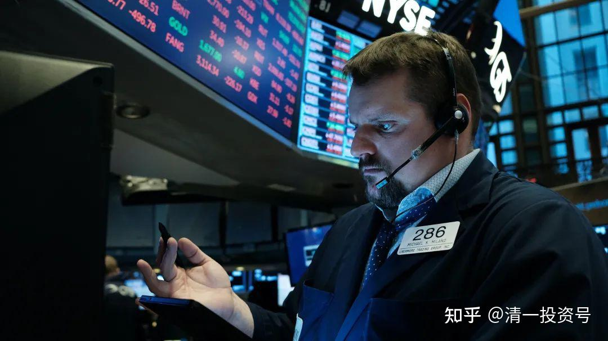

57篇.今日网校课程：华尔街金融专员赚钱之道（7）如何做投资，才能避免这样身败名裂的局面？

清一山长 2016年9月6日

**第五题：如果你是朴海娜，你将如何做事情，才能避免这样身败名裂的局面？你将如何运用你名校毕业的身份，为自己找到一个体面的工作？**

第一种，就是去做一个聪明的骗子，不要做一个笨蛋骗子，对不对？跻身华尔街里面，把形象搞好，然后把客户关系做好，严守规则，不要超越自己的规则，在框架之内做事，做个谨小慎微的身份，同时跟企业一起发展、跟公司一起发展，公司骗钱，你跟着它一起骗钱，但是不要自己去骗。是不是可以体面地过完一生？我见过的那个瑞士银行的推广人员就是这样的人，他就是这样很体面地过了一生，他按照规则做，反正他就忽悠更多的傻瓜，忽悠到一个就算一个。现在我才知道为什么他们那么傻。他们告诉我：“瑞士银行的人，你在昆明，只要你告诉他，你在昆明，你想开户，他们会飞过来见你面的。”我说：“哇，服务真周到啊！”你知道了他的收费，才知道他服务为什么周到。他的机票钱还是你出的，对不对？但是他这样做，他就避免了身败名裂，还可以体面地过一生，对不对？

山长：**（学生1），你这样做，好不好？

学生1：不好。

山长：为什么？

学生1：不道德。

山长：道德上没问题，只要按规则做事，公平、正义，很公平。就像我说的——公平地诈骗、公平地骗人。金融业就是在骗人，金融业就是骗子和傻瓜打交道。

山长：**（学生2），你去做吧？

学生2：不去

山长：理由呢？

学生2：当个骗子估计也要学习专业知识，不想去。也是一样的感觉——对不起良心。

山长：其实他们也赚不到大钱，他能够赚到一个白领的工资。当然了特别成功的人可以赚到大钱——如果忽悠到更多的大客户，他们根据大客户的资金来做。如果他运气很好，把几个亿万富翁给弄过去了，那他比你开一个企业还赚钱。这就叫体面。

但还有一种真正的体面、真正有自尊的生活，就是你们说的，像你们两个回答得不错，真正的自尊就是——我没有为社会创造效益、甚至没有为客户创造效益，我干嘛要去骗别人？就像我们学堂，我们明明教的是很有价值的东西，你们知道有些人愿意付钱来学。这一届申请商学院的有好几个人，我们直接把他们拒绝了。因为我们觉得他们不合适，包括你们前段时间看到的英国来的那个小伙子，我觉得他可能学不到我们的东西，我们就不给他了。

这叫强烈的自尊：我们能够为你创造价值，我们才接受你、我们才为你提供服务。如果不能创造价值，我们收你的学费，我们觉得不应该，所以我们才会把人退回去。但是我们把人退回去，那些家长又在那嚷嚷。他的孩子又不学我们的东西，家长却觉得我们太狠心，那就是神经病了，不自尊。他们不珍惜自己的钱，但是我们会珍惜客户的钱，这叫对客户负责。

正因为我们对客户负责，所以我们一定会教你真东西、真本事。如果你不好好学，就要打你的屁股、甚至把你赶走开除掉，这也是一种自尊。自尊有时候会以很残酷的方式展现出来。

那么，她作为一个哈佛的毕业生，她要做一种能够为别人创造效益的工作，其实很简单。她毕竟聪明、有学问、有学识，她去教教书，做做踏实的事情，做做真正的服务——能够创造的服务，甚至她做一些有价值的服务工作，她都可以过体面的生活，对还是不对？所以她的价值观要改变。她现在的价值观就是：她想骗人，以为别人是傻瓜。结果我们现在看她，这个局面她才是最大的傻瓜。她若老老实实地跟着机构一起走，做一个老实人，然后就算傻一些，别人拿她也没脾气，对不对？

但是她想做个聪明人、想自己去扮演一家华尔街公司——做一家独立公司。这种人什么人能做？巴菲特能做、索罗斯能做，她不能做。索罗斯为什么那么有名气，他经营公司，他不合格的，他脾气太倔了，他不是一个老老实实、一板一眼的人，结果那些投资公司都不肯要他。后来他干脆自己做，他找了一个合伙人，那个合伙人也很有名——吉姆·罗杰斯，两个人合伙开了一家公司。当他们真正地赚到了钱，他才赢得了真正的名声，也赢得了更多的客户，赢得了巨大的财富。

她呢？她又没本事，她要不就真正有本事去赚钱，要不然就跟别的小公司、大公司一起忽悠人，这些公司反正就是忽悠人的。但是她这两件事情都没做，她没有真正的本事，还假装自己有真正的本事，她是不是在骗自己？可是她骗自己的方式是骗客人，最终她变成了傻瓜。现在的牢狱之灾，让她一辈子垮了，一辈子都起不来了，对不对？还影响自己的后代，她非常不明理。

什么叫影响她自己的后代？你们知道哈佛的毕业生之间，他们互相都有照顾的，但是你不能出现丑闻，如果你出现了丑闻，你的孩子再申请哈佛，或者在哈佛学生当中——这些叔叔阿姨当中，寻找一点机会，完全没可能的。别人会说，啊，你是那个朴海娜的孩子呀！你的名声彻底垮了，你孩子的未来也毁了。所以你去做一个老老实实的人，就算你去非洲做打工的，比如像奥巴马的妈妈一样，可能一辈子平凡，但是她自己还是受人尊重的。她的同事，当年认识她的人都尊重她，对不对？她有没有障碍孩子的路呀？大家想象一下，如果奥巴马的妈妈是一个骗子，那可能他的路就只有死路了，对还是不对？

这就是要你们做人要积德，做父母要积德，将来你们都是要做父母的人，你们要注意积这个德，积这个德不一定要你做得多么成功，不一定要你考上哈佛。如果上了哈佛，你一定要珍惜这个平台。她这样的行为是给哈佛的脸上抹黑，对不对？做骗子都不好好做，起码做一个正当的骗子、合法的骗子，让别人没脾气。她做了这样一个低劣的骗子，就像别人形容她的，小学数学都可以学到的东西，不需要上哈佛才可以学到的东西，把它拿来骗人——低劣的骗子。所以，玩骗术要骗得高明一些，比如说瑞士银行的骗术是不是很高明？当然我这样说，这些人肯定要骂我，但是的确很高明。所以，你要骗就要骗得高级一些，你骗得这么低级，真是丢死人了。她太丢人了，最后她就失去了平台对她的支持，也失去了校友对她的信任。

文章音频

[380篇.今日网校课程：华尔街金融专员赚钱之道（7）_清一投资号文章同步音频_免费在线阅读收听下载 - 喜马拉雅](http://link.zhihu.com/?target=https%3A//www.ximalaya.com/sound/671138806)

**参考链接：**

[39篇.今日网校课程：查理•芒格的成功秘诀1——逆向思维](https://zhuanlan.zhihu.com/p/641398367)

[41篇.今日网校课程：查理·芒格的成功秘诀2——清一派成功学思维模式](https://zhuanlan.zhihu.com/p/642327054)

[43篇.今日网校课程：查理·芒格的成功秘诀3——理性（1）](https://zhuanlan.zhihu.com/p/642327095)

[45篇.今日网校课程：查理•芒格的成功秘诀4——理性（2）](https://zhuanlan.zhihu.com/p/643847923)

[47篇.今日网校课程：查理•芒格的成功秘诀5——自尊](https://zhuanlan.zhihu.com/p/643859353)

[50篇.今日网校课程：华尔街金融专员赚钱之道——朴海娜课题课前作业](https://zhuanlan.zhihu.com/p/650492818)

[51篇.今日网校课程：华尔街金融专员赚钱之道（1）西方金融业的本质](https://zhuanlan.zhihu.com/p/651194732)

[52篇.今日网校课程：华尔街金融专员赚钱之道（2）西方金融业的游戏规则及应对之策](https://zhuanlan.zhihu.com/p/653593258)

[53篇.今日网校课程：华尔街金融专员赚钱之道（3）中美的投资环境有什么差异？](https://zhuanlan.zhihu.com/p/654959008)

[54篇.今日网校课程：华尔街金融专员赚钱之道（4）中美金融行业未来的趋势发展](https://zhuanlan.zhihu.com/p/656346276)

[55篇.今日网校课程：华尔街金融专员赚钱之道（5）华尔街金融公司及员工到底靠什么本事赚钱？](https://zhuanlan.zhihu.com/p/657078439)

[56篇.今日网校课程：华尔街金融专员赚钱之道（6）合法与不合法诈骗的区别](https://zhuanlan.zhihu.com/p/658993542)

