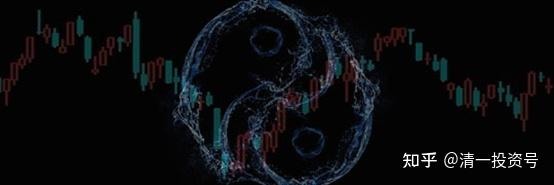

59篇.老子股经（六）——炒股炒的是“阴阳”

清一山长 2007年10月14日

王弼版原文：致虚极，守静笃。万物并作，吾以观复。夫物芸芸，各复归其根。归根曰静，是曰复命。复命曰常，知常曰明。不知常，妄作凶。知常容，容乃公，公乃王，王乃天，天乃道，道乃久，没身不殆。

帛书版原文：致虚，极也；守静，表也；万物并作，吾以观其复也。天物芸芸，各复归于其根，曰静。静，是谓复命。复命，常也；知常，明也；不知常，妄；妄作，凶。知常，容；容乃公，公乃王，王乃天，天乃道，道乃久，没身不殆。

**一、致虚极，守静笃**

这一章，“致虚极，守静笃”这句可能让人最难理解。我们讲几种版本，先讲武功版的，再讲股经版的，再讲文化版的。

（武功版和文化版略，详见“张清一解读《道德经》”）

第二、股经版的。

老子的东西还有另外一种特征，就是你要做事也行。做事的人也能读懂它。后面我们就用做事的方式来理解，就像我说的股经版的、股票版的老子。用做事的方式理解起来是一样的，万变不离其宗。

股经版就是：**当你面对市场的时候，你要使自己的心神放松，集中自己的意念，进入到一种一触即发但又不乱作的状态**。这个时候，所有的股价、各种各样非常混乱的像海一样的市场消息，最后在你的脑子里就变得简简单单，也是两个字——不就是“涨”和“跌”嘛！跟武功版的攻防是不是一样的？武功版的就叫攻和防，股经版的就叫涨和跌。等你能够把握涨和跌的节奏，就像把握攻和防的节奏一样，自然而然你就能够控制住市场的命脉。而且所有的信息、所有的消息以及所有的变化，最终就要体现在股价上的涨或跌。出来一个消息，我会问这个消息是干什么的？它会造成什么结果？马上就要分析它会造成大涨还是大跌。

比如那天讲的“振华港机”，我一看消息就说今天要涨停了。当时我手上已经没美金了，有美金的话我会立即打进。结果，就是涨。第二天，继续再涨。那么复杂的消息、那么大的报告，他们看了都没感觉，没感觉那就是没有达到“致虚极，守静笃”。

静静地看，一看，好，我知道是这个局面了。知道这个局面，马上就操作。马上就操作，当天就可以有一笔很好的收益。你把这种复杂的“夫物芸芸”、“万物并作”的东西一并，就是一个涨和一个跌。你发现它要跌，这一招分析出来，马上就趁它要涨的时候“嘣”全部出手，剩下的结果就是开开心心地看着它往下跌呗！跌够了，到了一个点了，你觉得它又要涨了，再一买进就完了呗！简单吧！

“夫物芸芸，各复归其根”，用股经来说就是，**所有复杂的东西都要归到它的根本去，它的根本就是——不是涨就是跌**。能够归到根本，你就了解了一个最终的趋势，你就了解了一个规律，这个规律就叫“常”。“知常曰明，不知常，妄作凶”，**如果你能够知道这种常数，知道所有的东西变成这种常数、这种规则，那么你就会很明白，你就会是股神。你不明白呢？你在里面追进杀出，那叫“不知常，妄作”，那当然也就叫“凶”**。

**二、知常——阴阳**

其实，我们学那么多东西，XX同学说了一句话，倒基本上达到这个境界了。他是华工的，自己跑来武大听我的课，跟我学了五年。第一年，我也不知道他是谁，也不知道他是哪里的。第二年他又跑来了，我说你怎么又来了？后来期末的时候我才知道他是华工的。他说刚开始越学越痛苦，各种各样的书都去看。他问我学习怎么学？学习干扰比较大怎么办？因为我曾经给别人提过建议，我说其实可以休学来找找自己到底要什么。之后他真休学了一年，然后搬到武大拼命地读书，拼命地去见各种各样的教授。最后他突然发现：“那么多东西，最后总结出来很简单，就是简单的一些规则！”

包括听我的课，我对他说：“你听一遍就够了，怎么你听那么多次？”他说：“原来我听不懂你的这些话，觉得每次听都不一样啊！”现在，他发现我讲的内容慢慢地就有点差不多了。这就叫“知常”，他知道这是“常”，而不是往外走，往外走就越走越复杂。

就像你们听我讲课听了那么多，如果你还是不知道我在讲什么的话，那你还没到“知常”这个状态。“知常”的话，你就会发现张老师讲东西其实就讲了两个字。你们知道我讲了哪两个字？**其实我讲的就是“阴阳”两个字**。

**你练武练半天也是练“阴阳”两个字，我做事也是做“阴阳”两个字，炒股也是炒“阴阳”两个字**。真没骗你的，是真的。你就要知道阴、阳，知道阴阳之间的变化。就像太极图，里面包含万物。但回过头来，宇宙万物都包含在太极图里面的话，那么太极图是不是“常”？你看它就是一个圆圈摆在那里，就是一个阴阳。**但是这个阴阳会变化，你要去观察它的变化，它就是万物；你把它收拢来，它就是阴阳**。

所以他说，“张老师，现在我才理解你的话，听过一次也就够了。”听懂了，听一次就够了；听不懂呢？继续听，看什么时候能够理解“知常”。

“不知常”也没关系。**“不知常”的话，给你的建议是要谦恭一些，做事情小心谨慎一些**。一个人一辈子一定要修一种东西，叫作修“静”。“静”，就是不要犯这个规矩“不知常，妄作凶”。**你不知道没关系，你静一些，静一些就不会去“妄作”，不会去乱搞事**。

（标题、图片为编者所加)

文章音频

[412篇.老子股经（六）--炒股炒的是“阴阳”_清一投资号文章同步音频](http://link.zhihu.com/?target=https%3A//www.ximalaya.com/sound/702982017)

**参考链接：**

[38篇.](https://zhuanlan.zhihu.com/p/641031041)[老子股经（一）](https://zhuanlan.zhihu.com/p/644751640)[持而盈之，不如其已；揣而锐之，不可长保（上）](https://zhuanlan.zhihu.com/p/641031041)

[40篇.老子股经（一）持而盈之，不如其已；揣而锐之，不可长保（下）](https://zhuanlan.zhihu.com/p/642329173)

[42篇.老子股经（二）——强分违背天性](https://zhuanlan.zhihu.com/p/643941532)

[44篇.老子股经（三）——善于管理、治理](https://zhuanlan.zhihu.com/p/644751640)

[46篇.老子股经（四）——“无为”的智慧](https://zhuanlan.zhihu.com/p/646940810)

[48篇.老子股经（五）——无之以为用](https://zhuanlan.zhihu.com/p/648281618)

