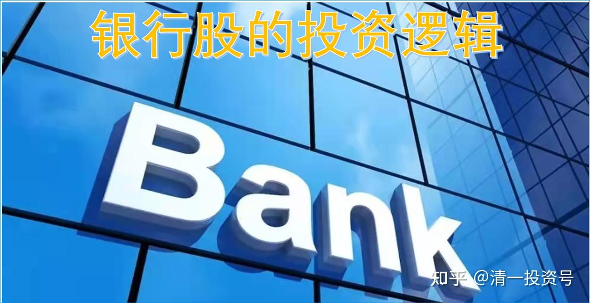
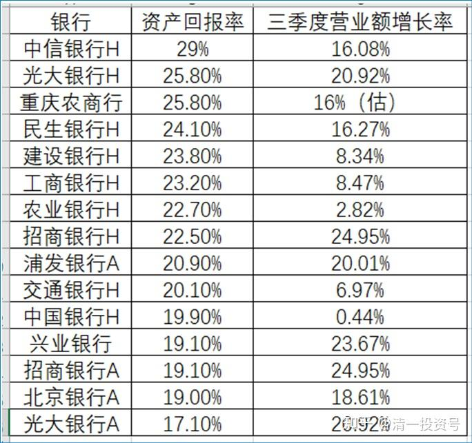
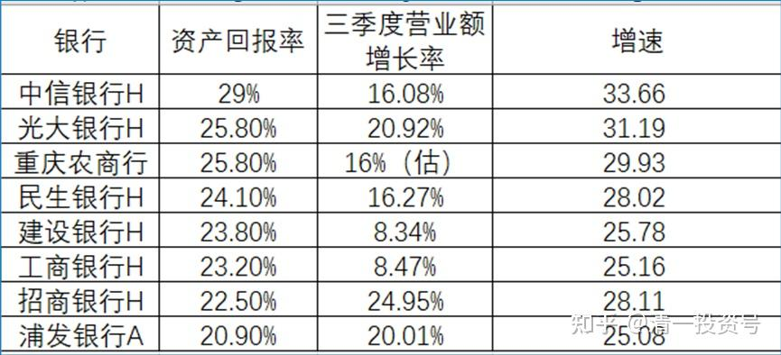
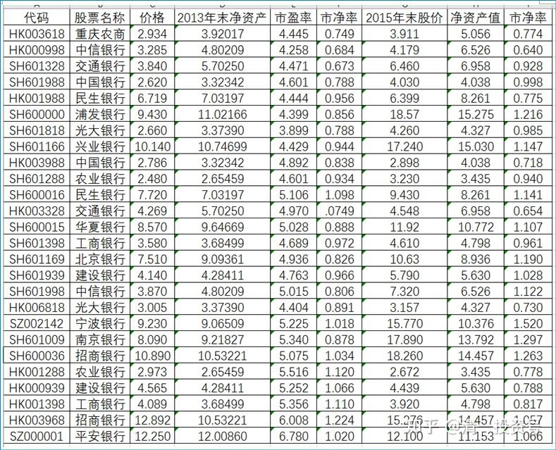
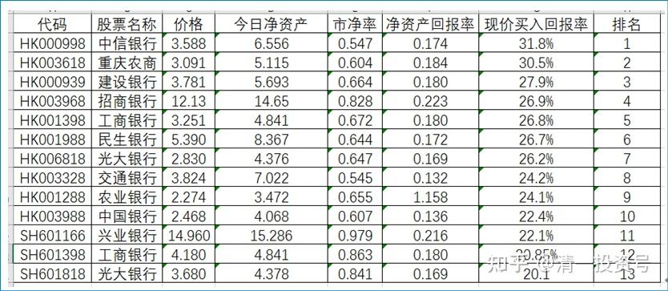

6篇. 银行股的投资逻辑

清一山长 2015年12月14日～2016年1月21日

此文整理自山长新浪博客——“教育张清一”

**文章一：《银行投资估值，只需要小学的数学水平！》**

清一山长 2015-12-14 13:42:17

[http://blog.sina.com.cn/s/blog_4f7cd6a10102vun0.html](http://link.zhihu.com/?target=http%3A//blog.sina.com.cn/s/blog_4f7cd6a10102vun0.html)

这几天，我正在大买特买股票。因为，现在我又能以比2014年几乎是最低的价格，买到一大堆优秀的企业股票，我很贪婪地大笔买进。但是，似乎市场比较冷清。很多几个月前兴奋的股民，现在躲得远远的。我觉得跟我2014年初鼓动人买股一样——大多数人看我，像是疯子和傻瓜一样。由于我的资金，已经不是2013～2014年初的状态，而是多了好几倍（平均4倍左右），这要感谢今年上半年的“牛市”，我今年的运气特别好，没有在牛市中赔钱（今年这个牛市很奇怪，居然让很多人赔光了），抓住现在的低风险投资机会，就是我现在最爱的选择。

由于这两年，我在投资上已经研究了很多公司，不像去年主要集中投资电力、银行和建筑，比较局限。今年投资的消费类公司要多一些。银行股，也是我重要的配置。说实话：今年年中，如果不是我重仓招商A和浦发，今年的业绩，就不够好看了。（申明一下：今天我不看好电力股，手上除了三元多买入的国投电力外，其他去年我买入的电力股，都在上涨过程中卖掉了）。另外，告诉大家一声：中国石油的价格，已经跌到了比当年巴菲特买入的价格更低的估值了（更低的PB），你们有没有兴趣呢（H股）？

不过，便宜货中，总有些是最便宜的。下面就做一个银行股估值，看什么标的更划算（花了我一天的时间来收集资料）：

**以今天的现价买入后的资产回报率 该银行三季度的营业额增长率 排名 **

**表格二：未来资产增值速度**

购买一支股票，不仅仅要看价格划不划算，还要看发展情况好不好。就是所谓的“成长性”，我们在银行股里面，居然也能够发现“成长股”——就是年度营业额增长率。

我用了目前的资产净回报乘以三季度的营业额增值率，来计算这笔投资未来的增值速度（假设未来该公司也可以保持这样的速度），主要是取得一个排名，找到最被低估的公司（价格优势＋成长性优势的组合）。

**最终总得分：**

中信银行H 33.66

光大银行H 31.19

重庆农商行 29.93

民生银行H 28.02

建设银行H 25.78

工商银行H 25.16

农业银行H 23.34

招商银行H 28.11

浦发银行A 25.08

交通银行H 21.5

中国银行H 20.77

兴业银行 23.62

招商银行A 23.86

北京银行A 22.53

光大银行A 20.67

**最值得投资的，总分在25分以上的银行，就只有这几家了：（如果这个增长率以后得以持续，你的投资回报率将超过巴菲特）**

备注：增速=资产回报率 *（1+营业增长率）

我现在最高兴的，就是十几天前，最高以19.89～19.99元，把浦发银行都卖光了。我计划把这部分浦发仓位，补充为14元多的招商H。因为这些浦发，本来就是原来的招商。在招商冲18元以上的过程中减仓，最高一批是20元上方出手的，回来换了15元的浦发。这回重新换回14元的招商，我怎么算，都不亏。就死拿着等分红吧！

**文章二：《2016年银行股的投资机会：又到冬耕播种时》**

清一山长 2015-12-30 12:13:07 [http://blog.sina.com.cn/s/blog_4f7cd6a10102vvuo.html](http://link.zhihu.com/?target=http%3A//blog.sina.com.cn/s/blog_4f7cd6a10102vvuo.html)

中原种麦子，都知道只有在冬天深耕后，春天才会发芽，夏天才有收获。如果你等别人的麦子成熟时，再去急乎乎地种麦子，等来的可能就是永远长不熟的麦秆了——只能喂牛！不过，性急而又无知的中国人，总是在别人收割麦子的时候才去种麦子，至少我在金融市场上看到的是这样。他们在5000点的“夏天”最急于“投资”，借钱都要买股。而在2000点的“冬播时节”，却连拉都拉不进来，有点钱都放银行吃利息。

有人很羡慕2014年初上课的财富学员，觉得这些人上课的时机真好，正好赶上了赚大钱。可是，假如历史又一次把机会放在您的面前，您会珍惜吗？**金融市场上，永远都有机会，但机会只给做好准备的人，心态好的人。**

**2014年，我为低风险承担者，开出的药方是“买银行股”**。实际上，这一年他们的确在银行股上收获颇丰。而且，正因为重仓银行股，他们躲过了今年的股灾。

**2016年，如果你只想要一个相对稳定可靠的回报，我依然建议买入银行股。**不过是便宜的银行股——那些价格与2013年相比没有涨的，甚至更低的银行股，就是你获取稳定收益的标的。不过，聪明人，研究能力更强的人，应该可以找到更有利可图的标的。我就不多说了，风险与利益成正比，没有做好风险研究的人，不适合买“成长股”。但傻瓜都可以靠买银行股，傻傻地坚持下去，就可以获得财富自由。

参考表格：投资机会再度光临：

我翻出了一张2013年年底的银行股历史表格，再填上2015年30日的新价格，成为了下面的表格，它蕴藏着未来的投资机会（这花了我好几个小时的时间，不过也算是我做功课了）。同样是这批银行股。两年以后的不同价格表现：你从中发现了什么？如果您有眼光看到这些变化，您就有赚钱的机会。如果您什么都看不出来，您还是去存银行，打工去吧！

本轮投资，我就是从2013年年底开始的，看到当时的图表代表的投资机会，我卖掉了武汉存了十年的房子，还借了一笔算是很大量的钱，买入了大批的“大蓝筹”，包括不少数量的银行股在内，华夏、招商、浦发、兴业、光大（分期轮动投资的）。我叫他们分红股，结果他们给了我远远超过本金的回报。

随后两年内，这笔投资的资产，与本金相比升值了400%左右。我在几个月前已经除掉了杠杆，正在像2013年一样寻找和布局新的投资机会。我认为未来两年，这笔投资，又会给我比较理想的回报。就算是只涨100%，相对于我2013至2014上半年的资产，就可以实现四年八倍的回报了。在大家都抱怨市场不好的这几年，能够获得这样的投资回报，已经算是“不可思议" 了。假如2018年能够遇到经济复苏，可能十倍都能够达到。这就是我乐观地对未来的判断。当然，我对2016年的中国和世界经济，感觉依然在“寻底”，但等经济底部到来再投资，可能就晚了。我是左侧投资者，喜欢花钱买套！

**文章三：《30%的年度资本回报率，比银行理财更安全，更可靠》**

清一山长 2016-01-21 21:38:07

[http://blog.sina.com.cn/s/blog_4f7cd6a10102vxc8.html](http://link.zhihu.com/?target=http%3A//blog.sina.com.cn/s/blog_4f7cd6a10102vxc8.html)

今天股市大跌，估计有很多投资者关灯吃面。我新作了一个功课，参照一些投资人做的排行榜，重新根据我认为最能够反映“现价买入后的投资回报率”情况，确认了一个新排行榜单。计划明天按照本排行榜名单，继续买入股票。这份名单，把投资收益率20%以下的扣除了。在目前这个低利息通缩时代，能够得到20%甚至30%的资本回报率，会让你超级满意的。毕竟这是一笔可以比肩巴菲特的投资回报率。而且，这还是保底收入。假如股价上涨，您还可以得到意外的交易收益。就像我去年得到的一样。因此，今天把这些未来获得稳定的高资本收益的表格，奉献给大家。希望给大家提供买入的机会和借鉴。

今天下午，我一直在跟踪和买入了我认为回报率可能更高的品种，但是我买的公司比较冷门，就不说了。下面排行前五的银行，有四只也是我的持仓股，从A股退出后新买入的，目前均处于“套牢”的状态。因此，您愿意的话，可以抄我的底。当然，可能各位担心现在买股是帮我解套了。这样想，就可以走远点。别理我就行了。

如果你期待的仅仅是分红，以及资产的收益率，下面这份表格会让你很安心；如果你在乎的是价格，今天估计你睡不好。对我来说，只要想到无论涨跌，我持有的股份，都会每年分给我不菲的红利，远远超出武汉大学给我的工资收入。这样，我会睡着了都笑。跌对我来说，只有一件事需要操心——我还有钱多买一点吗？没钱了，就休息去，连盘都不用看。学大股东的气派，反正涨了不容易买，跌了更不卖。如果涨了，反而麻烦多了，我总想要不要卖一部分出去。卖出后，总要想再买点什么进来？这个就很费心了。

