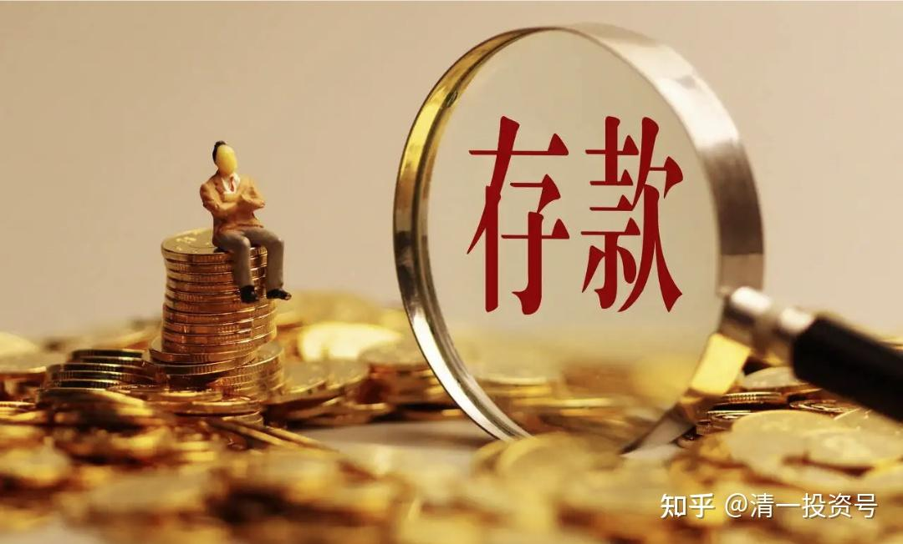

8篇.你的存款，跑得过年复合增长率18.31%的印钞速度吗？
清一山长2014年07月20日
我说过：中国十年之后会很穷，很多人都不信。我们身边的中国人，都很有钱呀？
其实，**财富并不是钱，财富来源于你创造的社会价值。如果这个社会无法创造价值了，你的钱，只是一张纸！**
中国最近30年，的确为世界创造了很多价值。主要是靠廉价劳动力，以及输出廉价资源（包括炼钢之类的），表面上“两头在外”——进口原料和出口产品，但是实质上，是把中国的煤资源以及环境等等，低价消耗，用来赚一点很少的钱（生产每吨钢，现在才赚几元钱）。
以后呢？由于劳动力已经快速衰竭，你们已经看到了用工快速的涨价趋势，很快我们就会变成劳动力奇缺的国家，因此，中国创造财富的能力，将大大的减弱。票子将越来越不值钱，人民币将追上日元的价值。
而以出口廉价资源为价值的中国式发展，也面临极度的环境压力而不得不受到政府的严格管理：**想要靠牺牲后人生活的空间，赚取眼前票子的行为，将不再有效。**
外国人，英国、德国、美国等等，当年也面临这样的问题（产业升级）。但是，产业升级的背后，是人才的升级。西方国家当年靠人才和教育素质的提高，靠创新，实现了产业升级，成功地度过危机。而我们呢？教育不仅仅没有“提高素质”，反而制造出了一大堆不会做事的废物。现在的大学，比三十年前的大学更不懂得培养国家需要的人才。
因此，中国人注定要面临未来的贫困。只是将来会有多贫困的问题——取决于中央政府能不能拿出有效的措施。这对这一届政府的执政能力是一大考验。我认为：就算是他们再英明，做好了教育，准备好了产业升级，但也只能在长期趋势上维持稳定和繁荣。短期内（十年内），想要维持稳定，实在是力所难及。因此，**民众被大面积遭遇“抢钱”是难免的，社会用中国民众这三十年的存款，来为中国的未来十年买单，也是应该的（谁让我们消费了未来？），只是情况会有多严重的问题。在最严重的状态下，可能会导致社会的动荡。我希望这种情况不会发生，目前政府也在竭力防止这一种最坏情况的出现。**
作为一个小民？我们怎么办？怎样才能防止你的养老钱不被抢走？除非**进行正确的投资，找到通货膨胀的避风港**，否则你无法避免。
至于房子？将来恐怕只会成为变穷了的政府的“劫富对象”——房产税的推出，将让目前的土地财政找到新的替补者。只是目前还没有必要开征税（先放水养鱼好了），以后还是不是“财富”，我看难说。
其实，恐怕不会到十年的。我看到的数据很恐怖：我们的中央银行已经“提前抢钱”了——最近六年，我们印刷了可以买下全世界一半资产的钞票（按现在的汇率）。这就是说：我们已经开始了“透支积累的中国财富”的进程。这是，目前这些钱靠房市吸收了，因此暂时你们没有看到严重的通货膨胀。因此自以为有钱。可是目前中国房市已经成为投资者开始逃离的地方，不再成为“资金蓄水池”。这些政府大量印刷出来的钞票，会冲到哪里去呢？
而且，看起来这个印钱的速度，越来越快。（我的判断就是：中国创造真正财富的能力越来越低，只好用印钱来假装弥补，支持表面上的经济繁荣），但是，这个游戏，总有玩不下去的一天。怎么办呢？
对付未来的这个惨景，您准备好了吗？
还是继续傻傻地活着？反正今天您还有钱……
下面附录一个国家级别的权威数据的资料，防止谣言。
请各位理性思考：**结论一定是一句话：今天不懂财富投资之道，只相信银行理财的人，请准备好做一个穷人。**
**无论你今天多么有钱，将来都会觉得自己很穷（想想看，30年前的万元户，比现在的千万富豪都牛。今天呢？一万元能做什么？）**
**别忘了：过去的三十年，是中国不断为世界创造财富的三十年，都已经达到这个水平的通胀了。未来的三十年，是中国消耗财富的三十年，通胀的水平，将远远超出你的想象！人民币赶上和超过日元，恐怕真不是梦！**
不信，让我们用时间来检验好了。
**今年的最新数据：**
据最新统计数据，上半年社会融资规模为10.57万亿元，为历史同期最高水平，比去年同期多4146亿元，比应对国际金融危机期间的2009年和2010年同期平均水平多2.08万亿元。上半年，人民币贷款增加5.74万亿元，同比增长14%，多增6590亿元。广义货币(M2)余额同比增长14.7%，3、4、5月份增速分别为12.1%、13.2%、13.4%，呈节节上升之势。
2007年底，中国的货币供应量相当于美国的74％。六年以后呢？它比美国的高61％,虽然美国的经济总量（GDP）依然比中国大83％。不可怕吗？
很多中国人以为，美国搞了QE，所以，街上肯定撒满了钞票。不！不是那样的。美国的广义货币供应量的增长非常缓慢。在过去六年，虽然有QE和QE2，但是，货币供应量的年复合增长率只有2.55％。相比较，中国的货币供应量(M2)年复合增长率高达18.31％。
咱们中国的很多评论员们，拍拍脑袋就想当然，瞎喊：“美国GE，印钞票 ......”。要知道，**印钞票最疯狂的是中国人**。
下面是原始数据，供大家核实。美国的数据来源于联邦储备委员会，网站：[www.federalreserve.gov](http://link.zhihu.com/?target=http%3A//www.federalreserve.gov/)
(M2,单位：十亿美元)
2006 14,068.4
2007 14,690.0
2008 14,546.7
2009 14,564.1
2010 15,231.7
2011 15,818.7
2012 16,420.3
2013 17,089.6
下面是中国人民银行的官方数据( 单位：亿元人民币)。资料来源：[www.pbc.gov.cn](http://link.zhihu.com/?target=http%3A//www.pbc.gov.cn/)
2013 1,106,525
2012 974,148.80
2011 851,590.90
2010 725,851.79
2009 610,224.52
2008 475,166.60
2007 403,401.30
2006 345,577.91
都是年底数据；
(补充财富群相关讨论)
深圳朱** 2014-07-20 18:09:14
关于印钞，这里提供一个另类观点，早期搞核子物理，后研究法律做律师，又做房地产、投资的张捷，2008年后转入金融和经济的研究，核心观点是不能完全用西方经济思维和模型或角度来分析中国的经济和金融实践，套用老子的观点“以身观身，以邦观邦”——中国的事，要用中国的逻辑和事实去理解：
1.货币存量和流量——因为是否存在发达的金融和衍生品市场体系和机制，美国的货币存量、流量与中国的实际内涵差距巨大：美国是存量小，但流量极大，但中国是存量大，但流量小。存量小而流量大，说明货币化效率极高，否则相反。
2.社会经济发展历史阶段和货币化程度差异极大——美国是已经金融资本市场高度成熟，过度货币化的发达国家，社会货币化进程已经超过100多年，而中国社会货币化进程才处在初期，比如中国的家务劳动就还未货币化，不计入GDP.集体经济和财产、军工生产等等都未货币化力量。而改革开放前，只有很少消费、生产领域需要货币力量，绝大部分领域都是票证、计划在计量。中国市场化进程同时也是一个货币化进程，这个张维迎、陈志武有较好的说明。
3.美国是金融霸权国家，美元全球流通，而中国是高速发展国家，人民币是国内流通。决定美元调节空间是全球调节，腾挪空间极大。而中国只能在国内消化。结论：中国的印钞问题，因2008金融危机等国际国内问题综合效应下，主要是短时间印钞过快、过大——短时间钞票淤积：为应对这个问题，周小川让楼市成为“货币池子”，实体经济消化不了的钞票先放在楼市，但“货币池子”本身也引发了货币的“虹吸效应”：由此引发了更严重的经济结构失衡。供大家参考。
清一山长2014-07-20 18:19:28
这些人真会误导人：
美国的状态，正好说明了资金的利用率高。**周转快，因此财富效应更明显。**
中国的状态，正好证明资金的利用率很低，创造财富的能力更低。因此，我们与美国财富的比较，将比数据上看到的距离更大。
但是，**我们却印刷了最多的钞票，难道不是隐形的贬值更厉害吗？这种逻辑是常识性的。**
当然，也可以说：**中国的市场反应速度很慢，因此危机推迟发生，而不是“中国更健康”，相反，美国市场更敏感，反应更快速——因此更健康。**

**

**
