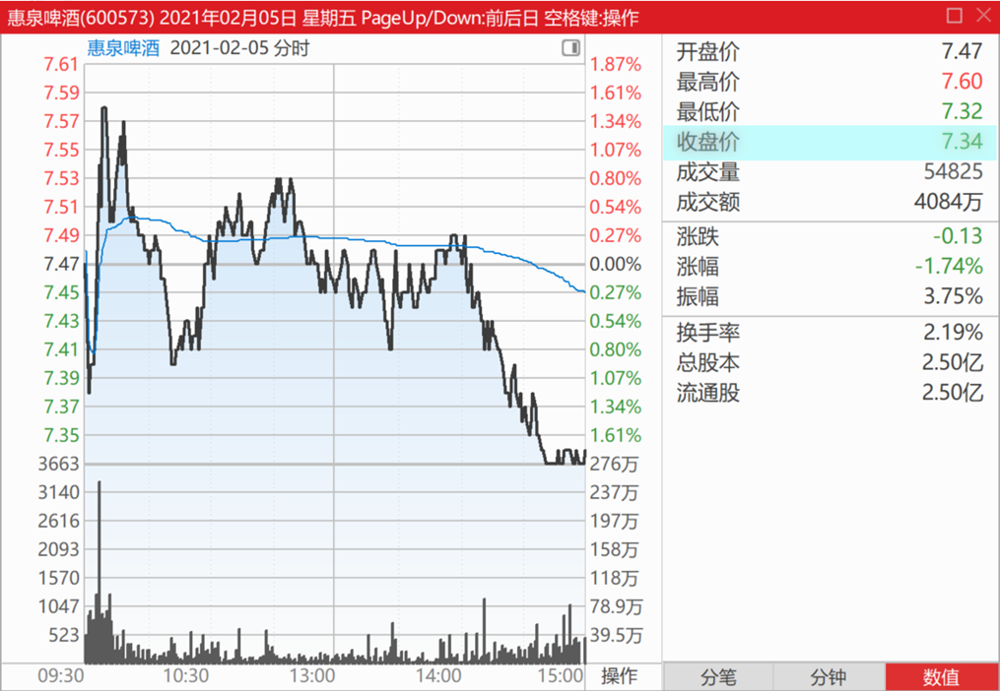
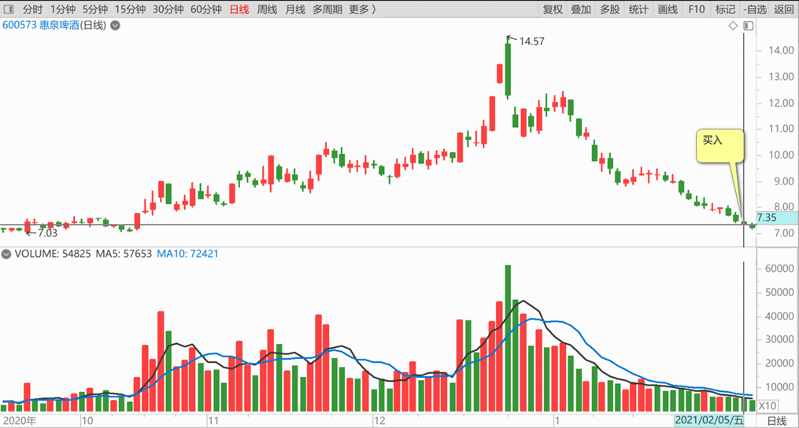
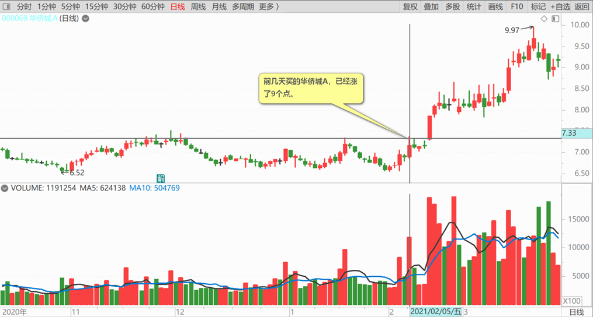
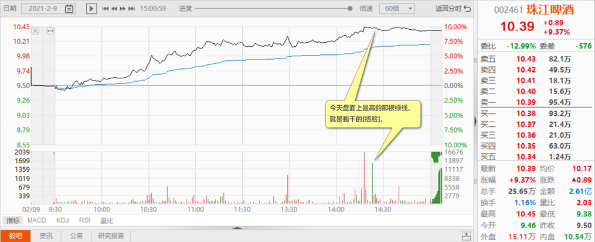
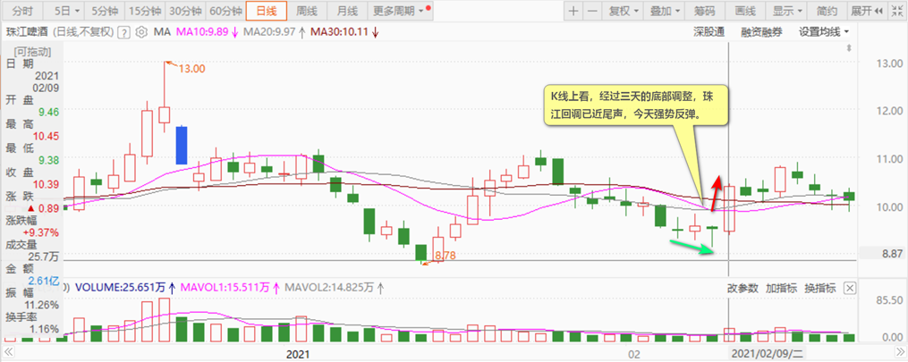
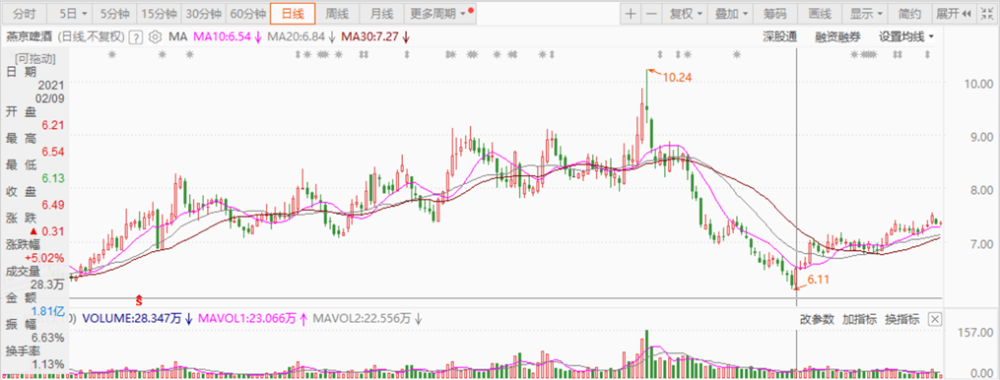
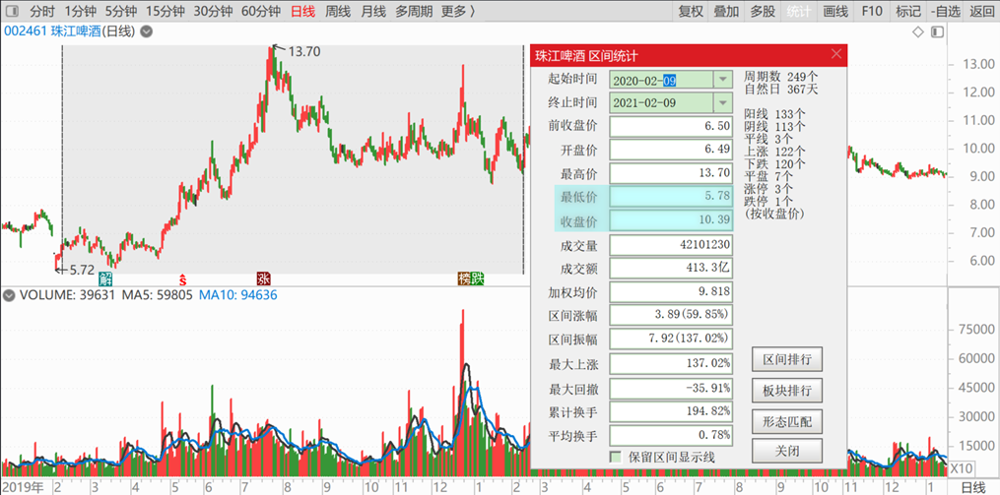

100篇.那条绿线，我干的

清一山长2021年2月5日～9日

清一山长2021-02-05 15:06:38

[$惠泉啤酒(SH600573)$](http://link.zhihu.com/?target=http%3A//xueqiu.com/S/SH600573) 今天尾盘，继续买了一点惠泉。挂了几次单子分别买入的，成交价7.34元。看了成交回报单，全都是小单，多数都是几手，最多的几十手，连一单百手的成交都没有。说明主力真的是走了。估计要跌到6元去了，[捂脸]。继续熬吧！已经习惯了喝冷酒了。大家随意。

唯一的亮点是：前几天买的华侨城A，已经涨了9个点。但跟这几天燕京啤酒等下滑带来的亏损相比，实在不足为道。继续忍住。[加油]

[笑口常开陽](http://link.zhihu.com/?target=http%3A//xueqiu.com/n/%25E7%25AC%2591%25E5%258F%25A3%25E5%25B8%25B8%25E5%25BC%2580%25E9%2599%25BD)回复[清一山长](http://link.zhihu.com/?target=http%3A//xueqiu.com/n/%25E6%25B8%2585%25E4%25B8%2580%25E5%25B1%25B1%25E9%2595%25BF)：

山长，现在基本买啥啥跌呀！不敢再抄作业了！

清一山长2021-02-09 13:58:07回复[笑口常开陽](http://link.zhihu.com/?target=http%3A//xueqiu.com/n/%25E7%25AC%2591%25E5%258F%25A3%25E5%25B8%25B8%25E5%25BC%2580%25E9%2599%25BD)：

可以反着抄呀？这样就赚钱了。我买啥你卖啥就行了，不是还可以融券做空吗？[俏皮]

清一山长2021-02-09 15:13:10

[$珠江啤酒(SZ002461)$](http://link.zhihu.com/?target=http%3A//xueqiu.com/S/SZ002461) **今天涨停价，把珠江卖掉了**。今天盘面上最高的那根绿线，就是我干的[捂脸]。不过我判断后面会涨的吧？毕竟我一直是反指，经常把自己带到坑里。跟我反着做的人，估计都发了大财。

**K线上看，经过三天的底部调整，珠江回调已近尾声，今天强势反弹**。这明显说明珠江是是最强势股的啤酒股。不是说：强者恒强吗？珠江想要继续涨下去，应该问题不大吧？

看多，我为啥不做多？因为它跌的时候，我已经买一肚子；现在涨了，肯定要卖了。主要是觉得：今天涨停这价格，拿来换燕京，怎么都划算的。万一以后不涨了咋办呢？我还是看燕京啤酒更眼馋一些。

当然，盘面上看，我丢出货之后，就马上跌破了涨停价。我只卖了一百多万股，盘面明明是三百多万股的封单，怎么一下就没了？后来看再度涨停，就没见大单封板了？难道是怕被人再丢一百多万股出来吗？不知道主力咋想的，我就单纯地想：似乎主力并不想要货呢！以后涨不涨就不知道了。

**资金拿回来，换不涨的股。**珠江从去年一年以来，已经涨了一两倍了。很够意思了。再涨下去，就给今天接盘的勇敢者算奖金吧！别有利润也不肯分给人共享。就算珠江涨，我手上拿的其他啤酒，也一样会跟涨的。2021年，继续是我的啤酒年！继续喝啤酒，吃白云的药。

祝大家新年吉祥如意，大吉大利[献花花]

[楠楠ec3](http://link.zhihu.com/?target=http%3A//xueqiu.com/n/%25E6%25A5%25A0%25E6%25A5%25A0ec3)回复[清一山长](http://link.zhihu.com/?target=http%3A//xueqiu.com/n/%25E6%25B8%2585%25E4%25B8%2580%25E5%25B1%25B1%25E9%2595%25BF)：

我眼睁睁地看见珠江今天炸板，马上就想一定是山长干的，看来我猜对了。

清一山长2021-02-09 15:38:15回复[楠楠ec3](http://link.zhihu.com/?target=http%3A//xueqiu.com/n/%25E6%25A5%25A0%25E6%25A5%25A0ec3)：

看来还是你最了解我[献花花]。有些来市场上喝啤酒，亏红了眼的赌徒酒鬼们，看我居然赚了钱，就骂我是割了他们的韭菜的大坏蛋。其实是主力割了他们，高价诱惑他们进来的，涨了我都不让大家去追买的。比如今天，我就不相信接我盘的是一堆小韭菜，我看了成交单，多数都是大单成交的，10万、20万股，最高的一单是50万股成交。也有一些小单子，微不足道了。

可这些亏红眼的家伙，找不到正主儿算账，非要找我这个老好人来出气。其实，你就知道了，我都是跟主力反着做的，从来不跟散户们抢东西。**主力亏本出货，低价打压，我就一路买进主力的压盘来拼命救市**，尽管一路下跌还无怨无悔。被深深地套牢，账面绿油油的一大片，长满了“韭菜”。**主力一旦拉涨停秀肌肉，我就赶快卖出股票给主力。**不然我的持仓，动不动就百万股级，想卖给韭菜也吃不掉的呀！所以，我就一直跟主力反向做了。

谢谢你的理解和支持[笑][干杯]

[老丸子o](http://link.zhihu.com/?target=http%3A//xueqiu.com/n/%25E8%2580%2581%25E4%25B8%25B8%25E5%25AD%2590o)回复[清一山长](http://link.zhihu.com/?target=http%3A//xueqiu.com/n/%25E6%25B8%2585%25E4%25B8%2580%25E5%25B1%25B1%25E9%2595%25BF)：

但是你比主力有钱啊[捂脸]

清一山长2021-02-09 15:47:18回复[老丸子o](http://link.zhihu.com/?target=http%3A//xueqiu.com/n/%25E8%2580%2581%25E4%25B8%25B8%25E5%25AD%2590o)：

就这眼力，真令人着急。有眼不识真主力。**今天珠江成交2.6亿，我就卖了一千多万。**零头都不到。你说我算主力？还比主力有钱？就这眼力的话，你会跟错对象的[俏皮]

[格格-冰凌儿](http://link.zhihu.com/?target=http%3A//xueqiu.com/n/%25E6%25A0%25BC%25E6%25A0%25BC-%25E5%2586%25B0%25E5%2587%258C%25E5%2584%25BF)回复[清一山长](http://link.zhihu.com/?target=http%3A//xueqiu.com/n/%25E6%25B8%2585%25E4%25B8%2580%25E5%25B1%25B1%25E9%2595%25BF):

老师，珠江啤酒出完了吗？

清一山长2021-02-09 16:46:23回复[格格-冰凌儿](http://link.zhihu.com/?target=http%3A//xueqiu.com/n/%25E6%25A0%25BC%25E6%25A0%25BC-%25E5%2586%25B0%25E5%2587%258C%25E5%2584%25BF)：

没有，还有一些，负成本持有。再涨再继续卖。

(标题、图片为编者所加)

文章音频：

[540篇. 那条绿线，我干的](http://link.zhihu.com/?target=https%3A//www.ximalaya.com/sound/811251360)

**参考链接：**

[91篇.如何看进出时机？](https://zhuanlan.zhihu.com/p/16488305045)

[92篇.珠江投资的反省总结](https://zhuanlan.zhihu.com/p/17164493123)

[93篇.揭开燕京的奥秘](https://zhuanlan.zhihu.com/p/18185937465)

[94篇.短期来说珠江和惠泉的趋势良好，股性更活](https://zhuanlan.zhihu.com/p/1960281323)

[95篇.燕京的经营很稳健](https://zhuanlan.zhihu.com/p/20722962985)

[96篇.啤酒的人均持股](https://zhuanlan.zhihu.com/p/21559367964)

[97篇.借燕京看粉转黑有多快](https://zhuanlan.zhihu.com/p/23176487676)

[98篇.我比唐建华还要保守](https://zhuanlan.zhihu.com/p/23175736428)

[99篇.避免涨停动作，消极以待](https://zhuanlan.zhihu.com/p/26670135074)
