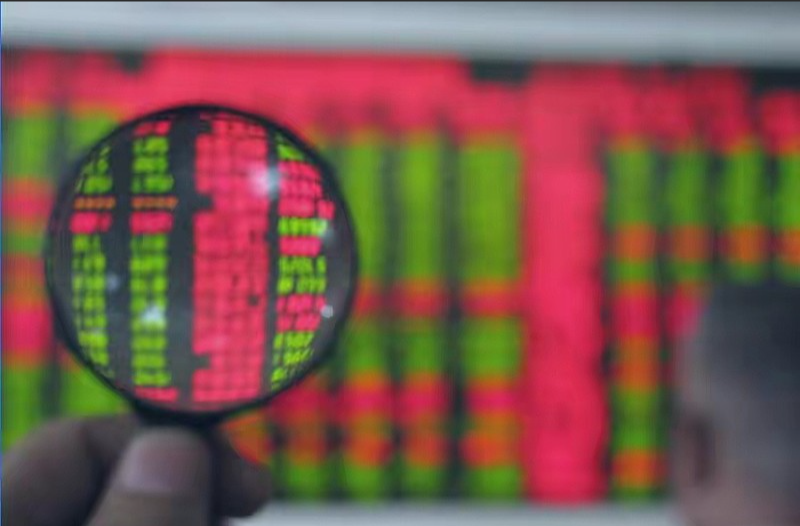
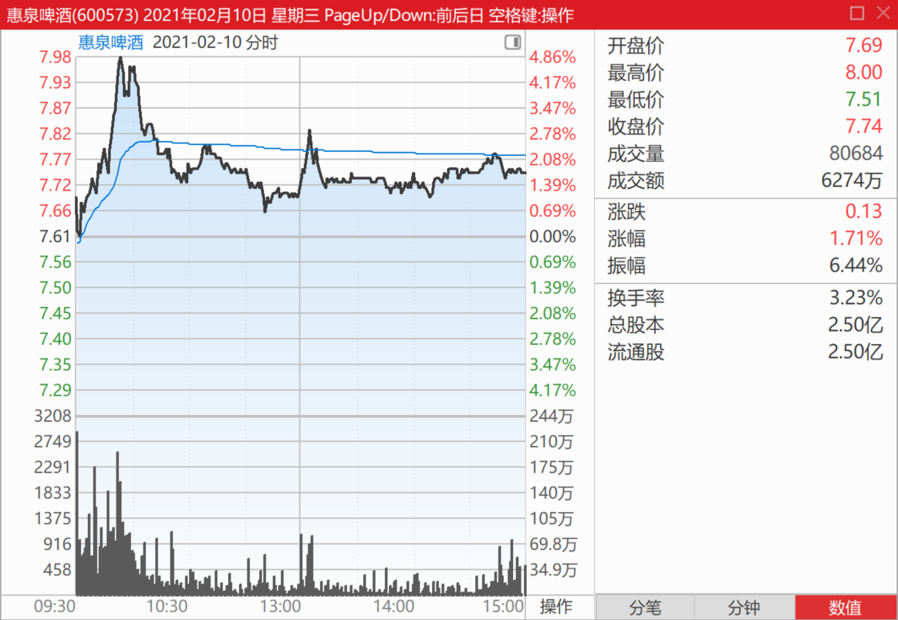
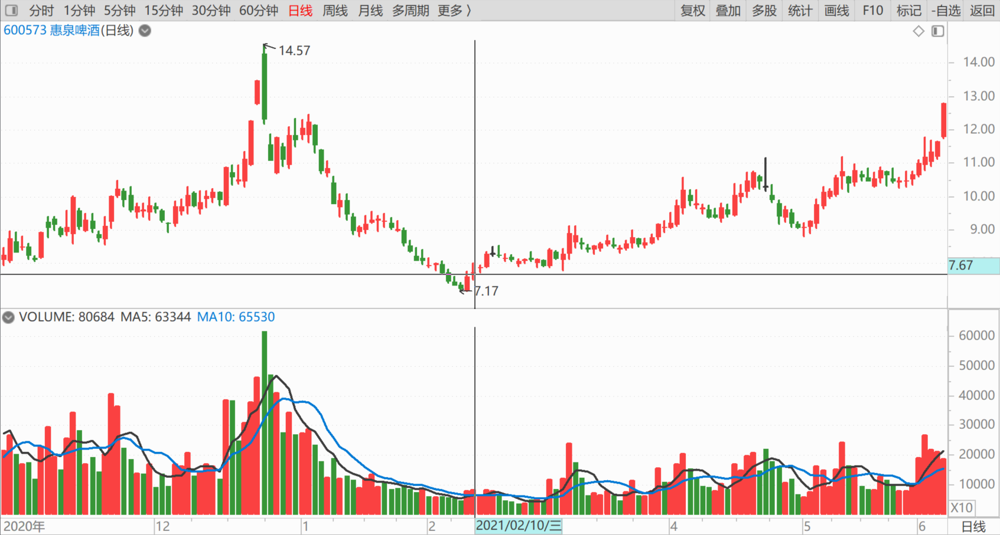
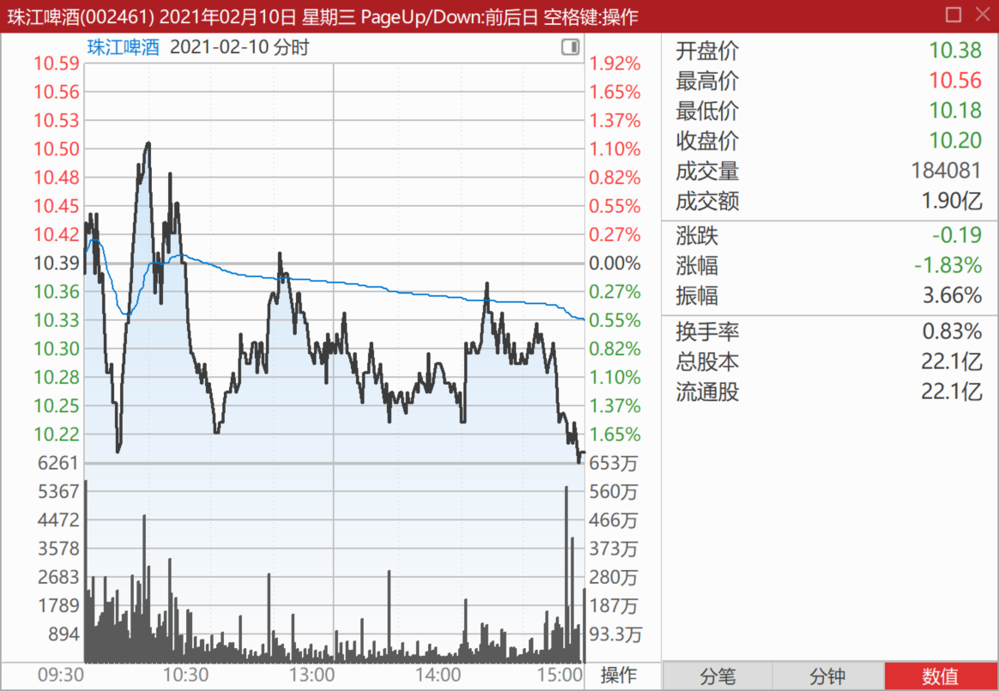
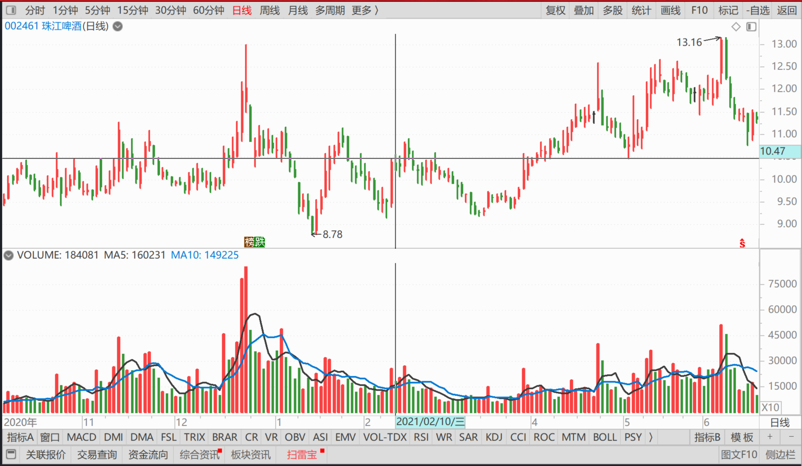
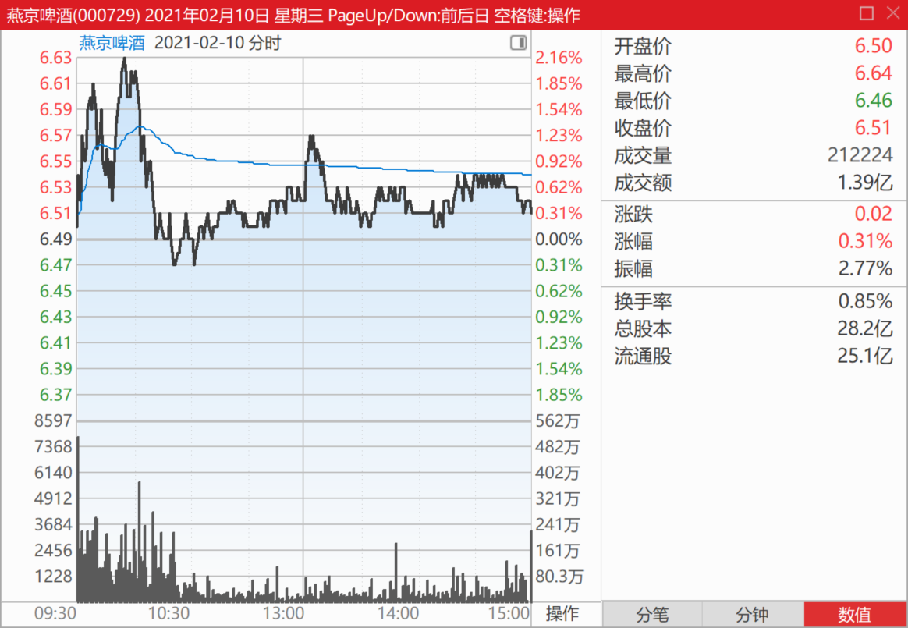
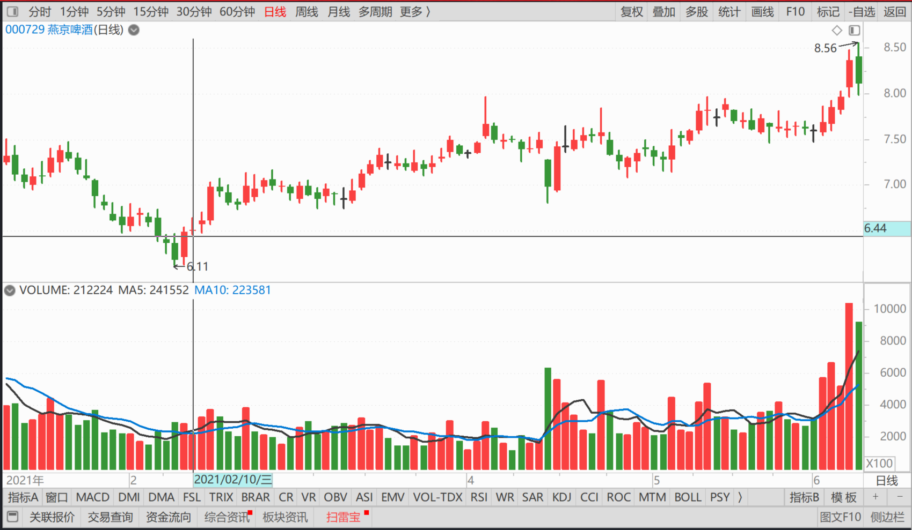
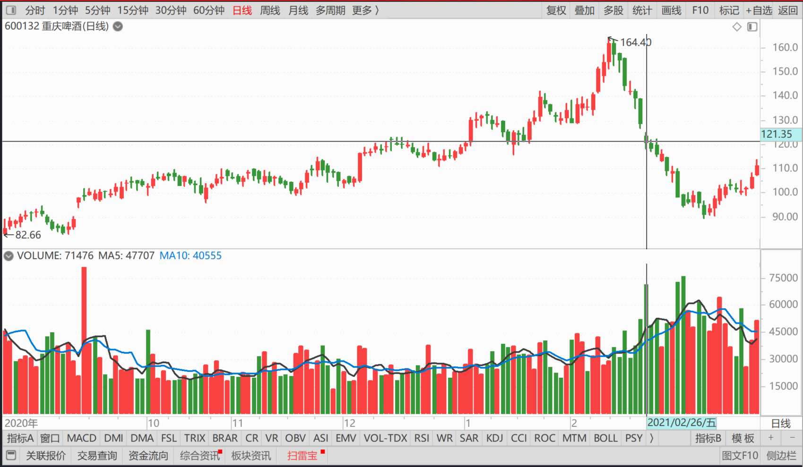

101篇.三家啤酒的走势

清一山长2021年2月

清一山长2021-02-10 11:33:37

[$惠泉啤酒(SH600573)$](http://link.zhihu.com/?target=http%3A//xueqiu.com/S/SH600573) 今天，**三家啤酒的走势都不正常。**下图是惠泉的。**不像拉升，倒很像是出货。**难道是有人过年没钱，要换钱买年货吗？[捂脸]。

下面这图是**珠江啤酒的走势图：急拉急跌的**，玩啥游戏？说实话，这种走势，也不是真要拉升的样子。也像是维持高位，出货的感觉。难道珠江也是要钱不要货吗？上午成交是昨天的一半。我很奇怪，珠江这半年来的调整，好不容易恢复了走势，但现在的主力，似乎是想离开珠江的样子。目前几家啤酒公司中，珠江的控盘程度最高。按道理走出一波行情是没问题的，为啥就是不走？还把这几个月好不容易拿到手的筹码倒出来？而且这些筹码，其实没赚啥钱的，目前的举动，只是不赔钱罢了。这样玩下去，回到9元去，一点也不奇怪的。

下面第三图是燕京啤酒的。勉强算是维持局面吧？**不要货，也不要钱！依然是温吞水一杯。**最没劲的酒。

最终总结：今年的啤酒，很不好喝。大家各自珍重！

我今天目前没有操作，光看盘。不想卖，也不想买！

清一山长2021-02-23 16:59:37
[$燕京啤酒(SZ000729)$](http://link.zhihu.com/?target=http%3A//xueqiu.com/S/SZ000729) 这种基本面下，要走下行通道，还是比较牛的。**至少控盘能力一流吧[大笑]**

转发：啤酒：燕京啤酒去年一季度下跌28.57%，今年春节上涨39.33%，所有啤酒中增速最快，一个是基数低的原因，另一个是U8啤酒上市销售非常成功，预计3～6月份会保持35%增长。青岛啤酒去年下跌22.22%，今年增长22.76%，青岛采取收缩打法，更多费用投到优势区域，北京投入费用不多，预计3～6月保持20%增速。百威啤酒去年下跌32.43%，今年增长26.28%，预计后续3～6月增速达到30%左右。百威策略很明确，把哈尔滨、科罗娜等品牌单独运营，整体打折促销等投入力度很大，今年会是翻身仗。百威到20年底还是-3.76%的负增长，2021年增长目标是15%，现在看情况比较好。雪花啤酒去年一季度下滑31.58%，今年春节增长32.27%，预计后续3～6月份增长30%，全年目标任务是15%增长。喜力春节增速40%左右，预计会持续比较好的增长。

[https://business.sohu.com/a/636226265_121609000](http://link.zhihu.com/?target=https%3A//business.sohu.com/a/636226265_121609000)

[https://xueqiu.com/8992659930/174500831](http://link.zhihu.com/?target=https%3A//xueqiu.com/8992659930/174500831)

清一山长2021-02-28 22:32:55

[$重庆啤酒(SH600132)$](http://link.zhihu.com/?target=http%3A//xueqiu.com/S/SH600132) 从图形上看，**是加速赶顶后的出货图形，非常明显的下行走势。**看样子，重啤已经到头了。别指望短期会前高了，就是给你看的一个山峰，很多年应该都回不来了。坐等打脸！

纯技术分析，不谈基本面。个人意见，不供参考，本人没有重啤。不涉及投资意见。

(标题、图片为编者所加)

文章音频：

[548篇. 三家啤酒的走势](http://link.zhihu.com/?target=https%3A//www.ximalaya.com/sound/830601063)

**参考链接：**
[91篇.如何看进出时机？](https://zhuanlan.zhihu.com/p/16488305045)

[92篇.珠江投资的反省总结](https://zhuanlan.zhihu.com/p/17164493123)

[93篇.揭开燕京的奥秘](https://zhuanlan.zhihu.com/p/18185937465)

[94篇.短期来说珠江和惠泉的趋势良好，股性更活](https://zhuanlan.zhihu.com/p/1960281323)

[95篇.燕京的经营很稳健](https://zhuanlan.zhihu.com/p/20722962985)

[96篇.啤酒的人均持股](https://zhuanlan.zhihu.com/p/21559367964)

[97篇.借燕京看粉转黑有多快](https://zhuanlan.zhihu.com/p/23176487676)

[98篇.我比唐建华还要保守](https://zhuanlan.zhihu.com/p/23175736428)

[99篇.避免涨停动作，消极以待](https://zhuanlan.zhihu.com/p/26670135074)

[100篇.那条绿线，我干的](https://zhuanlan.zhihu.com/p/27432186910)
