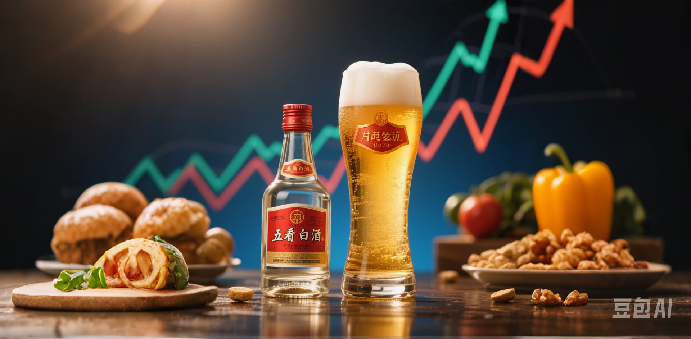
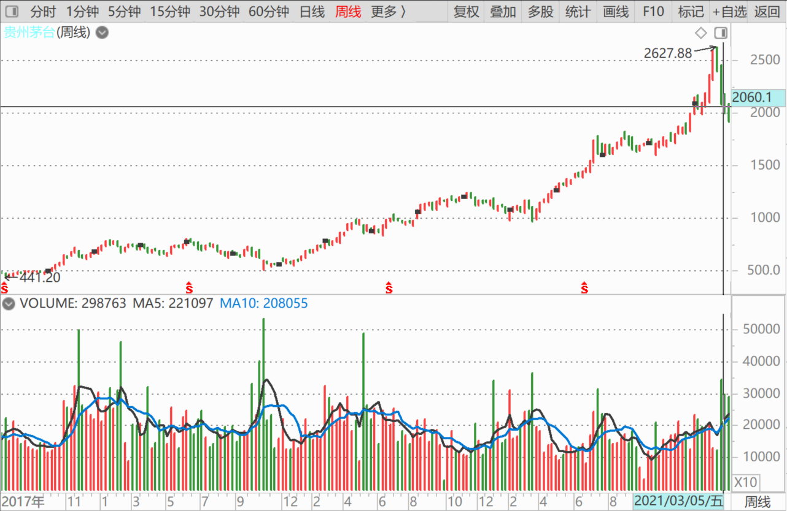
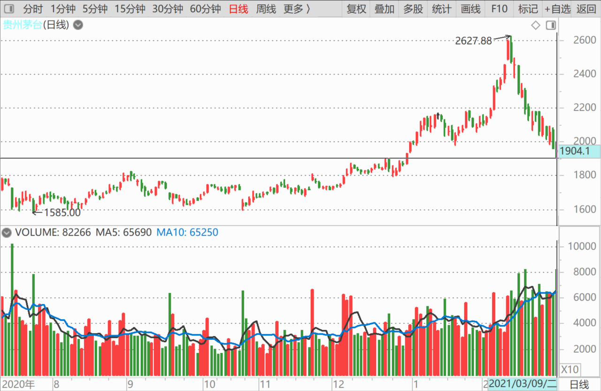
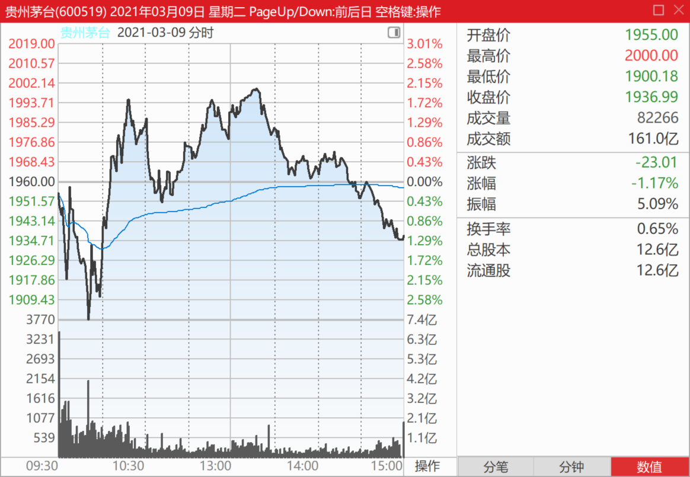
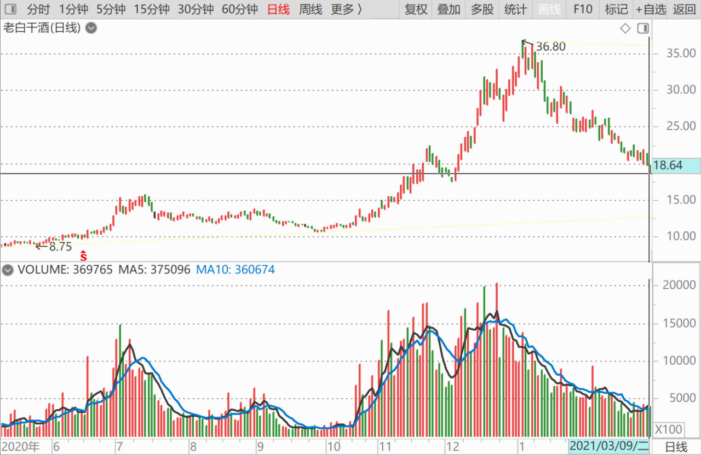
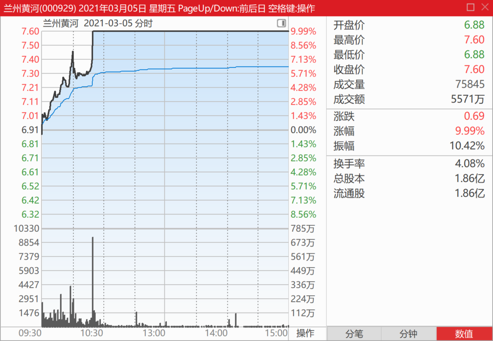
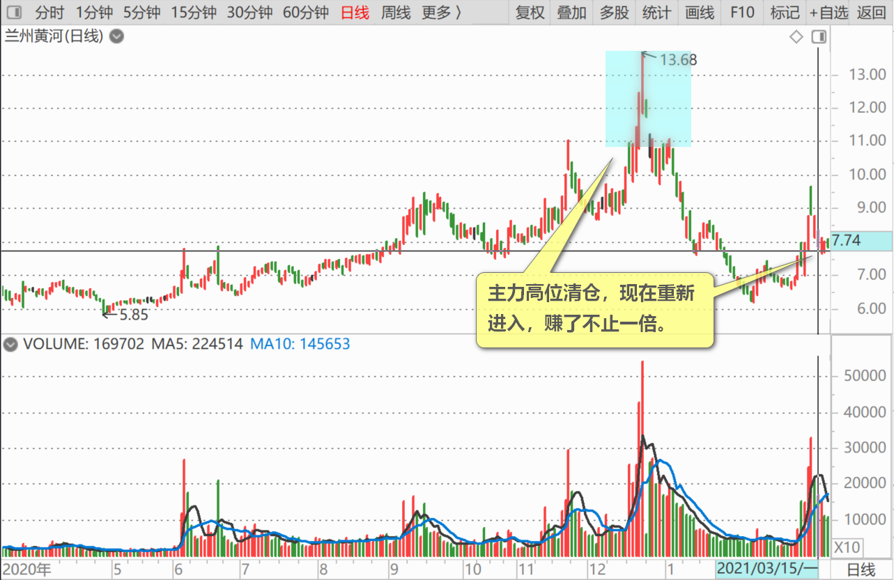
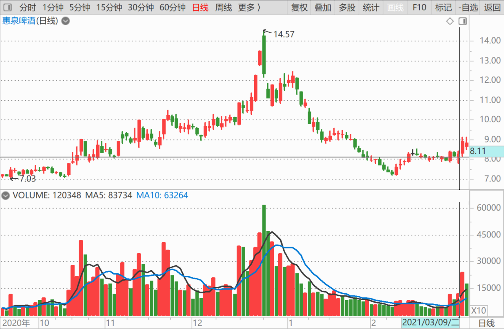
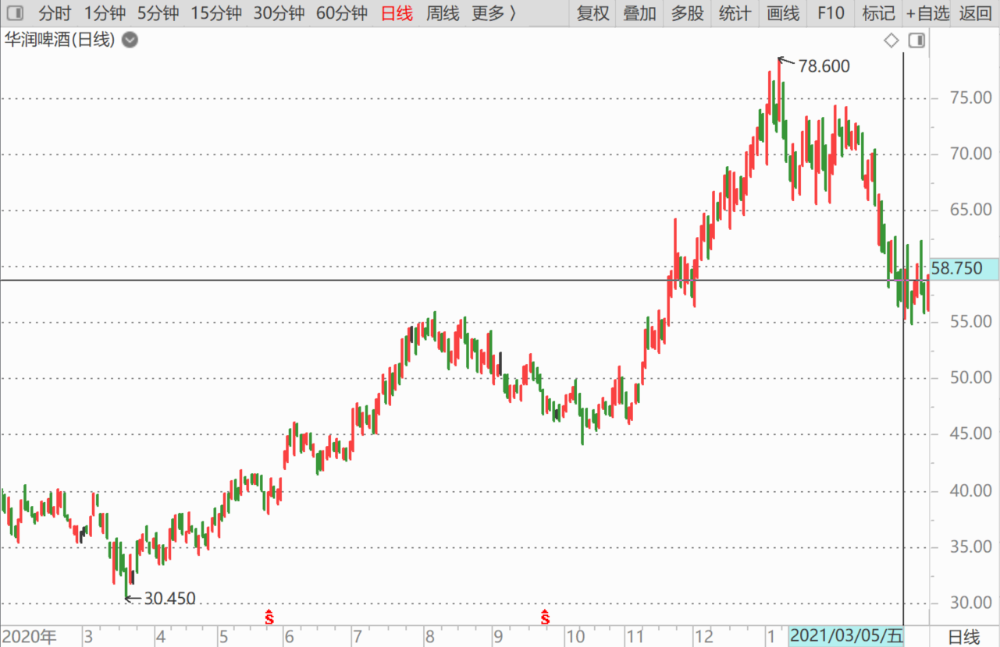

102篇.看他家走势，想像啤酒的未来走势

清一山长2021年3月1日～10日

**一、贵州茅台**

清一山长2021-03-01 21:59:48

[$贵州茅台(SH600519)$](http://link.zhihu.com/?target=http%3A//xueqiu.com/S/SH600519) **从周线上看，明显是加速赶顶，有人借机拉升出货的走势。**上周机构出货780个亿。不过，相对茅台三万亿的市值来说，这只是小菜一碟，算不上大出货吧？被套住的散户走不走呢？不知道。多看看K线图，熟悉这种走势。

**如果从惠泉啤酒的走势来看，加速赶顶之后，回撤了一半。**茅台毕竟是茅台，应该没有啤酒这么水的吧？[大笑]

清一山长2021-03-03 15:37:16

[$贵州茅台(SH600519)$](http://link.zhihu.com/?target=http%3A//xueqiu.com/S/SH600519) 个人认为，技术上说，2000～2100元，茅台的平台支撑还是很强的。如果出货过猛，1800元的平台支撑也更强，不太可能低于此线。未来在1800～2600元之间箱体震荡的可能性较大。

恭喜拿茅台赚了的人。我没有茅台，也不眼红你们，**只是看看茅台的走势，对我想象啤酒的未来走势，可能会有一定的帮助。**（我不懂酒，以为啤酒、白酒都是酒[大笑]）。

清一山长2021-03-09 23:33:47

[$贵州茅台(SH600519)$](http://link.zhihu.com/?target=http%3A//xueqiu.com/S/SH600519) 茅台跌得急了一点，特别是昨天，怎么有点控制不住的样子？2000多元的时候，我判断会跌到1800元一线才止跌。难道这么快就要下试1800元一线的支撑力吗？可怜这些2600元追买茅台的大神们，一手就要亏6～7万元[捂脸]。**今天成交161亿，有护盘痕迹。**

**白酒有些已经慢慢跌到价值区了，可以考虑重新建一点仓位了，**安全的股。我前期卖掉的迎驾贡酒、老白干等，还得再等一等。还是等我买入后，再分享吧！继续跌，就可以开始用啤酒换白酒了。原来一直是白酒换啤酒，证明换得不错，啤酒不跌了。

**二、老白干酒**

清一山长2021-03-09 23:51:54

[$老白干酒(SH600559)$](http://link.zhihu.com/?target=http%3A//xueqiu.com/S/SH600559) 以为永别了，没想到再回头，居然腰斩了——涨得急，跌得也快。不可思议。坚守白酒的小散，心理很苦吧？我们的啤酒觉得不好喝，没想到白酒更难喝。[捂脸]

[钱小鱼](http://link.zhihu.com/?target=http%3A//xueqiu.com/n/%25E9%2592%25B1%25E5%25B0%258F%25E9%25B1%25BC)回复[清一山长](http://link.zhihu.com/?target=http%3A//xueqiu.com/n/%25E6%25B8%2585%25E4%25B8%2580%25E5%25B1%25B1%25E9%2595%25BF)：

我记得您是9元买的

清一山长2021-03-10 09:33:21回复[钱小鱼](http://link.zhihu.com/?target=http%3A//xueqiu.com/n/%25E9%2592%25B1%25E5%25B0%258F%25E9%25B1%25BC)：

是的，9元买了一批。12元～15元也买过。涨高了，受不了，就几乎全卖了。正遗憾持仓就没白酒了

**三、兰州黄河**

清一山长2021-03-05 11:28:59

[$兰州黄河(SZ000929)$](http://link.zhihu.com/?target=http%3A//xueqiu.com/S/SZ000929) 这个是很典型的庄股。从图形上看，现在涨停不奇怪。

主力高位清仓，现在重新进入，赚了不止一倍。

再次回来，实力更加的雄厚，股性也摸得更透。未来难说会再创新高的，或者形成双头[为什么]。由于不知道该股的基本面情况，所以我根本不敢买这股。而且我有跟它类似的股，比如**惠泉啤酒，也是庄股，跌到7元多，算是跌透了。所以我再度满仓**（补回去年3季度的持有仓位就算满仓，如果再跌，就会超仓，当二大了。现在看来不给我机会超仓）。

一句话：**价值投机，是在有价值的基础上投机。惠泉啤酒、珠江啤酒都是这样的股。**兰州黄河，我就没看出啥价值来。就是知道是个庄股，跟庄赚了就行。投机派选兰州黄河不错[很赞]

**不过兰州黄河再度涨停，基本上也是一个信号：啤酒股，炒完一波后，将再度回归。**而且，这么短的时间就回归，说明未来基本面看好，**大家好好持有吧！别轻易丢掉了仓位。如果我有兰州黄河，今天的涨停，是不会走的。从K线图上看，今天只是开始罢了。**（我没有兰州黄河，此言论不代表推荐，只是投机，短线操作，看线的一些常识分享）

[龙哥还太小](http://link.zhihu.com/?target=http%3A//xueqiu.com/n/%25E9%25BE%2599%25E5%2593%25A5%25E8%25BF%2598%25E5%25A4%25AA%25E5%25B0%258F)回复[清一山长](http://link.zhihu.com/?target=http%3A//xueqiu.com/n/%25E6%25B8%2585%25E4%25B8%2580%25E5%25B1%25B1%25E9%2595%25BF)：

抄了哥哥的作业，9.51元买了宏桥

清一山长2021-03-05 12:08:55回复[龙哥还太小](http://link.zhihu.com/?target=http%3A//xueqiu.com/n/%25E9%25BE%2599%25E5%2593%25A5%25E8%25BF%2598%25E5%25A4%25AA%25E5%25B0%258F)：

好意思说抄我作业？我三元多买的[捂脸]。你买了，就是你买了，我不反对你买。但拜托别说是抄我的，不带这样黑人的。

**四、华润啤酒**

清一山长2021-03-05 12:13:12

[$华润啤酒(00291)$](http://link.zhihu.com/?target=http%3A//xueqiu.com/S/00291) **2020年利润超50%提升，但并不是销量大幅提升，只是裁员带来的利润增加。**《五谷财经》注意到，截止2020年上半年末，华润啤酒聘用约2.8万人，其中超过99%在中国内地雇佣，其余的主要驻守中国香港。

而2019年上半年末，华润啤酒聘用约3.5万人，其中超过99%在中国内地雇佣，其余的主要驻守中国香港。

看完这个消息，我在想：是不是再筹点钱，再多买一点燕京啤酒？啥？不是华润？

各位多想想，**华润裁员，对谁才是最大的利好？我以为是燕京**[大笑]。理由？你们想去吧？

(标题、图片为编者所加)

文章音频：

[550篇.看他家走势，想像啤酒的未来走势](http://link.zhihu.com/?target=https%3A//www.ximalaya.com/sound/834197432)

**参考链接：**
[93篇.揭开燕京的奥秘](https://zhuanlan.zhihu.com/p/18185937465)

[94篇.短期来说珠江和惠泉的趋势良好，股性更活](https://zhuanlan.zhihu.com/p/1960281323)

[95篇.燕京的经营很稳健](https://zhuanlan.zhihu.com/p/20722962985)

[96篇.啤酒的人均持股](https://zhuanlan.zhihu.com/p/21559367964)

[97篇.借燕京看粉转黑有多快](https://zhuanlan.zhihu.com/p/23176487676)

[98篇.我比唐建华还要保守](https://zhuanlan.zhihu.com/p/23175736428)

[99篇.避免涨停动作，消极以待](https://zhuanlan.zhihu.com/p/26670135074)

[100篇.那条绿线，我干的](https://zhuanlan.zhihu.com/p/27432186910)

[101篇.三家啤酒的走势](https://zhuanlan.zhihu.com/p/29771069394)
