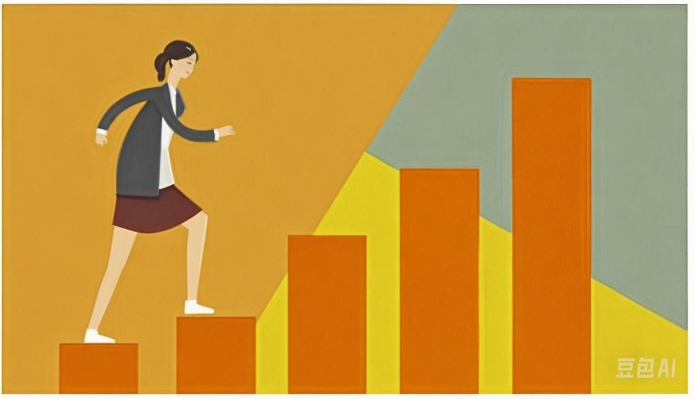

103篇.三个走势，两个稳健，一个怪异

清一山长2021年3月3日～10日

清一山长:2021-03-03 14:34:17

引用帖子内容：啤酒是我们生活必不可少的一个消费品，无论是朋友聚会，还是作为菜品的调料，它出现在我们生活的随处可见的地方。那么A股上市啤酒公司有哪些好标的？现在又是否值得投资呢？目前……（[https://www.cmtzz.cn/article/44933](http://link.zhihu.com/?target=https%3A//www.cmtzz.cn/article/44933)）

我刚打赏了这篇帖子￥18.99，也推荐给你,支持作者的这个逻辑。啤酒不是拿来炒的，是拿来长期持有的。**现在的啤酒，就是五年前的白酒,所以我们至少拿个五年吧**[大笑]

**特别是目前,我认为燕京啤酒具有比珠江啤酒更高的长期持有价值**（不谈炒作的逻辑，只谈内在实有价值的比较）。作为前珠江啤酒的十大，做出这个判断，不是我的屁股问题，而是我的判断和结论。当然，为了维护我的上述结论，已经把珠江的主要持仓在高位卖出，换成了低位的燕京啤酒。同时，也重新买入了高位卖掉的惠泉，继续维持十大地位不变。

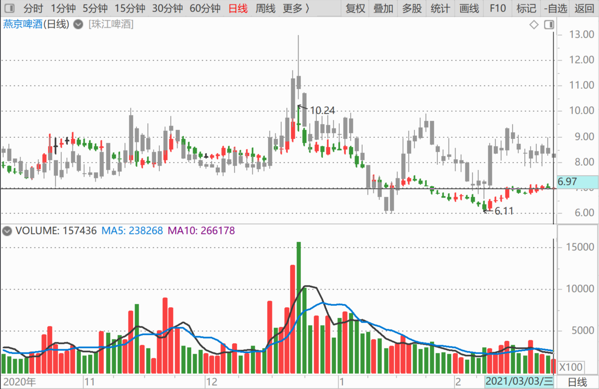

清一山长:2021-03-02 13:37:04

[$珠江啤酒(SZ002461)$](http://link.zhihu.com/?target=http%3A//xueqiu.com/S/SZ002461) 拉高出货图形。预后不良[捂脸]

今日无操作，随缘坐电梯[大笑]

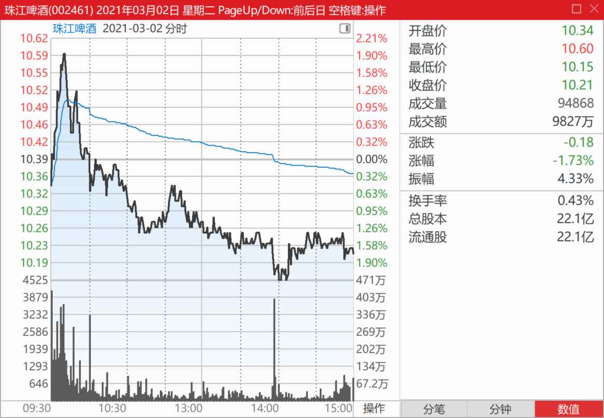

清一山长2021-03-05 11:01:05

[$惠泉啤酒(SH600573)$](http://link.zhihu.com/?target=http%3A//xueqiu.com/S/SH600573) 看样子，惠泉又恢复活力了。我的仓位也正好补回了三季度末期的位置。不知道现在算几大[大笑]

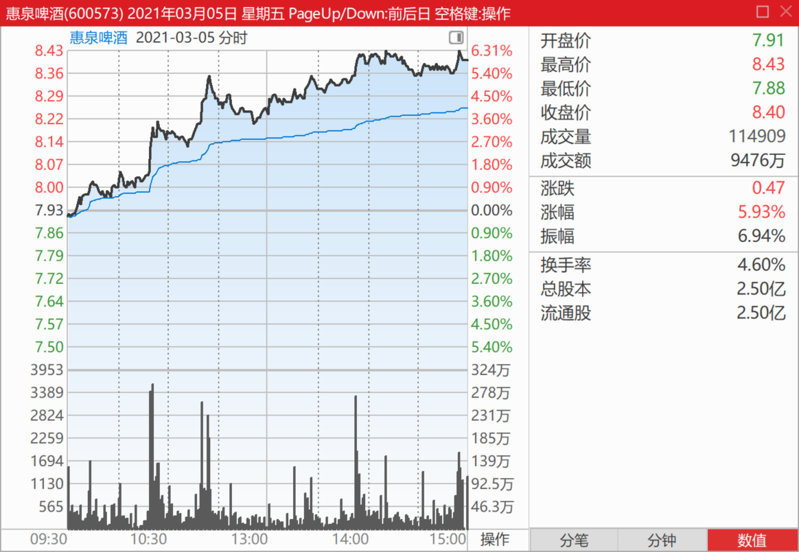

下图是珠江啤酒的走势。不得不说，**走势很怪异，拉得很急躁。**

惠泉的正常得多。本轮珠江涨停换惠泉和燕京，还是赚到了，算是一笔划算的买卖。

**永远买低估，涨跌均无心。不去期待就不会失望了。**

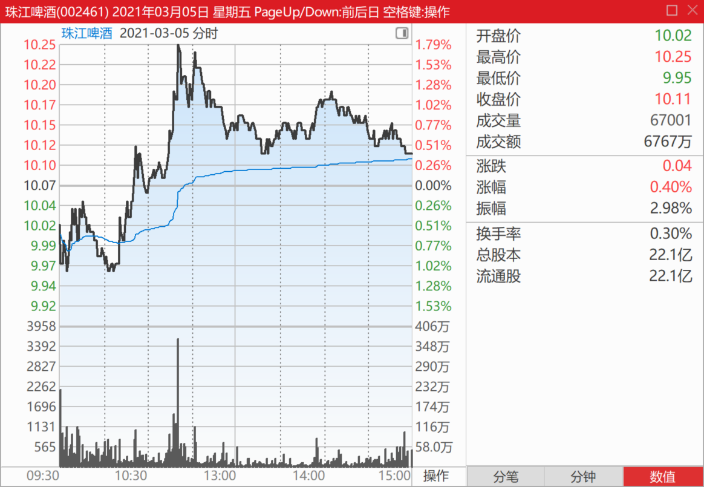

下图是燕京啤酒今天的走势，也挺稳健的。

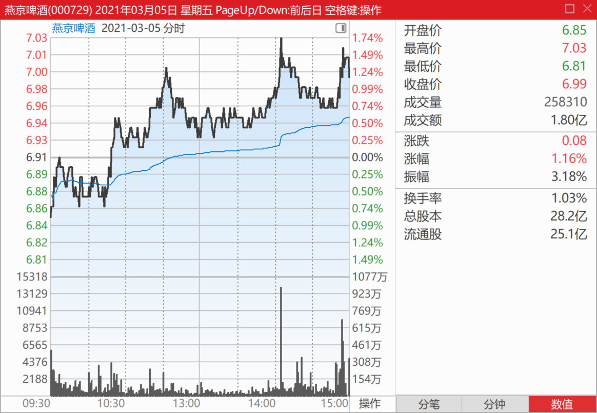

清一山长2021-03-05 15:01:13

[$惠泉啤酒(SH600573)$](http://link.zhihu.com/?target=http%3A//xueqiu.com/S/SH600573) 今天操作：8.41元卖出五万股惠泉，6.96元买入燕京啤酒。就是闹着玩的，涨不涨不管，股票的数量增加了倒是真的。我爱数量，不爱质量（价格）。

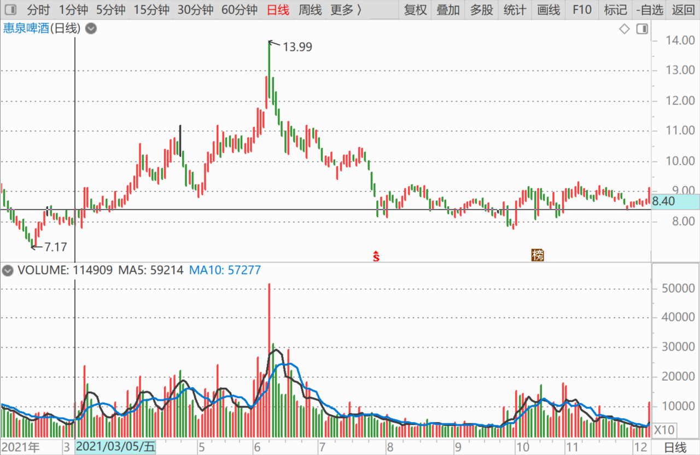

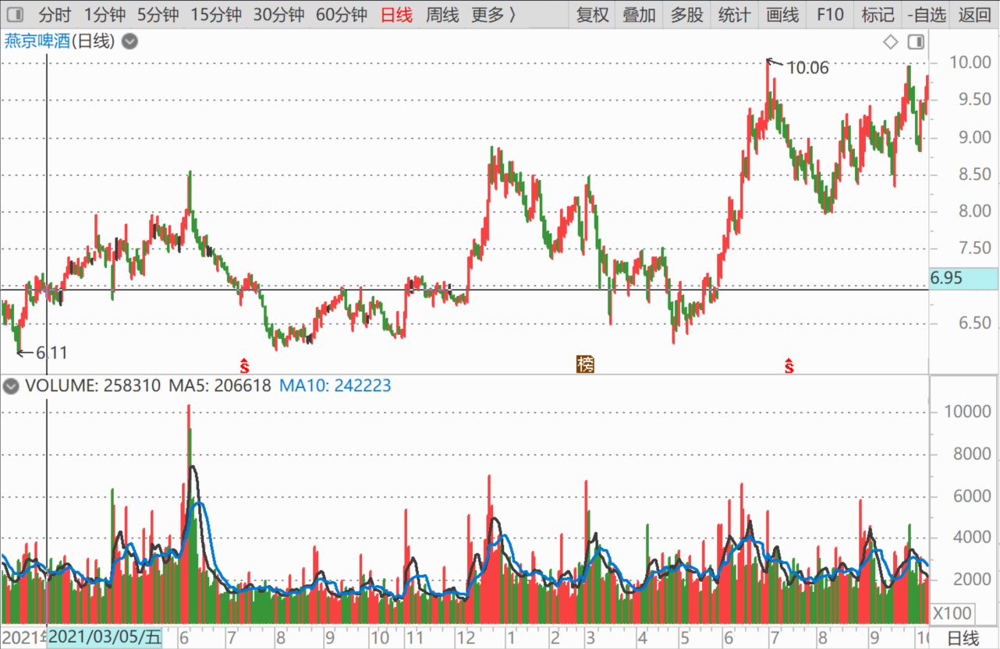

清一山长2021-03-09 11:52:09

[$惠泉啤酒(SH600573)$](http://link.zhihu.com/?target=http%3A//xueqiu.com/S/SH600573) 今天上午回踩确认支撑后上升，应该已经完成洗盘了，波幅蛮大的，惠泉新主力或者老主力的新动作。

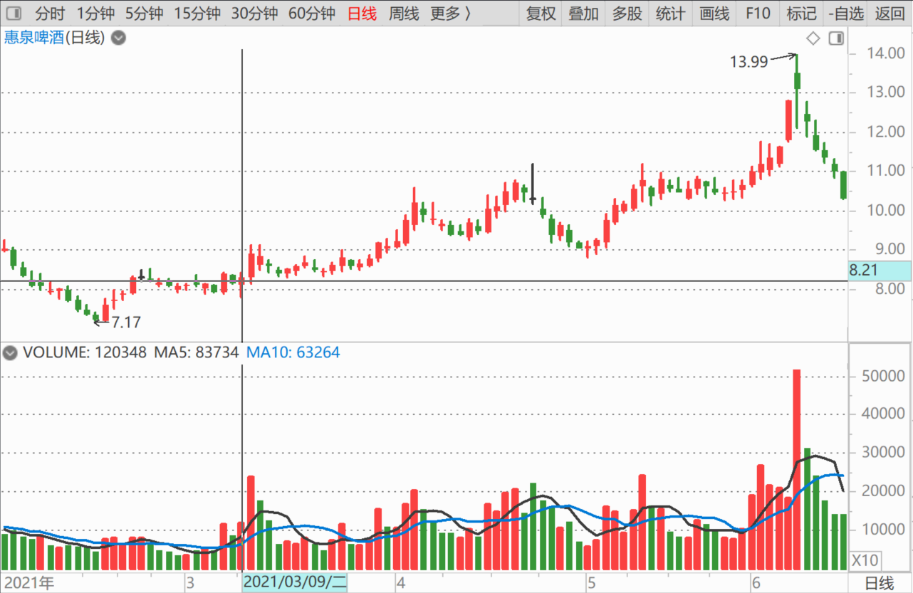

燕京继续死气沉沉，还没有想吸引眼球，只想逼走老仓。

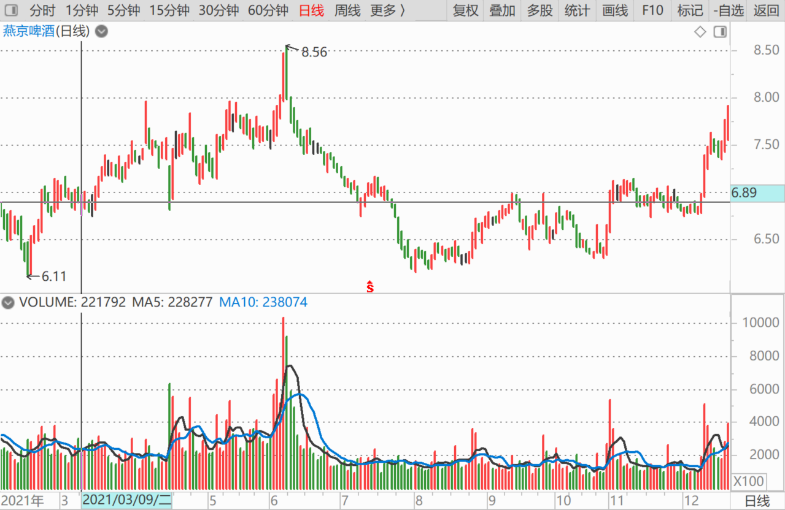

**珠江走势，依然怪异难解，也可以是回踩9.55元确认底部支撑后上升。**只是——总觉得有点不正常。

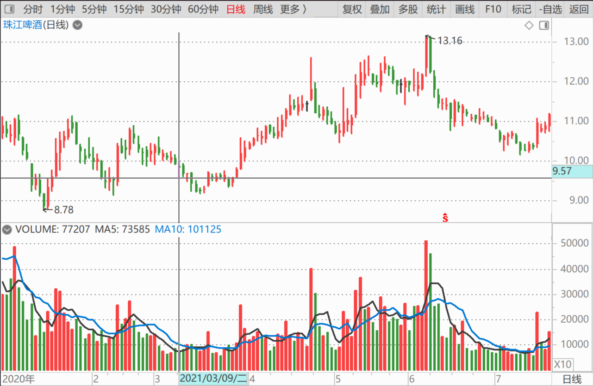

清一山长2021-03-10 11:54:50

[$惠泉啤酒(SH600573)$](http://link.zhihu.com/?target=http%3A//xueqiu.com/S/SH600573) 昨天我说：惠泉已经完成洗盘动作，下一步该涨了。今天果然拉升。目前看走势很稳健，明显的多头排列，未见出货迹象。**主力耐心消耗获利盘，稳步推升，后市可期。**

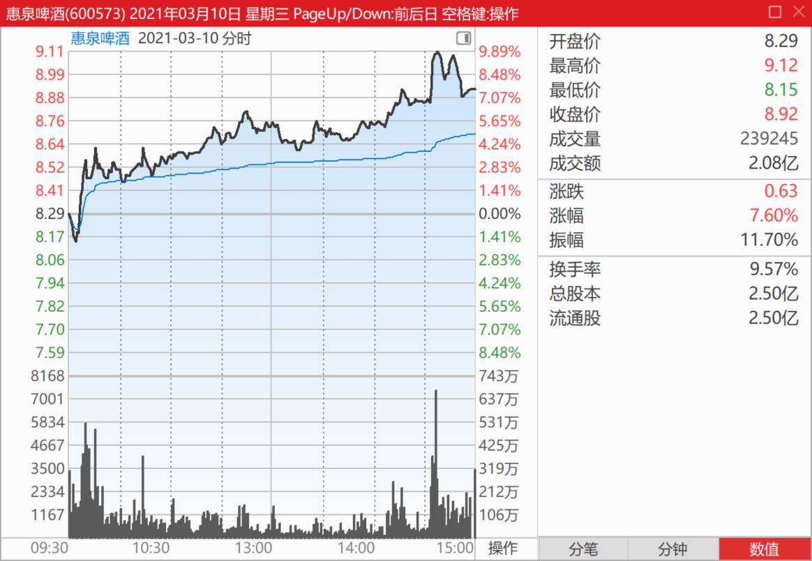

我三大稳稳地坐在惠泉的轿子上，手上很多的筹码，创个人的惠泉持仓新高记录，不少筹码还是用年前涨停的珠江啤酒换来的。珠江跌了不到一元，惠泉涨了一元左右，说明这换股的生意，还是很划算的（我就是不明白珠江啤酒为何走势这样衰弱？难道就是多拿了我的两百万股货吗？[大笑]）。**惠泉如果涨过了珠江，我还是换回来吧！我有点恋旧！**

对比：珠江啤酒的走势，怪异，无法理解。涨停卖掉珠江，是我运气好。因为我见不得别人抢东西，一抢，我就忍不住送人。**抢筹码，我就送筹码。不要筹码，只想抢钱，跌停了，我就出钱来换别人不要的筹码。**珠江如果再这样跌下去，我不忍心，就只能回来救救珠江了[大笑]。

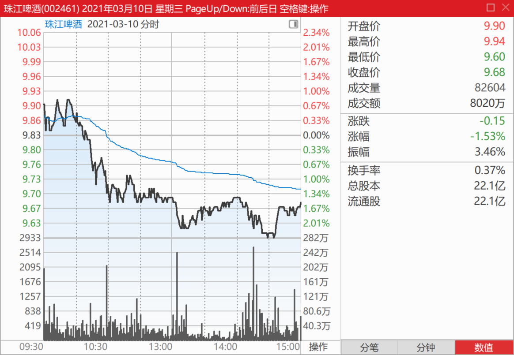

[pfstudio](http://link.zhihu.com/?target=http%3A//xueqiu.com/n/pfstudio)回复[清一山长](http://link.zhihu.com/?target=http%3A//xueqiu.com/n/%25E6%25B8%2585%25E4%25B8%2580%25E5%25B1%25B1%25E9%2595%25BF)：（跟评上贴）

现在还能进吗？

清一山长2021-03-10 13:01:30回复[pfstudio](http://link.zhihu.com/?target=http%3A//xueqiu.com/n/pfstudio):

当然不能！不能买，也不能卖。只能看！[大笑]

清一山掌2021-03-10 15:14:32

[$惠泉啤酒(SH600573)$](http://link.zhihu.com/?target=http%3A//xueqiu.com/S/SH600573) 没注意就冲了涨停[大笑]。看到后就挂了9.10元的单子卖掉。本想比涨停价低一分钱的，但911似乎不吉利，就挂了910，结果，当然没卖掉。说明人家就不想要。今天要封涨停的话，我先出一百万股，满足抢筹的需要。没人想要，我就留下来算了。

观察盘面，主力并不想要货。只想大家一起推进，非常小心的主力，不多拿货，财务控制极严。手法上看，应该还是原来的老主力重新进入的。

今天惠泉已经形成了一个典型的突破。**几个啤酒，各走各的，互不相关。**啤酒的板块效应消失了。未来应该是个股表演吧？

提示：别说跟我买惠泉，特别是今天。我不喜欢看到这种人冒出来乱说。

我的惠泉持仓是200多万股，持仓成本1.32元。你要说跟我，你是跟我的价格，还是跟的我的量？不是，就别说跟，你买你的，我买我的。各不相关！

[凯宝歌](http://link.zhihu.com/?target=http%3A//xueqiu.com/n/%25E5%2587%25AF%25E5%25AE%259D%25E6%25AD%258C)回复[清一山长](http://link.zhihu.com/?target=http%3A//xueqiu.com/n/%25E6%25B8%2585%25E4%25B8%2580%25E5%25B1%25B1%25E9%2595%25BF):（跟评上贴）

山大，怎么从盘面看是老主力，不多拿货，财务控制极严呢？

清一山长2021-03-10 21:59:04回复[凯宝歌](http://link.zhihu.com/?target=http%3A//xueqiu.com/n/%25E5%2587%25AF%25E5%25AE%259D%25E6%25AD%258C)：

就算你付给我一百万元学费，你学会这一条的本事，你都是大赚的[大笑]。

可惜，就算你付我一千万，我都不知道怎样把你教会！如果你不会的话。所以，**我儿子都不学我的这些本事，我让他学巴菲特就行了。**巴菲特的更容易学一些。

(标题、图片为编者所加)

文章音频：

[554篇. 三个走势，两个稳健，一个怪异](http://link.zhihu.com/?target=https%3A//www.ximalaya.com/sound/840005719)

**参考链接：**

[96篇.啤酒的人均持股](https://zhuanlan.zhihu.com/p/21559367964)

[97篇.借燕京看粉转黑有多快](https://zhuanlan.zhihu.com/p/23176487676)

[98篇.我比唐建华还要保守](https://zhuanlan.zhihu.com/p/23175736428)

[99篇.避免涨停动作，消极以待](https://zhuanlan.zhihu.com/p/26670135074)

[100篇.那条绿线，我干的](https://zhuanlan.zhihu.com/p/27432186910)

[101篇.三家啤酒的走势](https://zhuanlan.zhihu.com/p/29771069394)

[102篇.看他家走势，想像啤酒的未来走势](https://www.zhihu.com/column/c_1473746162334826496)
