**

**

105篇.老老实实等大波段

清一山长2021年3月16日～18日

清一山长2021-03-16 12:18:14

[$燕京啤酒(SZ000729)$](http://link.zhihu.com/?target=http%3A//xueqiu.com/S/SZ000729) 提醒大家一句话：**燕京啤酒正在悄然走强，**鬼子已经进村，账面是绿色的，因为前期打下来花费了筹码，现在正在稳定的吸筹。自己看日线走势，再比较大盘走势，就知道了。我已经满仓，超仓燕京。

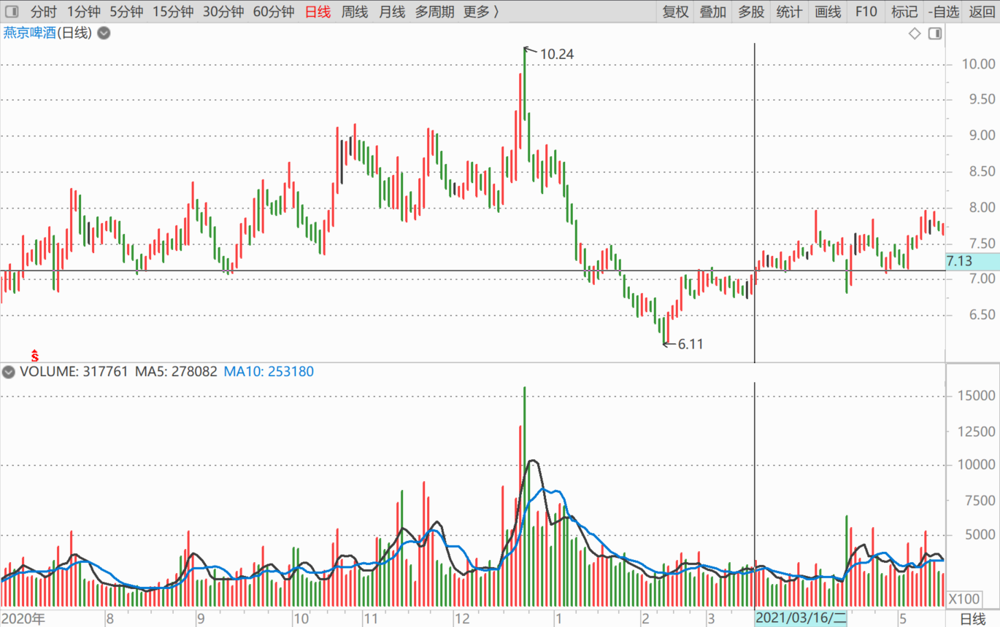

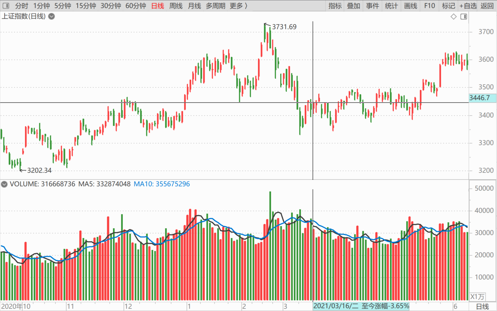

**下图，这个不是出货走势，而是建仓走势。**但故意地弄得像出货的样子。如果高位这样走，量大就是真出货。现在这样走，是假的，量也不大。

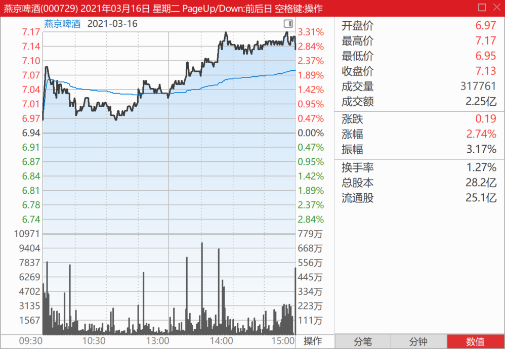

另外，下图是珠江啤酒的走势，这让我非常的奇怪。这种走势，是不想要货，不想拉升，但也不想低价卖货，所以这样拉拉打打地走。

但是，我认为：**这个价格，珠江啤酒的主力应该是他们的近半年以上的进货成本区**，为啥不珍惜筹码？

另外一种理由，就是故意地整出一点起伏波动来，赚些差价。主要是珠江啤酒上次冲高涨停，可能吃进了珠江啤酒主力不想要的货。比如我的货都基本倒给他了。当时的价格，我自然换燕京更划算，当然看你涨停我就要跑路。上次惠泉啤酒敢拉涨停，我也卖货跑了的。估计很多人都会这样做，所以，珠江啤酒主力这一次冲高不太成功，有点超仓，就想出掉一点回笼资金下次再干？其实量也不大，就是走势不好看。再跌我就买回来算了，至于弄这么难看吗？**9.22元我买了几万股。**

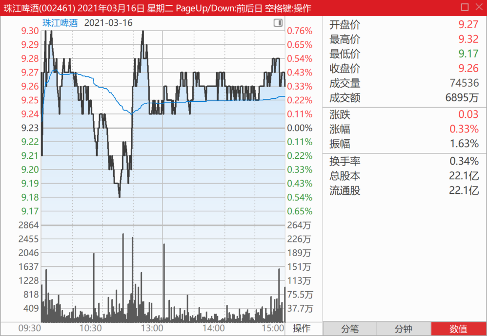

惠泉啤酒，快跌回冲涨停这一天的起涨点了。我弄不清它在玩什么？继续看，重仓持有中。**量能萎缩明显，很快就要变盘了。**

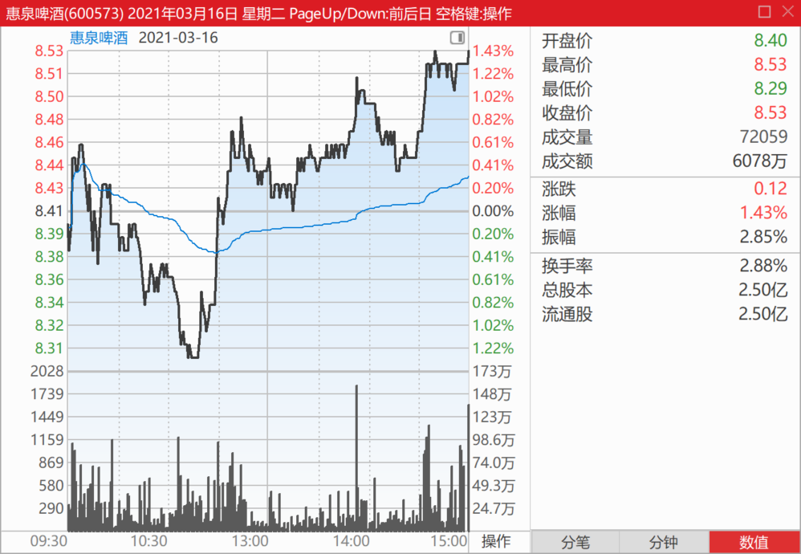

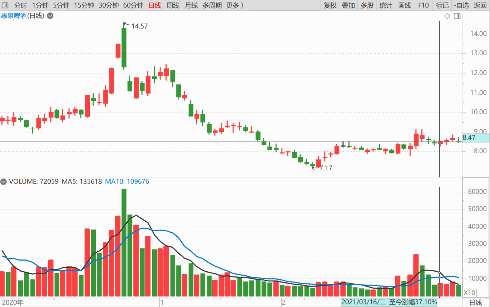

[沉栗子](http://link.zhihu.com/?target=http%3A//xueqiu.com/n/%25E6%25B2%2589%25E6%25A0%2597%25E5%25AD%2590)回复[稳住莫慌](http://link.zhihu.com/?target=http%3A//xueqiu.com/n/%25E7%25A8%25B3%25E4%25BD%258F%25E8%258E%25AB%25E6%2585%258C)：

我也不知道你在这T啥呢！T个9分钱。

[清一山长](http://link.zhihu.com/?target=https%3A//xueqiu.com/9310099567)2021-[03-16 15:16](http://link.zhihu.com/?target=https%3A//xueqiu.com/9310099567/174572512)回复[沉栗子](http://link.zhihu.com/?target=http%3A//xueqiu.com/n/%25E6%25B2%2589%25E6%25A0%2597%25E5%25AD%2590)：

蚊子腿上也是肉[大笑]。他吃这一口就已经很满意了，可以买好几盒盒饭的。这些人是机构的最爱，制造了很好的流动性。

我就被主力讨厌了。今天账上多了M级的浮盈，也懒得动一下（当然也动不了，卖了就买不回来），我只能等涨停才好卖。

[清一山长](http://link.zhihu.com/?target=https%3A//xueqiu.com/9310099567)2021-[03-16 16:03](http://link.zhihu.com/?target=https%3A//xueqiu.com/9310099567/174577823)

上午收市，我说话的时候只涨了8分钱。下午涨到超过0.20元了，收盘涨0.19元。

上午我看走势不对，就好心提醒大家别乱T。有人不就7.04元卖掉想7.00元接回T飞了吗？这几分钱，也值得费神T。真把自己当神了。做对了赚几分钱，做错了，丢五倍，十倍的利。

**拿了燕京，学唐建华吧！**别人几千万股拿着几年都一动不动，过9元几次了都没卖出。只有没见过钱的人，才4分钱都弄来吃了。一只鸡，刚孵出来就拿来烤了吃。这真是穷疯了。[大笑]

[清一山长](http://link.zhihu.com/?target=https%3A//xueqiu.com/9310099567)[2021-03-17 13:22](http://link.zhihu.com/?target=https%3A//xueqiu.com/9310099567/174665685)

[$燕京啤酒(SZ000729)$](http://link.zhihu.com/?target=http%3A//xueqiu.com/S/SZ000729)** 今天上午的走势判断：标准的吸筹动作，**比前期性急了一点点。估计是要赶在年报、一季报之前，完成吸筹。下午不排除回落，但未来逐级上升是必然的。你们不想低价让掉筹码，就拿好别乱T。上周7元以下，我就又多吸了几十万股进来，现在也不想卖。我想等年报、季报出来后，再考虑是否减一点仓位。

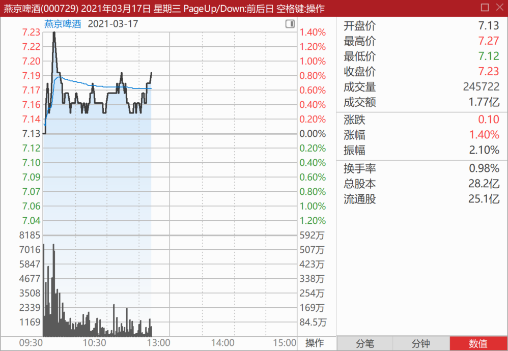

一个信息供思考：仅仅漓泉啤酒一家分公司，一年的净利润就有五个多亿，销量或者利润都相当于一个珠江啤酒。但是，由于销量比漓泉还多两倍的燕京品牌却是亏本的，全年利润是负的两个多亿。所以，导致燕京的整体价格还不如一个珠江。但是，万一燕京不亏了，市值肯定就要超过珠江了。如果燕京甚至开始盈利了，就至少要两倍于珠江才正常。我认为将来这是必然的，就是不知道什么时候实现。所以珠江10元以上，我肯定要卖掉换6元多的燕京。也许燕京2021年就开始盈利，这样燕京必然业绩大爆发。这就是燕京的未来。

我是投机交易者没错，但是别忘了我也是【**价值投机派**】，我一样要研究基本面，强调价值股为基础核心，加上技术图形来放大盈利，我只在基本面良好的情况下投机。不然，我为啥看好K线图走势很理想，6元左右明显可以买入，我却坚持不买兰州黄河？错过三个涨停毫无遗憾？因为兰州黄河的“价值”我看不到，只看到了它的投机。我认为安全度不够高。

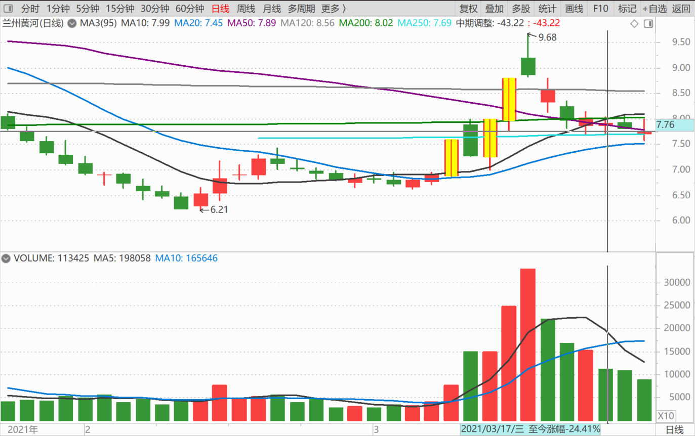

**我重仓燕京，是因为看到了燕京主品牌亏损带来的整体低估机会。**从价值上——燕京的公司，绝对不是只该卖1.5PB的货色。我认为从基本面来说，重庆啤酒未必比燕京啤酒的更好。特别长远来看中国的崛起，只有燕京啤酒这种才是“纯国货”。其他品牌或多或少都沾点洋气，比如青岛啤酒，前两年日本啤酒集团把大股东让给复星集团了，不然也是外资大股东的，但复星是股权投资者，一涨就会卖。所以筹码锁定未必能够比北京国资委的稳定。下一代年轻人，不像老一代青睐进口啤酒，更喜欢“国潮”，所以，**燕京啤酒我越跌越买，而且是准备长期投资，不松口的。**（高位会减仓降低成本，但不会清仓）。

[清一山长](http://link.zhihu.com/?target=https%3A//xueqiu.com/9310099567)2021-[03-17 15:43](http://link.zhihu.com/?target=https%3A//xueqiu.com/9310099567/174687253)

[$燕京啤酒(SZ000729)$](http://link.zhihu.com/?target=http%3A//xueqiu.com/S/SZ000729) 上午点评。我说是吸筹走势，强势，下午不排除回调一点，判断是逐级提高。其实就是告诉你：**主力不会舍得用筹码来打压**，**让你有做T的机会。**你见高就走，可以趁机拿走了不回头。但别以为你聪明，乱作T。

现在把下午的走势发出来：你自己看看，有无做T的空间？都在节节走高。尾巴掉了一点，没有在最高价7.26元维持住，但也不往下压。今天又涨了1毛钱，成交比昨天更低。说明现在抛压不重，下一步继续看高一线。

其实，你们拿了燕京，也没啥好看盘的。直接拿着等10元以上就行了。10元之前，会有些震荡，来回啥的，但你们就别想赚这些钱了。这钱不好拿，老虎嘴里面掏食吃呢！别看我总能捞一点小肉吃，这是我属兔的，跑得快，进退都方便**。你们身子又不行，就老老实实地等大波段，别赚小钱了。**

不过，你觉得自己就是聪明，就自己玩T吧！有本事就从虎牙里面剔几分钱的肉渣吃吃，就像昨天T出去想赚4分钱差价的伙计，今天下午，整个都没有给赚四分钱的机会。[大笑]

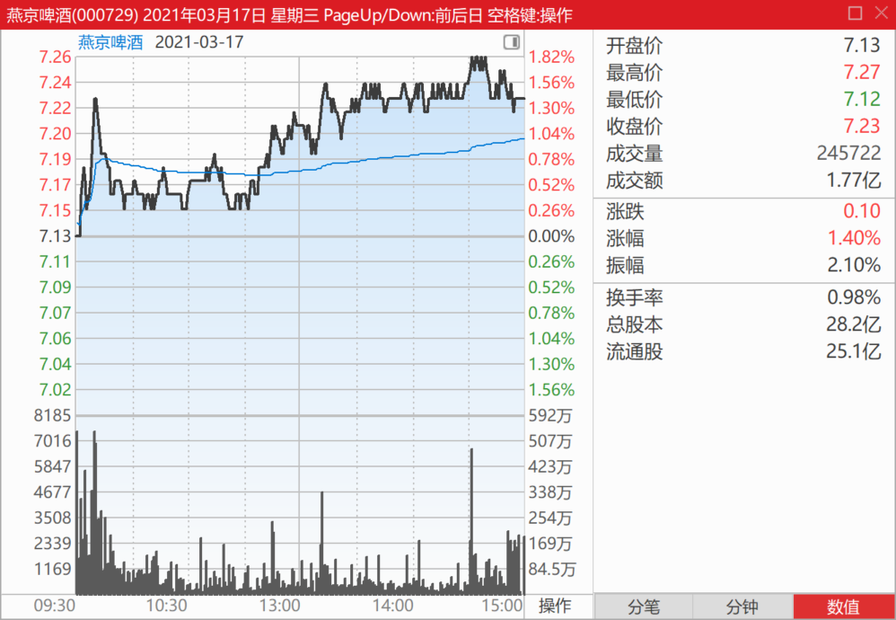

[清一山长](http://link.zhihu.com/?target=https%3A//xueqiu.com/9310099567)2021-[03-18 10:00](http://link.zhihu.com/?target=https%3A//xueqiu.com/9310099567/174751776)

[$燕京啤酒(SZ000729)$](http://link.zhihu.com/?target=http%3A//xueqiu.com/S/SZ000729) 今天还有人继续做T吗？看这个图形，很美妙的做T图形。今天高低差0.20元，您拿到没？[大笑]

申明：**我现在不做T，我只看你做**！

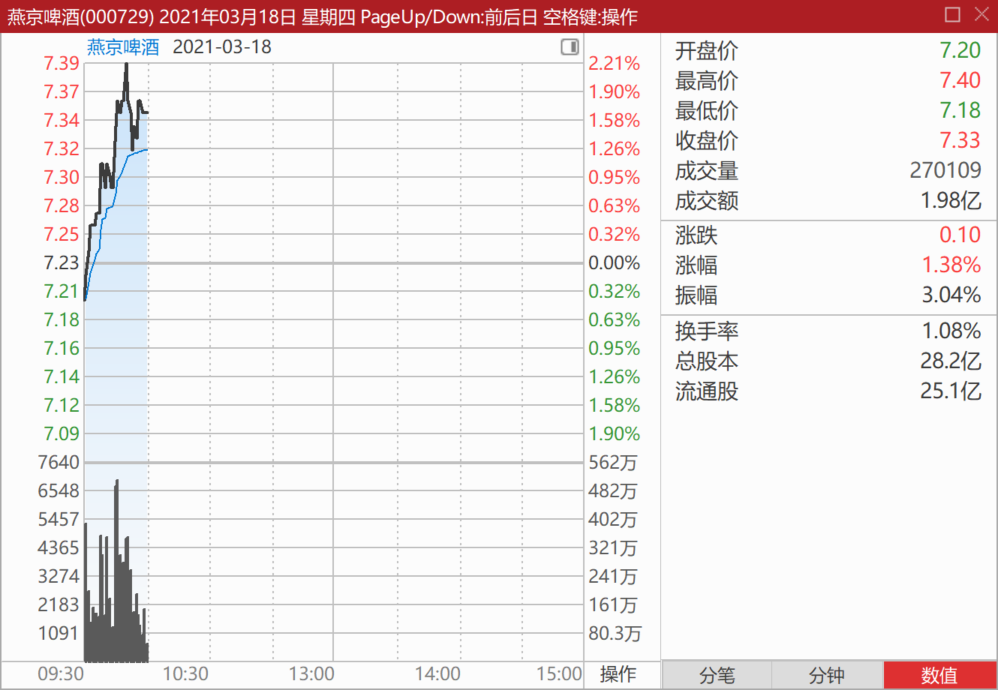

[清一山长](http://link.zhihu.com/?target=https%3A//xueqiu.com/9310099567)2021-[03-18 12:09](http://link.zhihu.com/?target=https%3A//xueqiu.com/9310099567/174771498)

[$珠江啤酒(SZ002461)$](http://link.zhihu.com/?target=http%3A//xueqiu.com/S/SZ002461) 前几天，**珠江啤酒9.22元我买了一万股。原因就是技术图形很吸引人，觉得这个价格到底了，**认为是珠江啤酒的极限价。但为啥不多买？因为燕京啤酒更划算，珠江啤酒只是恋旧，买一万股也只是玩一下。高位的股，我不喜欢示范出来。所以没吭声，怕人跟学。燕京啤酒跟学吃不了啥亏，珠江啤酒毕竟原来价格比燕京啤酒很低，买了怕有意外，所以不分享出来了，我也不多买。

结果现在来看，买谁都是对的，珠江这一笔小游戏，一万股的利润，赚了4K多，够我吃两个月的饭了。

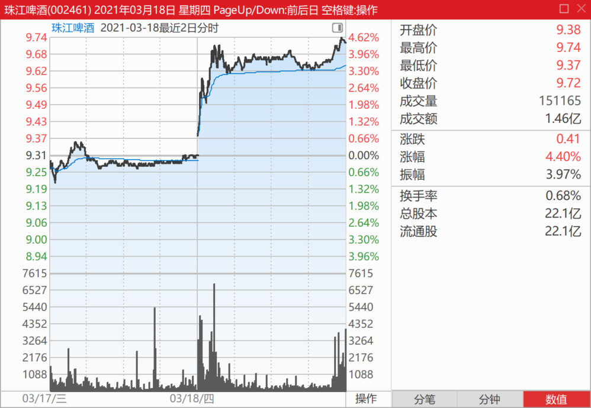

[清一山长](http://link.zhihu.com/?target=https%3A//xueqiu.com/9310099567)[2021-03-18 16:07](http://link.zhihu.com/?target=https%3A//xueqiu.com/9310099567/174796125)

[$燕京啤酒(SZ000729)$](http://link.zhihu.com/?target=http%3A//xueqiu.com/S/SZ000729) 尾盘2:45分钟，这么11097手的吃盘有点意思。可以确认燕京啤酒转入强势了，吃盘很有节制，不多吃价格，只加两分钱的价。但在乎量，有量就吃掉，然后继续等。说明：还没有到拉升的时候，主力根本就没吃饱，跟珠江啤酒的走势形成区别。

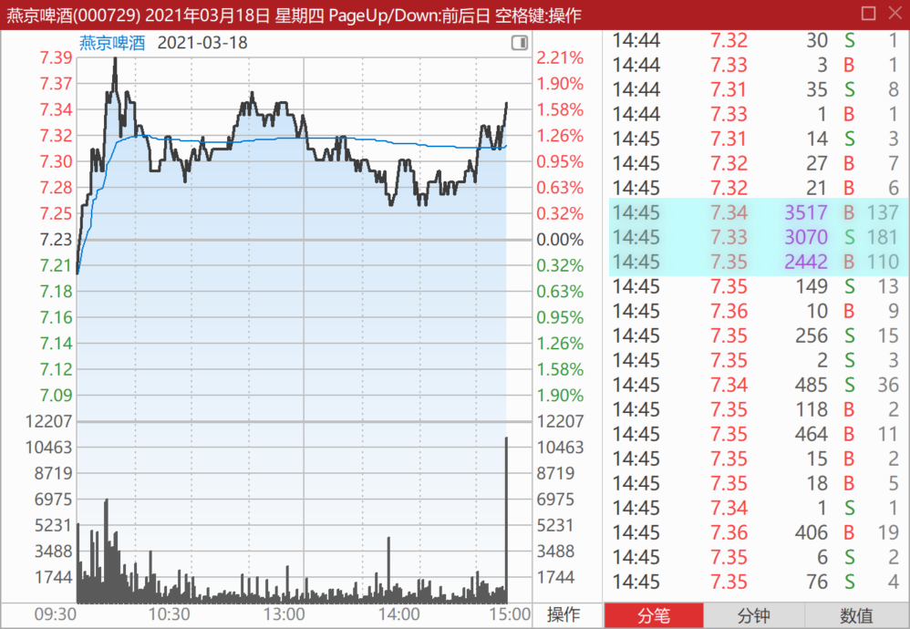

珠江啤酒今天涨得蛮好的。**今天算是跳涨，确认了上周是故意地打压，**一天之内就恢复了上周一周的失地。既然是故意地打压，这么快恢复原价，有点想不通道理。有钱任性？因为也不是出货，也不是进货的走法。唯一剩下来的理由，就是制造震荡，获取差价？

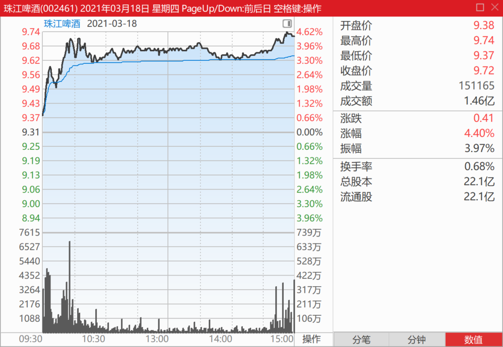

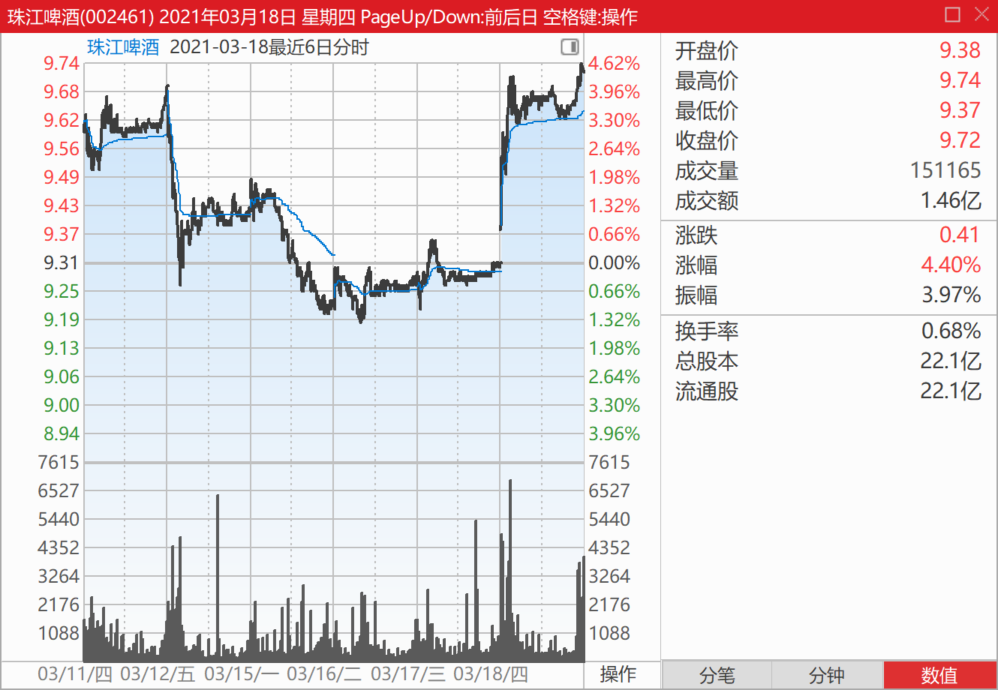

[清一山长](http://link.zhihu.com/?target=https%3A//xueqiu.com/9310099567)2021-[03-18 16:04](http://link.zhihu.com/?target=https%3A//xueqiu.com/9310099567/174798711)

[$重庆啤酒(SH600132)$](http://link.zhihu.com/?target=http%3A//xueqiu.com/S/SH600132) 一个多月都没看重庆啤酒，今天看看：居然最低点80多元，近乎腰斩，比燕京啤酒、珠江啤酒走势惨多了。拿它的人，脸都绿了吧？高位满融的人，应该爆仓了吧？

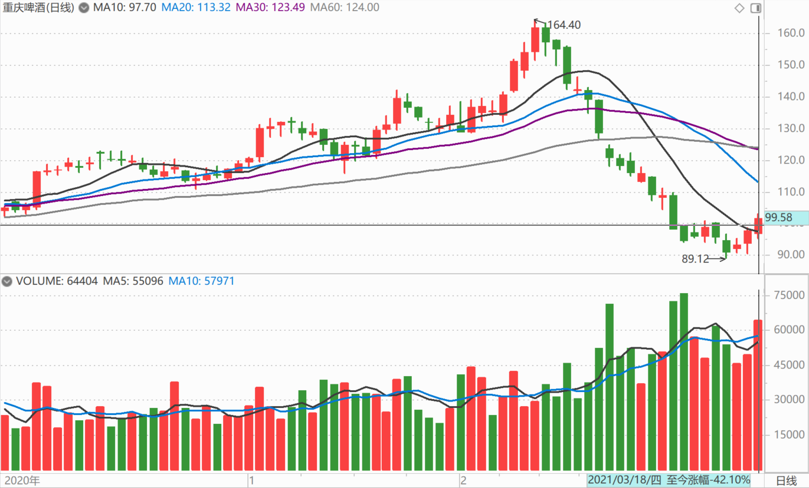

下面看看珠江啤酒的日线图：拿着珠江啤酒有多舒服滋润，稳稳的不太动。是不是差距太大了？

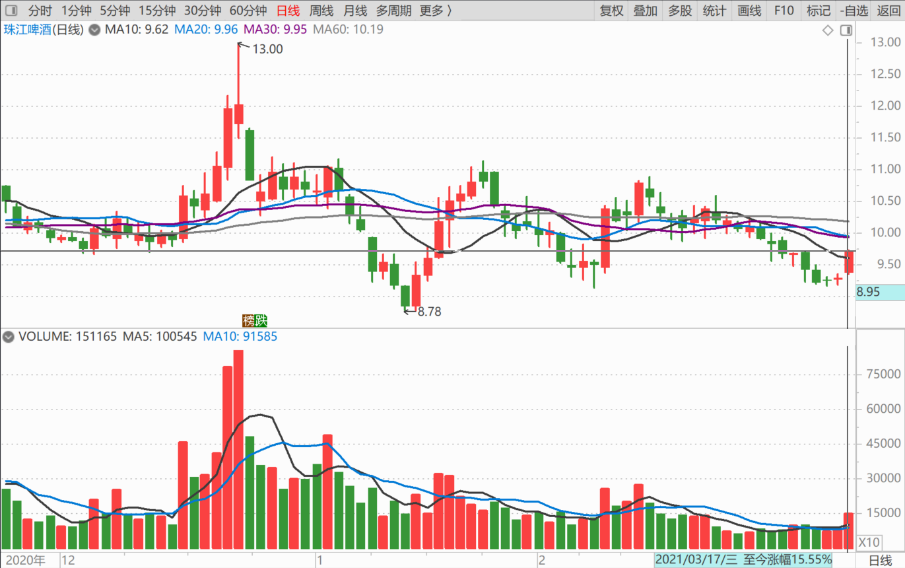

不过，别看重庆啤酒跌多了，现在企稳就想进来了。我提醒一句话：现在的价格，的确打了折，6折吧！不过跟买衣服一样，重庆啤酒的164元是标价，这个价格，没几个人手上有货的。我自然也没有，只能看着干瞪眼的，也没有多少人想要货的。

正常情况下，最高点附近，成交是最多的。你看燕京啤酒、惠泉啤酒，都是高点成交大增。惠泉啤酒最典型，但跌下来就没量了。

**这个重庆啤酒跌下来量比最高点还高。说明啥？主力高位没有机会出，现在次高位，也一样想出。**十几元拉起来的，80元、100元卖给你，都是赚。换了我，也一样高高兴兴地卖给你，如果你要的话。

申明：只是看盘，没有持有重啤，也不计划买，只是参考。**未来的燕京啤酒或者惠泉啤酒，会不会走成重庆啤酒的样子？**我应该何时开溜最好？[大笑]

(标题、图片为编者所加)

文章音频：

[570篇. 老老实实等大波段](http://link.zhihu.com/?target=https%3A//www.ximalaya.com/sound/871988655)

**参考链接：**

[98篇.我比唐建华还要保守](https://zhuanlan.zhihu.com/p/23175736428)

[99篇.避免涨停动作，消极以待](https://zhuanlan.zhihu.com/p/26670135074)

[100篇.那条绿线，我干的](https://zhuanlan.zhihu.com/p/27432186910)

[101篇.三家啤酒的走势](https://zhuanlan.zhihu.com/p/29771069394)

[102篇.看他家走势，想像啤酒的未来走势](https://www.zhihu.com/column/c_1473746162334826496)

[103篇.三个走势，两个稳健，一个怪异](https://zhuanlan.zhihu.com/p/1895973245435479673)
