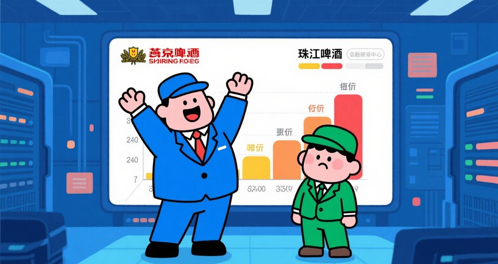
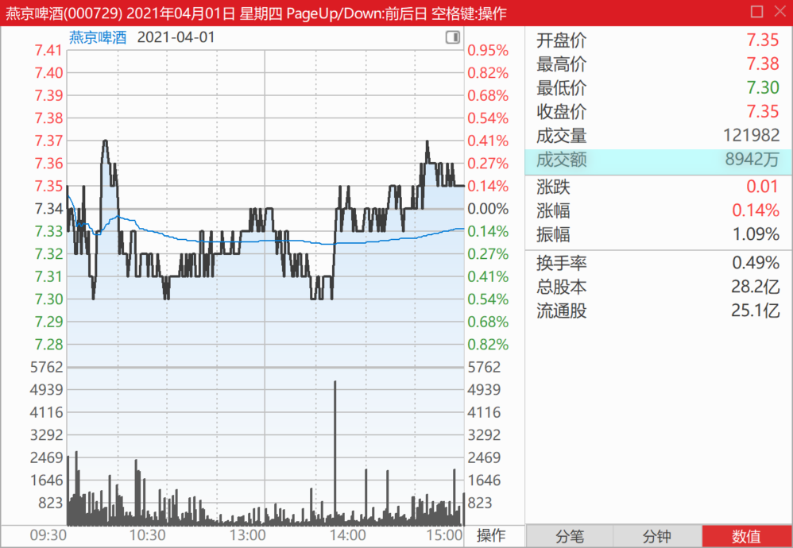
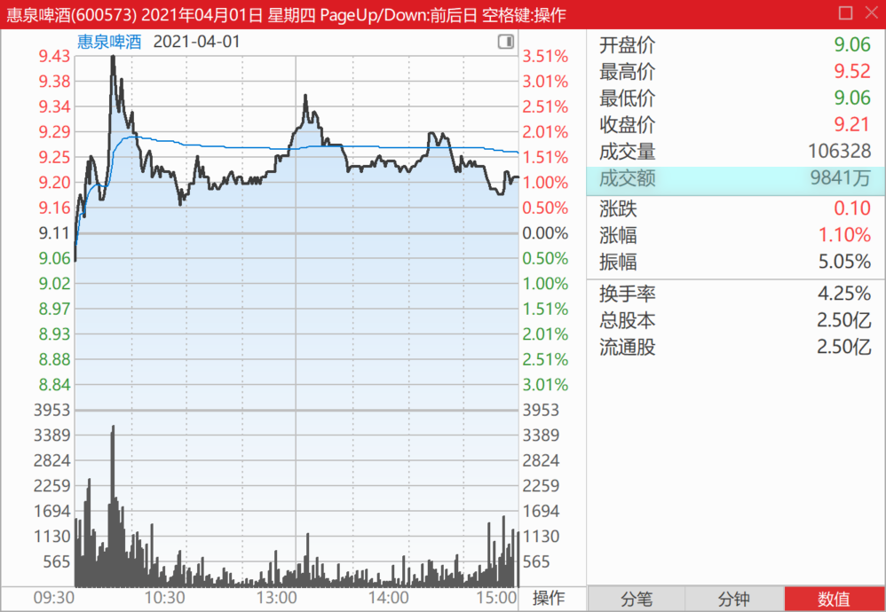
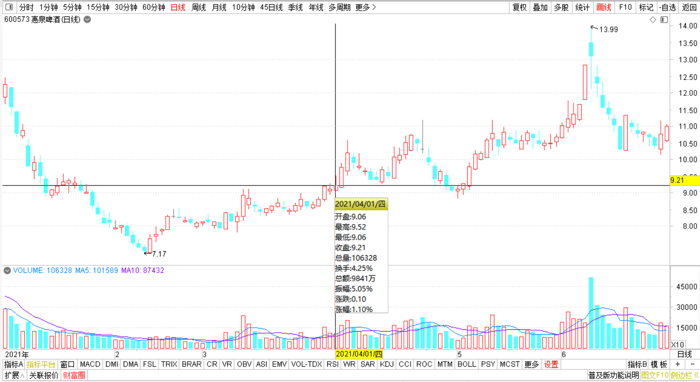
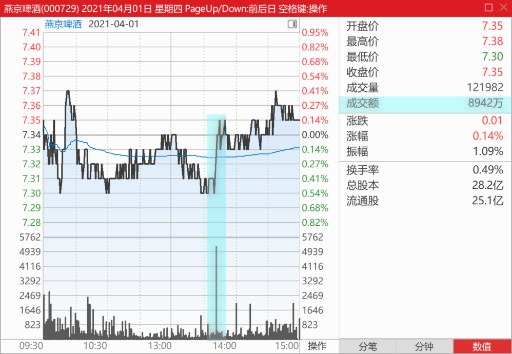
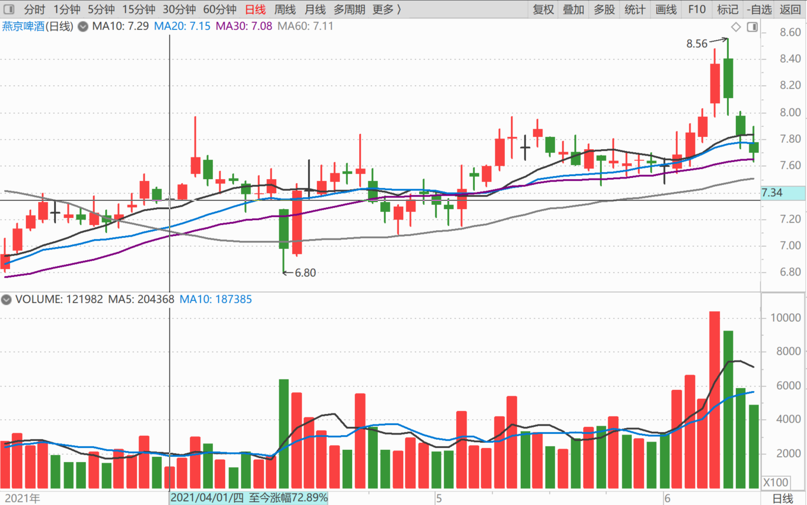
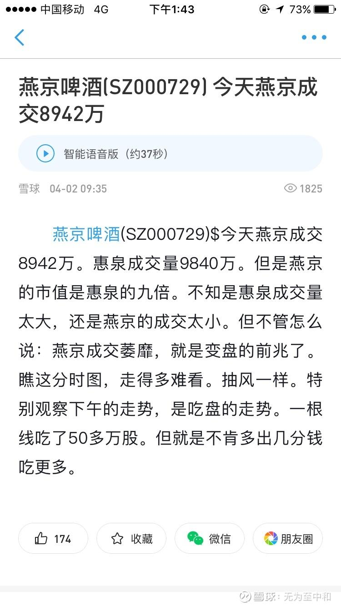
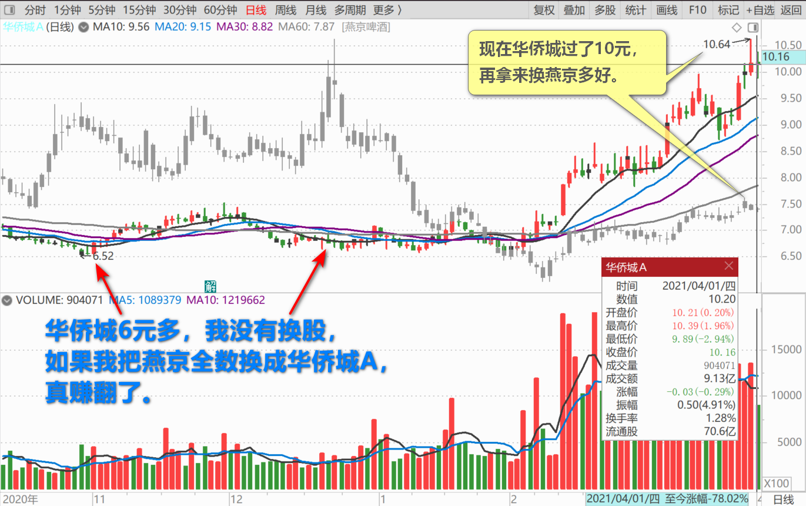

107篇.我赌燕京市值至少是珠江的一倍

清一山长2021年4月1日

一、**我赌燕京市值至少是珠江的一倍**

[$燕京啤酒(SZ000729)$](http://link.zhihu.com/?target=http%3A//xueqiu.com/S/SZ000729)

消息一：漓泉啤酒“2020年，面对疫情带来的不利影响，公司全年共产销啤酒90.7万吨，实现工业总产值36.48亿元，实现税金6.54亿元，利税总额12.33亿元。

消息二：珠江啤酒股份有限公司发布公告，公司2020年度实现总营收42.49亿元，同比增长0.13%；完成啤酒销量119.94万吨，同比下降4.65%。于上市公司股东的净利润5.69亿元，同比增长14.43%。

**结论：仅仅占燕京销量三分之一还不到的漓泉分公司，总利润比珠江更高，销量与珠江接近。**获利能力明显强于“高端化”的珠江。而且珠江的销量在下跌，漓泉的销售势头在上升，广东市场正在受到漓泉啤酒越来越强的市场影响。资本市场怎么说，也得给漓泉相当于珠江的市值才算正常吧？

燕京另外还有200多万吨的销量，主品牌销量是漓泉的两倍，合并税前利润才4.6亿元，与漓泉税前利润12.33亿元差距甚大。说明主品牌燕京是亏本赚吆喝的（惠泉品牌也是盈利的）。如果漓泉明显高于珠江的业绩，但燕京的总市值，再减去惠泉的市值，市场等于给了燕京这两百万顿的销量，居然是“零估值”，甚至是“负估值”，您觉得合适吗？

消费品，就是用市场占有率来说话的，互联网亏本占有市场会得到超高的估值。为啥快消品用牺牲利润来占有市场，就变成了（负估值）？哪有毛病？**燕京是用主品牌的亏损来抢占市场的，**您认为一家受欢迎的啤酒公司，市场占有率比较大的公司，真的是零市值给您，您还不要吗？

万一燕京主品牌，有一天开始赚钱了，这个账，会变成啥样的状态？燕京的市值还是比不过珠江吗？

我认为不是。所以，我这个去年的珠江十大，已经把我的珠江仓位，高价卖出后，几乎全数换了燕京了，只留了几万股玩。**我赌燕京市值至少是珠江的一倍！**这逻辑，有啥毛病没？

二、**燕京成交萎靡，就是变盘的前兆了**

[$燕京啤酒(SZ000729)$](http://link.zhihu.com/?target=http%3A//xueqiu.com/S/SZ000729) 今天燕京成交8942万元，惠泉成交量9840万元。

但是燕京的市值是惠泉的九倍。不知是惠泉成交量太大，还是燕京的成交太小。但不管怎么说：**燕京成交萎靡，就是变盘的前兆了。**瞧这分时图，走得多难看，抽风一样。特别观察下午的走势，是吃盘的走势，一根线吃了50多万股，但就是不肯多出几分钱吃更多。

[无为至中和](http://link.zhihu.com/?target=http%3A//xueqiu.com/n/%25E6%2597%25A0%25E4%25B8%25BA%25E8%2587%25B3%25E4%25B8%25AD%25E5%2592%258C)回复[清一山长](http://link.zhihu.com/?target=http%3A//xueqiu.com/n/%25E6%25B8%2585%25E4%25B8%2580%25E5%25B1%25B1%25E9%2595%25BF)：

山长这条发言被券商国泰君安收录到燕京啤酒的新闻中。

清一山长回复[无为至中和](http://link.zhihu.com/?target=http%3A//xueqiu.com/n/%25E6%2597%25A0%25E4%25B8%25BA%25E8%2587%25B3%25E4%25B8%25AD%25E5%2592%258C)：

看样子，我被主力关注了，说话要小心。现在珠江，马上惠泉都要到我的封口价格了。[大笑]

[姜达kkb](http://link.zhihu.com/?target=http%3A//xueqiu.com/n/%25E5%25A7%259C%25E8%25BE%25BEkkb)回复[清一山长](http://link.zhihu.com/?target=http%3A//xueqiu.com/n/%25E6%25B8%2585%25E4%25B8%2580%25E5%25B1%25B1%25E9%2595%25BF)：

我相信您，实战燕京，清仓珠江，加仓燕京，个人预测20年后，燕京29元左右或以上每股。个人跟您学习的，总结个人投资原则①重内轻外(即重价值轻价格)，②重长轻短(即重终生买股轻短期投机，最短20年以上。)

清一山长回复[姜达kkb](http://link.zhihu.com/?target=http%3A//xueqiu.com/n/%25E5%25A7%259C%25E8%25BE%25BEkkb)：

20年后，燕京每股才29元，这笔投资就太失败了。不如买中国建筑。20年后，中国建筑至少50元吧？

**如果五年内，燕京都上不了20元，我这次投资，就算是很失败的决策了。**华侨城6元多，我没有换股，如果我把燕京全数换成华侨城A，真赚翻了。我就坚持认为燕京更有机会，虽然现在证明我看错了。当初一样的价格，现在华侨城过了10元，再拿来换燕京多好。现在我的华侨城持仓并不是特别多，不到1M，就不想换了，动都不想动。

(标题、图片为编者所加)

文章音频：

[574篇. 我赌燕京市值至少是珠江的一倍](http://link.zhihu.com/?target=https%3A//www.ximalaya.com/sound/880484810)

**参考链接：**

[100篇.那条绿线，我干的](https://zhuanlan.zhihu.com/p/27432186910)

[101篇.三家啤酒的走势](https://zhuanlan.zhihu.com/p/29771069394)

[102篇.看他家走势，想像啤酒的未来走势](https://www.zhihu.com/column/c_1473746162334826496)

[103篇.三个走势，两个稳健，一个怪异](https://zhuanlan.zhihu.com/p/1895973245435479673)

[104篇.涨停第二天的走势](https://zhuanlan.zhihu.com/p/1898463871682982987)

[105篇.老老实实等大波段](https://zhuanlan.zhihu.com/p/1900951828339876144)

[106篇.这个图形，是在明显走强](https://zhuanlan.zhihu.com/p/1921218340522813199)
