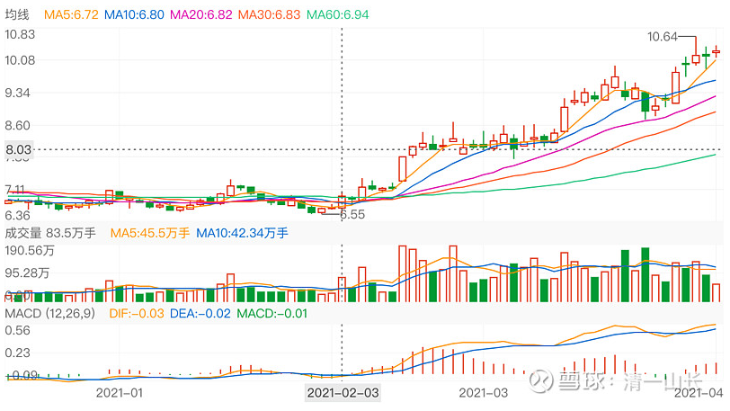
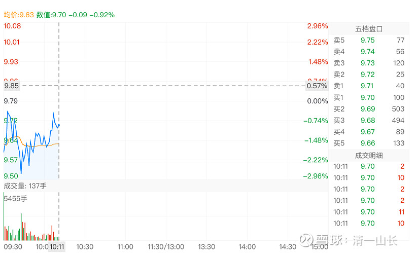
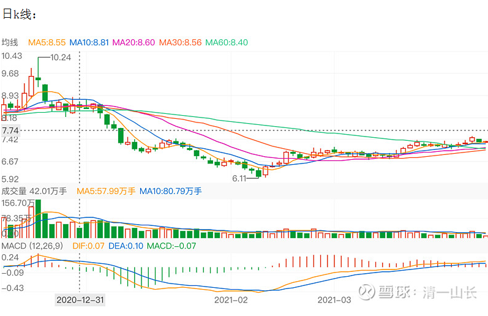
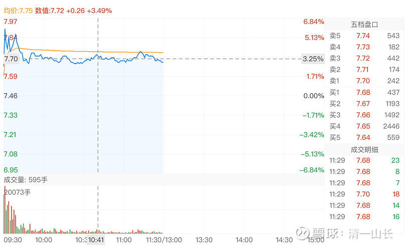
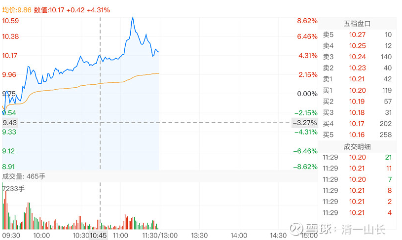

108篇.别碰我，有毒

清一山长2021年4月3日～9日

清一山长:2021-04-03 19:30:41

[$华侨城A(SZ000069)$](http://link.zhihu.com/?target=http%3A//xueqiu.com/S/SZ000069) 估计跟我进华侨城A的人，都清仓跑掉了。我一股未少。从日线图上，没看出主力有出货的迹象。2月份的6.55元是挖坑，之后一路抢夺筹码，没给做T的补仓机会。3月24日是主力卖出，非常像要调整。很多人这一天跑了。但三天后，就以更大涨幅拉回。以为要调整的人，这一天主动卖出后，再无上车的机会。上一周是用缓步上攻的机会，消化获利筹码。但只让人追高，不让人获利做T，喝主力的血。上周三冲高回落，放量。老手会都跑掉的，长上影线。但周四周五的走势，表示只是日内调整震仓。这个走势，跟惠泉的主力完全不一样，**显得很珍惜筹码**。**我判断主力的走势现阶段依然是掠取筹码，所以我一直不动。**估计有某天大家都狂喜，认为华侨城就绝对不会调整的时候，它才会开始调整。一旦调整，必然放大量，会吸引很多急不可耐的人跟进的。如果发生在大涨之后，就要走；如果没有大涨，应该不会调整。

惠泉的主力，对高价的筹码是不太想要的，他们的手法是持有的主仓不动，拉升时候吃了多少，回调就吐多少，资金保持活力状态。所以，我能看到有明显的机会做T，只要跟上主力的步调就能赚到更多的钱。华侨城一路上是没有机会做T的（对我来说，我认为几毛钱的小T，因小失大，不值得做）。我就老老实实地拿着好了。而且拿华侨城的心态，比拿啤酒坐电梯更好。起码分红多呀[大笑]

清一山长2021-04-06 12:41:20

[$燕京啤酒(SZ000729)$](http://link.zhihu.com/?target=http%3A//xueqiu.com/S/SZ000729) 燕京的走势好含蓄，**这种走势，是在说：别碰我，有毒！**

再看看惠泉啤酒的走势：今天走势图形是说：大家来看呀！看我有多棒！[很赞]，今天最高冲了8.62%，再拉一把就涨停了。

你们想买谁呢？

我谁都不买，早买完了。等现在来买，黄花菜都凉了。

清一山长2021-04-09 10:11:17评论上贴

回头看这个帖子，前几天看盘的结果，是不是全应验了？燕京跌了，珠江涨了。可见，我是“短线高手”[俏皮]。

现在燕京啤酒盘面上是7.46元，当时的盘面上是7.71元。我说“有毒”，就是有人在卖的走势。**惠泉当时的盘面，是有人在秀身材。**有人秀，我就给点赏钱，惠泉出了一点，现在价格的燕京，补了一点。

主要的时间，是啥都不做，就是看看！

(标题、图片为编者所加)

文章音频：

[576篇.别碰我，有毒](http://link.zhihu.com/?target=https%3A//www.ximalaya.com/sound/884550575)

**参考链接：**

[100篇.那条绿线，我干的](https://zhuanlan.zhihu.com/p/27432186910)

[101篇.三家啤酒的走势](https://zhuanlan.zhihu.com/p/29771069394)

[102篇.看他家走势，想像啤酒的未来走势](https://www.zhihu.com/column/c_1473746162334826496)

[103篇.三个走势，两个稳健，一个怪异](https://zhuanlan.zhihu.com/p/1895973245435479673)

[104篇.涨停第二天的走势](https://zhuanlan.zhihu.com/p/1898463871682982987)

[105篇.老老实实等大波段](https://zhuanlan.zhihu.com/p/1900951828339876144)

[106篇.这个图形，是在明显走强](https://zhuanlan.zhihu.com/p/1921218340522813199)

[107篇.我赌燕京市值至少是珠江的一倍](https://zhuanlan.zhihu.com/p/1923856292725917028)
