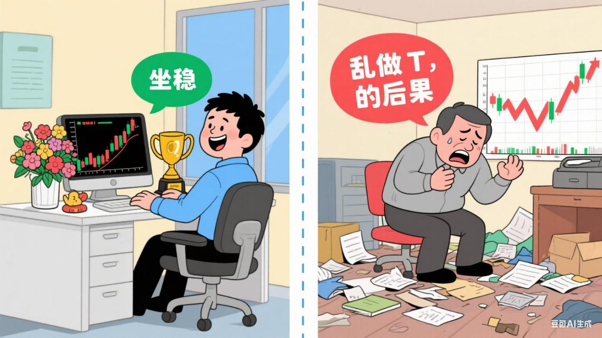
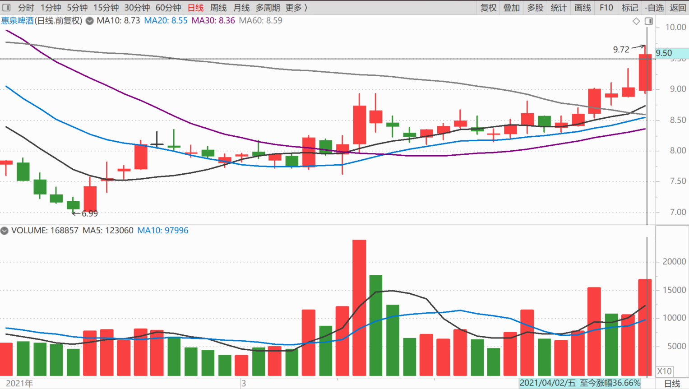
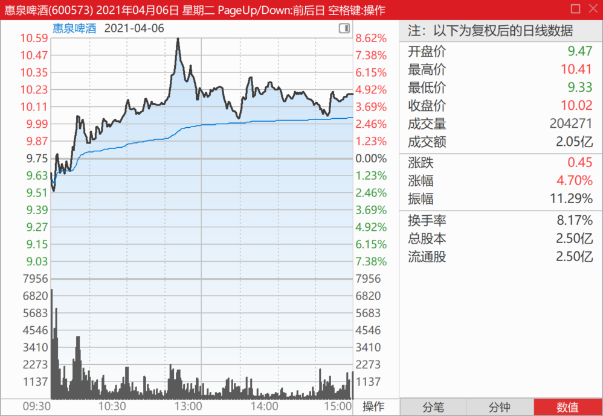
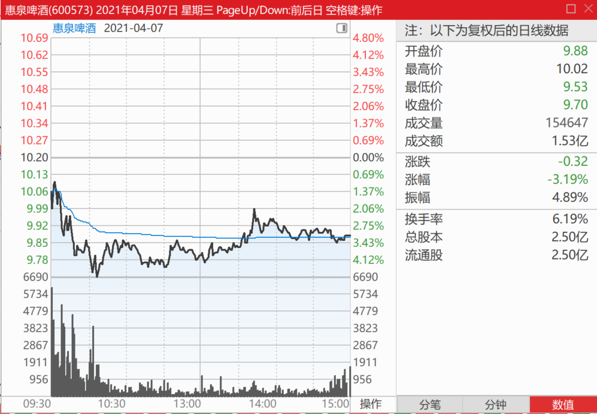
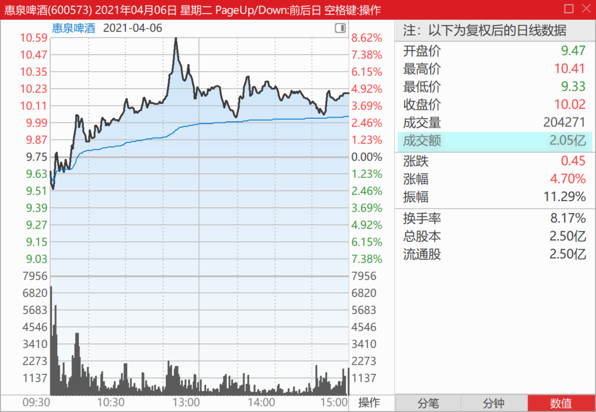
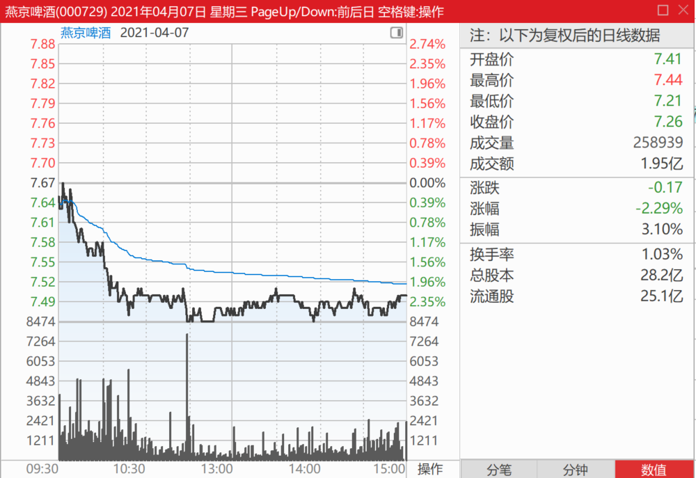
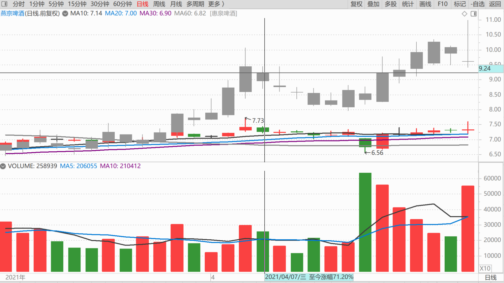
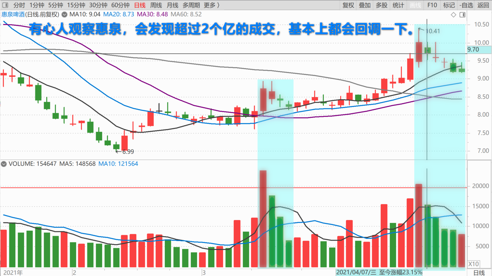

109篇.坐稳，别乱做T

清一山长2021年4月6日～7日

清一山长2021-04-06 13:07:48

[$惠泉啤酒(SH600573)$](http://link.zhihu.com/?target=http%3A//xueqiu.com/S/SH600573) 上周看走势，就感觉惠泉快有动静了，发帖警告，**提醒大家坐稳，别乱做T。**

结果今天就大涨了。

但居然今天有人骂我：“天天发帖显摆自己。”不喜欢我说话，你们取关我、拉黑我不就得了？这种人居然又要跑来关注我（没关注我的人不能发帖给我），又要骂我发帖多，让他不开心。真真奇怪了。

真是的，看我不顺眼，就跟我反着做呗！你的钱，跟我又没关系，爱咋花就咋花。谁拦你了？

惠泉啤酒过10元，我不说了。你们爱咋买就咋买，想卖就卖。我管你啥了？想看我的买卖交易情况，一个季度可以看一次，看十大股东的增减吧！我在就有持仓，我不在就减仓走了，就别问我怎么操作的了。我相信一季度我还在十大里面的，二季度在不在，就看主力给不给机会了。

清一山长2021-04-07 12:19:36

[$惠泉啤酒(SH600573)$](http://link.zhihu.com/?target=http%3A//xueqiu.com/S/SH600573) 又跌破10元了，我就再说几句。

昨天尾盘，看成交量接近两亿了，就尾盘挂单卖了一些货出去。10.20元的价格，居然都成交了。不多，十来万股。今天已经全部补回来了，不过补的是7.50元的燕京。现在我还不想失去啤酒股的股数。

燕京啤酒与惠泉啤酒同期日K线对比图

**有心人观察惠泉，会发现超过2个亿的成交，基本上都会回调一下。昨天没机会出更多的货，接盘不够，否则我会多卖一点的。因为有调整的需要了。**

今天的调整幅度不算大，还没有吃掉昨天的胜利成果。从量上来看，并没有出现筹码出逃的迹象。我认为今天的调整，没有破坏向上的走势。**其实昨天卖出的今天T回来很理想，赚了5个点了。**只是看燕京的价格实在太低，就换了燕京啤酒。惠泉就慢慢减少吧！

[明宇-0805](http://link.zhihu.com/?target=http%3A//xueqiu.com/n/%25E6%2598%258E%25E5%25AE%2587-0805)回复[股市人生2021](http://link.zhihu.com/?target=http%3A//xueqiu.com/n/%25E8%2582%25A1%25E5%25B8%2582%25E4%25BA%25BA%25E7%2594%259F2021)：

这位朋友真的幽默，山长只是买了燕京的股票，作为股东，您要是觉得酒不好喝可以去找董秘。[滴汗]话说回来，燕京好不好喝，卖不卖得出去要看业绩报告，不是您身边的朋友都喝雪花就能说明问题的[笑哭]

清一山长2021-04-07 18:44:18 回复[明宇-0805](http://link.zhihu.com/?target=http%3A//xueqiu.com/n/%25E6%2598%258E%25E5%25AE%2587-0805)：

喜欢雪花没问题，应该买华润啤酒去，不是来燕京的地盘上要燕京整改，甚至要我去找燕京董事长去。这是疯子的行为，真以为自己是神？想干啥就指派人去干？谁都想指派一把？

燕京干不过雪花，自己会想办法，他们才是专业人。听你一个喝酒的乱说？

我啥酒不喝，我喜欢吃泰国的水果。但我才不去入泰国的农民的股呢！喜欢就买他们的水果。有这么麻烦的吗？

**清黑就是自己想吃苹果，说我种的芒果不好吃，让我改种苹果给他们吃。**我说：“我就喜欢芒果咋啦？你不爱吃，自己去山东吃苹果去，别找我叽歪！爱吃芒果的人自己找我好了。”

(标题、图片为编者所加)

文章音频：

[580篇. 坐稳，别乱做T](http://link.zhihu.com/?target=https%3A//www.ximalaya.com/sound/891092596)

**参考链接：**

[103篇.三个走势，两个稳健，一个怪异](https://zhuanlan.zhihu.com/p/1895973245435479673)

[104篇.涨停第二天的走势](https://zhuanlan.zhihu.com/p/1898463871682982987)

[105篇.老老实实等大波段](https://zhuanlan.zhihu.com/p/1900951828339876144)

[106篇.这个图形，是在明显走强](https://zhuanlan.zhihu.com/p/1921218340522813199)

[107篇.我赌燕京市值至少是珠江的一倍](https://zhuanlan.zhihu.com/p/1923856292725917028)

[108篇.别碰我，有毒](https://zhuanlan.zhihu.com/p/1926327160127348962)
