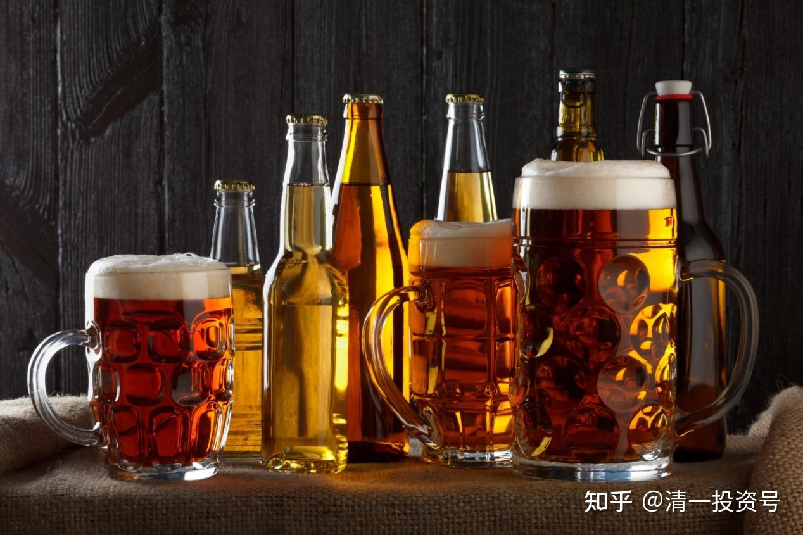
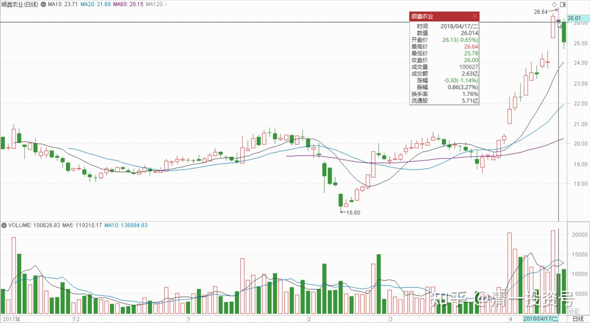
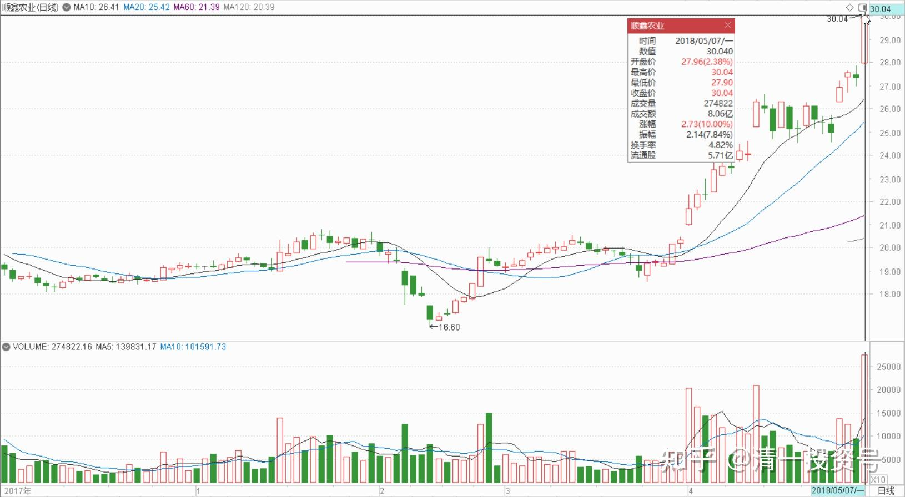
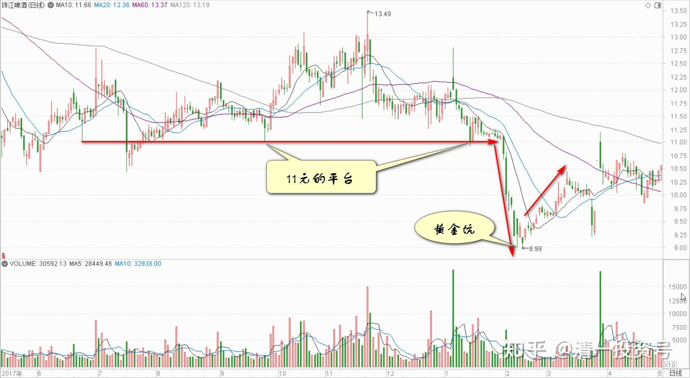

10篇.顺鑫快速拉升引发的啤酒讨论

清一山长2018年4月～5月

清一山长2018-04-17 14:45:11（主贴）

$顺鑫农业(SZ000860)$ 从盘面上观察，今天是强势缩量调整。昨天刚涨停过，今天这样小幅调整，走势是相当强的股。未来一定继续创新高[赚大了]。

至于我卖掉的20万股，是否要买回来呢？已经T成功了，如果现价买回，还有8-9万的水钱。但我决心放弃可能的利润，算了，不跟了。我还有其他更安全的股。**反正我还有不少仓位跟涨就行了。**不要想把所有的钱都赚到自己兜里。另外，**本股的主力操盘手法很厉害，很难判别方向。**所以就干脆啥都不去猜了。**反正便宜就买，见高就走。**怎么都亏不死我。就行了。

（提醒：虽然看好后市，但我T成功也不回补，新资金更不会加买。假如您因为我继续看好后市就买入顺鑫，盈亏自负，与我无关）。

明达野老:回复明达野老:（跟评主贴）

$顺鑫农业(SZ000860)$今天上午29.99元挂的单刚看到已经全部成交，涨停板追上再出掉一小部分，总计减掉20%仓位。顺鑫主力太厉害了，我也看不明白了，就乱卖了，今天第一次卖出，庆祝一下这只“温股”终于不温了。继续拉涨停我就继续卖，便宜货太多，忍不住手抖的毛病。我不看空，我只认为相对于更低洼处的好股，顺鑫这样快速拉升在我这里显得就“高”了。

卖出的仓位拿出一小部分买入了兴业A，现在兴业A买回已经有原出掉仓位的5成。

剩下的资金放一放，都涨飞了就算了，继续跌我就继续买。

清一山长2018-05-07 15:55:11回复明达野老:

恭喜明达君暂获无数[很赞]

今天顺鑫，涨停版故意的封不住，一直在洗来洗去的，应该就是故意让技术派“跑掉”的。后市看高一线。也许会在30元洗一洗再走，也许会直接脱离30元的区域。不清楚他怎么玩，既然不清楚，我就继续观望。

**我这段时间一直在补啤酒，吃了一肚子，有点撑了。**今天一看又大涨了，只好罢手不买了。还纳闷怎么现在啤酒和白酒一起混合喝？难道中国人有发明了新的喝法？虽然赚钱了，但我还不想走，继续等消息吧！中国人喝起酒来都不讲道理的，发酒疯。

51nxp回复朴拙君:（跟评主贴）

嗯，我骨子里是银粉。如果买啤酒我就不会抛顺鑫。

清一山长2018-05-07 17:30:09回复51nxp:

【如果买啤酒我就不会抛顺鑫】。

我和你讨论一下操作手法和安全边界的问题：如果手上的顺鑫已经涨了不少，但啤酒还在十年来的底部价格没动，特别是珠江，最近还跌出了黄金坑，显然是主力有意做的坑，从11元的长期盘整平台，居然打到了8元多。就像是顺鑫19元的平台，意外地打到16元多一样。如果您发现了这种典型的主力进驻手法和痕迹，加上你知道啤酒行业已经进入了十年一遇的涨价周期，当时珠江9-10元的价格买入后安全度极高，会不会使劲买一堆呢？

不过，你是价投派，可能不喜欢看K线图买入卖出。我是“价值投机派”的，会习惯看K线，加上基本面来买入卖出，特别是比价买入。我觉得这样更好玩一些[大笑]。起码我通过看K线来跟随主力进入股票，在时间上，不需要守候太久。

顺便评点一下燕京（这两只啤酒，都是我现在的重仓了，比兴业仓位多不少）：这货洗盘手法非常凌厉，狂跌狂涨。方向莫测，害得我高位出掉一些后，只敢补低位的珠江。这个手法，说明主力还没有完成洗盘，还没有进入上涨周期。**但以洗盘的力度而论，燕京主力志在长远，也是一个未来的牛股。**顺鑫已经完成洗盘了，我看未来走势和价格，就看主力的愿望了。所以，**观望为主，少动为妙。**

51nxp回复清一山长:

买燕啤正是这么想的。读了很多高集中度后垄断提价的案例，格力和美的是最显性的案例。

然而中国这么大的市场，啤酒5巨头占80%的份额了，怎么提价的幅度还是不能拉抬ROE呢？我觉得产品干不过外来的私酿的是主因，产能过剩是次因。

山长，你原来和我不熟，你不知道我曾经多么怕金融危机。2011年4月～2012年9月我空仓。2015年初我空仓，怕的是人民币贬值带来的危机，2015年1月底才买上药H股，3月11出后一直空，大盘涨了1000点，420才投机做了华闻传媒，5月15～16出后又空仓，直到5月底的大调整才买五粮液，6月12号全空了，我害怕融资带来的踩踏风险。

但是我看了欧美股市，发现自1988年起，每次危机最多持续一年，股市就能走出阴霾，哪怕2008年10月的金融海啸和2011年欧债危机。丝毫不像1929～1932的大萧条和1970的石油危机（这两次都是10年以上的调整），我不是经济学家，瞎猜是否与现在货币发行取消与黄金挂勾（金本位）相关，这几十年每次危机都被各种QE冲淡了。想清这一点，只要大盘还在5000点以下，我都会坚定做多，昨天看了雪球上巴菲特和芒格的发言，更让我坚定了持股信念。

清一山长2018-05-08 17:21:12回复51nxp:

你才看5000点呀？长期我看两万点都有可能[大笑]。**反正我在中国股市一万点之前，都看多，不会跑（不排除会卖掉一些股票，换仓等，但绝对不会清仓的）。**

安心潜伏回复清一山长:（跟评主贴）

啤酒青岛应该是龙头吧！

清一山长2018-05-07 23:03:13回复安心潜伏:

很荣幸，我26元多买入了青岛H[大笑]，一直潜伏至今。目前持有三家啤酒公司的股票。算是重仓了。

(标题、图片为编者所加)

**参考链接：**

[YJ走势果然神鬼难料\[表情\]](https://www.zhihu.com/pin/1604810289215668226)

[发表今天的想法，就是非常的感谢，感谢这…](https://www.zhihu.com/pin/1604504352521158656)

[8篇.初谈燕京](https://zhuanlan.zhihu.com/p/594537053)

[9篇.起码十年不涨就值得一起守候了](https://zhuanlan.zhihu.com/p/596134341)

[11篇.啤酒系列4：连连出台的质疑文让我加紧了买啤酒的行动](https://zhuanlan.zhihu.com/p/598382916)

[12篇.啤早期珠江啤酒、燕京啤酒的换仓记录](https://zhuanlan.zhihu.com/p/602033762)?

[13篇.买卖操作后的富足之心](https://zhuanlan.zhihu.com/p/604162057)

[14篇.珠江的破位急跌，名曰跌停进货法](https://zhuanlan.zhihu.com/p/606062514)

