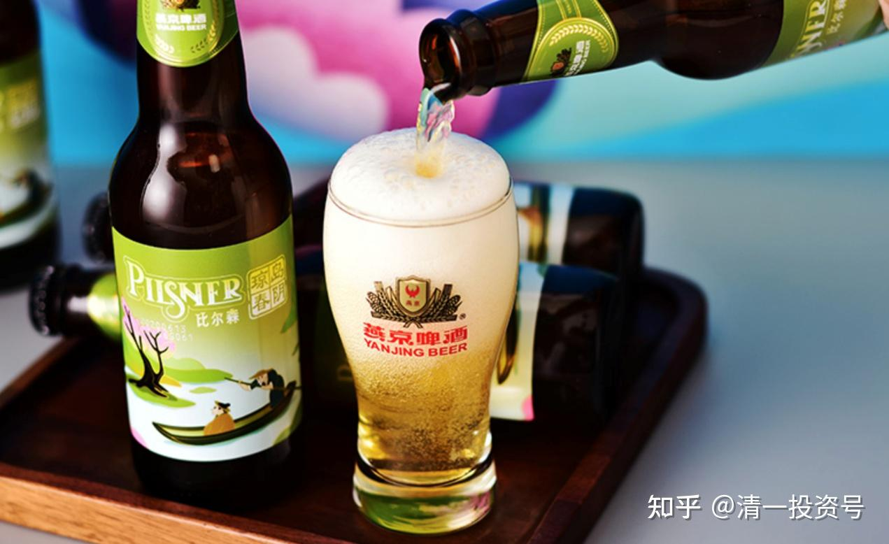
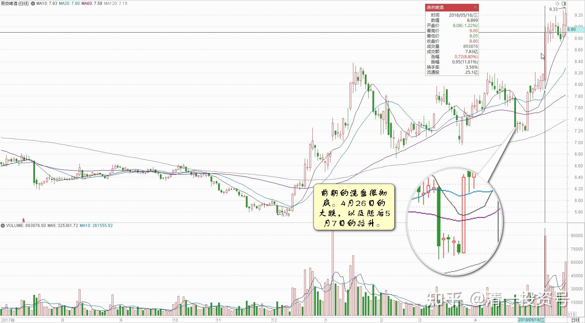
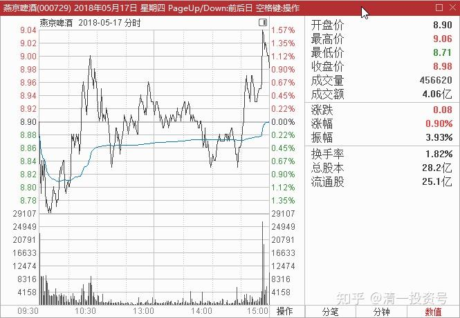

11篇.连连出台的质疑文让我加紧了买啤酒的行动

清一山长 2018年5月16～17日

**一、燕京已经被很好地控盘了**

清一山长2018-05-16 11:53:40(主贴1)

$燕京啤酒(SZ000729)$ 燕京今天看样子，想做啤酒行业的龙头了[大笑]。主要是它已经被很好地控盘了。前期的洗盘很彻底。4月26日的大跌，以及随后5月7日的拉升，手法极为凌厉。大开大合。今天冲击涨停，创出了两年来的新高，也是志在必得。**一旦穿越9元区域，多年来的压力线就突破了。以后股价多少钱，就由主力说了算了。**

总体来说，燕京是个坑，坑了我很长时间，也影响了我很多利润收入。就因为它一直跌，我把本计划增持顺鑫的头寸，换来买了很多的啤酒喝，结果做了很久的冷板凳。现在看收益，还是很不划算的，我就这命了。幸亏虽然在股票数量上，燕京占优，但持有的顺鑫总资产也差不多。所以还不是太失落。**今年我A股最大的持仓，就是主要用来买酒了。**其他觉得机会都不太大。目前看来这个策略是成功的，主要就是个股选择配置，还不是很理想。

深呼吸a回复清一山长:（跟评主贴1）

山长老师，感觉您买的股挺多的，挺分散的，也挺杂的，这样整体收益是不是会下降啊？资产增值是不是相对要慢呢？这样操作思路还适合资金量少的人操作吗？

清一山长2018-05-16 12:05:47回复深呼吸a:

**我持仓也就20多只股，多乎哉？不多也。**比彼得·林奇要少多了[大笑]。

清风紫悟:回复清一山长:（跟评主贴1）

山长，啤酒股您说的最多的就是燕京，能否也说下珠江呢？当时看你的操作，也买了部分珠江，一直在纠结要不要全部换成燕京[大笑]

清一山长2018-05-16 12:53:08回复清风紫悟:

燕京涨停了，我还在琢磨，要不要卖掉一点燕京换珠江呢[大笑]。可惜珠江也涨了[哭泣]。要不咱们两人就互相换股得了[赞成]

花樣年華回复清一山长:（跟评主贴1）

今天涨停了，还可以追着买吗？

清一山长2018-05-16 15:34:12回复花樣年華:

想追买呀！您要多少？告诉我数量，均点给你得了。燕京我少喝点没事。只要您想要，俺给。我不是小气的人[大笑]。别超过我的持仓数就行。

微踏同学回复清一山长:（跟评主贴1）

$燕京啤酒(SZ000729)$ 谢谢清一老师点评，昨夜还因为8.10元追高买入被套大半年哀怨，今天忙成上班狗，偶尔看了下盘竟然来了个翻身仗！虽说一股未多一股未少，半年来其实也是悔恨交加（定力不够，还是穷怕了），所以还是得老老实实当傻猫，自作聪明很容易被市场打脸！[笑]

清一山长2018-05-16 15:47:22回复微踏同学:

**我买的时候不一定都对，买了往往还会跌。但大概率是不会吃亏的。我卖的时候不一定对，卖后往往创新高。但大概率也是赚钱的。**

你买的燕京价格，是我卖的价格。但我只卖了20%。剩下80%做电梯了。跟我对着干，就是五元多非不买，8元多非要买。跌下去吓得赶快卖掉，然后骂我一顿出气。最后：您成功了地证明了跟随我买股，是会吃亏的[大笑]，清黑们就是这样做的[哭泣]

xsx100回复潜伏188168:（跟评主贴1）

就是！五元的时候应该一天发十贴提醒！还要一个个您的粉丝！

清一山长2018-05-16 20:15:50回复xsx100:

这样肯定是不行的，会被这些人骂死，说我买股亏了，就找他们来垫背的。这主意太馊了，差评[大笑]

莫青双华回复清一山长:（跟评主贴1）

坐了数次过山车雷打不动，9块没忍住出了抛了一点，正在面壁中[抠鼻]

清一山长2018-05-16 20:20:29回复莫青双华:

太贪了[大笑]。**卖出后，应该祝福买你股的人赚钱才对。总想有钱都要全部自己赚完，良心不好。真后悔，8.9元重新买进就是了。**没人拦住不卖给你的。今天来不及，明天只要有低于9元的价格就再买回就是了。装模做样的面壁干啥？[加油]

二、**连连出台**的**质疑**文**让我加紧了买啤酒的行动**

清一山长2018-05-16 12:03:16：

《中国经营报》李向磊 蒋政 新消费

《[业绩三连降 燕京啤酒根据地市场承压](http://link.zhihu.com/?target=http%3A//dianzibao.cb.com.cn/html/2018-05/07/content_65047.htm)》

[http://dianzibao.cb.com.cn/html/2018-5/07/content_65047.htm](http://link.zhihu.com/?target=http%3A//dianzibao.cb.com.cn/html/2018-5/07/content_65047.htm)

看到这样的文章，明显有很刻意的写作目的，我一看就知道作者就是专业的写手，“托儿”,拿钱写文章，有人拿钱登上权威媒体，专门让持有者心慌意乱，抛出手上持仓的。花点小钱，几万元，就可以拿到数百万股，数千万股。本小利大。最近我看到这种文章最近连连出台，表面上很“关心”啤酒业的发展。写的文章却狗屁不通，连基本的行业逻辑和方向都狗屁不通，专门拿一些忽悠外行的“客观数据”来冒充专家，胡乱黑啤酒企业。我看到后，**本能的反应就是：啤酒快涨了，一定要坐稳。**

其实我应该等看到这些消息满天飞的时候再入场，可以节省很多的时间成本，不至于傻傻地拿燕京这么久的时间，导致燕京账户不断的红绿变幻多次。甚至今年有几天时间居然还翻绿了一次。感谢作者的文章，让我持有燕京更坚定。现在我手上持有燕京M级仓位，等待跟随主力一起冲锋陷阵[大笑]。但我绝对不跟“自作多情”，故作姿态的本文作者共舞。**拿你做反向指标了。**

其实，**最近几个月，类似这种文章的连连出台，质疑啤酒业**。**这让我加紧了买啤酒的行动。**既然燕京提前涨了，我就买珠江，因为有写手专门黑珠江，说珠江利润是政府补贴出来的。我就知道珠江已经被主力盯上了，正在进货中。结果真的珠江还打出一个几年来的最低价黄金坑。我一直买买买，导致珠江的持仓，比燕京要多不少。现在两个都涨了，我就挂眼科好了。慢慢看戏。

**股市赚钱，真的好容易。有一双慧眼就够了。**实体赚钱，坦率说我觉得太不容易了，要做很多事情，还不一定赚到钱。

清粉傻猫回复清一山长:（跟评主贴2）

山长啤酒抄您的作业拿到现在，信心坚定着呢。黑嘴写的东东根本不看，只看您。

清一山长2018-05-16 12:49:19回复清粉傻猫:

**等以后牛市来了，大家都赚钱了，我就走了，再也不说话了。**你们就只能听黑嘴的了[大笑]

**三、抢涨了50%的燕京？**

清一山长2018-05-17 15:39:17（主贴3）

$燕京啤酒(SZ000729)$ 今天强势调整。收盘最后十几分钟，还来了一个“缴枪”的动作。强！有效清理了投机筹码，后市看高一线。

品味人生001001回复清一山长:（跟评主贴3）

感恩山长！今天从看客变成运动员身份了（今日8.9元建仓燕京啤酒，人生第一次买股票），山长分享《六祖坛经》在答疑里面说，想要学游泳看是看不会的，必须要下水实际去游。今天决定做个傻猫，抄了山长的作业，开始从实践中学习。之前看到山长分享很多机会，一直在观望，现在才知道错过了很多机会。不过当时没有那个福分，也不会懊恼，但愿以后多多播种财富的种子，像山长一样培植一颗富足的心！

清一山长2018-05-17 23:32:43回复品味人生001001:

二百五一个[哭泣][哭泣]。还说是学我的[吐血]。难道我拉你来抬轿吗？说什么富足的心，玩价值投资。可是有低的不买，原来没涨的燕京、以及现在没涨的兴业、中建等。非要来抢涨了50%的燕京？真有胆！真有钱！

赚了算你有胆，赔了算你无脑。

(标题、图片为编者所加)

**参考链接：**

[YJ走势果然神鬼难料\[表情\]](https://www.zhihu.com/pin/1604810289215668226)

[发表今天的想法，就是非常的感谢，感谢这…](https://www.zhihu.com/pin/1604504352521158656)

[8篇.初谈燕京](https://zhuanlan.zhihu.com/p/594537053)

[9篇.起码十年不涨就值得一起守候了](https://zhuanlan.zhihu.com/p/596134341)

[11篇.啤酒系列4：连连出台的质疑文让我加紧了买啤酒的行动](https://zhuanlan.zhihu.com/p/598382916)

[12篇.啤早期珠江啤酒、燕京啤酒的换仓记录](https://zhuanlan.zhihu.com/p/602033762)?

[13篇.买卖操作后的富足之心](https://zhuanlan.zhihu.com/p/604162057)

[14篇.珠江的破位急跌，名曰跌停进货法](https://zhuanlan.zhihu.com/p/606062514)

[15篇.金融市场是考验心态和修为的地方](https://zhuanlan.zhihu.com/p/608010478)

