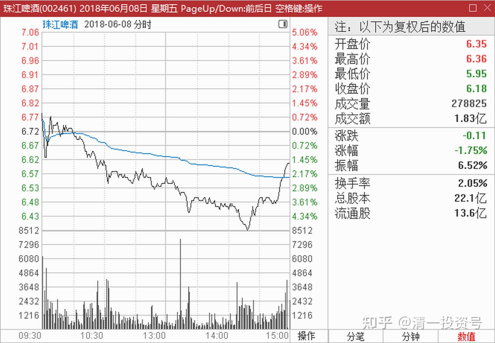
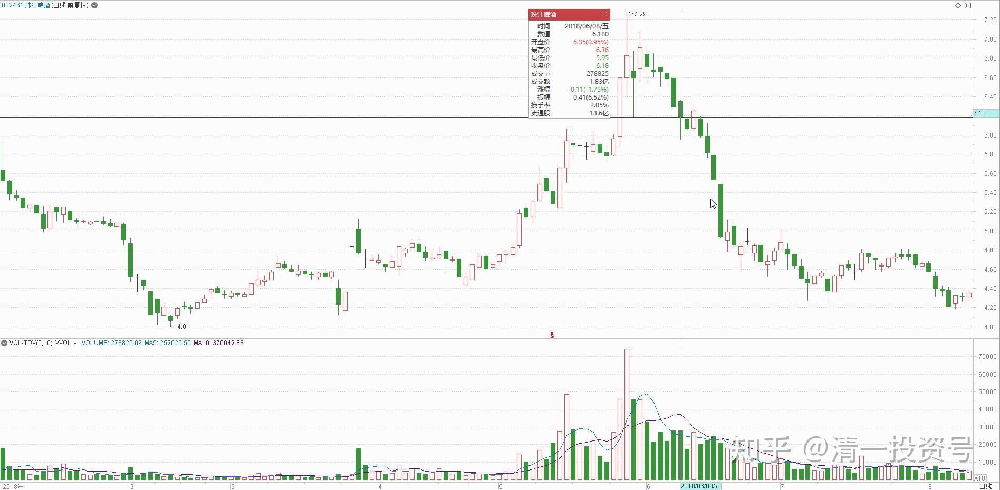

14篇.珠江的破位急跌，名曰跌停进货法

清一山长 2018年6月8日-14日

**一、挂大单，探水深**

清一山长 2018-06-08 15:13:43

$珠江啤酒(SZ002461)$ 今天一天都在买入珠江，累死了。成交的最低价是6.39元。我在6.46元一单就挂了25万股，想“托住价格”，但我就眼睁睁地看着被散户们一点点的吃掉。一百股、两百股、一千股的成交，显然是散户干的。很长时间才填完我的单子。然后，就打到6.38元了。我吃了太多的珠江啤酒，超过原来的持仓量了。结果把成本吃上来了，吃到5.19元成本了[哭泣]。仓位是酒股第一了。为啥这么多还继续吃呢？就是我算珠江买入后的成本，今天账上也才5.19元，比主力的成本还低，干嘛不敢持有？（主力成本应该在6元左右）。今天看主力无脑打压珠江，实在看不过去，就一个劲地买回来。尾盘结果就看到主力拉上去了。干嘛要啦呢？弄一根光头大阴线收盘，不是更吓人吗？收上去K线上就是一个独脚鬼的K线，不是明说是“探底回升”的架势吗？后市要涨的。技术派会跟风进来的。

顺鑫很对不住，今天没有买回来。看下周有无机会了。主要是珠江跌得太惨了，不然我还是准备救顺鑫的。从今天大调整的行情来看，顺鑫的抛盘不重，可以持有。我昨天的抛出行为，大概率是一个看上去正确的失败操作记录。

本发言仅作为我的操作记录，不构成投资建议，据此入市，风险自负，利润自拿[大笑]！

续评

清一山长 2018-06-08 23:06:39

今天不就是低位补了点货罢了，居然被当主力了。摆个25万的单子算啥？不就一百多万资金吗？真不算啥事的，主力哪有这么怂的。

我其实很少挂大单买货，**今天就是故意挂个大单的，看主力要不要不计成本倒货给我。**就算是试盘的，反正这个价我买进来，也能够消化的。无非是输时间不输钱的，跟主力共进退罢了。我正常的买货，我是看盘面有多少，就买多少，挂出来太多了，怕太吓人。所以有时候几万股几万股的买。卖货的时候，往往比较容易，都比较热了。

**我偶尔挂大单，无论买卖，都是想试试市场的反应如何，探探水深的。**有时候我挂出来十万股买进，结果价格马上就离开我要的价格，让我无法买进。我基本判断主力不愿意给货，所以会赶快加价买进（健康元就发生了这样的情况，9元多的时候，低位我低于成交价一分钱，挂了十万的买入单子，但居然很长时间都没有成交，价格直接往上走了，我只好加价买进）。我目前挂的最大的单子，就是兴业银行19元多挂出卖一万手，但一秒钟就被主力吃掉了。让我觉得主力好牛，好半天没回过神来。结果第二天果然高开，高走，很多人笑话我操作太烂。直到现在才觉得我走对了。当时的正常人应该觉得买错了，当我感觉还是拿回资金更重要，就没有当回事，但真判断是主力要货的。结果主力也会套牢[大笑]。

**今天我挂单珠江被吃掉，比兴业少多了，也慢多了**，明显是散户行为。说明今天很多小散户在不计成本出货，估计就是前几天抢高，现在反悔了夺路而走的。真同情这些聪明人，比谁都精明。**半点亏不肯吃，结果吃更多亏。**

明达野老回复清一山长:

高明的试盘手法[牛]正面佯攻，却又是真买[牛]。如果主力看到你的挂盘成交情况，也是帮到他对盘口情况看得更清楚了——差不多洗到位了，再巩固下成果就可以开始走下一轮了。

要是你的挂单量再加个0，可能主力这个独脚鬼收的更高了[大笑]。这样急性子的主力才不想给你筹码[大笑]（他扫货的节奏，哪像是愿意有人抢食的状态，还生怕拿少了[大笑]），出货就更不可能了，这个位置出货怕是难以全身而退的（从试盘也能看出来，跟风买盘不够，大级别的买盘还在观望中）。

不过，无论有没有实力的主力来抢货，洗盘到这个位置也差不多了（主力的成本应该在6～6.5元的区间）。要是我是主力，会在接下来的新的震荡中的平台高点以下挂“假卖单”试盘（不过这种挂法得谨慎，不能多也不能太少，多了要是被有实力的其他大资金摘掉了就不好玩了；如果主力货拿少了些，平台低位虚挂少量买盘试盘也是不错的选择），直到跟风卖盘弱了，我就开始上下一个平台。等拉到我目标价位，我就开始虚挂“假买盘”测试跟风买盘情况，同时保证趋势上的上攻状态（毕竟要照顾下图表派），并边刺激盘口边出货。

**二、珠江的破位急跌杀心理**

清一山长2018-06-09 19:53:08回复明达野老:

明达君高见。你判断的主力成本，又要被人猜一通了：你怎么知道主力成本？难道你就是传说中的庄家？[大笑]

**珠江这种破位急跌，其实是不用怕的，往往是主力故意吓人做出来的线。**所以我敢于再度买进并重仓，毕竟现价还没有完全脱离庄家的成本区。**急跌是杀心理，就是故意制造市场恐慌的，目标依然是震仓，让人跑路。这叫做“跌停进货法”**，是当年缠论的李彪的创造性手法。最怕的是慢跌，股票该跌不跌，普通散户就觉得安心，反而要当心主力是故意维护股票的“良好形象”，慢慢派货的。这一次一部分仓位，以比主力拉的最高点7.72元低一分钱的价格卖掉珠江，又以6.39元高于最低价一分钱成功买入，看上去实在像是玩杂技一样。我认为赚到的钱都是主力给的，感谢庄家的大方打赏[鼓鼓掌]。看来我现在的手气还不错，希望保持。不过，过一段时间，这些记录，无论好坏，都会被忘记了。

***五月回复清一山长：跌的尼玛币都不认识你。

清一山长2018-06-14 18:01:10回复***五月：

你走吧！把投资场当赌场，说话还特别没有修养的低级赌徒，跌了一点就骂骂咧咧的人，还是早点离开股市好。**对赌徒最安全的方式就是远离赌场。**凡是发现发言垃圾和低级的货色，我这里一律拉黑无商量。

参考链接：

[清一投资号：8篇.啤酒系列1：初谈燕京](https://zhuanlan.zhihu.com/p/594537053)

[清一投资号：9篇.啤酒系列2：起码十年不涨就值得一起守候了](https://zhuanlan.zhihu.com/p/596134341)

[清一投资号：10篇.啤酒系列3：顺鑫快速拉升引发的啤酒讨论](https://zhuanlan.zhihu.com/p/597816918)

[清一投资号：11篇.啤酒系列4：连连出台的质疑文让我加紧了买啤酒的行动](https://zhuanlan.zhihu.com/p/598382916)

[清一投资号：12篇.啤酒系列5：早期珠江啤酒、燕京啤酒的换仓记录](https://zhuanlan.zhihu.com/p/602033762)

[清一投资号：13篇.啤酒系列6：买卖操作后的富足之心](https://zhuanlan.zhihu.com/p/604162057)

