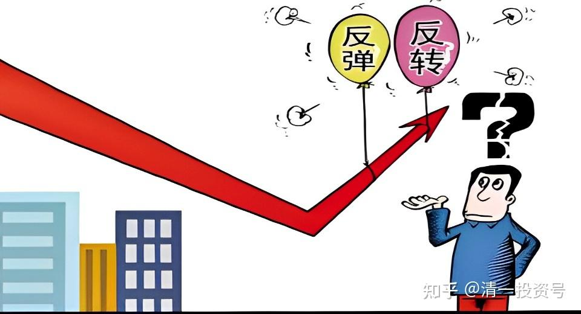
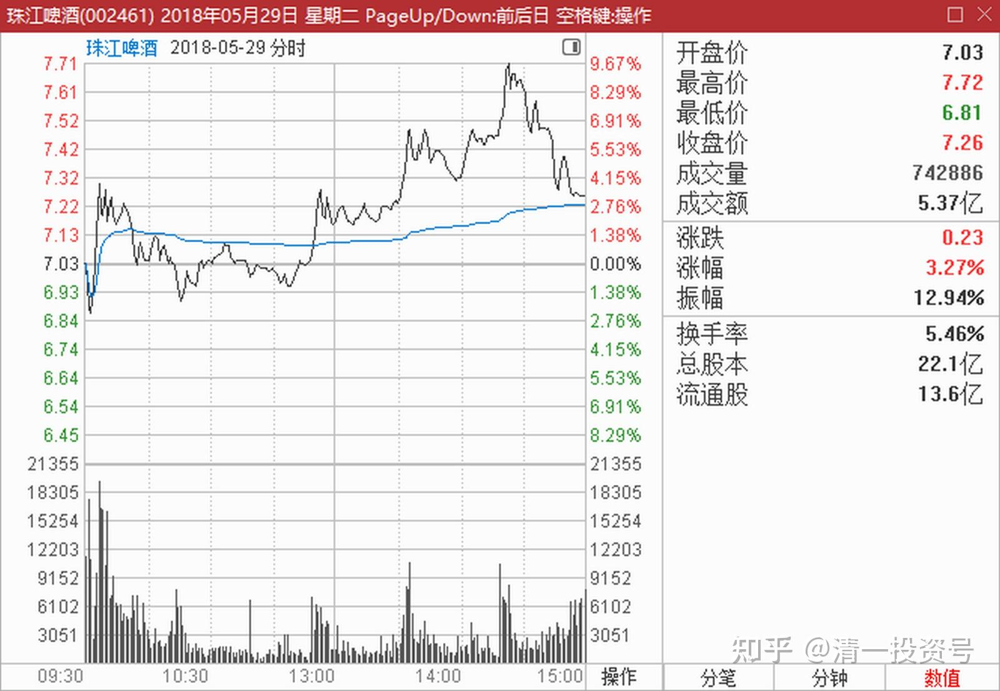
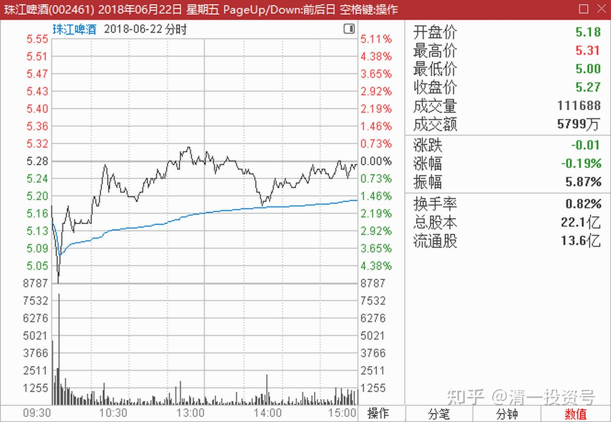
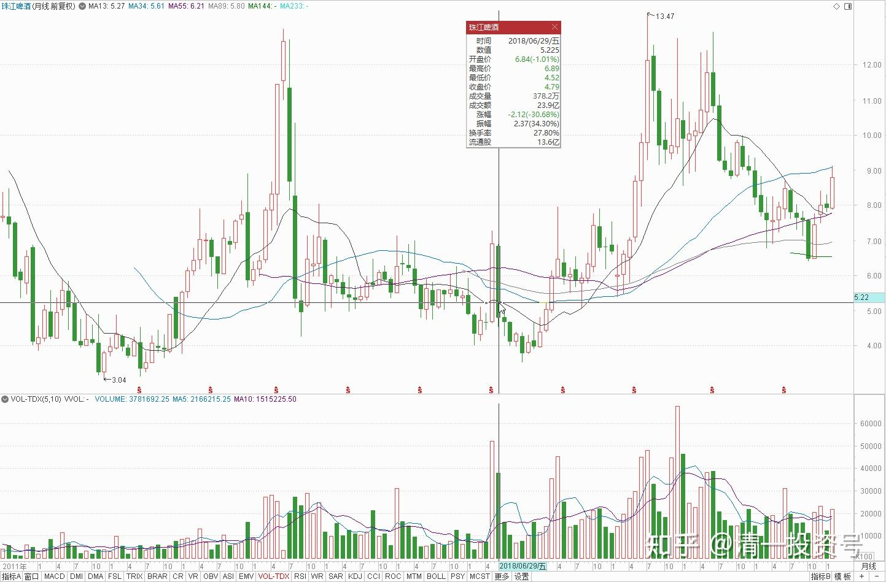
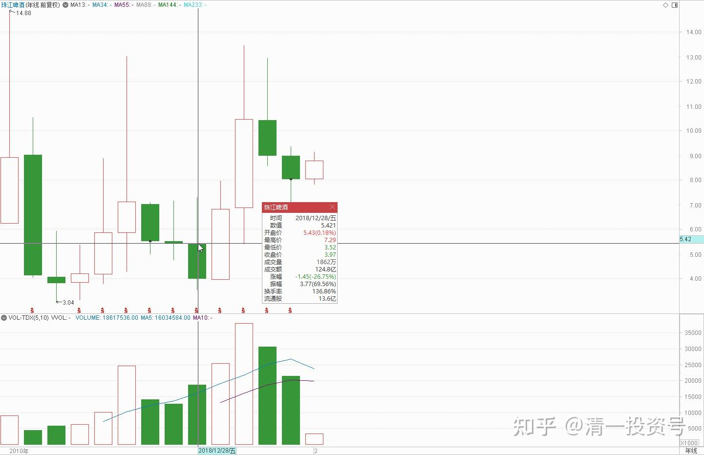

16篇.啤酒系列9：买入的理由不是因为要涨，而是因为没有多少下跌空间

清一山长 2018年5月～6月

**一、买入于底部**

清一山长 2018-05-29 14:31:33

$珠江啤酒(SZ002461)$刚才在7.7元之上，挂出40万股，成交了312700股。珠江实在太强悍了[滴汗][滴汗]。还是少动为佳。难说今天尾盘珠江又来一个涨停[加油]。

清一山长 2018-06-22 14:59:31

今天继续买入珠江，看到5.20元有20几万压单，就一单挂了20万股买进了。今天增仓45万股，成为重仓，比高抛前的仓位还多了一倍多。也就是说，一旦上涨到原来的价位，我的盈利会多一倍还多。实在太看好了，就是因为主力的操盘手法真的太迷人，让我越来越想多买一点。原来只是想买入抛掉的部分，没想到现在变这么多了。

**买入的逻辑是：以目前的价格买进，五年来低于目前价格的时间，大约只有5%的概率。基本上算是珠江五年来的最低价了，也是珠江8年来的底部区间。但上涨的空间，时间概率上算是90%是赚钱的**。最高的赚钱幅度是很容易翻倍，甚至接近三倍（珠江最高价30.95，前复权15元左右）。所以，回到10元上方的概率是很高的。投资的安全系数看样子较高。

提醒：请勿模仿我的操作，珠江上充分证明了我越跌越买的策略失败，把原来赚到的钱都赔进去了。目前微绿中（刚看了下，目前账户亏损0.51%)。虽然高抛了珠江，但似乎并没有得到好处。把赚钱的股弄成赔钱的股，我的水平够“好”的，你们千万别学[滴汗]。本次下跌，可能是主力的有意打压造成。如果是这样，股价重回上升通道就不远了。但也有可能是主力的资金被强行去杠杆，不得已卖出股票还债。如果是这样，就要等很长时间了。

正义的emiya回复清一山长：

请问山长如何看待兴业银行这只股票[为什么]？

清一山长 2018-06-22 19:06:53回复正义的emiya:

好股，好价。还需要拥有最佳介入的时机，就完美了。

**二、何谓理性交流：每个人都可以表达不同的看法**

***而定《对标青岛啤酒给珠江啤酒估值》@清一山长

$珠江啤酒(SZ002461)$$青岛啤酒(SH600600)$$顺鑫农业(SZ000860)$

用我的理解，通过对标青岛啤酒来给珠江啤酒估值，有理解不对的地方，欢迎各位大V指正。目前手里既没有青岛啤酒也没有珠江啤酒，不存在屁股决定脑袋的问题。就想看看珠江啤酒的基本面，到底有没有被低估？

原文链接：[https://xueqiu.com/8869975766/109374218?page=13](http://link.zhihu.com/?target=https%3A//xueqiu.com/8869975766/109374218%3Fpage%3D13)

清一山长 2018-06-25 12:14:06回复**而定（评论上文）

真要对标两个标的，您干吗不比一下2015年5100点的青岛啤酒价格是多少？与现在的价格差距有多大？同时看看珠江啤酒现在的价格，却连2015年的一半都没有？还躺在上市以来的最低价附近。比较之后，您觉得谁的安全边际会更高一些呢？

如果您真心觉得青岛很好，为啥你不在青岛只有20多元的时候买入呢？我的确买了一些，现在还持有中。因为我觉得青岛啤酒真的很好，就是现在的价格不够好，没有珠江好。如此而已。等珠江涨了，青岛没涨的话，我会多换一点青岛的。比如，以2015年珠江峰值的价格，我更愿意换成青岛来持有。

珠江现在涨不涨，我根本不知道。**我买珠江不是因为它要涨，而是因为它再跌也跌不了多少空间了。**但如果青岛创新高的话，珠江大概率也会创新高的，理由很简单：**大家都是做啤酒的，就算珠江差，也不差这么多吧？**外资、机构们，买入珠江这么多年，也没赚钱呢！我们陪着他们也亏几年，也不用抱怨个啥的。青岛20多元批发买了下来的复星，现在是赚钱的，我就不想去接他的单子。至于你们，想要今天买了明天就赚大钱的人，我建议买彩票去更靠谱一些[大笑]

清一山长 2018-06-25 21:49:47

真有意思。今晚来看我的回复时，居然发现我被这位“**而定”的兵法家高手拉黑了。看样子我错过了向他好好学习的机会[大笑]。

我说过：**很多中国人就没有学会什么是理性的交流，什么是自尊和尊人。**

比如，你说珠江不如青岛，**你有你的比法，我有我的比法。你的比法，只要不是胡说，就是有参考价值的。我的比法，只要不是乱讲，也是有参考价值的。**至于股票会不会因为你看不起珠江，珠江就跌，或者我看得起珠江，珠江就涨。肯定不会的。市场该怎么走，就怎么走。只要是理性的交流，都挺好的，我也愿意看看反派意见。只要讲的有理，我还会打赏呢！

你不同意我的意见，你有质疑和发言的权利。只要不是恶意低俗的语言，我也不会认为有啥不可以的。你当然有质疑我的权利。可是，你有权利认为我看错了，我没有同意你的看法，提出了另外的看法，你就玩拉黑人的游戏。这种人肯定谈不上什么理性，更谈不上优雅和文明。我看跟我原来拉黑的其他一些胡言乱语的家伙，差距也只是五十步笑百步。都是一些没有理性的人，只需自己放火，不许别人点灯的人。为了平等对待，我也拉黑这位“大侠”好了。我实在不喜欢看这种偷偷摸摸做事的人。我也欢迎所有被我拉黑的人拉黑我。道不同，不相与谋，这样彼此都清净一些。

清一山长 2018-06-25 21:51:53

谢谢本贴其他人的留言---特别是对我不认同的发言。也谢谢对我“技术派”的评价，不研究基本面的批评。有技术总是好事，总比没技术好些。我就不冒充价投了[大笑]

**三、过去五年各家啤酒的销量分析**

清一山长 2018-06-26 10:24:26

$珠江啤酒(SZ002461)$**过去的五年，是啤酒市场销量逐级下滑的五年。**青岛啤酒从2013年的870万千升到了2017年的797万千升，燕京更惨，下滑幅度更大。从571万千升下滑到416万千升，下滑的量，相当于消灭了一个半的珠江。而珠江是两家这五年保持了正增长的啤酒企业，从2013年的110万千升上升到了121万千升。另一家是华润，从1172万千升上升到了1182万千升。基本只能算是在同行下滑的情况下，勉强保持了销量没有跌。从绝对数值上，远远赶不上珠江10%的逆市增长。净利润率上，珠江从2013年的1.23%，上升到了2017年的4.93%。也就是说，**珠江是五大啤酒企业中唯一在逆势环境中，保持了价量齐升的企业。**同期燕京从2013年的4.95%，下降到了2017年的1.44%。行业龙头华润，净利润率，也从2013年的5.80%跌到了2017年的3.99%。说明华润是牺牲利润，维持住了市场占有率。在千升利润这个指标上，珠江从2013年的37万千升，上升到了2017年的153万千升。与青岛啤酒的158万千升差不多。而青岛啤酒在2013年是令人羡慕的高利润的227万千升下滑到158万千升的。拥有国内最有价值的啤酒品牌，啤酒中的“国酒地位”，却让这个品牌的价值逐年下降，到了2017年，居然跟毫无根基的珠江啤酒利润差不多了。青岛的品牌溢价是如何体现的？对于这五年的比赛结果，应该说市场太残酷，还是青岛太差？或者是珠江太优秀了？同期，燕京从2013年的千升利润119万千升，跌倒了2017年的39万千升，业绩惨不忍睹，跟珠江完全反向运行。市场份额丢了，利润也丢了。值得一提的是重庆啤酒，丢了市场和销量，但是维持甚至提高了利润。所以股价也节节高升。

可以说，**过去的五年，是燕京节节败退的五年，同时也是珠江不断逆势上升的五年。**所以，珠江比燕京估值高也不奇怪。当然，燕京目前，是最佳的**“困境反转”**题材。未来如果行业有改善，可能燕京的业绩弹性会最大。另外，燕京的销量第三地位，如果与其他任何一家强手（青岛和华润）并购联手，消除竞争，就会成为市场份额第一的企业。所以也许未来会有并购题材，提升燕京的估值水平。而珠江已经是外资百威英博控股（第二股东），不太可能有这种“改嫁的机会”。所以**燕京博的是“反转和并购”题材，珠江博的是行业的“优等生”今后继续优秀的可能。**虽然体量不大。知名私募买入燕京的理由是什么？我真不知道。但是我个人更看好珠江，虽然也买了一些燕京。

以上分析，纯属个人观点，不构成投资建议。据此入市，风险自担。**本人持有珠江、燕京和青岛啤酒。看好中国的消费升级。**

(标题、图片为编者所加)

**参考链接：**

[YJ走势果然神鬼难料\[表情\]](https://www.zhihu.com/pin/1604810289215668226)

[发表今天的想法，就是非常的感谢，感谢这…](https://www.zhihu.com/pin/1604504352521158656)

[8篇.初谈燕京](https://zhuanlan.zhihu.com/p/594537053)

[9篇.起码十年不涨就值得一起守候了](https://zhuanlan.zhihu.com/p/596134341)

[11篇.啤酒系列4：连连出台的质疑文让我加紧了买啤酒的行动](https://zhuanlan.zhihu.com/p/598382916)

[12篇.啤早期珠江啤酒、燕京啤酒的换仓记录](https://zhuanlan.zhihu.com/p/602033762)?

[13篇.买卖操作后的富足之心](https://zhuanlan.zhihu.com/p/604162057)

[14篇.珠江的破位急跌，名曰跌停进货法](https://zhuanlan.zhihu.com/p/606062514)

[15篇.金融市场是考验心态和修为的地方](https://zhuanlan.zhihu.com/p/608010478)

