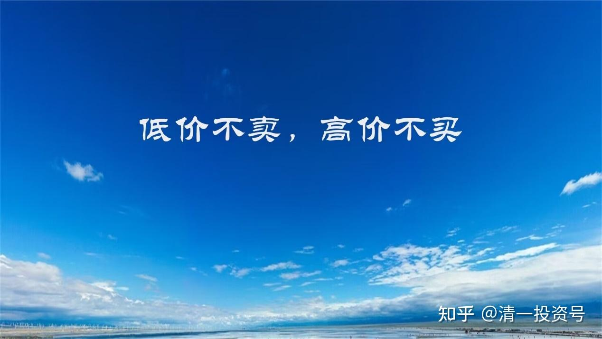
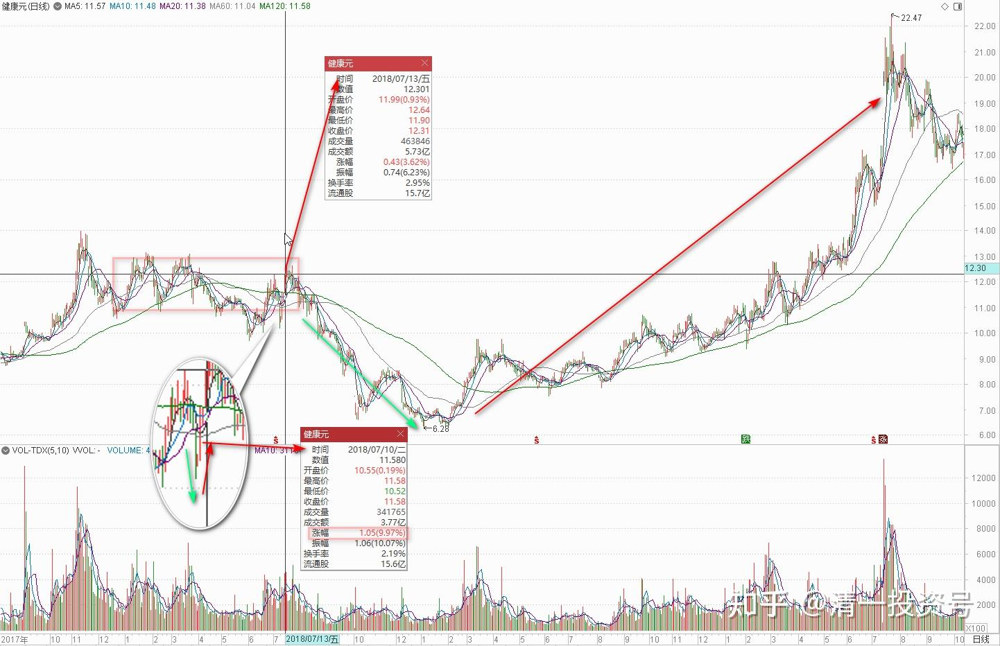
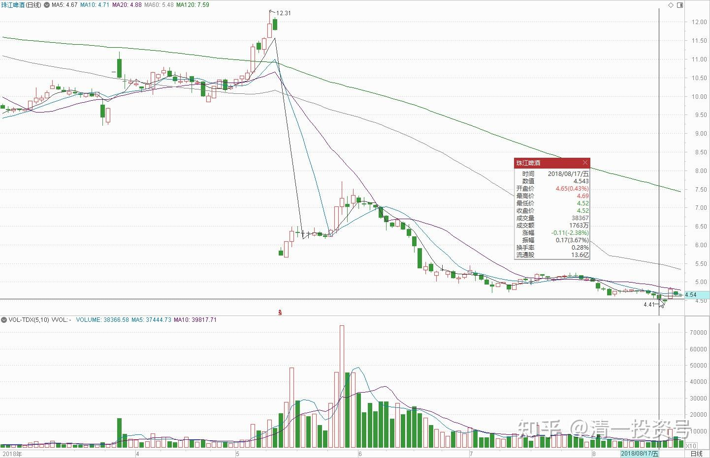
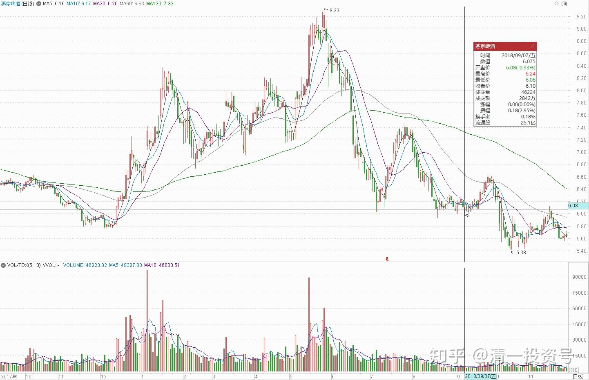
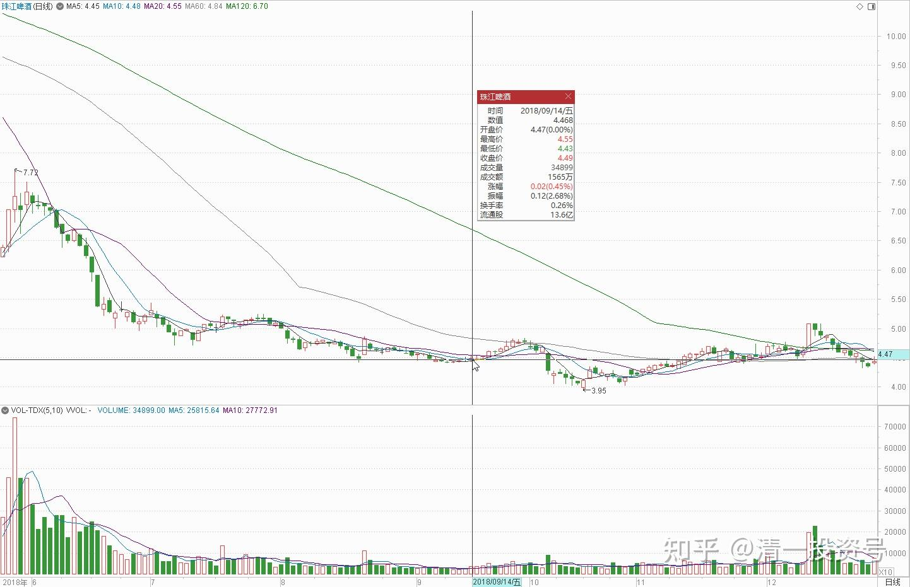
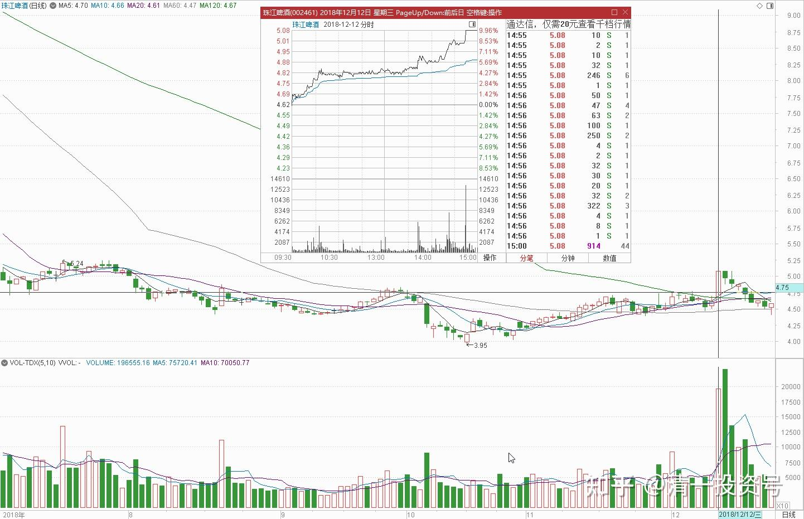

17篇.只记住一件事：低价不卖，高价不买

清一山长 2018年7月～12月

**一、经典主力洗盘记录，拉升在即**

清一山长2018-07-13 12:42:30

$健康元(SH600380)$ 从技术上说：健康元进入了前期高位的压力线一带，技术上显示应该“超买了，进入卖出位置”，主力也可以借机洗一波，制造“**12-13元左右必跌回10元区”的“人造走势规律”**。可是，**炒股从来就不是炒历史，而是看未来的**。**我13元不愿意追涨了，可也不愿意卖股。我做好继续跌到10元的准备，**反正我也刚从10元的坑里爬出来的人，怕什么[大笑]。

上周健康元三天内，**从跌停走到涨停，成交却没有放大**。这应该是一次可以计入炒股教科书的**经典主力洗盘记录，大起大落**，各位的心情是否也跟随大起大落了？而且跌停到涨停的间隔时间之短，也算创纪录吧？**说明这个股已经收集筹码完毕，拉升在即**。不再是原来主力持仓不足，不断考验持股耐心，用各种磨叽手法磨出你的持仓。也许真的快突破了。所以，我不急于卖出，大家也不别急。多坐坐电梯，也没啥的。别想抓完所有的波段。**就像是顺鑫，耐心坐电梯的人，都比做T的人收获多多。**

估值人生回复清一山长：

山长何不点评一下珠江？

清一山长 2018-07-13 22:26:00回复估值人生：

珠江呀？反正我只知道主力的账户现在绿油油的，生机勃勃，像麦田一样好看。肯定比我的还绿。虽然我的也绿了[大笑]！

半不同AKT回复清一山长：

山长珠江啤酒现在如何评价，还差一点就破前低了。

清一山长 2018-08-17 16:42:42回复半不同AKT：

珠江有啥好评价的？涨没有理由，跌也没有理由，我们只要知道：跌成这个样子，某些所谓的主力账户，比我们的更难看。我的珠江“损失”，肯定比您的更多。大家不就心安了[大笑]。

**对价投来说，下跌是好事，有钱想买就买，不想买就继续看。**

**二、毕竟是十年来的价格底部**

原文链接：[燕京啤酒告急 温馨提示：本文共2201字，阅读约需5分钟。编者注： 最近一段时间，从范冰冰到黄晓明再到刘强东，德林社持续关注明星人物举... - 雪球](http://link.zhihu.com/?target=https%3A//xueqiu.com/4226224438/113335893)

清一山长 2018-09-07 15:31:39评论上文

对燕京分析不错。2018年的半年报，燕京表现真的太差了。燕京就是相对更便宜，我跟裘国根投了。但我个人持有珠江更多，目前看珠江表现更正常一点，增长基本符合要求。**不过两个啤酒目前都套牢了，准备拿五年。毕竟是十年来的底部价格**，接受这个不良的命运。

清一山长2018-09-14 13:36:28

$中国宏桥(01378)$ 主动套牢买入宏桥。今天试探性买入30万股，成交价5.97元、5.96元。持仓成本今天已经上升为2.61元了。不就是电网要交费吗？羊毛出在羊身上。又不是宏桥一家的问题。无非是电解铝的市场平均成本上升罢了。目前7-8%的股息率，拿着分红就有饭吃了。今天买得比张老板增持的价格都低，我认了。

另外今天还主动买入了中国华融，100万股。挂价1.41元。我不入地狱谁入地狱！下周计划：如果市场继续下跌，就慢慢买入一些低价股。

空投轰-20回复尚禾资本投资：

不知山长昔日的珠江啤酒、古越龙山等，后来是如何处理了[不说了]

清一山长 2018-09-14 15:05:16回复空投轰-20:

今天也买了十万股珠江，继续套牢之路。**我不会“处理”这种企业没有出现问题、只是价格出问题的股票。**

**三、只记住一件事：低价不卖，高价不买**

清一山长 2018-12-12 22:37:01

$珠江啤酒(SZ002461)$ 刚刚才知道珠江涨停了。说实话，我很意外。珠江是我今年投资的一只黑天鹅，40元左右卖出的顺鑫等白酒资金，以及一路卖出的银行股，统统加到了珠江等啤酒股上了。却没想到一路加一路跌，弄得我后来都不看啤酒行情了。看着仓位我都吓一跳——我今年怎么就变“酒鬼”了。怎么都想不到它会跌到四元，当然，也怎么都想不到今天它涨停。不过，**跌也好，涨也好，都是资本市场的游戏。**我只记住一件事情：**低价很难看，可我就是不卖股，只买；高价很好看，大家都心情好，可我就是不买票，只考虑如何卖票。**我承认庄家手段高，我就一笨猫，死脑子，看不懂涨跌。但我就认这个死理，我看主力再厉害，怎么才能弄死我？[大笑][大笑]

二马由之回复清一山长:

恭喜山长！

清一山长 2018-12-12 22:41:09回复二马由之：

也没啥可喜的，今天一股也没多[滴汗]。只是账面上减了数百万的浮亏[哭泣]。账面上看起来好看一点，反正就只有自己看，也无所谓。

年年稻谷丰收了回复清一山长：

用锐贝儿的话来说，这个垃圾就是个股混混，满嘴跑火车！[大笑]

清一山长 2018-12-12 22:52:51回复年年稻谷丰收了：

是喔！我这个股混子，就靠蒙技术K线来混日子了。我7.74元看人保K线走势不妙，出来说了几句话，却被人跳出来骂大街，我只好不吭气。我看K线买入珠江一路被套成重仓，也只好认栽不吭气。明天，我看是不是卖掉一点点珠江，买一点点人保H进来，平衡一下多空的分歧，也免得大V继续骂我[滴汗]。祝你们锐粉们多子多福多赚[献花花]！

清一山长 2018-12-12 23:10:06

这倒霉孩子，看珠江涨停了，就像你们某粉看到人保跌一样，火气居然这么大[哭泣]。既然如此轻我、践我，就祝你们全家的生活和事业，都处处跟我相反好了[大笑]！以后就滚远一点玩去吧！大家相忘于江湖，免得你们一看到我赚钱，你们居然愤怒成这个样子，真可怜。见不得别人发财，也是一种病呢[捂脸]！

清一山长 2018-12-12 23:32:35

提醒大家一下：**今天虽然涨停了，但目前股价，依然低于主力的平均买入价。**大致上，至少还需要一个涨停，主力才会“回本”，但主力的意图，显然不是回本。是多少我也不知道。我只知道，再拉一个涨停，我也不想卖股的。**除非比价效应导致我认为珠江高估。**目前看没有这种情况。今天的成交其实量并不大。所以盘口并不重，拉升的空间，全看主力的愿望了。

(标题、图片为编者所加)

**参考链接：**

[YJ走势果然神鬼难料\[表情\]](https://www.zhihu.com/pin/1604810289215668226)

[发表今天的想法，就是非常的感谢，感谢这…](https://www.zhihu.com/pin/1604504352521158656)

[8篇.初谈燕京](https://zhuanlan.zhihu.com/p/594537053)

[9篇.起码十年不涨就值得一起守候了](https://zhuanlan.zhihu.com/p/596134341)

[11篇.啤酒系列4：连连出台的质疑文让我加紧了买啤酒的行动](https://zhuanlan.zhihu.com/p/598382916)

[12篇.啤早期珠江啤酒、燕京啤酒的换仓记录](https://zhuanlan.zhihu.com/p/602033762)?

[13篇.买卖操作后的富足之心](https://zhuanlan.zhihu.com/p/604162057)

[14篇.珠江的破位急跌，名曰跌停进货法](https://zhuanlan.zhihu.com/p/606062514)

[15篇.金融市场是考验心态和修为的地方](https://zhuanlan.zhihu.com/p/608010478)

[16篇.啤酒系列9：买入的理由不是因为要涨，而是因为没有多少下跌空间](https://zhuanlan.zhihu.com/p/609653689)

