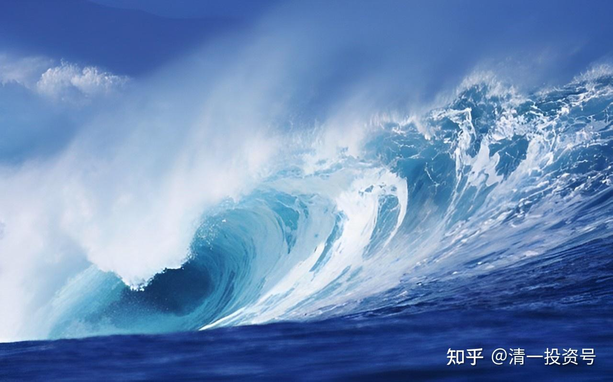
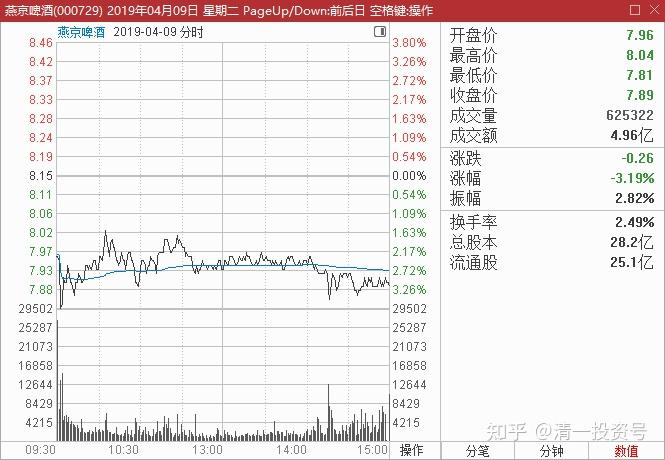
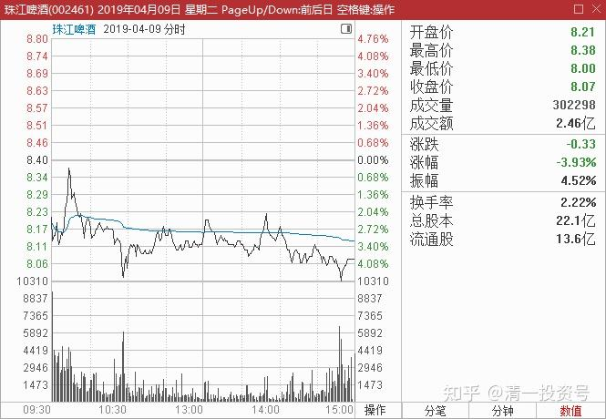
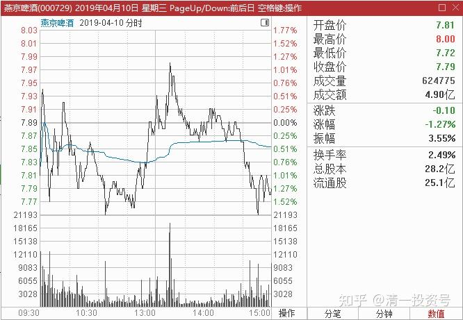

19篇.啤酒是一个难得的大潮

清一山长 2019年4月～5月

**一、投机比投资的要求要高得多**

清一山长 2019-04-09 10:08:11（主贴1）

$珠江啤酒(SZ002461)$ 昨天尾盘挂盘8.37卖出珠江30万股。今天看盘面燕京跌破8元，挂盘7.89元重新买入30万股，已经成交。算是做T成功，跨品种做T。**我认为燕京的每股内含价值是超过珠江的，这样做T我不觉得会吃亏。**这样，就在啤酒总仓位未减仓的情况下，让这30万股的成本每股少了接近0.48元。得到一笔很令人满意的意外收入。只是账面上，珠江的利润并未转移给燕京，燕京看起来持仓成本增加了一些[大笑]

舒缓回复清一山长:（跟评主贴1）

今天没看山长的帖子前，8.30元卖出部分珠江，7.90买入燕京[微笑]

清一山长 2019-04-09 12:08:34回复舒缓:

**等你看了我的记录，再来模仿，往往就来不及了。所以必须有自己的投资逻辑（投机逻辑）。**别以为投机很容易，认为投机的档次低了。其实，**投机比投资的要求要高得多。**投资可以教，但投机还真教不了。有些人号称自己是“价值投资者”，其实只是听消息，买入后傻等风来的等待者。有人说自己“会投机”，其实是赌博，赌徒一个。别以为投机容易。

明达野老回复清一山长:（跟评主贴1）

最低净赚24%+啤酒优质资产的操作，漂亮[献花花]

清一山长 2019-04-09 12:27:09回复明达野老:

这单子运气好而已，赚了点小钱，还冒了丢失筹码的风险[滴汗]。如果**不是手里的货多，这个价位（中位数，可上可下）**，也不敢这样玩法。如果按照两股的净资产值来评估，这单交易，差价高达30%以上呢[微笑]。不过珠江的资产经营质量更有效率一些，贵一点也正常。

明达野老回复清一山长：（跟评主贴1）

无论人谋或是天意，无论投资还是投机，山长终归是赚了一笔，恭喜[啤酒]

昨晚看了下龙虎榜单，看样子山长的单子倒给了散户，有个著名的营业部专门玩热门股，看手法，就是散户“集团”，主力资金这样尾盘拉一下发信号，他们就应声而至，真是好呼应。现在的散户大多数是80、90甚至00后，玩王者荣耀、LOL长大的，玩股票和打游戏一样，不为别的，只为刺激，所以加起仓来，吓死人，什么缺口、压力位，通通作为“打怪兽”的目标。厉害啊！我还是慢慢躲远点，太刺激了睡不着。

清一山长 2019-04-09 12:46:27回复明达野老:

这些散户真狠。我还以为是被主力收走了呢！我是提前挂的单等着的，**我猜要冲就冲8.4元整数。而看燕京死气沉沉的样子，今天破8的可能性很大，就想要借机出一点珠江换换股。**为了保险，就多放了几分钱，原以为无法成交了。没想到尾盘一拉就上去了，单子真多。

清一山长 2019-04-09 15:10:20（跟评主贴1）

8.01元买的珠江买入单，刚查看也成交了？看来今天买多了一点，燕京的保险上多了**，有珠江和燕京两个股提供的卖出机会，应该不会让我超仓的。**主要是涨停这天卖出的多，所以今天我的啤酒仓，依然是净卖出状态，没有出现吃撑的情况。特别是珠江，买入价仅仅比最低价多了一分钱。感谢愿意低价卖给我的大侠。有了这些筹码，以后做T就更方便了。争取获得更大的收益。

**二、啤酒是一个难得的大潮**

一切有道回复清一山长:（跟评主贴1）

太巧了山长，我也是8.01元买入一些珠江啤酒，还有7.89元买入一些燕京啤酒。当时估计珠江啤酒应该是要保8元关口的，燕京似乎要保7.90元关口，因此投机性买入。也想尝试做个T，看看后面几天给不给机会。

清一山长 2019-04-09 18:53:40回复一切有道:

别误导人，别说是“跟我买股”。牛市中我不推荐任何股票，包括我持仓的股票。因为如果真是牛市，你们瞎买也会赚钱的，很快大家就会鄙视我这种“稳健派”的老股民了。因为你们发现自己赚钱比跟我更容易。所以牛市我不吹票，也不回答你们问的某个股的问题。

本次操作**，我并不是“买入珠江和燕京”，我只是平掉我昨天和前天的啤酒空仓罢了。**这个价位，我不买入新仓，只是“平仓（平掉多仓和空仓）”和“持仓”，一路会做点T，摊低成本。这是我20多年比别人多赚一点的窍门。**如果后市啤酒继续上涨，我就要逐步地减仓了。减仓后遇到下跌，会把卖出的头寸买回来。这叫做“平掉空仓”，**不是买入！**啤酒我认为我遇到的是一个难得的大潮，所以我会拿得更持久一些。**希望能够看到中国啤酒赶上世界啤酒大王的一天。真到了这一天，我就会跟啤酒股说再见了。

清一山长 2019-04-10 13:23:06

$燕京啤酒(SZ000729)$ 今天7.77元左右，已经把涨停这天出掉的百万股啤酒份额，全部买回来了。再度满仓啤酒。只是新买入的筹码换成了燕京[加油]。我相信一股珠江换一股燕京不亏，何况我是用比燕京还贵两毛的珠江换的，怎么算都觉得划算。**我内心的定价，大致上认为燕京应该比珠江贵1.5元才是正常的。**但又舍不得自己掏钱来买涨停之后的燕京。所以，我只换股，不买股[大笑]

**三、虽然长期持有，买啤酒是投机不是投资**

理财与投资回复清一山长:清一山长

山长老师您好，去年抄了您的作业买入了珠江和燕京，目前盈利了一点，谢谢您了！另外想请教您一下珠江和燕京的净利润和净资产收益率过去几年和五粮液茅台以及洋河相差甚远，且珠江和燕京的市盈率目前也很高，为什么您近期还在加仓呢？希望您能赐教一二，再次感谢！

清一山长 2019-05-07 19:22:02回复理财与投资:

**我买啤酒是投机，不是投资**[滴汗]**。就算是长期持股，也是投机行为。**你要看利润和资产收益率的话，应该买白酒和银行去[为什么]。

清一山长 2019-05-08 10:27:00

$珠江啤酒(SZ002461)$ 周一居然玩跌停洗仓，动作也够大胆的，可惜成交量不配合。偏偏外围市场上，青啤、华润等，居然接近历史新高了。珠江要这样继续洗下去，恐怕筹码会丢更多的，不划算。所以，珠江今天只好涨上来了。珠江现在使劲洗盘的必要真不大，搞不懂总要玩这种过山车，估计是找找刺激。倒是给了不少人上车的机会。燕京倒是很有必要洗洗盘，主力介入深度不够。周一也只跌了五点。昨天拉升7%我错过了，否则正打算换珠江的。差价1.1元以上的话，我很愿意把原来高2毛钱换来的低价燕京再换回珠江去。等于每股多赚了1.3元。可惜昨天错过了时机，就没动。珠江假如继续跌，我的手段就是换多点，**了不起就是把燕京都换成珠江，**无非是成为第四流通股东罢了[加油]，单一持仓也不怕。如果想让我走吗？**只要涨得比燕京高，我保证心甘情愿的走掉。**

炒股没尊严回复壹生随缘:上贴跟评

同问，一直看到一个大股东叫刘存，很神秘！

清一山长 2019-05-08 12:01:20回复炒股没尊严:

燕京的唐建华，那才叫神秘呢[滴汗]！据说此人买入后一般要拿十年，赚十倍才肯走。我目前账上持有的燕京，其实比珠江还多（都是最近珠江涨价超过燕京害的）。可是连第十股东都进不去，可见燕京高手云集。珠江嘛，看样子主力实力不太强，居然让个小散都进了十大股东。我其实最希望今天燕京涨5%！珠江只涨1.8%，我就正好卖掉燕京来买珠江，好争取成为第三大流通股东[大笑]。不知道下次去参加珠江的股东会，会不会有把交椅坐[俏皮]！

(标题、图片为编者所加)

**参考链接：**

[YJ走势果然神鬼难料\[表情\]](https://www.zhihu.com/pin/1604810289215668226)

[发表今天的想法，就是非常的感谢，感谢这…](https://www.zhihu.com/pin/1604504352521158656)

[8篇.初谈燕京](https://zhuanlan.zhihu.com/p/594537053)

[9篇.起码十年不涨就值得一起守候了](https://zhuanlan.zhihu.com/p/596134341)

[11篇.啤酒系列4：连连出台的质疑文让我加紧了买啤酒的行动](https://zhuanlan.zhihu.com/p/598382916)

[12篇.啤早期珠江啤酒、燕京啤酒的换仓记录](https://zhuanlan.zhihu.com/p/602033762)?

[13篇.买卖操作后的富足之心](https://zhuanlan.zhihu.com/p/604162057)

[14篇.珠江的破位急跌，名曰跌停进货法](https://zhuanlan.zhihu.com/p/606062514)

[15篇.金融市场是考验心态和修为的地方](https://zhuanlan.zhihu.com/p/608010478)

[16篇.啤酒系列9：买入的理由不是因为要涨，而是因为没有多少下跌空间](https://zhuanlan.zhihu.com/p/609653689)

[17篇.只记住一件事：低价不卖，高价不买](https://zhuanlan.zhihu.com/p/611574943)

[18篇.炒股美德——亏赚两相宜](https://zhuanlan.zhihu.com/p/611564523)

